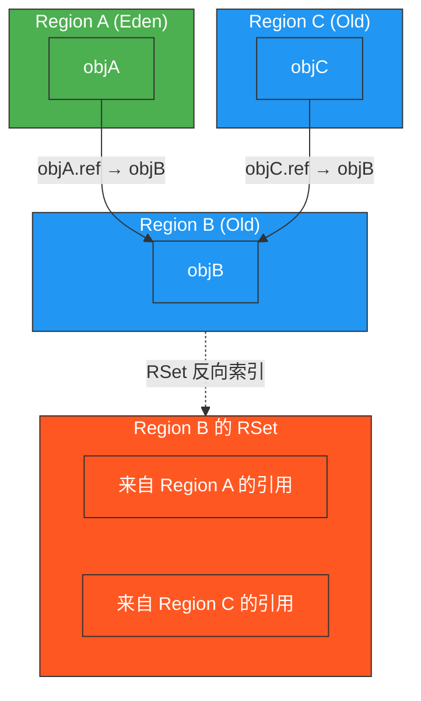
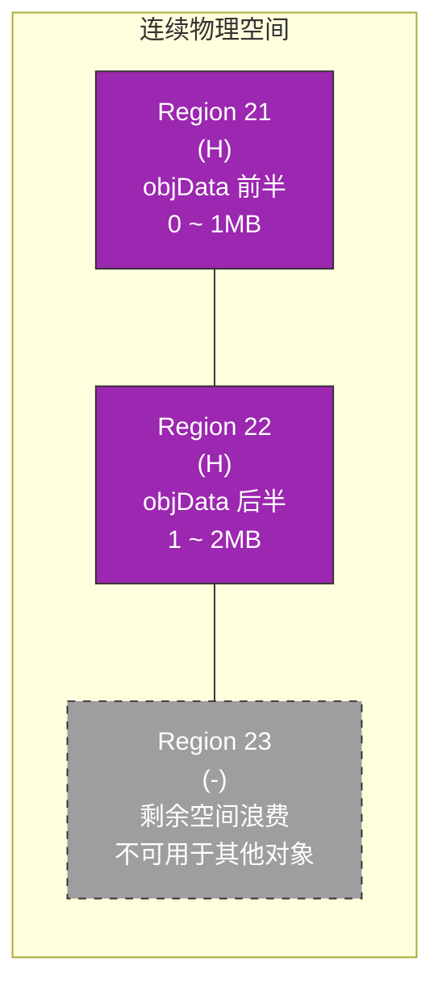
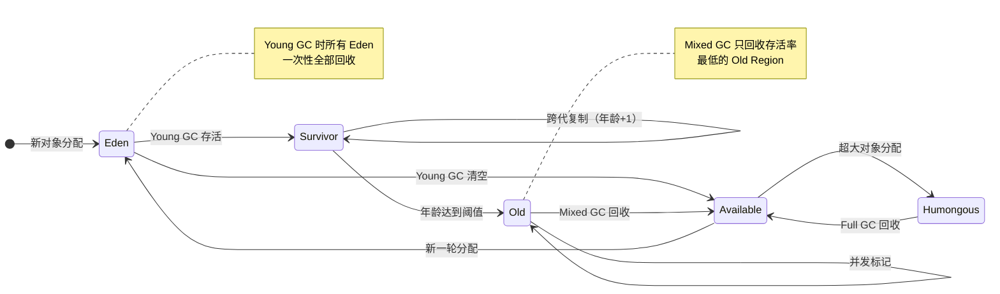

# G1 Garbage Collector

## G1 出现背景

**G1（Garbage First）** 在 JDK 7u4（2012 年）正式发布，并于 **JDK 9** 成为默认垃圾回收器，取代了 Parallel Scavenge + CMS 的组合。到 JDK 14，CMS 被正式移除，G1 成为主流。

G1 诞生的核心驱动力：

| 背景问题          | 说明                                                     |
| ------------- | ------------------------------------------------------ |
| **内存越来越大**    | 硬件发展使堆内存从几十 MB 增长到几十 GB，传统 GC 在大堆下性能急剧恶化               |
| **CMS 的先天缺陷** | CMS 存在严重的碎片问题、无法预测停顿、并发阶段占用 CPU、会发生"并发模式失败"退化为 Full GC |
| **停顿时间不可控**   | 业务对延迟敏感，需要**可预测、可配置的停顿时间**（Pause Time Goal）            |
| **吞吐量不牺牲**    | 低延迟不能以牺牲吞吐量为代价，需要在两者间取得平衡                              |

### 设计目标

> 在 **大堆（6GB+）** 上，实现**可预测的停顿时间**，同时保持**高吞吐量**。

G1 的名字 "Garbage First" 直译——**优先回收垃圾最多的区域**，最大化每次 GC 的收益。

---

## G1 vs CMS：核心区别与优势

| 维度          | CMS                      | G1                                            |
| ----------- | ------------------------ | --------------------------------------------- |
| **内存布局**    | 连续分代（年轻代、老年代物理连续）        | **Region 化**，每个 Region 角色动态可变                 |
| **回收算法**    | 标记-清除（Mark-Sweep）        | 标记-整理（Mark-Compact）——通过 **Evacuation（复制）** 实现 |
| **内存碎片**    | 严重，最终必然引发 Full GC 压缩     | 天然无碎片，Evacuation 到新 Region 天然紧凑               |
| **停顿预测**    | 无（Young GC 停顿时长不可控）      | **有**（基于历史停顿模型动态调整）                           |
| **并发标记算法**  | 增量更新（Incremental Update） | **SATB（Snapshot-At-The-Beginning）**           |
| **并发阶段异常**  | 「并发模式失败」退化为串行 Full GC    | 晋升失败触发的 Full GC（频率更低）                         |
| **大对象处理**   | 直接进入老年代                  | Humongous Region 单独管理                         |
| **适用堆大小**   | 中等堆（< 6GB）表现好            | 大堆（>= 4GB）表现更优                                |
| **CPU 敏感度** | 高（抢占 CPU 做并发标记）          | 相对较低                                          |

### G1 对 CMS 的核心优势

1. **无碎片**——复制算法天然压缩，不需要像 CMS 那样定期做 Full GC 来整理内存
2. **停顿可预测**——通过 `-XX:MaxGCPauseMillis` 设定目标，G1 动态调整工作量来逼近该目标
3. **局部收集**——不需要每次都扫描整个堆，借助 RSet 实现只回收部分 Region
4. **大堆友好**——堆越大，Region 化的优势越明显
5. **SATB 更安全**——相比增量更新，SATB 对并发期间引用变更的处理更保守，减少了漏标风险

> **术语澄清：为什么 G1 是"标记-整理"而不是"标记-复制"？**
>
> G1 的年轻代 GC 和 Mixed GC 中，存活对象被 **复制（Copy）** 到新的空闲 Region，而非在原地滑动压缩——从机制上看这确实是 Mark-Copy。但 G1 与传统 Young GC 的 Mark-Copy 有一个本质区别：

| | 传统 Mark-Copy（如 Parallel Scavenge） | G1 Evacuation |
|---|---|---|
| **范围** | 只作用于年轻代 | 可同时作用于 Eden + Survivor + Old Region |
| **结果** | 年轻代紧凑，老年代不变 | **全堆无碎片**，等同于 Compact 的效果 |

> 关键在于：传统 GC 理论中，"Mark-Compact" 指通过对象移动消除碎片的行为，无论移动方式是"复制到新空间"还是"原地滑动"——**结果决定分类**。G1 的 Evacuation 虽然底层是复制，但覆盖了老年代且彻底消除了碎片，所以业界普遍将其归为 **Mark-Compact 的一种实现形式**。表格中的表述遵循这一主流分类。

---

## 内存结构：Region 化设计

### 整体布局

G1 将堆划分为 **大约 2048 个等大的 Region**（实际数量由堆大小决定）。每个 Region 的大小：

```
Region Size = 堆大小 / 2048（向上取整到 2 的幂）
范围：1MB ~ 32MB
```

例如：
- 4GB 堆 → Region ≈ 2MB
- 16GB 堆 → Region ≈ 8MB
- 64GB 堆 → Region ≈ 32MB

### Region 结构总览

#### 1. 堆空间 Region 分布

G1 的堆在某一时刻（Eden 未满、未触发标记时）大致分布如下：

```
┌─────┬─────┬─────┬─────┬─────┬─────┬─────┬─────┐
│  E  │  E  │  E  │  S  │  O  │  O  │  O  │  O  │
├─────┼─────┼─────┼─────┼─────┼─────┼─────┼─────┤
│  O  │  O  │  O  │  O  │  O  │  H  │  H  │  -  │
├─────┼─────┼─────┼─────┼─────┼─────┼─────┼─────┤
│  -  │  -  │  -  │  -  │  -  │  -  │  -  │  -  │
└─────┴─────┴─────┴─────┴─────┴─────┴─────┴─────┘
```

```
E = Eden | S = Survivor | O = Old | H = Humongous | - = Available/Unused
```

> **注意**：Region 并非物理地址上连续排列，这里仅为逻辑示意。Available Region 散布在堆中，随时准备被分配为新角色。

#### 2. 单个 Region 内部结构

每个 Region 在内存中有明确的起始地址（bottom）和分配指针（top），配合 **TAMS（Top-At-Mark-Start）** 实现并发标记。

**bottom 与 top 的线性分配机制**：

每个 Region 内部采用 **bump-the-pointer（指针碰撞）** 方式分配对象。新对象从 top 指向的位置分配，分配完成后 top 向后移动对象大小的距离。当 top 到达 Region 末尾时，该 Region 被"填满"。

关键概念：**bottom 到 top 之间的全部是已分配的内存空间**，TAMS 只是在这段已分配空间中画出了一条"时间线"。

```
          ←────── bottom 到 top 之间都是已分配的内存 ──────→
          │                                                      │
          ▼                                                      ▼
┌──────────────────────────────────────────────────────────────────┐
│  bottom < 地址 < TAMS    │   TAMS < 地址 < top                   │
│  (标记开始前已分配的旧对象) │   (标记开始后才分配的新对象)             │
│                           │                                      │
│  在 SATB 快照中            │   标记开始时还不存在                    │
│  标记器需要遍历这些对象      │   直接视为存活，不遍历                  │
└──────────────────────────────────────────────────────────────────┘
          ▲                                                      ▲
          │                                                      │
       bottom                                              top(分配指针)
                                                     ↑
                                                  TAMS 水位线
                                        (并发标记开始时 top 的位置)
```

> TAMS 不代表"内存边界"，它只是一个**时间标记**。它把已分配的内存切成了两段：左边是"老人"（标记前就在的），右边是"新人"（标记后才来的）。

**TAMS 的核心作用**：

并发标记不是 STW 的，标记线程遍历对象图的同时，应用线程仍在分配新对象。G1 通过 TAMS 解决"新分配的对象要不要标记"的问题——把问题变成了一个简单的地址比较。

标记开始时，每个 Region 的分配指针 top 被记录为 **TAMS 水位线**：

| 地址范围 | 对象来源 | 如何处理 |
|---|---|---|
| bottom ~ TAMS | 标记开始前就存在的对象（老人） | 参与 SATB 快照，标记线程从根出发逐一遍历 |
| TAMS ~ top | 标记开始后才分配的对象（新人） | 标记开始时它们还不存在，**隐式存活**，无需遍历 |

隐式存活的含义：并发标记开始时这些对象还没创建，它们是在标记过程中由应用线程分配的，自然是"活"的，不需要被标记器遍历也不需要被回收。

**SATB 与 TAMS 的配合流程**：

1. 并发标记开始时，每个 Region 记录 `TAMS = top`（当前分配指针）
2. 标记线程从 GC Roots 出发，遍历 bottom ~ TAMS 之间的对象图
3. 应用线程在 TAMS 之上继续分配新对象，top 不断上涨
4. SATB 写屏障记录引用覆写前的旧值（pre-value），防止并发期间黑色对象新建引用路径导致的漏标
5. 并发标记结束时，bottom ~ TAMS 之间的对象已全部遍历完成，TAMS 以上的对象隐式存活
6. 标记完成后，`TAMS` 指针不再需要，下一轮标记时会记录新的 TAMS

**prevTAMS 与 nextTAMS**（双 TAMS 机制）：

G1 实际维护两个 TAMS 指针，确保轮次之间不冲突：

- **prevTAMS**：上一轮并发标记的 TAMS 水位。并发标记结束后，用它判断对象是否需要遍历
- **nextTAMS**：当前轮（或下一轮）并发标记的 TAMS 水位。本轮标记开始时记录

标记结束后，下一次 Young GC 会将 `nextTAMS` 赋值给 `prevTAMS`，实现滚动。

**为什么需要 TAMS？——防止标记线程被新对象拖死**：

没有 TAMS 的话，并发标记期间标记线程顺着引用链往下走，应用线程不断分配新对象、建立新引用，标记器永远有新的可达对象要遍历——陷入了"跑不完"的困境。TAMS 说"新分配的一律不用看"，一刀切断追赶，保证标记一定能完成。

这个设计会产生两类浮动垃圾，需要区分：

| 浮动垃圾来源 | 原因 | 是否由 TAMS 导致 |
|---|---|---|
| TAMS 上方的对象被跳过 | 一个 ≥ TAMS 的对象分配后很快失去引用（如临时变量），但 TAMS 剪枝导致这轮不管它 | **是** |
| TAMS 下方的对象引用已断 | 标记线程已遍历过某对象（< TAMS），但随后它的引用被断开，标记器不知道它已死 | **否**（所有并发 GC 共有的问题） |
| SATB 中间值 | 同一字段在并发期间被多次覆写，SATB 记录每次覆写前的旧值而非仅首次。若中间值对象仅通过该字段可达，会被多保一轮 | **否**（SATB 设计取舍） |

所以 `≥ TAMS` 的隐式存活不是"正确"的——它可能包含垃圾。但它是**可接受的权衡**：宁可多活一轮，也不能让标记线程永无止境地追赶新分配。SATB 不记首次也是同理：**容忍少量冗余，换取写屏障的极致轻量。**

每个 Region 还附带元数据：RSet 指针、存活对象字节数、Region 类型标记（E/S/O/H/-）、Survivor 年龄阈值等。

#### 3. RSet 跨 Region 引用



RSet 本质上是 **"谁引用了我"的反向索引**。回收 Region B 时，只需查它的 RSet 就知道 Region A、C 引用了 B 中的对象，**无需扫描整个堆**。

#### 4. Humongous Region 连续分配

超大对象（> Region Size 的 50%）分配在一组连续 Region 中：



- Humongous 对象**必须占用连续 Region**，找不到足够空间则触发 Full GC
- 最后一个 Region 的剩余空间**无法被其他对象使用**，造成内部碎片

#### 5. 动态角色演变（一次 GC 周期中的 Region 状态变化）



**典型演变示例**（以下网格中每个格子代表一个 Region）：

```
Young GC 前:     ┌─────┬─────┬─────┬─────┬─────┬─────┬─────┬─────┐
                 │  E  │  E  │  E  │  S  │  O  │  O  │  -  │  -  │
                 └─────┴─────┴─────┴─────┴─────┴─────┴─────┴─────┘
                      ↓ Eden→Available，存活对象晋升
Young GC 后:     ┌─────┬─────┬─────┬─────┬─────┬─────┬─────┬─────┐
                 │  -  │  -  │  -  │  E  │  S  │  O  │  O  │  O  │
                 └─────┴─────┴─────┴─────┴─────┴─────┴─────┴─────┘
                      ↓ Mixed GC 回收垃圾最多的 Old
Mixed GC 后:     ┌─────┬─────┬─────┬─────┬─────┬─────┬─────┬─────┐
                 │  -  │  E  │  -  │  -  │  O  │  -  │  O  │  -  │
                 └─────┴─────┴─────┴─────┴─────┴─────┴─────┴─────┘
```

### Region 类型

| 类型 | 标识 | 说明 |
|---|---|---|
| **Eden** | E | 新对象分配区，占满时触发 Young GC |
| **Survivor** | S | 存放年轻 GC 后存活的对象 |
| **Old** | O | 长期存活对象晋升后的区域 |
| **Humongous** | H | 存储超大对象（> Region size 的 50%） |
| **Available/Unused** | - | 空闲 Region，等待分配 |

> **关键设计**：每个 Region 的角色是**动态变化**的。一次 GC 后，Eden Region 被清空并变为 Available，新的分配需要时再重新标记为 Eden。这种灵活性能让 G1 更好地适应不同应用的分配模式。

### 关键辅助结构

#### RSet（Remembered Set）

每个 Region 维护一个 RSet，记录**其他 Region 中的对象指向本 Region 对象的引用**。

```
Region A RSet = { Region B 中指向 A 的引用, Region C 中指向 A 的引用, ... }
```

**作用**：支持局部收集。回收 Region A 时，只需扫描 A 的 RSet 即可知道谁引用了 A 中的对象，**不需要扫描整个堆**。

**实现方式**：基于 Card Table（卡表）的精简版本，使用粒度更细的卡页（Card），配合"脏卡"（Dirty Card）机制。

#### SATB（Snapshot-At-The-Beginning）

并发标记阶段的算法：

- 标记开始时，拍下一个**逻辑快照**（所有存活对象的引用图）
- 并发期间，通过写屏障记录引用覆写前的旧值（pre-value）
- 保证：**在快照时存活的对象，不会被错误地回收**
- **TAMS（Top-At-Mark-Start）**：每个 Region 记录标记开始时的分配指针，之后分配的新对象都标记为存活

> **SATB 保护目标**：三色标记中，标记线程不会重扫已处理完的黑色对象。若黑色对象在标记完成后新建了一条指向白色对象的引用，该白色对象将因不可达而被漏标，形成悬垂指针。SATB 记录的是覆写前的旧值而非新值——它保存"快照时刻这个引用指向谁"，而非"此刻指向谁"。这保证了快照中的活对象即使被转移到已扫过的黑色对象上，标记线程仍能从 SATB 缓冲区找到它并继续遍历。
>
> **代价**：若一个对象的唯一引用断开后无人新建引用，SATB 仍会保它一轮，产生浮动垃圾（下轮回收）。这是 SATB 用浮动垃圾换取 STW 时间（无需 CMS 式的 Remark 全量重扫年轻代）的权衡。
>
> **与增量更新的对比**：CMS 的增量更新通过写屏障标记脏卡（而非直接记录被引用的对象），并发期间脏卡信息累积在 **mod-union table** 中。并发标记结束后有一轮 **Concurrent Precleaning**（并发），扫描脏卡，发现黑色→白色的新建引用即追加到标记栈；Remark 再处理残余。
>
> 因此老年代→老年代的引用变更处理路径是：**引用写入 → 卡变脏 → 入 mod-union table → Precleaning/Remark 扫描脏卡 → 发现白色对象 → 追加到标记栈**。Remark 不需要全量重扫老年代，因为 mod-union table 定位了确切需要重扫的卡片。
>
> 但 Remark 必须**全量重扫年轻代**，因为并发期间新分配的年轻代对象的初始引用不会被写屏障捕获，其中可能包含指向老年代未标记对象的引用，需要补扫。
>
> **标记栈积压与并发模式失败**：增量更新没有 TAMS 来豁免新对象，应用线程持续写入新引用会持续向标记栈追加工作。若写入速率超过标记线程的处理速度，标记栈不断增长。CMS 的应对手段有限：Precleaning 并发 drain 脏卡，Remark（STW）强制扫完残余，若堆在标记完成前已被填满则触发**并发模式失败（Concurrent Mode Failure）**，退化为串行 Full GC。这是增量更新的根本弱点：**标记进度受应用写入速率影响**。SATB 不受此影响，因为它只记旧值不追新引用，标记工作量在标记开始时已确定。
>
> **旧值的命运——两种策略的根本不对称**
>
> 当 `A.ref = null`（原指向 X），两种策略对旧值 X 的态度截然不同：

| | SATB（G1） | 增量更新（CMS） |
|---|---|---|
| 旧值 X 是否被记录 | ✅ 记录 pre-value X，入缓冲区 | ❌ 不记录（新值 = null，无意义） |
| X 是否必定被标记为存活 | ✅ **是**——标记线程从缓冲区取出 X 并遍历其子图 | ❌ **取决于时机** |
| X 最终命运 | **必成浮动垃圾**（无条件保，下轮回收） | 标记未走到 A → 正确回收 ✅<br>标记已走过 A → 浮动垃圾 ❌ |

> **根源**：SATB 记录的是"旧值曾经存在"这一事实，不管引用此刻是否已断，一律保留。增量更新只追"新值指向谁"，旧值被断开后若标记线程还没处理到它，它自然消失在标记路径上——被正确回收。这是 **SATB 无条件保守**和**增量更新有条件精确**的分水岭。

---

## 垃圾回收策略

G1 的 GC 周期由 **Young GC** 和 **Mixed GC** 交替组成。

```
Normal 运行 ──→ Young GC ──→ Young GC ──→ ...
                         │
                         ▼ (IHOP 阈值触发)
               并发标记阶段（Concurrent Marking）
                         │
                         ▼
                   Mixed GC（多轮）
                         │
                         ▼
                    回收完成，回到 Normal
```

### 一、Young GC

**触发条件**：Eden Region 占满。

**过程**（全程 STW，多线程并行）：

1. 选定所有 Eden Region + 部分 Survivor Region 作为 CSet
2. 扫描 GC Roots（虚拟机栈、静态变量、JNI 等）
3. **扫描 RSet**：处理老年代到年轻代的引用（不需要扫描老年代所有对象）
4. **复制存活对象**：从 Eden / Survivor 复制到新的 Survivor Region
5. **清理**：清空原来的 Eden Region，回到 Available 池

**自适应调整**：

G1 根据 `-XX:MaxGCPauseMillis`（默认 200ms）自动调整 Eden 大小：
- 如果历史停顿小于目标 → 下次增大 Eden（更多分配，更少 GC）
- 如果历史停顿大于目标 → 下次减小 Eden（更少分配，更快 GC）

### 二、并发标记（Concurrent Marking）+ Mixed GC

当堆占用达到 **IHOP（Initiating Heap Occupancy Percent）** 阈值（默认 45%）时触发。

#### 并发标记的 5 个阶段

```
1. 初始标记（Initial Mark）    [STW]
   └── 标记 GC Roots 直接引用的对象
   └── 借道一次 Young GC 执行，零额外停顿
```

初始标记 "借道" Young GC 的原因：初始标记只需要做 Root 扫描 + 设置 TAMS，而 Young GC 的第一阶段也是 Root 扫描——两个 STW 任务重合度极高。合在一起做相当于白送：

```
单独做：
  ├── Young GC   [STW]: 扫 Roots + Evacuation         → 8ms
  └── 初始标记     [STW]: 扫 Roots + 设 TAMS             → 2ms
      总暂停：10ms

借道（实际做法）：
  └── Young GC   [STW]: 扫 Roots + Evacuation + 设 TAMS  → 8ms
      总暂停：8ms
```

GC 日志中通过 `(initial-mark)` 标记来识别这是借道执行：

```
[GC pause (G1 Evacuation Pause) (young) (initial-mark) ...]
                                         ↑
                              初始标记借道这次 Young GC
```

```
[2026-05-19T10:00:00.000+0800] GC pause (G1 Evacuation Pause) (young) (initial-mark)
      to-space overflow: 0.0 MB used, 2048.0 MB available
      Parallel Workers: 8
      Heap: 2048.0M → 1536.0M (4096.0M)
      pauses: 8.2ms
```

日志中的 `(young) (initial-mark)` 同时出现，说明这次 Young GC 顺带执行了初始标记。后续 Mixed GC 阶段才会出现 `(mixed)` 标记取代 `(young)`。

```
2. 并发标记（Concurrent Marking） [并发]
   └── 从根对象开始遍历存活对象
   └── 使用 SATB 处理并发期间的引用变更
   └── 应用线程不暂停

3. 最终标记（Final Marking）    [STW]
   └── 处理 SATB 缓冲区中积压的引用变更
   └── 更新存活对象统计信息

4. 筛选回收（Live Data Counting & Evacuation） [STW]
   └── 对 Old Region 按存活率（垃圾多少）排序
   └── 选择垃圾最多的 Region 放入 CSet
   └── 复制存活对象到空 Region，释放旧 Region
   └── 这一步的名字就是 "Garbage First"
```

#### Mixed GC

并发标记完成后，G1 不一次性回收所有 Old Region，而是分**多轮** Mixed GC 来回收：

- 每轮选择部分垃圾最多的 Old Region + 全部 Eden Region
- 默认分 **8 轮**（由 `-XX:G1MixedGCCountTarget` 控制）
- 每轮也受 MaxGCPauseMillis 约束，自动调整回收量
- 直到堆占用回到安全水平，停止 Mixed GC，回到 Young GC

#### Mixed GC 日志结构

G1 的日志有不同的详细级别，取决于 `-Xlog` 配置。同一个 Mixed GC 事件，在不同级别下长这样。

##### 级别 1：`-Xlog:gc`（最简格式）

这就是你选中的那段——**非标准缩进格式**，所有信息压在几行里，没有统一的时间戳前缀：

```
[2026-05-19T10:00:05.000+0800] GC pause (G1 Evacuation Pause) (mixed)
      to-space overflow: 0.0 MB used, 1024.0 MB available
      Parallel Workers: 8
      Heap: 2816.0M → 2048.0M (4096.0M)
      pauses: 25.3ms
```

- **`(mixed)`** —— Mixed GC 标记。说明这次回收既扫 Eden 也扫了部分 Old Region
- **`to-space overflow: 0.0 MB used`** —— 预留的复制目标空间完全没用上（没有发生 to-space 溢出这个异常）
- **`Parallel Workers: 8`** —— 并行线程数，由 `-XX:ParallelGCThreads` 控制，默认 = CPU 核数
- **`2816.0M → 2048.0M (4096.0M)`** —— 堆占用 2.75GB → 2GB，总容量 4GB，回收了 768MB
- **`25.3ms`** —— 总 STW 停顿时间

这个级别的日志的问题是：你只知道停了 25.3ms，但这 25.3ms 花在哪了？不知道。阶段分解被吞了。

##### 级别 2：`-Xlog:gc*`（完整信息，最常用）

以下是用 `-Xlog:gc*` 看到的**同一轮 Mixed GC**：

```
[10.000s][info][gc,start  ] GC(3) Pause Mixed (G1 Evacuation Pause)       ← GC 开始
[10.000s][info][gc,task   ] GC(3) Using 8 of 8 workers                   ← 并行线程 8
[10.000s][info][gc,phases ] GC(3)   Pre Evacuate Collection Set: 0.1ms   ← 准备阶段
[10.000s][info][gc,phases ] GC(3)   Evacuate Collection Set: 18.2ms      ← ⭐ 复制对象（最耗时）
[10.000s][info][gc,phases ] GC(3)   Post Evacuate Collection Set: 1.2ms  ← 收尾
[10.000s][info][gc,phases ] GC(3)   Other: 5.8ms                         ← 其他杂项
[10.000s][info][gc,heap   ] GC(3)   Eden regions: 12 -> 0 (12)           ← 12 个 Eden 全清
[10.000s][info][gc,heap   ] GC(3)   Survivor regions: 4 -> 3 (4)         ← Survivor 合并
[10.000s][info][gc,heap   ] GC(3)   Old regions: 42 -> 38                ← ⭐ 回收了 4 个 Old Region
[10.000s][info][gc,heap   ] GC(3)   Humongous regions: 2 -> 2
[10.000s][info][gc,heap   ] GC(3)   Metaspace: 125.0M -> 125.0M
[10.000s][info][gc        ] GC(3) Pause Mixed (G1 Evacuation Pause) 2816M->2048M(4096M) 25.3ms  ← 汇总
[10.000s][info][gc,stats  ] GC(3) User=0.18s Sys=0.02s Real=0.03s       ← CPU 耗时
```

关键信息：

- **`GC(3)`**——JVM 启动以来的第 3 次 GC，全局序号
- **4 个阶段**：Pre Evacuate (0.1ms) → **Evacuate (18.2ms)** → Post Evacuate (1.2ms) → Other (5.8ms)。25.3ms 的构成一目了然
- **`Old: 42 → 38`**——Mixed GC 的核心：回收了 4 个存活率最低的 Old Region
- **`User=0.18s Real=0.03s`**——CPU 耗时 0.18s，挂钟时间 0.03s，说明 8 线程并行把 0.18s 的工作压到了 0.03s 完成

##### 级别 1 和级别 2 的对应关系

级别 1 其实是级别 2 的**摘要版**，把多行结构化的 tag 日志合并成了给人扫一眼的缩进格式：

```
级别1 (-Xlog:gc)                   级别2 (-Xlog:gc*)
─────────────────────────────     ──────────────────────────────
GC pause (G1 Evacuation Pause)    [gc,start]  GC(3) Pause Mixed ...
                                   [gc,task]   Using 8 of 8 workers
      Parallel Workers: 8          
                                   [gc,phases] Pre Evacuate: 0.1ms
                                   [gc,phases] Evacuate: 18.2ms
                                   [gc,phases] Post Evacuate: 1.2ms
                                   [gc,phases] Other: 5.8ms
      to-space overflow: ...       
                                   [gc,heap]   Eden: 12→0
                                   [gc,heap]   Survivor: 4→3
                                   [gc,heap]   Old: 42→38
                                   [gc,heap]   Humongous: 2→2
      Heap: 2816M→2048M(4096M)    [gc]        2816M→2048M(4096M) 25.3ms
      pauses: 25.3ms               [gc,stats]  User=0.18s Sys=0.02s Real=0.03s
```

快速生成你自己的完整日志看看：
```bash
java -Xlog:gc* -XX:+UseG1GC -version
```

##### Mixed GC 多轮执行——"8 轮"在日志里的真实样貌

这里的 **8 轮** = `-XX:G1MixedGCCountTarget=8`（默认值），指并发标记完成后最多分 8 次独立的 STW 逐步回收老年代。**日志里能看到连续 8 条 `(mixed)` 记录，GC 序号递增**：

```
GC(3) Pause Mixed ... Old: 42→38  25.3ms  ← 第 1 轮 Mixed GC
GC(4) Pause Mixed ... Old: 38→35  22.1ms  ← 第 2 轮（中间应用在跑）
GC(5) Pause Mixed ... Old: 35→33  18.7ms  ← 第 3 轮
GC(6) Pause Mixed ... Old: 33→31  15.2ms  ← 第 4 轮
  ...                                          ← 直到堆占用降到安全线
GC(N) Pause Young ...  Old: 30→30   6.5ms  ← Mixed GC 结束，(young) 重新出现
```

你说"独立的八轮"——就是这个意思，理解完全正确。**每轮都是完整的 STW 暂停**，序号连续 +1，不是一次暂停里的 8 个内部阶段。

关键特征：
- Old Region 数量逐轮下降（42→38→35→33→...），说明每轮真的在收 Old
- 停顿时间逐渐变小，因为垃圾多的 Region 优先被收了，越往后活对象越多垃圾越少
- 不一定做完 8 轮，堆占用降到 `G1HeapWastePercent`（默认 5%）以下就提前结束
- `(young)` 重新出现 = 本轮标记周期正式结束

##### Evacuation 细节：CSet 只出不进

CSet 中的 Old Region（待回收的老年代 Region）有一个关键约束：**CSet 里的 Region 只做"搬出"，不做"搬入"**。Eden 晋升的对象和 CSet Old Region 里存活的对象全部复制到**空闲 Region**，不会塞回 CSet。

```
本轮 Mixed GC 的内存流动
                        ┌── to-space ──┐
Eden →→→ 存活对象 ──────→  空闲 Region   ←── CSet Old 中的存活对象
         (晋升/复制)     │  (晋升与复制的  │
                        │   共同目的地)   │
                        └───────────────┘
```

具体而言：

| 来源 | 去向 |
|---|---|
| Eden Region（全在 CSet 里）中的存活对象 | 空闲 Region → 成为新的 Survivor 或 Old |
| Survivor Region（在 CSet 中）中的存活对象 | 空闲 Region → 成为新的 Survivor 或晋升 Old |
| CSet 中的 Old Region 里的存活对象 | 空闲 Region → 成为新的 Old |
| CSet 中的 Old Region 里的垃圾 | 直接丢弃，Region 清空后回归空闲池 |

所以一轮 Mixed GC 结束后 `Old: 42 → 38`——进了 CSet 的 4 个 Old Region 清空释放了，净减 4 个。即使本轮有 Eden 对象晋升到 Old，它们也去了**别的空闲 Region**，不会塞回已选进 CSet 的那 4 个 Region。

**异常情况——to-space overflow：**

如果空闲 Region 不够用（晋升 + 复制的总需求 > 可用空闲 Region），就发生 **晋升失败（Promotion Failure）**，退化为 Full GC。日志中的 `to-space overflow: 0.0 MB used, 1024.0 MB available` 表示本轮空闲空间绰绰有余（用了 0MB，还剩 1GB），完全不用担心。

##### Bitmap 归属：同一个 Evacuation，不同的 Old

一轮 Mixed GC 的 Evacuation 阶段，存活对象会从多个来源复制到空闲 Region 变成"新 Old"。但来源不同，新 Old 的 bitmap 状态也不同：

| 来源                        | 去向                                 | 变成新 Old 后有无 bitmap    | 能否参与本轮后续 CSet 选型               |
| ------------------------- | ---------------------------------- | --------------------- | ------------------------------ |
| CSet 中的 Old Region 里的存活对象 | 空闲 Region（带 bitmap 继续当 Old）        | ✅ 从原 Region 继承 bitmap | **能**——只是换了住址，存活信息还在           |
| CSet 中 Eden 晋升的对象         | **空闲 Region**（绝不塞进已存在的 Old Region） | ❌ 无 bitmap            | **不能**——本轮 Mixed GC 永远进不了 CSet |
| CSet 中 Survivor 晋升的对象     | **空闲 Region**（绝不塞进已存在的 Old Region） | ❌ 无 bitmap            | **不能**——同上                     |

关键区别在于 bitmap 是跟**对象**走的，不是跟 Region 走的。标记时算过"对象 X 活着"，X 被 evacuate 到空闲 Region 后这个信息不丢。而 Eden 晋升上来的对象在标记时根本不存在，没法参与 CSet 存活率排序。

结果就是本轮 Mixed GC 周期内，新 Old Region 分两类：

```
本轮 Mixed GC 结束时 Old Region 构成：

┌─ 有 bitmap（下轮可回收） ─┬─ 无 bitmap（下轮标记才能算） ─┐
│                           │                              │
│  Old #01, #02, #03 ...    │  Old #43（Eden 晋升来的）     │
│  (之前标记过的，分批收了)    │  Old #44（Eden 晋升来的）     │
│                           │  Old #45（Survivor 晋升来的）  │
└───────────────────────────┴──────────────────────────────┘
```

##### 晋升过快的问题：Old 不降反升，连续标记

如果 Mixed GC 期间应用分配速率很高，Eden/Survivor 频繁晋升，可能出现：

```
第 1 轮 Mixed GC：Old 42 → 38（回收 4 个）
     ↓ Young GC：晋升 3 个新 Old（#43, #44, #45）
第 2 轮 Mixed GC：Old 41 → 38（回收 3 个，但 #43~45 存在但不被处理）
     ↓ Young GC：又晋升 2 个（#46, #47）
第 3 轮 Mixed GC：Old 40 → 38（回收 2 个）
     ↓ 
堆占用没降下来 → IHOP 又触发了 → 新一轮 initial-mark
```

这就形成了**连续标记（Concurrent Marking Cycle 连环触发）**——上一轮 Mixed GC 还没收完，下一轮并发标记又开始了。持续的 Mixed GC + Young GC 周期中，吞吐量会明显下降。

G1 通过 `-XX:G1ReservePercent`（默认 10%）预留晋升空间来缓解这个问题，预留空间越大，Mixed GC 期间晋升失败的概率越低，但可分配空间越少。

### 三、Full GC

G1 **理论上不应该发生 Full GC**。发生 Full GC 是异常情况：

#### 触发原因

| 原因 | 说明 |
|---|---|
| **晋升失败（Promotion Failure）** | Young GC 时没有足够空间容纳存活对象的复制 |
| **并发标记来不及完成** | 对象分配速度太快，堆在标记完成前被占满 |
| **Humongous 分配失败** | 找不到连续的空闲 Region 存放超大对象 |
| **元空间（Metaspace）** | 元空间扩容触发的 Full GC |
| **调用 System.gc()** | 显式调用，或 RMI / NIO 触发 |

#### 行为

- **JDK 9 及之前**：单线程串行 Full GC，停顿时间极长
- **JDK 10+**：`-XX:ParallelGCThreads` 使 Full GC 变成**并行**，性能大幅改善
- **JDK 12+**：支持 `-XX:+G1FullGCCompaction` 的并行压缩

#### 如何避免 Full GC

1. 适当降低 `-XX:InitiatingHeapOccupancyPercent`（默认 45%），提早启动并发标记
2. 增大堆空间
3. 增大 `-XX:G1ReservePercent`（默认 10%），预留更多晋升空间
4. 减少 Humongous 对象，合理设置 Region Size
5. 优化应用代码，降低对象分配速率

---

## G1 调优参数

### 核心参数

| 参数 | 默认值 | 说明 |
|---|---|---|
| `-XX:+UseG1GC` | JDK 9+ 已默认 | 启用 G1 |
| `-XX:MaxGCPauseMillis` | 200 | 目标最大停顿时间（ms）。设为 0 表示不设目标，优先吞吐量 |
| `-XX:G1HeapRegionSize` | 自动计算 | 强制指定 Region 大小（1m/2m/4m/8m/16m/32m） |
| `-XX:InitiatingHeapOccupancyPercent` | 45 | 触发并发标记的堆占用百分比 |
| `-XX:G1NewSizePercent` | 5 | 年轻代初始占比 |
| `-XX:G1MaxNewSizePercent` | 60 | 年轻代最大占比 |

### Mixed GC 相关

| 参数 | 默认值 | 说明 |
|---|---|---|
| `-XX:G1MixedGCCountTarget` | 8 | 一个标记周期后执行 Mixed GC 的轮数 |
| `-XX:G1HeapWastePercent` | 5 | Mixed GC 中可接受的堆浪费比例（低于此值停止 Mixed GC） |
| `-XX:G1MixedGCLiveThresholdPercent` | 85 | Old Region 存活对象占比高于此值则不回收 |
| `-XX:G1OldCSetRegionThresholdPercent` | 10 | 每次 Mixed GC 最多回收的老年代 Region 占比 |

### 停顿时间相关

| 参数 | 默认值 | 说明 |
|---|---|---|
| `-XX:GCPauseIntervalMillis` | 0 | 两次 GC 间隔目标 |
| `-XX:G1TimeRatio` | 9 | GC 时间占总时间的比例（1 / (1 + 9) = 10%） |
| `-XX:ParallelGCThreads` | CPU 核数 | 并行 GC 线程数 |
| `-XX:ConcGCThreads` | ParallelGCThreads 的 1/4 | 并发标记线程数 |

### 晋升与预留

| 参数 | 默认值 | 说明 |
|---|---|---|
| `-XX:G1ReservePercent` | 10 | 预留空间占比，防止晋升失败 |
| `-XX:MaxTenuringThreshold` | 15 | 晋升老年代的年龄阈值 |
| `-XX:G1HeapRegionSize` | 自动 | Region 大小，影响 Humongous 阈值 |
| `-XX:G1UpdateRSetLogBuffer` | 1 | RSet 更新缓冲区大小 |

### 日志与监控（JDK 9+）

```bash
# 基础 GC 日志
-Xlog:gc

# 详细信息
-Xlog:gc*

# 输出到文件
-Xlog:gc*:file=gc.log

# 带时间戳和级别
-Xlog:gc*=info:file=gc.log:time,uptime,level,tags
```

### 典型调优思路

#### 场景 1：低延迟敏感应用

```
-XX:MaxGCPauseMillis=100
-XX:G1NewSizePercent=8
-XX:G1MaxNewSizePercent=80
-XX:G1ReservePercent=15
-XX:InitiatingHeapOccupancyPercent=30
```

目的：更早触发并发标记，预留更多晋升空间，减少停顿时间。

#### 场景 2：高吞吐量优先

```
-XX:MaxGCPauseMillis=500    # 或设为 0 取消停顿目标
-XX:ConcGCThreads=4          # 较少并发标记线程，释放 CPU
-XX:G1MixedGCCountTarget=4   # 减少 Mixed GC 轮数，集中回收
```

#### 场景 3：大堆（32GB+）

```
-XX:G1HeapRegionSize=32m     # 显式指定大 Region，减少 Region 数量
-XX:ParallelGCThreads=8      # 限制线程数，避免线程竞争
-XX:ConcGCThreads=4
```

---

## 总结

```
G1 核心思想：
  堆 Region 化 → 局部收集 → 停顿可预测 → Garbage First
      │                              ↑
      ├── RSet —— 支持局部收集 ───────┤
      ├── SATB —— 安全的并发标记 ─────┤
      └── 复制算法 —— 无碎片 ────────┤
```

G1 不是万能的。对于 **小堆（< 4GB）**，Parallel GC 可能有更好的吞吐量；对于 **超低延迟（< 10ms）** 场景，ZGC 或 Shenandoah 更合适。但在 4GB ~ 64GB 的主流服务器配置下，G1 仍然是**最均衡**的选择。
