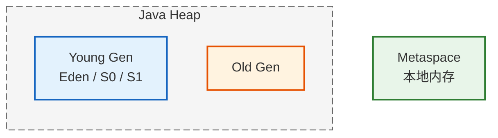
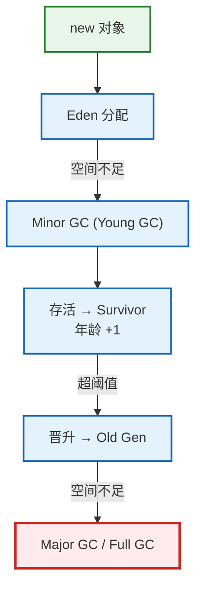
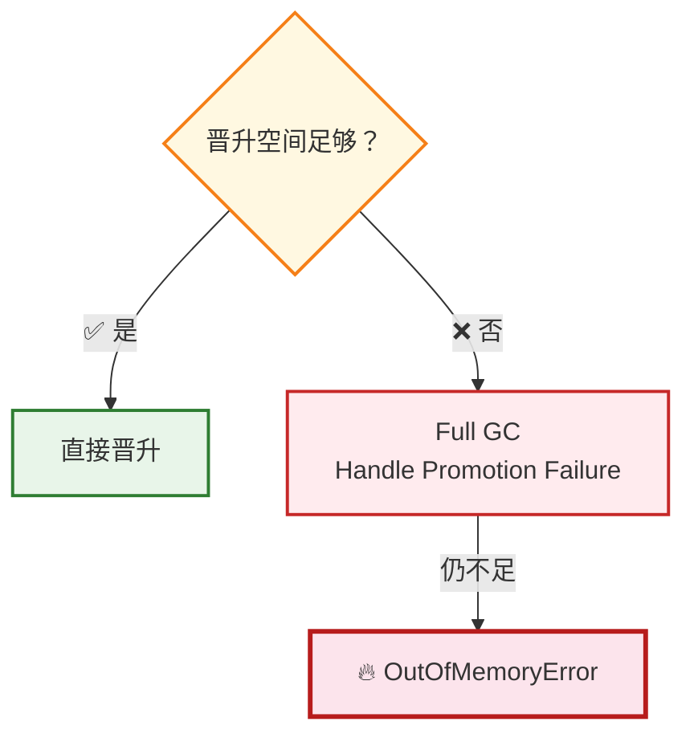
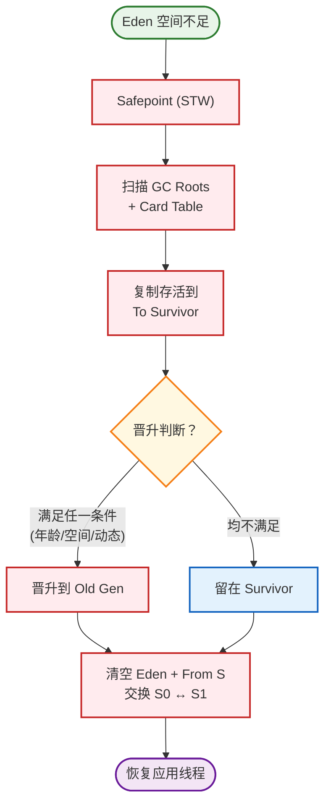
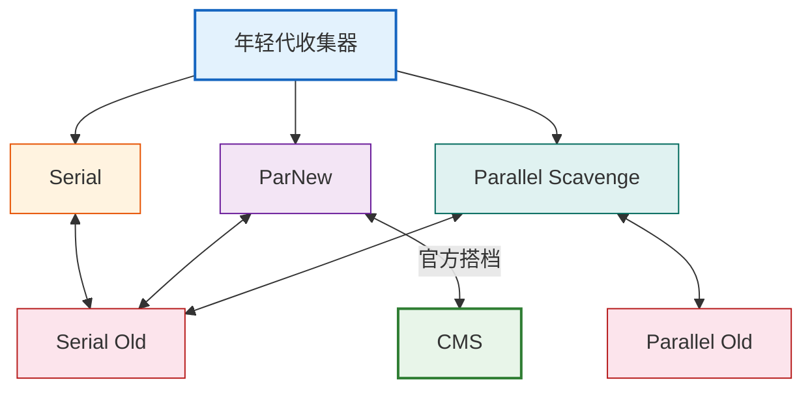
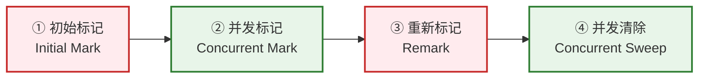
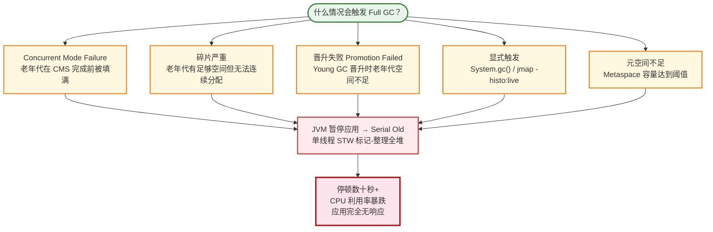
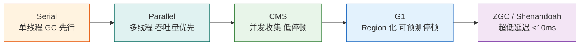

# JVM 垃圾回收通述

## 一、堆内存分代策略

### 1.1 为什么分代？

分代收集理论基于两个**弱分代假说 (Weak Generational Hypothesis)**：

- **弱分代假说**：绝大多数对象都是朝生夕死的（在年轻代就消亡）
- **强分代假说**：熬过越多次 GC 的对象越难消亡（应放在老年代）

基于这两个假说，JVM 堆被划分为不同代，对每一代采用最合适的收集算法。

### 1.2 堆内存结构（JDK 8）



| 区域                  | 说明                       | 默认占比                       |
| ------------------- | ------------------------ | -------------------------- |
| **Eden**            | 多数对象首次分配的地方              | Young 的 8/10               |
| **Survivor 0 (S0)** | 年龄未满的对象在此流转              | Young 的 1/10               |
| **Survivor 1 (S1)** | 同上，与 S0 互为主从             | Young 的 1/10               |
| **Old Gen**         | 长期存活的对象晋升至此              | 堆的 2/3 (默认 -XX:NewRatio=2) |
| **Metaspace**       | 类元数据（取代 JDK 7 的 PermGen） | 本地内存，默认无上限                 |

> **注意**：JDK 8+ 已移除永久代 (PermGen)，改为 Metaspace（使用本地内存）。

### 1.3 对象分配与晋升流程



**相关参数**：
- `-XX:NewRatio`：老年代 / 年轻代的比例，默认 2
- `-XX:SurvivorRatio`：Eden / Survivor 比例，默认 8
- `-XX:MaxTenuringThreshold`：晋升老年代的年龄阈值，默认 15
- `-XX:PretenureSizeThreshold`：大于此值的对象直接在老年代分配

---

## 二、Young GC（Minor GC）完整流程

### 2.1 触发条件

新对象分配在 Eden，Eden 空间不足 → 触发 Young GC。

Young GC 是 **Stop-the-World** 的（所有年轻代收集器皆是如此，包括 G1），应用线程全部暂停。

### 2.2 前置：跨代引用与卡表 (Card Table)

年轻代 GC 只扫描年轻代，但老年代中的对象可能引用了年轻代对象。如果不处理这些跨代引用，被老年代持有的年轻代对象会被误判为垃圾。

解决方案——**卡表 (Card Table)**：

```
Old Gen 被划分为许多 512 字节的"卡"（Card）
┌────┬────┬────┬────┬────┬────┬────┬────┐
│  0 │  0 │  1 │  0 │  0 │  1 │  0 │  0 │  ← Card Table (1 byte per card)
└────┴────┴────┴────┴────┴────┴────┴────┘
       ↑                 ↑
  引用 Young Gen     引用 Young Gen
```

- 老年代对象修改引用指向年轻代时，对应的卡标记为 **dirty**
- Young GC 时**只扫描 dirty 卡**中的老年代对象，不必扫描整个老年代
- 这是 **记忆集 (Remembered Set)** 的其中一种实现

### 2.3 初始状态

GC 触发前，堆中布局示意：

```
Eden:   ████████████████████░░░░  （快满了）
S0 (From):  ██████░░░░░░░░░░░░░░  （上次 GC 存活下来的对象）
S1 (To):    ░░░░░░░░░░░░░░░░░░░░  （空）
Old:        ████████████████████   （可能有对象）
```

### 2.4 Step 1 — 标记存活对象

从 GC Roots 出发，标记 **Eden + From Survivor** 中的存活对象。但 GC Roots 可能同时指向年轻代和老年代，HotSpot 通过**遍历时区域过滤 + Card Table 兜底**来实现"只标记年轻代"：

**遍历过程的过滤逻辑**：

```
GC Roots 扫描（全量扫描）：
  ├── 虚拟机栈 / 本地方法栈中引用的对象
  ├── 方法区中静态属性 / 常量引用的对象
  ├── 活跃的 Java 线程
  └── JNI 全局引用
          │
          ▼
  对每个 GC Root 指向的对象，判断其所在区域：
      ├── 在年轻代 (Eden / From S) → 标记，并递归遍历其字段
      │     └── 子对象在年轻代 → 继续标记 & 递归
      │     └── 子对象在老年代 → 停止此路径（不遍历老年代内部）
      └── 在老年代 → 直接停止此路径，不遍历
```

这种过滤确保了遍历范围被限制在年轻代内部，不会深入老年代的对象图。

**Card Table 兜底——弥补遍历中断遗漏的跨代引用**：

```
GC Root ──→ OldObj ──→ YoungObj
              ↑
    算法在此停止 → 遍历不到 YoungObj

Card Table 补救：
  遍历 dirty card 中的老年代对象 →
  发现 OldObj.field → YoungObj → 标记 YoungObj
```

单独靠遍历过滤会漏掉"老年代对象 → 年轻代对象"的引用，Card Table 在 Young GC 时只扫描 dirty card（远小于整个老年代），找到这些跨代引用并标记对应的年轻代对象。

> **两条路径共同构成完整的年轻代存活集**：GC Roots 遍历（区域过滤）覆盖栈/静态区直达年轻代的引用链，Card Table 覆盖老年代→年轻代的跨代引用。

### 2.5 Step 2 — 复制存活对象

将 Eden + From Survivor 中的存活对象复制到 **To Survivor**：

```
存活对象复制到 To Survivor：
  ┌─────┬─────┬─────┬─────┐
  │ ObjA│ ObjB│ ObjC│ ... │  → 到 To Survivor（年龄 +1）
  └─────┴─────┴─────┴─────┘
```

复制过程中同时发生的两件事：
- **A. 年龄 +1**：每次熬过一次 Young GC，对象年龄增加 1
- **B. 判断晋升**：满足条件则直接进入老年代

### 2.6 Step 3 — 对象晋升 (Promotion)

满足以下**任一条件**的对象直接晋升到老年代：

| 条件 | 说明 |
|------|------|
| `age >= MaxTenuringThreshold` | 年龄超过阈值，默认 15（CMS 隐含调整为 6） |
| **To Survivor 空间不足** | 存活对象超过 To Survivor 大小 → "提前晋升" (Premature Promotion) |
| **动态年龄判定** | 某年龄对象总大小超过 To Survivor 的 50%（`-XX:TargetSurvivorRatio`），则 >= 该年龄的对象全部晋升 |

**晋升前老年代空间检查**：



### 2.7 Step 4 — 清空 & 交换

```
1. 清空 Eden（全部清空，所有垃圾已回收）
2. 清空 From Survivor（原 S0，存活对象已复制走）
3. 交换 Survivor 指针：
     From ← 原 S1（现在是下一轮的 From）
     To   ← 原 S0（现在是下一轮的 To）
```

### 2.8 最终结果

```
GC 后状态：

Eden:   ░░░░░░░░░░░░░░░░░░░░░░  （清空）
S0 (From):  ░░░░░░░░░░░░░░░░░░  （清空，等待下一轮填充）
S1 (To):    ████████░░░░░░░░░░  （此轮存活对象，年龄 = 1,2,3...）
Old:    ████████████████████████  （可能有本轮晋升来的对象）
```

### 2.9 完整流程图



### 2.10 常见误区

| 误区 | 正解 |
|------|------|
| Young GC 只扫描年轻代 | 对，但需要通过 Card Table 扫描老年代中引用年轻代的对象 |
| Young GC 停顿时间一定很短 | 不一定。存活对象多（复制量大）或 Card Table 范围大时停顿也会变长 |
| 对象一定到 15 岁才晋升 | 不一定。动态年龄判定或 To Survivor 空间不足都会导致提前晋升 |
| Young GC 只在 Eden 满时触发 | 对的。唯一例外是 `-XX:+CMSScavengeBeforeRemark` 显式请求 |

### 2.11 相关参数

```bash
# Survivor 与 Eden 的比例（默认 8 → Eden:S0:S1 = 8:1:1）
-XX:SurvivorRatio=8

# 晋升年龄阈值
-XX:MaxTenuringThreshold=15

# 动态年龄判定：Survivor 使用率达到此比例时触发
-XX:TargetSurvivorRatio=50

# TLAB（线程本地分配缓冲区，减少 Eden 分配竞争）
-XX:+UseTLAB
-XX:TLABSize=0              # 0 = JVM 自动调整
```

---

## 三、垃圾回收算法

### 3.1 标记-清除 (Mark-Sweep)

| 项目 | 内容 |
|------|------|
| **过程** | 1. 标记存活对象 → 2. 清除未被标记的对象 |
| **优点** | 实现简单，不需要移动对象 |
| **缺点** | 产生内存碎片；分配效率随碎片化下降 |
| **适用** | CMS（老年代抽象思想上） |

### 3.2 标记-复制 (Mark-Copy)

| 项目 | 内容 |
|------|------|
| **过程** | 将存活对象从 From 空间复制到 To 空间，然后清空 From |
| **优点** | 分配指针滑动，无碎片；效率高 |
| **缺点** | 浪费一半空间（Survivor 设计缓解了此问题） |
| **适用** | 年轻代收集器（Serial、ParNew、Parallel Scavenge） |

**HotSpot 的优化**：Eden : S0 : S1 = 8 : 1 : 1，只浪费 10% 的空间。

### 3.3 标记-整理 (Mark-Compact)

| 项目 | 内容 |
|------|------|
| **过程** | 1. 标记存活对象 → 2. 将所有存活对象向一端移动 → 3. 清理边界外的空间 |
| **优点** | 无碎片；分配指针滑动，分配效率高 |
| **缺点** | 移动对象需要 STW；停顿时间长 |
| **适用** | Parallel Old、Serial Old、G1 Full GC、CMS 失败时的备用 |

### 3.4 分代收集理论

不同代使用不同算法：

| 代 | 算法 | 原因 |
|----|------|------|
| 年轻代 | **标记-复制** | 对象存活率低，复制开销小 |
| 老年代 | **标记-清除** 或 **标记-整理** | 对象存活率高，避免大量复制 |

---

## 四、G1 前的垃圾回收器

### 4.1 Serial 收集器（JDK 1.3）

```
Young:  Serial (标记-复制)
Old:    Serial Old (标记-整理)
```

| 项目 | 内容 |
|------|------|
| **工作方式** | 单线程，STW |
| **适用场景** | 客户端模式、单核处理器、小堆（<100MB） |
| **优点** | 简单高效，单线程无上下文切换开销 |
| **缺点** | STW 时间长，不能利用多核 |
| **开启参数** | `-XX:+UseSerialGC` |

### 4.2 ParNew 收集器

```
Young:  ParNew (标记-复制，多线程)
Old:    Serial Old (标记-整理)
```

| 项目 | 内容 |
|------|------|
| **工作方式** | Serial 的多线程版本，STW |
| **设计目标** | **低延迟**（作为 CMS 的年轻代搭档，缩短停顿） |
| **核心定位** | 存在的唯一意义就是配合 CMS——无 CMS 则无 ParNew |
| **自适应调节** | ❌ 无。需手动指定年轻代大小、分代比例、晋升阈值等 |
| **运行时写屏障** | 较重。为支持 CMS 并发标记，应用线程在**运行时**就需维护 Card Table，有持续开销 |
| **适用场景** | 与 CMS 搭配使用 |
| **开启参数** | `-XX:+UseParNewGC`（JDK 9 后废弃 + 移除） |

> ParNew 是 CMS 的唯一"官方搭档"年轻代收集器。如果不用 CMS，ParNew 没有独立存在的优势，应优先考虑 Parallel Scavenge 或 G1。

### 4.3 Parallel Scavenge + Parallel Old

```
Young:  Parallel Scavenge (标记-复制)
Old:    Parallel Old (标记-整理)
```

| 项目         | 内容                                                                                                                                             |
| ---------- | ---------------------------------------------------------------------------------------------------------------------------------------------- |
| **工作方式**   | 多线程 STW                                                                                                                                        |
| **设计目标**   | **吞吐量优先** (Throughput)                                                                                                                         |
| **关注点**    | 吞吐量 = 用户代码时间 / (用户代码时间 + GC 时间)，让 GC 总占比最低                                                                                                     |
| **自适应调节**  | ✅ **GC Ergonomics**。设目标参数，JVM 自动调整堆大小、分代比例、晋升阈值                                                                                                |
| **运行时写屏障** | 较轻。始终 STW，不需要为并发维护 Card Table，运行期零开销                                                                                                           |
| **适用场景**   | 后台计算、批处理任务、科学计算                                                                                                                                |
| **关键参数**   | `-XX:MaxGCPauseMillis=N`：期望最大停顿（软目标，与吞吐量 trade-off）<br/>`-XX:GCTimeRatio=N`：GC 时间占比分母，默认 99 → GC ≤ 1%<br/>`-XX:+UseAdaptiveSizePolicy`：开启自适应调节 |
| **开启参数**   | `-XX:+UseParallelGC` 或 `-XX:+UseParallelOldGC`                                                                                                 |

> **吞吐量 vs 停顿的权衡**：`-XX:MaxGCPauseMillis` 设得越小，JVM 会缩小年轻代来降低单次停顿，但 GC 频率升高，总吞吐量反而下降；设得越大（或不设），单次停顿变长但总 GC 时间占比更少。

### 4.4 收集器对比总结

| 收集器 | 线程 | 年轻代算法 | 老年代算法 | 设计目标 | 自适应调节 | 搭配关系 |
|--------|------|------------|------------|----------|-----------|----------|
| Serial | 单 | 复制 | 整理（Serial Old） | 简单低延迟（单线程） | ❌ | 独立 |
| ParNew | 多 | 复制 | 整理（Serial Old） | **低延迟**（配合 CMS） | ❌ 手动调参 | 搭配 CMS |
| Parallel Scavenge | 多 | 复制 | 整理（Parallel Old） | **吞吐量优先** | ✅ Ergonomics | 可搭配 Serial Old |

### 4.5 垃圾收集器间的关系（JDK 8 及更早）



---

## 五、CMS (Concurrent Mark Sweep) 收集器

### 5.1 概述

CMS 是 JDK 5 引入的 **老年代** 垃圾收集器，核心目标是**降低停顿时间**（低延迟），通过让垃圾回收线程与用户线程**并发执行**来实现。

| 项目 | 内容 |
|------|------|
| **适用代** | 仅老年代 |
| **算法** | 标记-清除 (Mark-Sweep) |
| **默认搭档** | ParNew（年轻代） |
| **设计目标** | 低停顿 (Low Pause) |
| **开启参数** | `-XX:+UseConcMarkSweepGC` |

### 5.1.1 CMS 的触发时机

CMS 和 ParNew（Young GC）是**两个相互独立的收集器**，各有各的触发条件，互不嵌套：

| 收集器                   | 谁触发            | 触发条件      |
| --------------------- | -------------- | --------- |
| **ParNew** (Young GC) | Eden 满 → 触发    | 与老年代无关    |
| **CMS** (老年代 GC)      | 老年代占用达到阈值 → 触发 | 与 Eden 无关 |

两者的关系是单向的：ParNew 晋升对象使老年代上涨，**可能间接触发** CMS；但 CMS 不会触发 ParNew（除非显式配置 `CMSScavengeBeforeRemark`）。

#### 阈值触发模式（显式指定）

```bash
-XX:+UseCMSInitiatingOccupancyOnly     # 告诉 JVM 用固定阈值，别自己算
-XX:CMSInitiatingOccupancyFraction=75  # 老年代用到 75% → 启动 CMS
```

#### 动态预测模式（JDK 8 默认行为）

如果**没有** `-XX:+UseCMSInitiatingOccupancyOnly`，JVM 会动态计算触发时机：

```
每次 ParNew GC 后，JVM 记录：
  ├── 本次晋升了多少对象     → promotion_rate
  ├── 上次 CMS 周期耗时      → cms_cycle_duration
  └── 老年代当前剩余空间

估算逻辑：
  下次 CMS 周期中预计新晋升量 = promotion_rate × cms_cycle_duration
  如果 当前占用 + 预计晋升 > 老年代容量 → 有 CMF 风险 → 立刻启动 CMS
```

这个模式下 `CMSInitiatingOccupancyFraction` 默认值 92% 只是个"动态预测不可用时的保底值"，JVM 通常会在更早（比如动态算到 70%-80%）就触发。

#### 触发时机的时间线

```
老年代占用趋势：

100% ┤ ═══════════════════════════════╤═════ 溢出 → CMF 💥
     │                               ↑
 92% ┤ ═════════════════╤═══════════│← CMSInitiatingOccupancyFraction 默认保底值
     │                   ↑           │
 75% ┤ ════╤════════════│ 并发标记中 │ 并发清除中
     │     ↑             │           │
     │  动态预测触发CMS   │ 新晋升对象不断涌入     │
     │                   预测："再不来就爆了"     │
     └─────────────────────────────────────────→ 时间
                      ↑
                CMS 周期耗时
          promotion_rate × 周期耗时 = 此间新晋升量
```

#### 其他触发方式

| 方式 | 参数 | 说明 |
|------|------|------|
| **重新标记前主动 Young GC** | `-XX:+CMSScavengeBeforeRemark` | 在 CMS 重新标记阶段前先做一次 Young GC，减少重新标记的扫描范围 |
| **显式触发 CMS 周期** | `-XX:+ExplicitGCInvokesConcurrent` | 使 `System.gc()` 触发一次 CMS 周期而不是 Full GC |

> **核心要点**：CMS 是异步回收，不阻塞应用。触发后老年代的进水口（对象晋升）始终开着，所以 CMS 必须**提前启动**才能在老年代被填满前完成回收。触发时机本质上是一场"启动太晚会 CMF vs 启动太早浪费 CPU"的权衡。



| 阶段 | STW? | 说明 |
|------|------|------|
| **初始标记** | ✅ 暂停 | 标记 GC Roots 直接关联的老年代对象，速度极快 |
| **并发标记** | ❌ | 从 GC Roots 开始遍历整个老年代的对象图，与应用并发执行 |
| **重新标记** | ✅ 暂停 | **修正**并发标记期间因用户程序继续运行而产生变动的对象标记。使用 `-XX:+CMSScavengeBeforeRemark` 可在重新标记前先做一次 Young GC |
| **并发清除** | ❌ | 清除未被标记的对象，回收空间。与应用并发执行 |

> CMS 的 STW 阶段只有初始标记和重新标记，都不长，所以总体停顿时间短。

### 5.3 CMS 的优缺点

#### 优点

- **低停顿**：两个 STW 阶段都很短（初始标记极快，重新标记相对较短）
- **并发性高**：GC 主要工作在并发阶段完成

#### 缺点

| 缺点 | 说明 | 影响 |
|------|------|------|
| **CPU 敏感** | 并发阶段会占用 CPU 资源 | 在 GC 线程竞争下，应用吞吐量下降（默认 GC 线程数 = CPU 核数的 1/4） |
| **浮动垃圾 (Floating Garbage)** | 并发标记/清除期间产生的垃圾无法在本轮处理 | 需要预留空间给浮动垃圾 |
| **Concurrent Mode Failure** | 老年代在 CMS 完成前被填满 | JVM 降级为 Serial Old（标记-整理），产生极长 STW |
| **内存碎片** | 标记-清除算法不整理内存 | 老年代碎片化严重时，大对象分配失败，提前触发 Full GC |
| **无法处理"惊群"对象** | JDK 5 时对跨代引用会全量扫描（JDK 6 引入卡表(Card Table)优化） | 增加并发标记的负担 |

### 5.4 Concurrent Mode Failure

**触发条件**：CMS 还在并发执行，但老年代已经没有足够空间容纳新晋升的对象。

**后果**：JVM **暂停应用**，使用 Serial Old 收集器对老年代做一次**完全的 STW 标记-整理**回收，停顿时间极长（可能数秒到数十秒）。

**预防与优化**：

| 方法       | 参数                                     | 说明                        |
| -------- | -------------------------------------- | ------------------------- |
| 提前触发 CMS | `-XX:CMSInitiatingOccupancyFraction=N` | 老年代占用 N% 时就开始 CMS，默认 92%  |
| 启用增量收集   | `-XX:+CMSIncrementalMode`              | 减少并发阶段的 CPU 竞争（JDK 9 已废弃） |
| 预留更多空间   | 调低上述阈值，留更多空间给浮动垃圾                      | —                         |
| 减少碎片     | `-XX:+UseCMSCompactAtFullCollection`   | Full GC 后做一次碎片整理          |
| 整理间隔     | `-XX:CMSFullGCsBeforeCompaction=N`     | N 次 Full GC 后做一次碎片整理      |

### 5.5 CMS 相关关键参数

```bash
# 启用 CMS（JDK 9 起废弃，JDK 14 移除）
-XX:+UseConcMarkSweepGC

# 指定年轻代收集器（默认 ParNew，JDK 9 前）
-XX:+UseParNewGC

# 老年代触发 CMS 的占用比例
-XX:CMSInitiatingOccupancyFraction=75

# 是否在重新标记前先做一次 Young GC
-XX:+CMSScavengeBeforeRemark

# CMS 失败后是否做碎片整理
-XX:+UseCMSCompactAtFullCollection

# 每 N 次 Full GC 做一次碎片整理
-XX:CMSFullGCsBeforeCompaction=5

# CMS 并行线程数
-XX:ParallelCMSThreads=4
```

### 5.6 CMS 的完整 GC 流程


### 5.7 CMS 下的 Full GC

CMS 的 Full GC **不是 CMS 的正常并发周期**，而是 CMS 失败或特殊触发后的**降级行为**。理解这一点对排查 CMS 下的性能问题至关重要。

#### CMS 中 Full GC 到底是什么？

```
CMS 正常工作时：
  ParNew (Young GC) ─→ CMS (并发老年代收集)
  └── 这不是 Full GC，这只收集老年代

CMS 下的 Full GC：
  暂停所有线程 → Serial Old 全量标记-整理（年轻代 + 老年代）
  └── 单线程、STW、从头到尾，极其慢
```

**关键认知**：CMS 本身没有"Full GC"阶段。它只有两种状态：

| 状态 | 行为 | STW? | 是否算 Full GC |
|------|------|------|---------------|
| **正常 CMS 周期** | 并发标记 + 并发清除，只处理老年代 | 仅初始标记和重新标记短暂停 | ❌ 不是 |
| **CMS 失败/降级** | Serial Old 标记-整理全堆 | ✅ 全程 STW，可能数秒到数十秒 | ✅ **这才是 Full GC** |
| **碎片触发** | 老年代碎片导致无法分配大对象 | ✅ 降级 Serial Old | ✅ 也是 Full GC |

#### 触发 Full GC 的几种场景



#### Full GC 时的表现特征

| 观察维度 | 表现 |
|----------|------|
| **GC 日志** | 出现 `[Full GC ... [Serial: ...]` 而非 `[CMS ...`，伴随 `concurrent mode failure` |
| **停顿时间** | 极长，与老年代大小成正比，数秒～数十秒 |
| **CPU** | Full GC 期间 CPU 占用下降（单线程 Serial Old + 应用暂停） |
| **JVM 行为** | Full GC 后会做碎片整理（如果开启了 `-XX:+UseCMSCompactAtFullCollection`） |
| **后续影响** | Full GC 整理后老年代连续空间增大，但整体吞吐量断崖式下降 |

#### CMS Full GC vs Parallel Full GC

| 维度 | CMS 下的 Full GC | Parallel Scavenge 下的 Full GC |
|------|-----------------|-------------------------------|
| **收集器** | **Serial Old**（单线程） | **Parallel Old**（多线程） |
| **算法** | 标记-整理 | 标记-整理 |
| **线程数** | 1 个 | 多线程 |
| **速度** | 极慢 | 相对快 |
| **发生频率** | 较低（正常 CMS 周期能处理多数情况） | 每次老年代满就触发 |
| **讽刺之处** | **选 CMS 追求低延迟，但 Full GC 恰恰是停顿最长的** | Full GC 是预期内的，多线程反而更快 |

> **CMS Full GC 的讽刺**：你选 CMS 就是为了避免老年代 STW，但 CMS 的 Full GC 降级到 Serial Old 后，反而比 Parallel 的 Full GC 更慢（单线程 vs 多线程）。所以 CMS 的 Full GC 是最坏情况中的最坏情况。

### 5.8 CMS 的监控视角

CMS 和 ParNew 在监控系统中的归类经常让人困惑，核心原因是 JMX 的命名和人们的直觉不一致。

#### 监控中的 GC 分类速查

| 实际事件 | GC 日志关键词 | JMX Bean 名称 | 监控归类 |
|---------|-------------|---------------|---------|
| **Young GC** | `[ParNew ...` | `ParNew` | Young GC |
| **CMS 正常周期** | `[CMS ...` | `ConcurrentMarkSweep` | **Old GC / Major GC** |
| **CMF 降级 Full GC** | `[Full GC ...` | 仍记在 `ConcurrentMarkSweep` | 监控上看不出，需要查日志 |

> CMS 的设计定位就是老年代收集器，所以它的周期在监控中天然归为 **Old GC**。ParNew 归为 **Young GC**。两者互相独立。

#### 监控中最容易掉的两个坑

**坑一：CMS 的"耗时"数字是假的**

CMS 的 4 个阶段里只有初始标记和重新标记是 STW 的，但 JMX 的 `GarbageCollectorMXBean.getCollectionTime()` **把整个并发周期的时间都算进去了**：

```
一次典型 CMS 周期耗时：
  初始标记 (STW)     10ms
+ 并发标记 (不暂停)   500ms  ← 应用在正常跑
+ 重新标记 (STW)     50ms
+ 并发清除 (不暂停)   300ms  ← 应用在正常跑
= 860ms  ← JMX 上报这个值，但应用只暂停了 60ms
```

如果你用 `jvm_gc_collection_seconds_sum{gc="ConcurrentMarkSweep"}` 画图，看到的巨大尖峰**主要是并发时间，不是真正的 STW 时间**。

> **正确做法**：看 GC 日志中的真正暂停时间，或使用 `-XX:+PrintGCApplicationStoppedTime` 单独输出所有 STW 事件。

**坑二：Full GC 被藏在 CMS 的 JMX 指标里**

Concurrent Mode Failure 降级到 Serial Old 后，JMX **不会新增一个** `SerialOld` Bean——它仍然记在 `ConcurrentMarkSweep` 名下。

```
正常 CMS 周期 → ConcurrentMarkSweep count +1, time + 860ms  (大部分并发)
CMF Serial Old → ConcurrentMarkSweep count +1, time + 30s   (全部 STW)
```

同一指标里混合了两种完全不同的行为，光看 JMX 曲线你分不清。"咦，这次 Old GC 耗时怎么 30 秒？"——那就是 CMF + Full GC 了。

#### 实际监控建议

| 你想监控什么 | 该用什么方式 |
|-------------|------------|
| **Young GC 频率/耗时** | `jvm_gc_collection_seconds{generation="young"}` (Prometheus JMX Exporter) |
| **Old GC 触发频率** | `jvm_gc_collection_seconds_count{generation="old"}` |
| **CMS 真正 STW 时间** | GC 日志初始标记 + 重新标记的暂停时间，或 `-XX:+PrintGCApplicationStoppedTime` |
| **有没有发生 CMF** | GC 日志中搜索 `concurrent mode failure`——**这是唯一可靠的方式** |
| **Full GC 频率** | GC 日志搜索 `[Full GC`，不要依赖 JMX |
| **老年代占用趋势** | JMX `MemoryPoolMXBean` 的 `Tenured Gen` 使用率 |

> **一句话总结**：监控 CMS 时，JMX 的 `ConcurrentMarkSweep` 耗时曲线**不可信**（混入了并发时间），Full GC 被隐藏在同一个指标里（和正常 CMS 周期无法区分）。真正的答案在 GC 日志里。

### 5.9 CMS 的消亡

| JDK 版本 | 变化 |
|----------|------|
| JDK 5 | 引入 CMS |
| JDK 6 | 优化卡表 (Card Table) 处理跨代引用 |
| JDK 8 | CMS 仍然是常用收集器 |
| **JDK 9** | **CMS 被废弃** (`-XX:+UseConcMarkSweepGC` 仅给出警告) |
| JDK 14 | **CMS 正式移除**（代码已删除） |

**替代方案**：
- **G1**：JDK 9 的默认收集器，Region 化设计，同时处理年轻代和老年代，低延迟
- **ZGC**（JDK 15+）：超低延迟（<10ms），几乎不 STW
- **Shenandoah**（JDK 12+）：与 ZGC 类似的低延迟收集器

> 详见 [[G1]] 和 [[ZGC]]

---

## 六、总结

### 各收集器适用场景速查

| 需求 | 推荐组合 |
|------|----------|
| 单机小堆、开发调试 | Serial |
| 业务系统、低延迟要求（JDK 8） | ParNew + CMS |
| 后台任务、吞吐量优先 | Parallel Scavenge + Parallel Old |
| JDK 9+ 通用默认 | G1 |
| 超低延迟 (<10ms) | ZGC / Shenandoah |

### 垃圾收集器演进路线



---

## 参考

- 《深入理解 Java 虚拟机》（周志明）
- Oracle JDK 文档：Garbage Collection Tuning Guide
