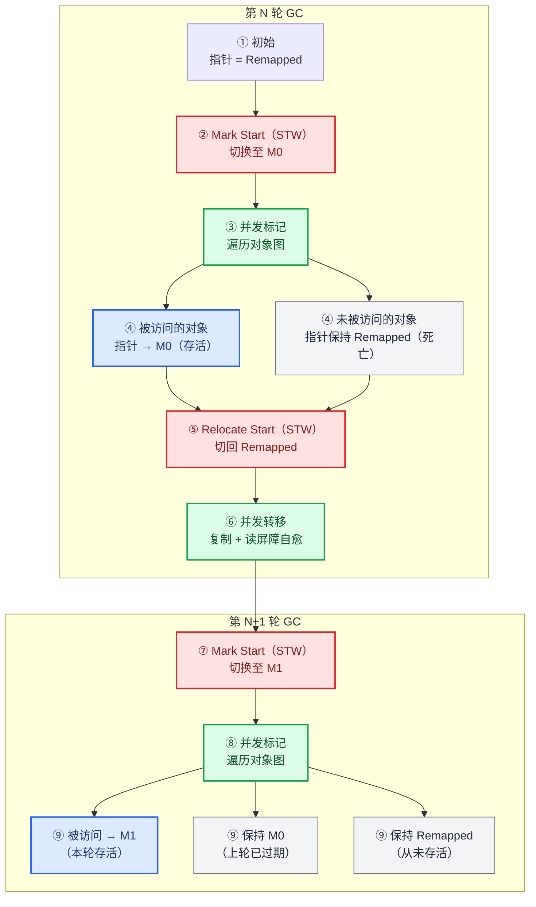

# ZGC (Z Garbage Collector)

## 概述

ZGC（The Z Garbage Collector）是 JDK 11 中推出的一款**低延迟垃圾回收器**，由 Oracle 的 Per Lidén 和 Stefan Karlsson 领导设计。其核心设计目标：

- **停顿时间不超过 10 ms**
- 停顿时间**不随堆大小或活跃对象大小增加**
- 支持 8 MB ~ 16 TB 级别的堆（JDK 21 后）

后续 JDK 21 引入了**分代 ZGC (Generational ZGC)**（基于年轻代 + 老年代），JDK 24 后非分代模式被移除。

---

## 核心原理速览

### 关键技术

| 技术 | 作用 |
|------|------|
| **着色指针 (Colored Pointers)** | 将对象存活信息存在指针的 42~45 位（元数据位），而非对象头。标记/重定位状态通过指针即可判断，无需访问内存 |
| **读屏障 (Load Barrier)** | 应用线程从堆读取对象引用时触发。若对象被移动了，读屏障将指针更新到新地址（自愈）|

### 并发阶段（非分代 ZGC）

ZGC 只有 **3 个 STW 阶段**（均只扫描 GC Roots，耗时极短）：

```
初始标记 (STW, <1ms) → 并发标记 → 再标记 (STW, <1ms) → 初始转移 (STW, <1ms) → 并发转移
```

- **并发标记**：标记存活对象，通过着色指针将地址视图从 Remapped 切换为 M0/M1
- **并发转移**：将存活对象复制到新地址，通过读屏障自愈访问旧地址的引用

### 分代 ZGC（JDK 21+）

JDK 21 引入分代版 ZGC，将堆分为年轻代和老年代各自独立并发收集，降低内存开销和 GC CPU 开销。JDK 17 及之前的非分代 ZGC 则是单一代全堆收集，下文原理部分均以非分代 ZGC 为准。

---

## ZGC 与其他 GC 对比（快速一览）

### 各收集器横向对比

| 维度             | Parallel      | G1                                | ZGC                          |
| -------------- | ------------- | --------------------------------- | ---------------------------- |
| **设计目标**       | 高吞吐量          | 平衡延迟与吞吐量                          | 超低延迟（<10 ms）                 |
| **STW 特征**     | 全程 STW（多线程）   | Young/Mixed GC 全程 STW；初始/最终标记 STW | **三段极短 STW**（仅扫 Roots，<1 ms） |
| **转移阶段**       | STW 复制        | **STW Evacuation**（随活跃对象量增长）      | **并发转移**（不 STW）              |
| **运行时屏障**      | ❌ 无           | 写屏障（SATB）                         | 读屏障                          |
| **吞吐量**        | ⭐⭐⭐⭐⭐（基准）     | ⭐⭐⭐⭐                              | ⭐⭐⭐（读屏障开销约降 5~15%）           |
| **大堆（>32 GB）** | ⭐⭐ Full GC 过长 | ⭐⭐⭐⭐ 停顿随活跃对象增长                    | ⭐⭐⭐⭐⭐ 停顿不随堆增长                |
| **小堆（<4 GB）**  | ⭐⭐⭐⭐⭐         | ⭐⭐⭐⭐                              | ⭐⭐⭐                          |
| **超大堆（1 TB+）** | ❌             | ❌ RSet 内存爆炸                       | ⭐⭐⭐⭐⭐ 唯一可行选择                 |

### 选型建议

- **追求超低延迟（<10 ms）** → ZGC
- **平衡吞吐量与延迟（10~200 ms）** → G1（调节 MaxGCPauseMillis）
- **吞吐量优先 / 小堆** → Parallel

---

## ZGC 核心原理详解

### 一、内存布局

ZGC 使用 Region 化的堆结构，将堆划分为等大小的 Region，但相比 G1 有更灵活的虚拟内存映射：

| 属性 | 说明 |
|------|------|
| **Region 大小** | 动态，支持 8 MB ~ 16 TB 堆 |
| **虚拟地址映射** | **多映射（Multi-Mapped Memory）**：同一物理地址映射到三个虚拟地址空间 M0、M1、Remapped，通过切换地址视图来实现标记状态判断 |
| **大对象** | 直接在老年代分配 |

### 二、着色指针（Colored Pointers）

着色指针是 ZGC 最核心的创新——**将对象存活信息编码在指针引用中**，而非传统方式的对象头。

#### 传统 GC vs ZGC


#### 地址视图与三段虚拟地址空间

ZGC 将着色信息编码在 64 位指针的元数据位中，通过三个虚拟地址视图实现标记状态的隐式判断：


这三个视图对应三段不同的虚拟地址区间，但通过内存多映射（Multi-Mapped Memory）指向**同一物理堆内存**：


GC 通过交替激活 M0 / M1 作为"当前标记视图"，让两次 GC 周期共享同一套标记机制，无需显式清除上次的标记位：

```mermaid
flowchart LR
    accTitle: ZGC Alternating M0 and M1 Mark Views Across Cycles
    accDescr: Two consecutive GC cycles demonstrating how M0 and M1 views alternate as the active mark view, eliminating the need to explicitly clear previous mark bits

    subgraph cycle_n["第 N 轮 GC"]
        direction TB
        n1["① 初始<br/>指针 = Remapped"] --> n2["② Mark Start（STW）<br/>激活 M0"]
        n2 --> n3["③ 并发标记<br/>存活 → M0"]
    end

    subgraph cycle_n_plus_1["第 N+1 轮 GC"]
        direction TB
        n4["④ 初始<br/>M0 已过期"] --> n5["⑤ Mark Start（STW）<br/>激活 M1"]
        n5 --> n6["⑥ 并发标记<br/>存活 → M1"]
    end

    n3 --> n4
    n6 --> n7["⑦ 第 N+2 轮<br/>M0 再次激活……"]

    classDef stw_style fill:#fee2e2,stroke:#dc2626,stroke-width:2px,color:#7f1d1d
    classDef mark_style fill:#dcfce7,stroke:#16a34a,stroke-width:2px,color:#14532d
    classDef init_style fill:#dbeafe,stroke:#2563eb,stroke-width:2px,color:#1e3a5f

    class n2,n5 stw_style
    class n3,n6 mark_style
    class n1,n4,n7 init_style
```



| 视图 | 作用 |
|------|------|
| **Remapped** | 初始状态。对象未被当前轮次访问过，隐式为死亡 |
| **M0（本轮标记视图）** | 当前 GC 标记阶段被访问 → 对象存活 |
| **M1（上一轮标记视图）** | 上一轮标记的存活对象，已随新轮次切换退化为"历史标记"，不再有效 |

#### 为什么交替视图不需要显式清除标记？

传统 GC（如 G1）在每轮标记结束后，需要**遍历所有对象头清除标记位**，否则上一轮的标记信息会干扰下一轮判断。这在并发场景下代价很高。

ZGC 通过 M0 / M1 交替绕过了这个问题——它用了一个很巧妙的思路：**不擦黑板，换支笔写**。

##### 问题：不擦掉会发生什么？

每轮 GC 都需要区分"本轮存活的"和"上一轮存活但本轮已死的"。如果没有清除机制，一个对象在上轮被标记为存活，这轮没有被访问到，但它的标记还在，GC 无法判断它到底是本轮存活的还是上轮残留的。

##### ZGC 的解法：切换视图即重置

ZGC 的着色指针中，元数据位记录的**不是布尔值"是否标记"**，而是**视图标识**（指向哪个虚拟地址区间）。物理内存不变，但哪个视图有效由 GC 阶段决定。

用一个具体例子走一遍流程：



| 状态 | 第 N 轮 | 第 N+1 轮 |
|------|--------|---------|
| Remapped | 初始/未访问 | 从未存活 |
| M0 | 存活 | 历史标记 |
| M1 | — | 存活 |

关键差异在于：

| 维度 | 传统 GC（清除标记） | ZGC（交替视图） |
|------|-------------------|----------------|
| 操作 | 每轮结束后 STW 遍历对象头，将标记位清零 | 下一轮直接切换有效视图，旧视图自动作废 |
| 代价 | 需暂停、需遍历所有存活对象 | 零额外开销，仅改变指针元数据位的解释方式 |
| 并发安全 | 清除期间需 STW，否则与并发标记冲突 | 天然安全——视图激活是原子切换 |

### 三、读屏障

应用线程**从堆中读取对象引用**时自动触发。作用：

1. **自愈**：若对象被 GC 转移，读屏障检测到指针指向旧地址，自动更新为新的目标地址
2. **标记**：标记阶段首次访问对象时，将地址视图从 Remapped 切换为 M0/M1

```
Object o = obj.fieldA    // ← 此处插入读屏障代码
// 伪代码逻辑：
// if (colored_ptr.is_remapped()) {
//     colored_ptr = colored_ptr.remap();   // 更新为新地址
// }
// return colored_ptr;
```

读屏障经过高度优化，分为**快路径**（内联到 JIT 编译代码中的几个指令）和**慢路径**（仅少数情况才进入的 C++ 处理函数）。

### 四、GC 周期详解

ZGC 的一次垃圾回收周期由三个并发阶段组成：**标记**、**转移**、**重定位**。其中仅含 3 个 STW 子步骤（初始标记、再标记、初始转移），其余均与应用线程并发执行。

#### 完整周期（非分代 ZGC）


各阶段详细说明：

| 阶段                                          | STW?    | 说明                                                                                                                           |
| ------------------------------------------- | ------- | ---------------------------------------------------------------------------------------------------------------------------- |
| **初始标记**（Pause Mark Start）                  | ✅ <1 ms | 扫描 GC Roots，标记 Roots 直接引用的对象。处理时间仅与 GC Roots 数量成正比                                                                           |
| **并发标记 / 重映射**（Concurrent Mark / Remap）     | ❌       | 从 GC Roots 出发遍历对象图，标记存活对象（地址视图 Remapped → M0）。**同时重映射上一轮转移遗留的旧指针**（将指向旧地址的引用修正到新地址）。此阶段结束时，对象的地址要么是 M0（活跃），要么是 Remapped（不活跃） |
| **再标记**（Pause Mark End）                     | ✅ ≤1 ms | 处理并发标记阶段的残余标记工作。若超过 1 ms 则回到并发标记 / 重映射阶段继续                                                                                   |
| **并发转移准备**（Concurrent Prepare for Relocate） | ❌       | 处理非强引用（软/弱/虚/终结引用），选择垃圾最多的 Region 组成重定位集，为转移阶段做准备                                                                            |
| **初始转移**（Pause Relocate Start）              | ✅ <1 ms | 扫描 GC Roots，切换地址视图为 Remapped。根对象引用的转移从此开始                                                                                    |
| **并发转移**（Concurrent Relocate）               | ❌       | 将重定位集中的存活对象复制到新 Region。GC 线程执行对象复制（转移），应用线程通过读屏障自动将指向旧地址的引用修正到新地址（重定位）。转移和重定位在此阶段并发完成                                        |

#### 为什么 ZGC 能把转移做成并发的？

1. **着色指针**：转移时只需要修改指针元数据（标记对象已移动），不必更新对象本身
2. **读屏障**：应用线程访问旧地址时，读屏障自动"自愈"到新地址
3. **转发表**：GC 线程维护旧地址→新地址的映射，供读屏障查询

使得应用线程和 GC 线程可以在转移阶段**同时访问同一个对象**而不会出错。这是 ZGC 相对于 G1 的核心优势——G1 的 Evacuation 是全程 STW 且停顿随存活对象量增长。

#### 转发表的清理时机

转发表（旧地址 → 新地址的映射）在并发转移阶段产生，但**不能立即清理**——转移结束后，应用线程手中可能还持有指向旧地址的指针（尚未触发读屏障自愈），此时清掉转发表会让后续读屏障找不到新地址。

清理发生在**下一轮 GC 的并发标记/重映射阶段**：

```
第 N 轮：并发转移 → 产生转发表（旧地址→新地址映射）
         ↓
第 N+1 轮：并发标记/重映射 → 遍历对象图时，将所有遇到的旧指针重映射到新地址
         ↓ 重映射完成 → 该条转发表不再被任何指针引用 → 安全释放
```

选择这个时机有三点原因：

1. **免费搭车**：并发标记本身就要遍历所有存活对象，重映射顺带完成，无需单独遍历
2. **覆盖完整**：标记遍历的对象图即为应用线程可访问的全部路径，路径上的旧指针在一次遍历中全部修正，不留遗漏
3. **唯一安全窗口**：上一轮转移已结束（转发表稳定），下一轮转移尚未开始（不会新增转发表条目），不存在并发冲突

#### 完整的停顿时间构成

| 阶段 | 停顿来源 | 持续时间 |
|------|---------|---------|
| Roots 扫描 | GC Roots 遍历（栈、静态区、JNI、ClassLoader、CodeCache 等）| 与 Roots **数量**成正比，与堆大小无关 |
| 标记 | 并发，0 STW | — |
| 转移/复制 | **并发**，0 STW | — |
| 重定位 | **并发**，0 STW | — |

ZGC 停顿时间的核心特征是：**只取决于 GC Roots 集合的大小，不随堆大小或活跃对象量增加**。这是 ZGC 能在多 TB 堆上保持亚毫秒停顿的根本原因。

## ZGC 调优指南

### 关键参数

| 参数 | 默认值 | 说明 |
|------|--------|------|
| `-XX:+UseZGC` | — | 启用 ZGC（JDK 11+）|
| `-Xmx` | — | **最重要的参数**。需足够容纳 live-set + GC 期间的分配 |
| `-XX:ConcGCThreads` | 核数的 12.5% | 并发 GC 线程数，越大 GC 越快但吞吞吐量 |
| `-XX:ParallelGCThreads` | 核数的 60% | STW 阶段线程数 |
| `-XX:ZCollectionInterval` | — | 最小 GC 间隔（秒），固定间隔触发 |
| `-XX:ZAllocationSpikeTolerance` | 2 | 分配速率容忍系数，越大越早触发 GC |
| `-XX:+ZProactive` | true | 主动 GC 触发 |
| `-XX:ZUncommit` | true | 是否将未用内存返还 OS |
| `-XX:ZUncommitDelay` | 300 s | 内存空闲多久后返还 |

### GC 触发机制

ZGC 有多种 GC 触发方式，按优先级排列：

| 触发方式       | 日志关键词                   | 说明                                |
| ---------- | ----------------------- | --------------------------------- |
| **内存分配阻塞** | `Allocation Stall`      | 堆满时线程阻塞等待 GC。**应避免**              |
| **自适应算法**  | `Allocation Rate`       | 根据分配速率和 GC 耗时计算触发阈值，默认主要触发方式      |
| **固定时间间隔** | `Timer`                 | 由 ZCollectionInterval 控制，到点必触发，与分配速率脱钩；自适应算法依赖历史样本，突增流量时会反应不及导致 Allocation Stall，固定间隔提供兜底节奏 |
| **主动触发**   | `Proactive`             | ZGC 自行计算触发时机，由 ZProactive 控制      |
| **显式调用**   | `System.gc()`           | 代码中调用 System.gc() 触发              |
| **预热**     | `Warmup`                | 服务刚启动时触发                          |
| **元数据不足**  | `Metadata GC Threshold` | 元数据区不足时触发                         |

> 自适应算法基于正态分布模型预测分配速率，ZAllocationSpikeTolerance 值越大越早触发 GC，默认 2，可在流量突增场景调大到 5。

> **触发 ≠ 启动**：Director 线程持续评估触发规则，但**单代 ZGC 一次只能跑一个周期**——并发回收中即便规则判定该 GC 了，新周期也只能排队等当前周期结束。这意味着**单次 GC 周期耗时本身就是吞吐量硬约束**：当 `周期耗时 > 触发间隔` 时，触发规则等不及兑现 → 堆持续上涨 → Allocation Stall。这也是大堆要调高 ConcGCThreads 缩短单次周期的根本动机。
>
> 分代 ZGC（JDK 21+，`-XX:+ZGenerational`）允许 Young 和 Old 周期部分重叠，但**同一代内部仍然串行**。

### 场景推荐配置

#### 低延迟敏感服务

```bash
-Xms10G -Xmx10G
-XX:+UseZGC
-XX:ZCollectionInterval=5         # 固定间隔，避免自适应触发过晚
-XX:ZAllocationSpikeTolerance=5   # 更早触发 GC
-XX:ConcGCThreads=2               # 根据 CPU 核数调整
```

#### 大堆（>100 GB）场景

```bash
-Xms200G -Xmx200G
-XX:+UseZGC
-XX:ConcGCThreads=8               # 增加并发线程加速回收
-XX:ParallelGCThreads=16
-XX:ZCollectionInterval=10
```

### 监控关键指标

ZGC 运行健康度无法靠"GC 次数 + 暂停时间"这种传统两件套衡量。下面这些指标按**优先级**排列，前几项是必须告警的，后几项是趋势观察用的。

#### 核心指标（必须告警）

| 指标                                                    | 来源                                                        | 关注原因                                                                  |
| ----------------------------------------------------- | --------------------------------------------------------- | --------------------------------------------------------------------- |
| **Allocation Stall 次数 / 总时长**                         | GC 日志关键词 `Allocation Stall`、JFR 事件 `jdk.ZAllocationStall` | **应用线程被冻结**，是 ZGC 最坏情况。出现即说明 GC 跟不上分配速度，吞吐量瞬间塌陷。生产环境应配置为"出现即告警"       |
| **GC 周期耗时（Cycle Duration）**                           | GC 日志中 `Garbage Collection (Reason) ... XXXms`            | 单次周期耗时是吞吐量的硬约束（见上文"触发 ≠ 启动"）。当周期耗时接近触发间隔时，离 Stall 就只剩一步               |
| **GC 触发频率与周期耗时比**                                     | 推算：`Cycle Duration / 触发间隔`                                | 比值 > 0.7 即预警，> 1 必然 Stall。这是判断"GC 能不能追上分配"的最直接指标                      |
| **STW 暂停时间（Pause Mark Start / End / Relocate Start）** | GC 日志 `Pause` 行                                           | ZGC 的核心卖点是亚毫秒停顿。单次 > 1 ms 通常说明 GC Roots 异常膨胀（CodeCache、ClassLoader 等） |

#### 容量与压力指标（趋势观察）

| 指标 | 来源 | 关注原因 |
|------|------|---------|
| **堆使用率（Used / Max）** | JMX `MemoryUsage`、GC 日志 | 持续 > 70% 说明堆偏小，留给 GC 的缓冲不足，自适应算法被迫提前触发，GC 频率被拉高 |
| **Live Set 大小** | GC 日志 `Live` 字段 | 真正"活着"的对象量。Live Set / Xmx 应保持在 30% 以下，否则 GC 周期需搬运的对象多，耗时长 |
| **分配速率（Allocation Rate）** | GC 日志 `Allocation Rate XXX MB/s`、JFR `jdk.ZAllocationRate` | 业务侧泄漏或临时对象暴涨的第一信号。结合 ConcGCThreads 推算 GC 极限分配速率 |
| **GC CPU 使用率** | JFR `jdk.ZStatisticsCPU`、`top -H` 查看 GC 线程 | 验证 ConcGCThreads 调整是否合理。若 GC CPU 占比 > 30% 且应用 CPU 仍紧张，说明该加堆而不是加 GC 线程 |

#### 内存返还与稳定性指标

| 指标 | 来源 | 关注原因 |
|------|------|---------|
| **Committed / Reserved 内存** | JMX、GC 日志 `Memory: ...` | ZGC 会按 ZUncommitDelay 把空闲内存还给 OS。Committed 持续等于 Xmx 说明从未空闲过，要么堆偏小要么有泄漏 |
| **GC Roots 扫描耗时** | GC 日志 `Pause Roots` 子项 | ZGC 唯一与堆大小无关、却与代码复杂度强相关的停顿来源。趋势上涨 = CodeCache / ClassLoader 膨胀 |
| **元数据 GC 触发次数** | GC 日志 `Metadata GC Threshold` | 频繁出现说明 Metaspace 配置偏小或存在类加载泄漏（动态代理、字节码生成框架易踩） |

#### 指标采集建议

- **GC 日志**：必开 `-Xlog:gc*,gc+heap=debug,gc+age=trace:file=gc.log:time,uptime,level,tags:filecount=10,filesize=100M`，是最权威的数据源
- **JFR**：长期录制（`-XX:StartFlightRecording=duration=0,filename=app.jfr,settings=profile`），ZGC 相关事件以 `jdk.Z*` 开头
- **Prometheus**：通过 `jmx_exporter` 暴露 `java.lang:type=GarbageCollector,name=ZGC` 系列指标，建议自定义 recording rule 聚合"GC 周期耗时 / 间隔"这种推算指标
- **告警阈值**：上面列的阈值仅为**经验起点**，必须结合自己业务的基线调整。比对正常时段与异常时段才有意义

> 我对具体 JFR 事件名和 JMX 路径基于 JDK 17 ~ 21 的命名做了归纳，跨大版本时建议先 `jcmd <pid> JFR.view event-types` 确认实际事件名再写监控。

### 常见瓶颈与解决方案

| 瓶颈 | 表现 | 解决方案 |
|------|------|---------|
| **读屏障开销** | 吞吐量下降 5~15%（对比 Parallel）| 增大堆以降低 GC 频率 / 调整 ConcGCThreads |
| **Allocation Stall** | 分配速度超过 GC 回收速度时线程阻塞 | 增大堆 / 调小 ZCollectionInterval / 增大 ZAllocationSpikeTolerance |
| **GC Roots 过多** | 单次停顿 >1 ms（日志中 Pause Roots 耗时高）| 检查 ClassLoader、CodeCache 等 Roots 来源是否异常 |
| **CodeCache 膨胀** | Roots 扫描 CodeCache 耗时随运行时间增长 | 限制 JIT 编译 / 优化业务代码减少动态类生成 |
| **大堆吞吐量下降** | ZGC 全并发导致 CPU 争抢 | 适当降低 ConcGCThreads / 增大堆 |

---

## 附录：经典文章 & 资源

### 中文

| 文章 | 来源 | 发布 | 内容侧重 |
|------|------|------|---------|
| [新一代垃圾回收器 ZGC 的探索与实践](https://tech.meituan.com/2020/08/06/new-zgc-practice-in-meituan.html) | 美团技术团队 | 2020.08 | ⭐ **最推荐入门**。含整体原理（着色指针、读屏障、并发标记/转移/重定位）+ 调优实战 + 生产效果，~13000 字 |
| [JEP 439: Generational ZGC（中译参考）](https://openjdk.org/jeps/439) | OpenJDK | 2023 (JDK 21) | ⭐ **分代 ZGC 官方设计文档**。详细介绍了分代设计动机、多代堆布局、着色指针元数据、Load/Store Barrier、SATB 标记、Remembered Set 双缓冲、Dense Region 等 |

> 注：多篇国内博客（博客园、简书、掘金等）上的 ZGC 文章链接已失效/404，建议优先阅读美团技术团队的长文。

### 英文

| 文章 | 来源 | 发布 | 内容侧重 |
|------|------|------|---------|
| [ZGC: What's new in JDK 17](https://malloc.se/blog/zgc-jdk17) | Per Lidén 博客 (malloc.se) | 2021.10 | **ZGC 作者亲笔**。JDK 17 新特性：动态 GC 线程数、快速 JVM 终止、减少 Mark Stack 内存、macOS/ARM 支持、双 GarbageCollectorMXBean |
| [ZGC FOSDEM 2018 幻灯片](https://cr.openjdk.org/~pliden/slides/ZGC-FOSDEM-2018.pdf) | Per Lidén (FOSDEM) | 2018.02 | ⭐ **入门幻灯片**。ZGC 概览、设计目标（TB 级堆 / 10 ms 停顿 / 吞吐量损失 ≤ 15%）、并发标记/转移/压缩/引用处理、NUMA 感知 |
| [Oracle GC Tuning Guide - ZGC](https://docs.oracle.com/en/java/javase/17/gctuning/z-garbage-collector.html) | Oracle 官方 | JDK 17 | 官方调优指南：堆大小设置、并发线程数、内存返还 OS |
| [JEP 439: Generational ZGC](https://openjdk.org/jeps/439) | OpenJDK | JDK 21 | **最权威的分代 ZGC 设计文档**。无多映射内存、优化屏障、双缓冲 Remembered Set、免额外堆内存的 Relocation、Dense Heap Regions |
| [JEP 377: ZGC: A Scalable Low-Latency GC (Production)](https://openjdk.org/jeps/377) | OpenJDK | JDK 15 | ZGC 转 production 的 JEP |
| [JEP 333: ZGC (Experimental)](https://openjdk.org/jeps/333) | OpenJDK | JDK 11 | ZGC 首次引入的 JEP |
| [JEP 490: ZGC: Remove Non-Generational Mode](https://openjdk.org/jeps/490) | OpenJDK | JDK 24 | 移除非分代 ZGC |

### 书籍

- **《新一代垃圾回收器 ZGC 设计与实现》**— 彭成寒，机械工业出版社，2019
