---
tags:
  - mq
  - kafka
  - spring-kafka
  - consumer
created: 2026-07-17
updated: 2026-07-17
---
# Kafka 消费线程模型、ACK、重试与批量消费

> 范围：以 **Spring Kafka `@KafkaListener` / listener container** 为主，必要时下沉到原生 `KafkaConsumer` 解释底层语义。

## 0. 一句话总览

Kafka 消费链路架构图：

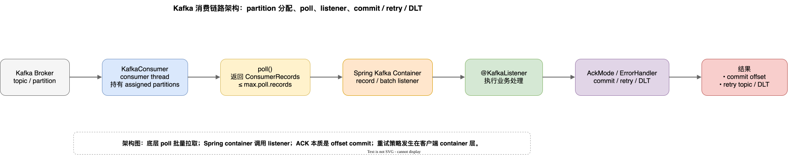

关键结论：

| 问题 | 结论 |
|---|---|
| 一个 partition 和线程是什么关系？ | 同一个 consumer group 内，一个 partition 同一时刻只分配给一个 consumer；通常由该 consumer 的一条 consumer thread 消费。 |
| `poll()` 是单条还是批量？ | 底层是批量，返回 `ConsumerRecords`；Spring record listener 只是把批量 records 拆成逐条回调。 |
| Kafka 的 ACK 是什么？ | 本质是 **offset commit**，不是 broker-side 单条 ACK。 |
| 失败重试在哪里阻塞？ | 阻塞重试主要发生在客户端 / Spring Kafka container 层，不是 broker 帮你阻塞。 |
| Spring Kafka 支持批量消费吗？ | 支持，`factory.setBatchListener(true)` 或 `@KafkaListener(batch = "true")`。 |
| 宕机后会不会有一批消息重放？ | 会。`poll()` 到但未 commit 的 records，重启后会从 committed offset 重新消费。 |

---

## 1. Partition -> Consumer 实例 -> Consumer 线程

### 1.1 关系图

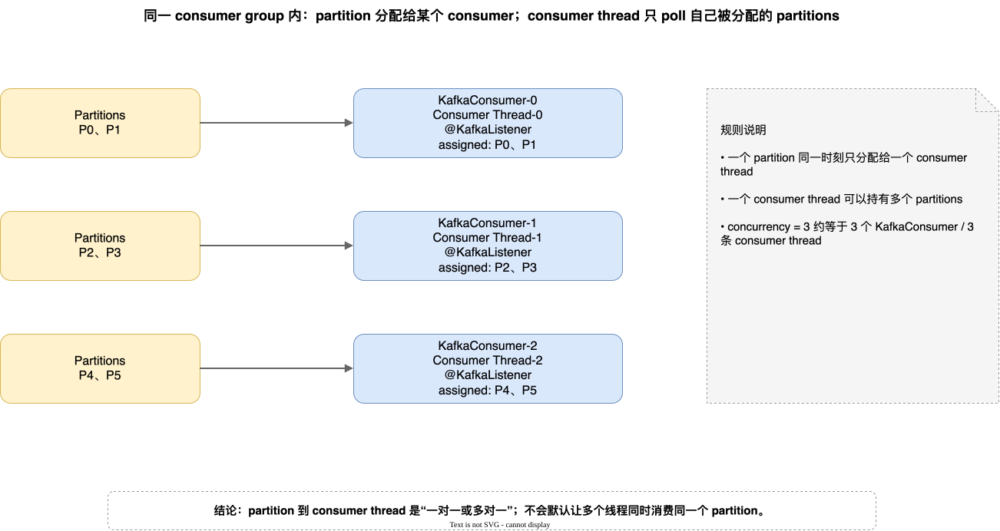

图中表达的是：在同一个 consumer group 内，`partition` 会被分配给某个 `KafkaConsumer`，再由这个 consumer 对应的 consumer thread 调用 `poll()` 并触发 listener。关系不是严格一对一，而是 **一对一或多对一**。

也就是：

- 一个 partition 同一时刻不会被同一个 group 内多个 consumer thread 同时消费；
- 一个 consumer thread 可以消费多个 partitions；
- 有效并发度通常不超过 topic partition 数；
- 如果 Spring Kafka `concurrency` 大于 partition 数，多出来的 consumer 可能空闲。

### 1.2 Spring Kafka `concurrency` 的含义

`concurrency = n` 更接近 **n 个 `KafkaMessageListenerContainer` + n 个 `KafkaConsumer` + n 条 consumer thread + n 个 consumer group members**，而不是“1 个 `KafkaConsumer` 内部开 n 个业务 worker 线程”。

源码重点：`ConcurrentMessageListenerContainer` 会基于 `concurrency` 创建一个或多个 `KafkaMessageListenerContainer`；`setConcurrency()` 的注释也明确同一 partition 内消息顺序处理。

源码摘录：

```java
// ConcurrentMessageListenerContainer.java L44-L50
/**
 * Creates 1 or more {@link KafkaMessageListenerContainer}s based on
 * {@link #setConcurrency(int) concurrency}.
 */
```

```java
// ConcurrentMessageListenerContainer.java L97-L105
public void setConcurrency(int concurrency) {
    Assert.isTrue(concurrency > 0, "concurrency must be greater than 0");
    this.concurrency = concurrency;
}
```

```java
// ConcurrentMessageListenerContainer.java L258-L266
for (int i = 0; i < this.concurrency; i++) {
    KafkaMessageListenerContainer<K, V> container =
            constructContainer(containerProperties, topicPartitions, i);
    configureChildContainer(i, container);
    container.start();
    this.containers.add(container);
}
```

来源：

- [ConcurrentMessageListenerContainer.java L44-L50](https://github.com/spring-projects/spring-kafka/blob/main/spring-kafka/src/main/java/org/springframework/kafka/listener/ConcurrentMessageListenerContainer.java#L44-L50)
- [ConcurrentMessageListenerContainer.java L97-L105](https://github.com/spring-projects/spring-kafka/blob/main/spring-kafka/src/main/java/org/springframework/kafka/listener/ConcurrentMessageListenerContainer.java#L97-L105)
- [ConcurrentMessageListenerContainer.java L243-L267](https://github.com/spring-projects/spring-kafka/blob/main/spring-kafka/src/main/java/org/springframework/kafka/listener/ConcurrentMessageListenerContainer.java#L243-L267)

### 1.3 增加 `concurrency` 是否触发 rebalance？

会。

因为增加 Spring Kafka `concurrency` 等价于增加 consumer group 中的 consumer members，group 成员变化后 Kafka 需要重新分配 partitions。

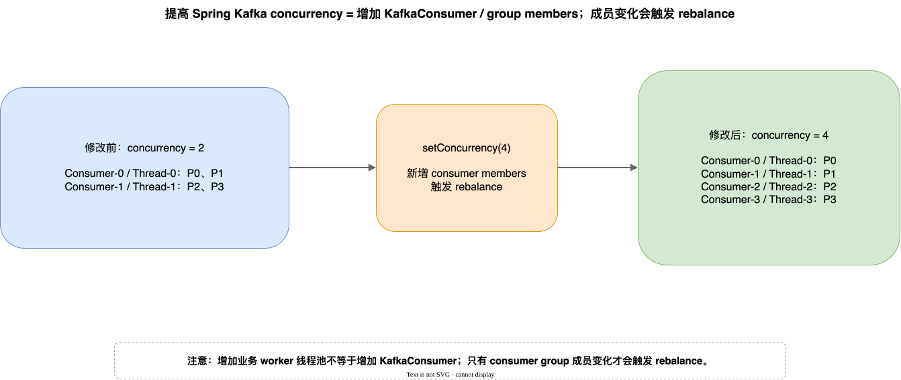

注意区分：

| 你增加的是                        | 是否触发 consumer group rebalance | 原因                                |
| ---------------------------- | ----------------------------: | --------------------------------- |
| Spring Kafka `concurrency`   |                             是 | 新增 `KafkaConsumer` / group member |
| listener 内自己创建的业务 worker 线程池 |                否，不会因为这个动作本身触发 | group member 数没有变化                |

---

## 2. `poll()`：底层批量，上层可单条

### 2.1 即使是单条 listener，底层也是批量 `poll()`

原生 API 的核心形态是：

```java
ConsumerRecords<K, V> records = consumer.poll(timeout);
```

Spring Kafka 单条 listener：

```java
@KafkaListener(topics = "order-topic")
public void onMessage(OrderEvent event) {
    // 每次看起来只处理一条
}
```

底层可以理解为：

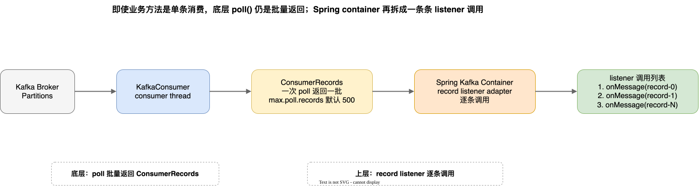

也就是说：`KafkaConsumer.poll()` 先返回一批 `ConsumerRecords`，Spring Kafka container 再把这批 records 拆成逐条 `@KafkaListener` 调用。

### 2.2 `max.poll.records` 默认值

默认：

```properties
max.poll.records=500
```

含义是：**单次 `poll()` 最多返回 500 条 records**。

不是“每次一定返回 500 条”。实际返回数量还受 broker 是否有数据、fetch size、网络、分区数据分布等影响。

源码重点：Kafka `ConsumerConfig` 中 `max.poll.records` 的说明强调：它限制单次 `poll()` 返回 records 数量，不影响底层 fetch 行为；consumer 会缓存 fetch 到的数据，并在后续 poll 中递增返回。

源码摘录：

```java
// ConsumerConfig.java L95-L100
public static final String MAX_POLL_RECORDS_CONFIG = "max.poll.records";
private static final String MAX_POLL_RECORDS_DOC = "The maximum number of records returned in a single call to poll().";
public static final int DEFAULT_MAX_POLL_RECORDS = 500;
```

```java
// ConsumerConfig.java L627-L632
.define(MAX_POLL_RECORDS_CONFIG,
        Type.INT,
        DEFAULT_MAX_POLL_RECORDS,
        atLeast(1),
        Importance.MEDIUM,
        MAX_POLL_RECORDS_DOC)
```

```java
// KafkaConsumer.java L158-L160
*     <li><code>max.poll.records</code>: Use this setting to limit the total records returned from a single
*     call to poll. This can make it easier to predict the maximum that must be handled within each poll
*     interval. By tuning this value, you may be able to reduce the poll interval, which will reduce the
```

来源：

- [ConsumerConfig.java L95-L100](https://github.com/apache/kafka/blob/trunk/clients/src/main/java/org/apache/kafka/clients/consumer/ConsumerConfig.java#L95-L100)
- [ConsumerConfig.java L627-L632](https://github.com/apache/kafka/blob/trunk/clients/src/main/java/org/apache/kafka/clients/consumer/ConsumerConfig.java#L627-L632)
- [KafkaConsumer.java L150-L161](https://github.com/apache/kafka/blob/trunk/clients/src/main/java/org/apache/kafka/clients/consumer/KafkaConsumer.java#L150-L161)

---

## 3. Kafka 的 ACK：本质是 offset commit

### 3.1 ACK 图

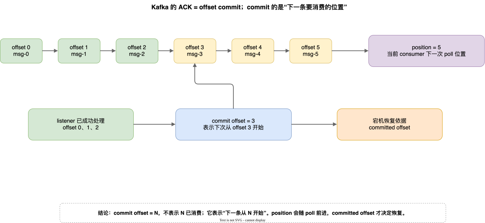

Kafka 里常说的 ACK，可以理解成：业务处理成功后提交 offset，consumer group 持久化这个消费进度，宕机恢复时从 committed offset 继续。

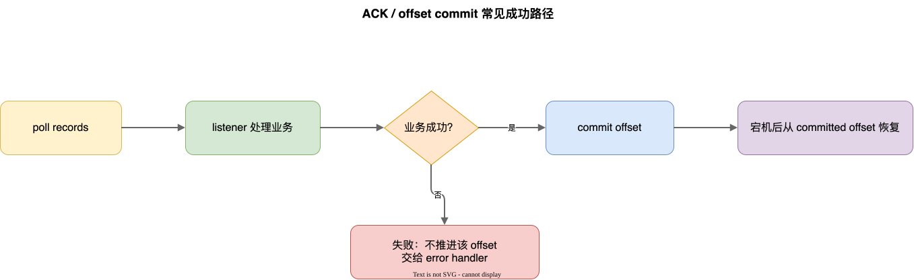

重点：`commit offset = N` 表示下一次从 offset `N` 开始消费。例如已经成功处理 offset `0,1,2`，应该提交 `commit offset = 3`。

### 3.2 `position` 与 `committed offset`

| 概念 | 含义 | 作用 |
|---|---|---|
| `position` | 当前 consumer 下一条要返回给用户的 offset | 内存态拉取进度，会随着 `poll()` 前进 |
| `committed offset` | consumer group 已持久化的 offset | 宕机恢复依据 |

源码重点：`KafkaConsumer` 文档里区分了 consumer position 和 committed position；position 会在 `poll()` 收到消息时自动前进，而 committed position 是故障恢复的依据，可自动或手动提交。

源码摘录：

```java
// KafkaConsumer.java L82-L88
* The {@link #position(TopicPartition) position} of the consumer gives the offset of the next record that will be given
* out. It will be one larger than the highest offset the consumer has seen in that partition. It automatically advances
* every time the consumer receives messages in a call to {@link #poll(Duration)}.
* The {@link #commitSync() committed position} is the last offset that has been stored securely.
```

来源：

- [KafkaConsumer.java L72-L89](https://github.com/apache/kafka/blob/trunk/clients/src/main/java/org/apache/kafka/clients/consumer/KafkaConsumer.java#L72-L89)

### 3.3 Spring Kafka `AckMode`

Spring Kafka container 通过 `AckMode` 决定何时 commit offset。

| AckMode | 语义 |
|---|---|
| `RECORD` | 每条 record 被 listener 成功处理后提交 offset |
| `BATCH` | 上一次 `poll()` 返回的所有 records 都处理完后提交 |
| `TIME` | 超过指定时间后提交 pending offsets |
| `COUNT` | 处理数量达到阈值后提交 pending offsets |
| `COUNT_TIME` | 数量或时间满足其一后提交 |
| `MANUAL` | listener 调用 `Acknowledgment#acknowledge()`，ack 会排队，通常等本次 poll records 处理完再提交 |
| `MANUAL_IMMEDIATE` | listener 调用 `acknowledge()` 后，如果在 consumer thread 上调用则尽快提交 |

源码摘录：

```java
// ContainerProperties.java L68-L77
/**
 * Commit the offset after each record is processed by the listener.
 */
RECORD,
/**
 * Commit the offsets of all records returned by the previous poll after they all
 * have been processed by the listener.
 */
BATCH,
```

```java
// ContainerProperties.java L100-L117
/**
 * Listener is responsible for acking - use a
 * {@link org.springframework.kafka.listener.AcknowledgingMessageListener};
 */
MANUAL,
/**
 * Listener is responsible for acking ... the
 * commit will be performed immediately if the {@code Acknowledgment} is
 * acknowledged on the calling consumer thread;
 */
MANUAL_IMMEDIATE,
```

源码依据：

- [ContainerProperties.java L66-L119](https://github.com/spring-projects/spring-kafka/blob/main/spring-kafka/src/main/java/org/springframework/kafka/listener/ContainerProperties.java#L66-L119)

### 3.4 手动 ACK 的含义

Spring Kafka 手动 ACK 示例：

```java
@KafkaListener(topics = "order-topic")
public void onMessage(ConsumerRecord<String, OrderEvent> record,
                      Acknowledgment ack) {
    handle(record.value());
    ack.acknowledge();
}
```

这里的 `ack.acknowledge()` 本质仍然是告诉 container：**这个 offset 可以提交了**。它不是给 broker 返回“这条消息成功”的单条 ACK。

---

## 4. 失败重试模型

Kafka broker 只负责保存日志、按 offset 提供拉取。消费失败后的重试策略主要发生在 **`KafkaConsumer` / Spring Kafka listener container / error handler** 这一侧。

### 4.1 阻塞重试：客户端 container 层阻塞

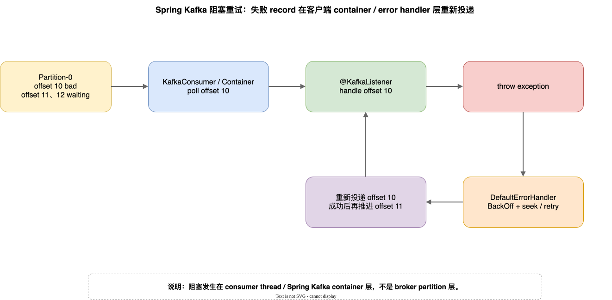

常见流程已经画在上图：`poll record` 后 listener 抛异常，`DefaultErrorHandler` 接管，经过 `BackOff`、`seek` 或保留未处理 records 后重新投递失败 record。

所以阻塞点在 **consumer thread / Spring Kafka container 层**，不是 broker partition 层。

为什么看起来像 partition 被阻塞？

因为失败 offset 没有成功处理、也没有向后提交，后续 offset 不能被正常推进。若一个 consumer thread 只负责一个 partition，就表现为这个 partition 后续消息被挡住；若一个 consumer thread 负责多个 partitions，则可能影响该 thread 当前处理循环中的其他 records。

源码重点：`DefaultErrorHandler` 对 record listener 会 seek 到当前 offset，让失败消息可以重放；对 batch listener 也会定位未处理 records。

源码摘录：

```java
// DefaultErrorHandler.java L32-L39
* An error handler that, for record listeners, seeks to the current offset for each topic
* in the remaining records. Used to rewind partitions after a message failure so that it
* can be replayed. For batch listeners, seeks to the current offset for each topic in a
* batch of records.
```

```java
// DefaultErrorHandler.java L57-L63
/**
 * Construct an instance with the default recoverer which simply logs the record after
 * {@value SeekUtils#DEFAULT_MAX_FAILURES} (maxFailures) have occurred for a
 * topic/partition/offset, with the default back off (9 retries, no delay).
 */
```

来源：

- [DefaultErrorHandler.java L32-L45](https://github.com/spring-projects/spring-kafka/blob/main/spring-kafka/src/main/java/org/springframework/kafka/listener/DefaultErrorHandler.java#L32-L45)
- [DefaultErrorHandler.java L57-L73](https://github.com/spring-projects/spring-kafka/blob/main/spring-kafka/src/main/java/org/springframework/kafka/listener/DefaultErrorHandler.java#L57-L73)

### 4.2 非阻塞重试：retry topic / DLT

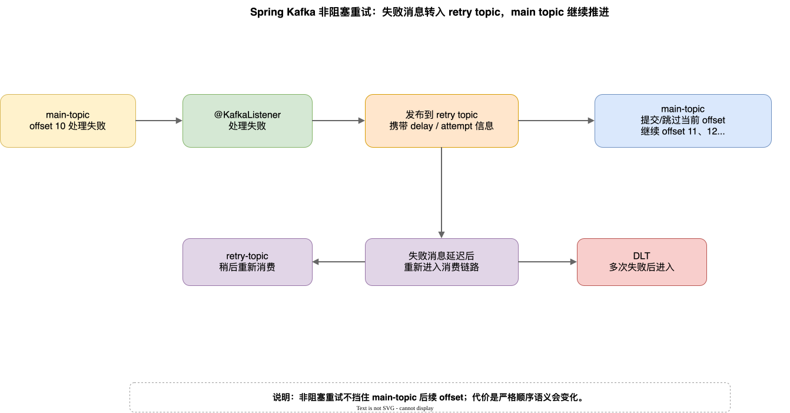

非阻塞重试的核心思想已经画在上图：main topic 消费失败后，失败消息被发布到 retry topic；main topic 当前 offset 可以继续推进；retry topic 到时间后再次消费，多次失败后进入 DLT。

特点：

| 维度 | 说明 |
|---|---|
| 是否阻塞 main topic 后续消息 | 通常不阻塞 |
| 是否仍保持原 partition 严格顺序 | 不保证严格顺序，因为失败消息被转移到 retry topic 延后处理 |
| 实现层次 | Spring Kafka / 应用层模式，不是 Kafka broker 内置 retry queue |
| 常见入口 | `@RetryableTopic`、retry topic、DLT |

文档依据：Spring Kafka retry topic 文档说明了失败消息转发到 retry topic、按 backoff 时间恢复消费、最终进入 DLT 的模式；同时明确非阻塞重试不支持 batch listener。

文档源码摘录：

```adoc
// retrytopic/how-the-pattern-works.adoc L4-L8
If message processing fails, the message is forwarded to a retry topic with a back off timestamp.
The retry topic consumer then checks the timestamp and if it's not due it pauses the consumption for that topic's partition.
When it is due the partition consumption is resumed, and the message is consumed again.
```

```adoc
// retrytopic/how-the-pattern-works.adoc L12-L14
IMPORTANT: By using this strategy you lose Kafka's ordering guarantees for that topic.
IMPORTANT: You can set the `AckMode` mode you prefer, but `RECORD` is suggested.
```

```adoc
// retrytopic.adoc L12-L12
IMPORTANT: Non-blocking retries are not supported with Batch Listeners.
```

来源：

- [how-the-pattern-works.adoc L4-L14](https://github.com/spring-projects/spring-kafka/blob/main/spring-kafka-docs/src/main/antora/modules/ROOT/pages/retrytopic/how-the-pattern-works.adoc#L4-L14)
- [retrytopic.adoc L12-L12](https://github.com/spring-projects/spring-kafka/blob/main/spring-kafka-docs/src/main/antora/modules/ROOT/pages/retrytopic.adoc#L12-L12)
- [Spring Kafka Non-Blocking Retries](https://docs.spring.io/spring-kafka/reference/retrytopic.html)

---

## 5. 批量消费

### 5.1 Spring Kafka 支持批量消费

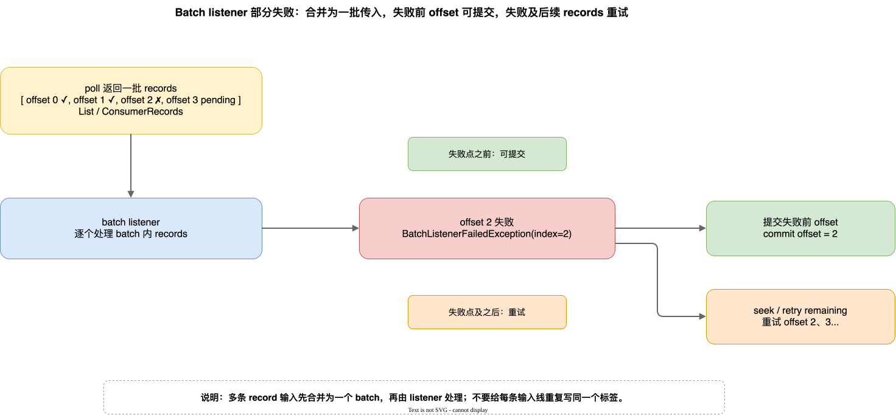

开启方式一：container factory：

```java
@Bean
public ConcurrentKafkaListenerContainerFactory<String, OrderEvent> batchFactory() {
    ConcurrentKafkaListenerContainerFactory<String, OrderEvent> factory =
            new ConcurrentKafkaListenerContainerFactory<>();
    factory.setConsumerFactory(consumerFactory());
    factory.setBatchListener(true);
    return factory;
}
```

开启方式二：`@KafkaListener` 注解覆盖：

```java
@KafkaListener(topics = "order-topic", batch = "true")
public void onMessages(List<OrderEvent> events) {
    // batch process
}
```

源码 / 文档摘录：

```java
// AbstractKafkaListenerContainerFactory.java L199-L206
/**
 * Set to true if this endpoint should create a batch listener.
 */
public void setBatchListener(Boolean batchListener) {
    this.batchListener = batchListener;
}
```

```java
// KafkaListener.java L288-L298
// @KafkaListener batch property: true for batch listener, false for record listener.
String batch() default "";
```

```adoc
// listener-annotation.adoc L279-L299
== Batch Listeners
factory.setBatchListener(true);
```

源码 / 文档依据：

- [AbstractKafkaListenerContainerFactory.java L199-L206](https://github.com/spring-projects/spring-kafka/blob/main/spring-kafka/src/main/java/org/springframework/kafka/config/AbstractKafkaListenerContainerFactory.java#L199-L206)
- [KafkaListener.java L288-L298](https://github.com/spring-projects/spring-kafka/blob/main/spring-kafka/src/main/java/org/springframework/kafka/annotation/KafkaListener.java#L288-L298)
- [listener-annotation.adoc L279-L299](https://github.com/spring-projects/spring-kafka/blob/main/spring-kafka-docs/src/main/antora/modules/ROOT/pages/kafka/receiving-messages/listener-annotation.adoc#L279-L299)

### 5.2 Spring Kafka batch listener 可以接收什么？

常见签名：

```java
public void listen(List<String> payloads) { ... }
```

```java
public void listen(List<ConsumerRecord<Integer, String>> records) { ... }
```

```java
public void pollResults(ConsumerRecords<?, ?> records) { ... }
```

文档源码摘录：

```adoc
// listener-annotation.adoc L307-L313
@KafkaListener(id = "list", topics = "myTopic", containerFactory = "batchFactory")
public void listen(List<String> list) {
    ...
}
```

```adoc
// listener-annotation.adoc L363-L381
public void listen(List<ConsumerRecord<Integer, String>> list) { ... }
public void pollResults(ConsumerRecords<?, ?> records) { ... }
```

文档依据：

- [listener-annotation.adoc L307-L329](https://github.com/spring-projects/spring-kafka/blob/main/spring-kafka-docs/src/main/antora/modules/ROOT/pages/kafka/receiving-messages/listener-annotation.adoc#L307-L329)
- [listener-annotation.adoc L358-L386](https://github.com/spring-projects/spring-kafka/blob/main/spring-kafka-docs/src/main/antora/modules/ROOT/pages/kafka/receiving-messages/listener-annotation.adoc#L358-L386)

### 5.3 batch 中部分失败怎么办？

如果 batch 第 `i` 条失败，建议抛出 `BatchListenerFailedException` 并指明失败 index：

```java
@KafkaListener(id = "orders", topics = "order-topic", batch = "true")
public void listen(List<OrderEvent> events) {
    for (int i = 0; i < events.size(); i++) {
        try {
            handle(events.get(i));
        }
        catch (Exception e) {
            throw new BatchListenerFailedException("failed", i);
        }
    }
}
```

Spring Kafka 的 batch error handling 语义已经画在本节上方：先提交失败记录之前的 offsets，再重试失败记录以及后续 records；重试耗尽后可以把失败记录发送到 DLT，随后提交已恢复记录 offset，并继续处理后续 records。

文档源码摘录：

```adoc
// annotation-error-handling.adoc L176-L184
For a batch listener, the listener must throw a `BatchListenerFailedException` indicating which records in the batch failed.
* Commit the offsets of the records before the index.
* If retries are not exhausted, perform seeks so that all the remaining records (including the failed record) will be redelivered.
```

```adoc
// annotation-error-handling.adoc L380-L385
When a `BatchListenerFailedException` is thrown, the `DefaultErrorHandler`:
1. **Commits offsets** for all records before the failed record
2. **Retries** the failed record (and subsequent records) according to the `BackOff` configuration
```

文档依据：

- [annotation-error-handling.adoc L176-L184](https://github.com/spring-projects/spring-kafka/blob/main/spring-kafka-docs/src/main/antora/modules/ROOT/pages/kafka/annotation-error-handling.adoc#L176-L184)
- [annotation-error-handling.adoc L194-L209](https://github.com/spring-projects/spring-kafka/blob/main/spring-kafka-docs/src/main/antora/modules/ROOT/pages/kafka/annotation-error-handling.adoc#L194-L209)
- [annotation-error-handling.adoc L380-L394](https://github.com/spring-projects/spring-kafka/blob/main/spring-kafka-docs/src/main/antora/modules/ROOT/pages/kafka/annotation-error-handling.adoc#L380-L394)

### 5.4 原生 SDK 怎么支持批量？

原生 KafkaConsumer 天然就是批量：

```java
while (true) {
    ConsumerRecords<K, V> records = consumer.poll(Duration.ofMillis(1000));
    for (ConsumerRecord<K, V> record : records) {
        handle(record);
    }
    consumer.commitSync();
}
```

如果要按 partition 精细提交，可以自己计算每个 `TopicPartition` 的下一个 offset：

```java
Map<TopicPartition, OffsetAndMetadata> offsets = new HashMap<>();
for (ConsumerRecord<K, V> record : records) {
    handle(record);
    offsets.put(
        new TopicPartition(record.topic(), record.partition()),
        new OffsetAndMetadata(record.offset() + 1)
    );
}
consumer.commitSync(offsets);
```

注意：原生写法自由度更高，但错误处理、重试、DLT、部分失败语义都要自己保证。

---

## 6. 宕机时：哪些消息会重试 / 重放？

### 6.1 宕机重放窗口

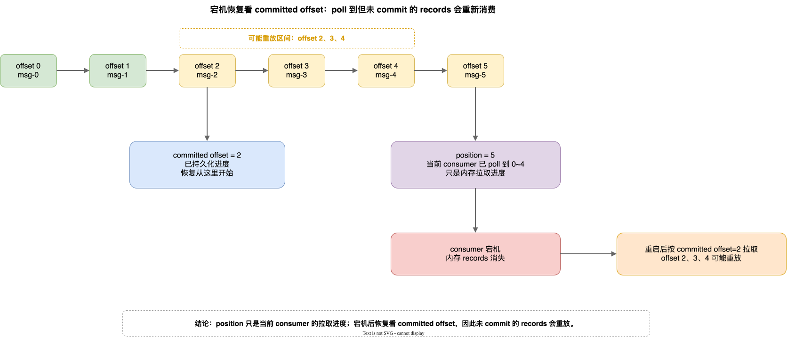

Kafka 恢复依据是 **committed offset**。

所以：

| 宕机前状态 | 宕机后结果 |
|---|---|
| 消息已处理，offset 已 commit | 通常不会重放 |
| 消息已处理，offset 未 commit | 可能重放 |
| `poll()` 到一批 records，只处理一部分，还没 commit 到对应位置 | 从 committed offset 之后重新消费，形成一批重放 |
| listener 内异步 worker 还没完成，但 listener 已返回且 offset 已提交 | 可能丢业务处理，因为 Kafka 认为进度已推进 |
| commit 早于业务成功 | 有丢消息风险 |
| commit 晚于业务成功 | 有重复消费风险 |

### 6.2 为什么 listener 里异步 worker 要谨慎？

如果 listener 这样写：

```java
@KafkaListener(topics = "order-topic")
public void onMessage(ConsumerRecord<String, OrderEvent> record) {
    workerPool.submit(() -> handle(record.value()));
}
```

则实际风险链路如下：

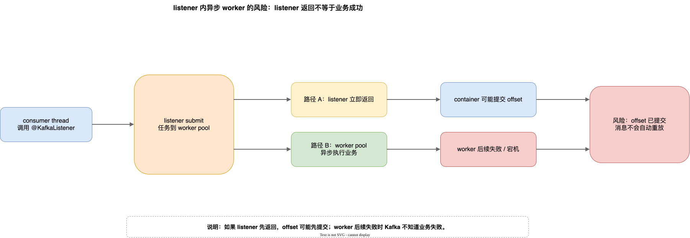

因此，自己引入 worker 线程池时，必须明确：

- 何时 ack / commit？
- worker 失败如何回滚或补偿？
- 是否允许 partition 内乱序？
- 应用宕机时 worker 队列里的任务如何恢复？

Kafka 源码文档也明确：`KafkaConsumer` 本身不是线程安全的；如需多线程处理，应小心设计 poll thread 与 processor thread 的协作。

源码摘录：

```java
// KafkaConsumer.java L61-L64
* The consumer maintains TCP connections to the necessary brokers to fetch data.
* Failure to close the consumer after use will leak these connections.
* The consumer is not thread-safe. See <a href="#multithreaded">Multi-threaded Processing</a> for more details.
```

```java
// KafkaConsumer.java L164-L166
* For use cases where message processing time varies unpredictably, neither of these options may be sufficient.
* The recommended way to handle these cases is to move message processing to another thread, which allows
* the consumer to continue calling {@link #poll(Duration) poll} while the processor is still working.
```

来源：

- [KafkaConsumer.java L55-L64](https://github.com/apache/kafka/blob/trunk/clients/src/main/java/org/apache/kafka/clients/consumer/KafkaConsumer.java#L55-L64)
- [KafkaConsumer.java L150-L166](https://github.com/apache/kafka/blob/trunk/clients/src/main/java/org/apache/kafka/clients/consumer/KafkaConsumer.java#L150-L166)

---

## 7. 最佳实践

| 实践项                                                                | 理由                                                             |
| ------------------------------------------------------------------ | -------------------------------------------------------------- |
| 优先通过增加 partition 数 + Spring Kafka `concurrency` 提升并发               | Kafka 的有效并发边界通常是 partition；`concurrency` 会增加 consumer members。 |
| 不要盲目让 `concurrency` 大于 partition 数                                 | 多余 consumer 可能空闲，还会增加连接、线程和 rebalance 成本。                      |
| 普通业务优先使用同步 listener 处理，不要轻易在 listener 内异步 submit 到 worker pool     | listener 返回不等于 worker 成功，容易造成 offset 早提交。                      |
| 如果必须异步处理，使用手动 ack 并设计完成回调、失败补偿和关闭等待                                | 避免 worker 未完成但 offset 已提交。                                     |
| 关闭或避免依赖 Kafka 原生 auto commit，交给 Spring Kafka container / 手动 ack 管理 | 避免 offset 与业务成功状态脱节。                                           |
| ACK 语义始终按 offset commit 理解                                         | Kafka 没有 broker-side 单条消费成功 ACK；恢复看 committed offset。          |
| 业务处理必须幂等                                                           | commit 失败、宕机、rebalance、阻塞重试都可能导致重复消费。                          |
| record listener 中需要严格顺序时，用阻塞重试或谨慎使用 DLT                            | retry topic 会让失败消息延后，可能破坏原 partition 严格顺序。                     |
| 不要求严格顺序、希望主链路继续推进时，用 retry topic / DLT                             | 非阻塞重试可以避免坏消息长期挡住 main topic。                                   |
| batch listener 中显式抛 `BatchListenerFailedException` 指明失败 index      | 让 Spring Kafka 可以提交失败前 offsets，并只重试失败及后续 records。              |
| 不要把 non-blocking retry topic 用在 batch listener 上                   | Spring Kafka 文档明确不支持 batch listener 的非阻塞重试。                    |
| 根据处理耗时调整 `max.poll.records` 和 `max.poll.interval.ms`               | 避免一次 poll 返回太多导致处理超时，进而影响 rebalance。                           |
| 监控 consumer lag、rebalance 次数、listener error、DLT 堆积                 | 这些指标能暴露消费能力、失败重试和 offset 推进问题。                                 |

---

## 8. 参考资料

官方文档：

- [Spring Kafka - Message Listener Containers](https://docs.spring.io/spring-kafka/reference/kafka/receiving-messages/message-listener-container.html)
- [Spring Kafka - `@KafkaListener` Annotation / Batch Listeners](https://docs.spring.io/spring-kafka/reference/kafka/receiving-messages/listener-annotation.html)
- [Spring Kafka - Handling Exceptions](https://docs.spring.io/spring-kafka/reference/kafka/annotation-error-handling.html)
- [Spring Kafka - Non-Blocking Retries](https://docs.spring.io/spring-kafka/reference/retrytopic.html)
- [Apache Kafka Consumer Configs](https://kafka.apache.org/documentation/#consumerconfigs)
- [Apache Kafka `KafkaConsumer` Javadoc](https://kafka.apache.org/41/javadoc/org/apache/kafka/clients/consumer/KafkaConsumer.html)

源码：

- [KafkaConsumer.java](https://github.com/apache/kafka/blob/trunk/clients/src/main/java/org/apache/kafka/clients/consumer/KafkaConsumer.java)
- [ConsumerConfig.java](https://github.com/apache/kafka/blob/trunk/clients/src/main/java/org/apache/kafka/clients/consumer/ConsumerConfig.java)
- [ConcurrentMessageListenerContainer.java](https://github.com/spring-projects/spring-kafka/blob/main/spring-kafka/src/main/java/org/springframework/kafka/listener/ConcurrentMessageListenerContainer.java)
- [ContainerProperties.java](https://github.com/spring-projects/spring-kafka/blob/main/spring-kafka/src/main/java/org/springframework/kafka/listener/ContainerProperties.java)
- [DefaultErrorHandler.java](https://github.com/spring-projects/spring-kafka/blob/main/spring-kafka/src/main/java/org/springframework/kafka/listener/DefaultErrorHandler.java)
- [KafkaListener.java](https://github.com/spring-projects/spring-kafka/blob/main/spring-kafka/src/main/java/org/springframework/kafka/annotation/KafkaListener.java)
- [AbstractKafkaListenerContainerFactory.java](https://github.com/spring-projects/spring-kafka/blob/main/spring-kafka/src/main/java/org/springframework/kafka/config/AbstractKafkaListenerContainerFactory.java)
