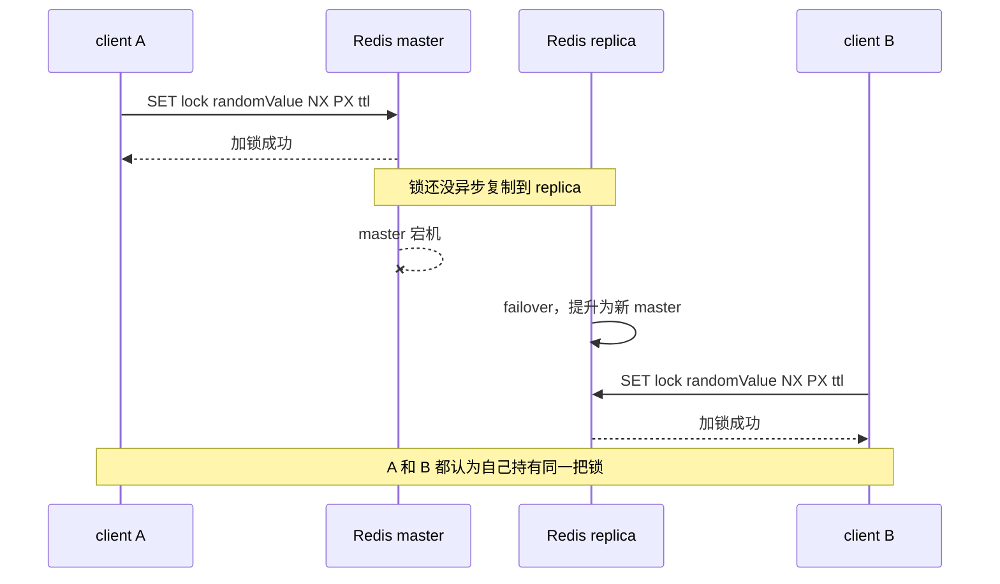

## 一、查询相关

### Q1：集群现状

- **流量**：cquery 峰值 14W+ QPS，pquery 12W+（多级 bom 查询优化后 qps 为 7W）；Squirrel 集群 QPS 峰值 246W+
- **集群大小**：55 主 275 从（1 主 5 从）；总容量 275 G，分片大小 5 G
- **数据量**：key 数量为 3.2 亿，命中率 89%
### Q2：为什么 cquery 使用本地缓存，而不扩容 Squirrel

1. **复制开销**：从节点增多会增加复制开销（主节点带宽/CPU/复制缓冲压力），在写入较大或链路/从节点较慢时可能导致复制延迟增大（从节点读一致性窗口变大）
2. **成本与运维**：节点越多成本越高、运维复杂度更大
3. **热点 key 问题**：扩容 Squirrel 对热点 key 往往无解或收益有限（单 key 请求集中 + Squirrel 单线程处理 + 网络 RTT），本地缓存/两级缓存能把热点读"截流"在应用侧，效果更直接
### Q3：为什么不使用 OceanBase 或者 Hbase 做查询，而是使用 Squirrel

1. **历史背景**：查询历史选择了 Squirrel 缓存，切换成本过高，现有性能可以满足 SLA
2. **主要场景是查询**：把热点读变成内存命中，RT 更低 → 并发更小 → 排队少 → TP999 更稳，还能把读洪峰和数据库隔离开
3. **OceanBase/OBKV 更 ”重“**：为强一致/持久化/治理付出更高单位成本（主要是 CPU 耗时），高并发下更容易碰到连接/线程/尾延迟瓶颈。查询场景对数据强一致性诉求较低（非写后即读场景），没必要为强一致/持久化付出更高成本
### Q4：查询服务刚上线时本地缓存为空，为什么 Squirrel 流量可以抗住

1. 服务上线均在非高峰期进行，Squirrel 集群此时容量可以支撑全部流量击穿到 Squirrel 集群上
2. 服务上线会拆分为多个机器分组进行，每组机器发布间隔期间，已发布的机器已完成本地缓存初始化，且并非全部机器同时初始化，因此流量穿透到 Squirrel 上的量并不大
### Q5：Squirrel（Redis）怎么做到高可用部署的

参见 [[03-高可用部署]]。常见方案：Redis 集群模式（多节点充当哨兵功能）。
### Q6：为什么查询和管理要做读写分离架构

**商品管理服务和商品查询服务的核心职责定位不同：** 管理服务是数据写端，负责商品创建、编辑、上下架、审核、校验、操作审计等；查询服务是数据读端，面向交易、营销、展销、供应链等下游提供高 QPS 查询能力。二者分离主要有几个原因：
1. **流量特征不同**：管理侧写流量相对低，但单次操作链路复杂；查询侧读流量极高，对 RT、吞吐和稳定性要求更高。分离后查询服务可以独立扩容，避免高并发读影响商品维护，也避免批量写入拖慢查询。
2. **数据模型不同**：写端关注领域模型、数据完整性和状态流转；读端关注查询效率、返回结构和场景化聚合。分离后写端可以保持规范模型，读端可以针对 B/C 端、城市、业态等场景构建冗余查询模型。
3. **缓存策略不同**：查询侧需要 Redis、本地缓存、空对象缓存、热点 key 治理、降级兜底等读优化能力；管理侧更关注事务、一致性、权限、校验和审计。分离后两边职责更清晰，代码复杂度更低。
4. **稳定性隔离**：商品查询是核心高频链路，故障影响面大；商品管理是写链路，通常更重视正确性。分离后可以独立发布、回滚、限流和降级，降低互相影响。
5. **支持 CQRS 架构思想**：管理服务负责 Command，查询服务负责 Query。写端完成 DB 变更后，通过 DTS、Binlog、MQ 等方式驱动读侧缓存/索引/查询模型构建，用一定的最终一致性换取更好的查询性能和扩展性。
### Q7：WBR 指标

**重点关注指标：**

1. **商品查询性能**（bquery，cquery）：TP999（尾部延迟）、成功率、失败率、QPS、long-call（长耗时调用）
2. **缓存一致性**：监控各类业务缓存（如 SKU 条码缓存、城市 SKU 缓存、POI SKU 缓存等）的数据一致性状态
3. **慢 SQL**：分析慢 SQL 的数量、走势及具体原因（如刷数导致查询量激增）
4. **慢消息**：监控消息处理耗时的异常情况
5. **慢缓存**：关注缓存访问的延迟指标
6. **慢 RPC 服务/调用**：分析 RPC 服务端和调用端的性能瓶颈
7. **慢 ES 查询**：监控 Elasticsearch 查询的耗时情况
8. **流量峰值**：跟踪核心服务的 QPS 峰值及其变化趋势，用于容量规划和风险预警（如 Cquery、Pquery、Opensearch 等）
9. **告警响应率**
### Q8：为什么查询使用 Redis 当主存储不用 ES，复杂条件检索是怎么做的

**核心不是 Redis 替代 ES，而是职责分层：Redis/Squirrel 作为商品查询主存储，ES/OpenSearch 作为 B 端复杂条件检索的索引层。** 商品详情最终以 Redis 中的查询模型为准，ES 主要负责从大量商品中按条件召回商品信息唯一键；这个唯一键不一定是单个 id，也可能是 skuId、poiId、cityId、业务类型等字段组成的组合键。

1. **查询场景不同**：核心商品查询大多是确定性查询，例如按 skuId、spuId、poiId、cityId 或批量唯一键查详情，适合 KV/Hash 模型；ES 更适合关键词、类目、品牌、状态、时间、门店等复杂条件组合检索。
2. **性能目标不同**：商品查询是高 QPS、强依赖链路，更关注 TP99/TP999 的长尾稳定性。Redis 访问路径短，延迟模型简单；ES 查询会涉及协调节点、分片查询、排序、聚合、打分、结果 merge 等环节，复杂查询下长尾更容易抖动。
3. **稳定性边界不同**：如果所有商品详情都依赖 ES，ES 抖动会影响核心查询链路；把 ES 定位为索引召回后，ES 异常主要影响 B 端复杂检索，不影响 C 端/核心链路按唯一键查商品详情。
4. **数据模型不同**：Redis 存的是面向查询的商品详情模型或场景化查询模型，字段更完整，便于直接返回或组装；ES 存的是检索字段和排序字段，重点是倒排索引能力，不适合作为商品详情最终数据源。
5. **一致性和治理成本不同**：ES 存在 refresh 延迟、mapping 变更、reindex、分片治理、段合并等成本；Redis 查询模型通过 DTS/Binlog/MQ 等链路构建，主链路读模型更可控，也更符合高频查询的成本结构。

**复杂条件检索的链路一般是：**

一句话总结：**ES 是检索系统，不是商品详情主查询系统。Redis/Squirrel 负责高频、确定性的商品查询，ES/OpenSearch 负责 B 端复杂条件检索召回；召回商品信息唯一键/组合键后，再回 Redis 批量查详情，保证主链路低延迟和长尾稳定。**

---
## 二、Redis 相关

### Q1：为什么 Redis 集群模式下部署不需要哨兵

因为集群中的多节点本身就充当了哨兵功能，实现了自动故障转移。详见 [[Redis 高可用部署]]。

### Q2：Redis 是 AP 结构，那分布式锁（Redisson RLock）怎么保证 C 的

**严格来说，Redis 分布式锁不能保证强一致的 C，只能在一定工程假设下提供尽力互斥。** Redis/Redis Cluster 更偏 AP 和最终一致，主从复制默认是异步的；一旦 master 写入锁成功但还没复制到 replica 就发生 failover，新的 master 可能允许其他客户端再次加锁，导致互斥被破坏。

>`failover` 指故障转移：master 宕机或不可达后，系统从 replica 中选出新的 master，客户端后续读写切到新 master。

**所以不是 Redis 锁怎么保证严格 C，更准确的说法是：**

1. **单实例 RLock 解决的是正确加锁和安全释放**：加锁通常依赖 `SET key value NX PX ttl` 语义，释放时用 Lua 校验 value 后删除，避免误删别人的锁；Redisson 还通过 watchdog 机制对未过期锁自动续期，降低业务执行时间超过锁 TTL 的风险。
2. **主从 failover 会破坏严格互斥**：Redis 复制默认异步，锁写入成功不代表已经同步到 replica；如果此时发生故障转移，新的 master 可能没有这把锁。
3. **RedLock 提升的是互斥可靠性，不是强一致**：RedLock 通过多个独立 Redis master 和多数派加锁降低单点故障风险，但仍依赖锁有效期、时钟漂移、网络延迟、GC pause 等假设，不能把 Redis 变成 CP 系统。
4. **`WAIT` 只能降低写丢失概率**：它可以等待指定数量 replica 确认写入，但不能从根本上改变 Redis 异步复制和故障切换下的一致性取舍。
5. **强正确性场景不能只靠 Redis 锁**：库存扣减、资金、订单状态流转等场景要求 correctness（并发、锁超时、failover、重试下也不能出现超卖、重复扣款、状态错乱等错误结果），应该用数据库事务、唯一约束、乐观锁、状态机、幂等表，或者引入 fencing token / ZooKeeper / etcd 等强协调能力兜底。

一句话总结：**Redis 锁适合防重复执行、任务互斥、缓存重建、降低并发冲突等工程互斥场景；如果业务要求严格 correctness，Redis 锁只能作为辅助，最终一致性要靠资源侧约束或 CP 协调组件保证。**

**支撑文档：**

| 观点                              | 文档                                                                                                                             | 重点段落                                                       | 支撑点                                                                    |
| ------------------------------- | ------------------------------------------------------------------------------------------------------------------------------ | ---------------------------------------------------------- | ---------------------------------------------------------------------- |
| Redis 偏 AP / 最终一致，不能当成强一致系统     | [Redis Replication](https://redis.io/docs/latest/operate/oss_and_stack/management/replication/)                                | `Redis uses by default asynchronous replication`           | Redis 默认异步复制，master 写成功返回后，replica 可能还没同步这次写入。                         |
| Redis Cluster 存在已确认写入丢失窗口       | [Redis Cluster Specification](https://redis.io/docs/latest/operate/oss_and_stack/reference/cluster-spec/)                      | `Write safety`                                             | Redis Cluster 使用异步复制，故障转移或网络分区时，已确认给客户端的写入仍可能丢失。                       |
| 基于主从 failover 的 Redis 锁不能保证严格互斥 | [Redis Distributed Locks](https://redis.io/docs/latest/develop/clients/patterns/distributed-locks/)                            | `Why Failover-based Implementations Are Not Enough`        | 官方举例说明 master 加锁成功但未复制到 replica 时发生 failover，另一个客户端可能再次获得同一把锁。         |
| 单实例锁只能解决正确释放和避免误删               | [Redis Distributed Locks](https://redis.io/docs/latest/develop/clients/patterns/distributed-locks/)                            | `Correct Implementation with a Single Instance`            | 官方推荐 `SET resource_name random_value NX PX ttl`，释放时用 Lua 校验 value 后删除。 |
| RedLock 提升可靠性，但不是严格 C           | [Redis Distributed Locks](https://redis.io/docs/latest/develop/clients/patterns/distributed-locks/)                            | `The Redlock Algorithm` / `Is the Algorithm Asynchronous?` | RedLock 要求多数独立 master 加锁成功，但仍依赖时间、网络和锁有效期等假设。                          |
| 需要 correctness 的场景不能只靠 Redis 锁  | [Martin Kleppmann - How to do distributed locking](https://martin.kleppmann.com/2016/02/08/how-to-do-distributed-locking.html) | `Making the lock safe with fencing`                        | 锁过期、GC pause、网络延迟后旧客户端可能继续操作共享资源，需要 fencing token 让资源侧拒绝旧请求。           |
| Redisson RedLock 不是推荐答案         | [Redisson Locks and Synchronizers](https://redisson.pro/docs/data-and-services/locks-and-synchronizers/)                       | `RedLock` / `Fenced Lock`                                  | Redisson 文档中 RedLock 已标注 deprecated，更推荐 `RLock` 或 `RFencedLock`。       |
|                                 |                                                                                                                                |                                                            |                                                                        |

---
## 三、MQ 相关

### Q1：Kafka 和 RocketMQ 的区别是什么

| 对比维度       | Kafka                                                                                                                                                                      | RocketMQ                                                                                          |
| ---------- | -------------------------------------------------------------------------------------------------------------------------------------------------------------------------- | ------------------------------------------------------------------------------------------------- |
| **数据可靠性**  | 使用异步刷盘方式，异步复制/同步复制                                                                                                                                                         | 支持异步实时刷盘、同步刷盘、同步复制、异步复制。同步刷盘在单机可靠性上比 Kafka 更高，不会因 OS Crash 导致数据丢失                                 |
| **ack 策略** | acks=0：发出去就当成功，延迟最低吞吐最高，但丢消息风险最大（适用于日志/埋点） acks=1（默认）：Leader 写入本地日志后返回，follower 异步复制，性能好但 Leader 宕机可能丢消息 acks=all（或-1）：等待 ISR 中 min.insync.replicas 个副本确认，可靠性最高但延迟更高 | RocketMQ 的同步刷盘 + 同步 Replication 在单机可靠性上更高                                                         |
| **性能对比**   | 单机写入 TPS 约百万条/秒（消息大小 10 字节）                                                                                                                                                | 单机部署 3 个 Broker，最高约 12 万条/秒（消息大小 10 字节）                                                           |
| **性能优势原因** | ① 顺序写入优化：减少磁盘寻道时间 ② 批量处理技术：减少网络开销和磁盘 I/O ③ 零拷贝技术：避免用户空间和内核空间之间的多次数据拷贝 ④ 压缩技术：减少网络传输数据量                                                                            | —                                                                                                 |
| **消费失败重试** | 原生不支持失败重试，通常由应用/框架层实现                                                                                                                                                      | 提供内置重试队列（%RETRY%）+ 延迟级别 + 死信（DLQ）语义                                                               |
| **定时消息**   | 不支持                                                                                                                                                                        | 支持                                                                                                |
| **事务消息**   | 不支持                                                                                                                                                                        | 支持                                                                                                |
| **消息查询**   | 不支持                                                                                                                                                                        | 支持                                                                                                |
| **消息回溯**   | 理论上可以按偏移量回溯                                                                                                                                                                | 支持按时间回溯消息，精度毫秒                                                                                    |
| **消费并行度**  | 依赖 Topic 的分区数（如分区数 10，则最多 10 个线程并行消费），消费线程数与分区数一致                                                                                                                          | ① 顺序消费：并行度同 Kafka ② 乱序消费：并行度取决于 Consumer 的线程数（如 Topic 配置 10 个队列，10 台机器消费，每台 100 个线程，并行度为 1000） |

> Kafka 的 TPS 能跑到单机百万，主要是 Producer 端将多个小消息合并批量发向 Broker。RocketMQ 没有这么做，因为对 Java 来说缓存过多消息，GC 是个很严重的问题。且 RocketMQ 认为线上的系统单个 Producer 每秒产生的数据量有限，不可能上万。

---
## 四、Java 基础相关

### Q1：String 压缩列表是什么

参考：[Compact Strings in Java | Baeldung](https://www.baeldung.com/java-9-compact-string)
### Q2：Spring 三级缓存了解过吗

**Spring 使用三级缓存解决循环依赖：**

- 三级缓存的数据结构、存储内容
- 为什么需要三级缓存（而非二级）

参考：[Spring使用三级缓存解决循环依赖](https://juejin.cn/post/6844904099976536072)
### Q3：可重入锁相关实现

参考：[从 ReentrantLock 的实现看 AQS 的原理及应用](https://tech.meituan.com/2019/12/05/aqs-theory-and-apply.html)
### Q4：怎么区分 JDK 线程池里的核心线程和非核心线程

> TODO — 纪一帆

---
## 五、Tomcat

### Q1：Tomcat 的线程池模型和 JDK 线程池有什么区别

> TODO — 纪一帆
