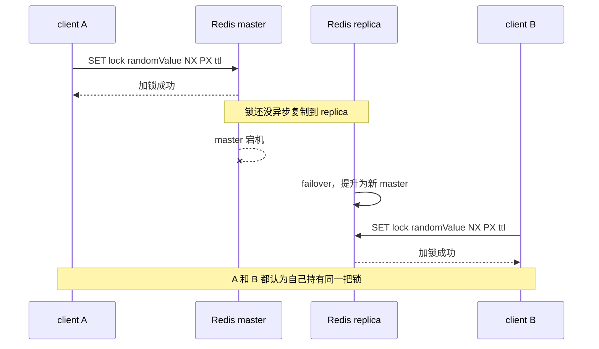
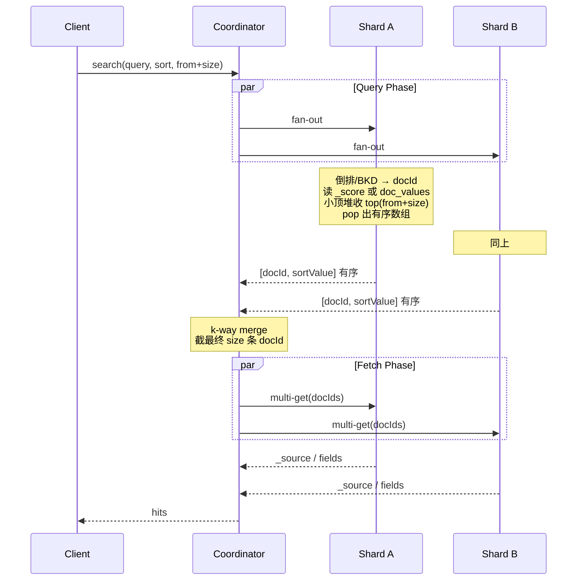

## 一、查询相关

### Q1：集群现状

- **流量**：cquery 峰值 14W+ QPS，pquery 12W+（多级 bom 查询优化后 qps 为 7W）；Squirrel 集群 QPS 峰值 246W+
- **集群大小**：55 主 275 从（1 主 5 从）；总容量 275 G，分片大小 5 G
- **数据量**：key 数量为 3.2 亿，命中率 89%
### Q2：为什么 cquery 使用本地缓存，而不扩容 Squirrel

1. **复制开销**：从节点增多会增加复制开销（主节点带宽/CPU/复制缓冲压力），在写入较大或链路/从节点较慢时可能导致复制延迟增大（从节点读一致性窗口变大）
2. **成本与运维**：节点越多成本越高、运维复杂度更大
3. **热点 key 问题**：扩容 Squirrel 对热点 key 往往无解或收益有限（单 key 请求集中 + Squirrel 单线程处理 + 网络 RTT），本地缓存/两级缓存能把热点读"截流"在应用侧，效果更直接
### Q3：为什么不使用 OceanBase 或者 Hbase 做查询，而是使用 Squirrel

1. **历史背景**：查询历史选择了 Squirrel 缓存，切换成本过高，现有性能可以满足 SLA
2. **主要场景是查询**：把热点读变成内存命中，RT 更低 → 并发更小 → 排队少 → TP999 更稳，还能把读洪峰和数据库隔离开
3. **OceanBase/OBKV 更 ”重“**：为强一致/持久化/治理付出更高单位成本（主要是 CPU 耗时），高并发下更容易碰到连接/线程/尾延迟瓶颈。查询场景对数据强一致性诉求较低（非写后即读场景），没必要为强一致/持久化付出更高成本
### Q4：查询服务刚上线时本地缓存为空，为什么 Squirrel 流量可以抗住

1. 服务上线均在非高峰期进行，Squirrel 集群此时容量可以支撑全部流量击穿到 Squirrel 集群上
2. 服务上线会拆分为多个机器分组进行，每组机器发布间隔期间，已发布的机器已完成本地缓存初始化，且并非全部机器同时初始化，因此流量穿透到 Squirrel 上的量并不大
### Q5：Squirrel（Redis）怎么做到高可用部署的

参见 [[03-高可用部署]]。常见方案：Redis 集群模式（多节点充当哨兵功能）。
### Q6：为什么查询和管理要做读写分离架构

**商品管理服务和商品查询服务的核心职责定位不同：** 管理服务是数据写端，负责商品创建、编辑、上下架、审核、校验、操作审计等；查询服务是数据读端，面向交易、营销、展销、供应链等下游提供高 QPS 查询能力。二者分离主要有几个原因：
1. **流量特征不同**：管理侧写流量相对低，但单次操作链路复杂；查询侧读流量极高，对 RT、吞吐和稳定性要求更高。分离后查询服务可以独立扩容，避免高并发读影响商品维护，也避免批量写入拖慢查询。
2. **数据模型不同**：写端关注领域模型、数据完整性和状态流转；读端关注查询效率、返回结构和场景化聚合。分离后写端可以保持规范模型，读端可以针对 B/C 端、城市、业态等场景构建冗余查询模型。
3. **缓存策略不同**：查询侧需要 Redis、本地缓存、空对象缓存、热点 key 治理、降级兜底等读优化能力；管理侧更关注事务、一致性、权限、校验和审计。分离后两边职责更清晰，代码复杂度更低。
4. **稳定性隔离**：商品查询是核心高频链路，故障影响面大；商品管理是写链路，通常更重视正确性。分离后可以独立发布、回滚、限流和降级，降低互相影响。
5. **支持 CQRS 架构思想**：管理服务负责 Command，查询服务负责 Query。写端完成 DB 变更后，通过 DTS、Binlog、MQ 等方式驱动读侧缓存/索引/查询模型构建，用一定的最终一致性换取更好的查询性能和扩展性。
### Q7：WBR 指标

**重点关注指标：**

1. **商品查询性能**（bquery，cquery）：TP999（尾部延迟）、成功率、失败率、QPS、long-call（长耗时调用）
2. **缓存一致性**：监控各类业务缓存（如 SKU 条码缓存、城市 SKU 缓存、POI SKU 缓存等）的数据一致性状态
3. **慢 SQL**：分析慢 SQL 的数量、走势及具体原因（如刷数导致查询量激增）
4. **慢消息**：监控消息处理耗时的异常情况
5. **慢缓存**：关注缓存访问的延迟指标
6. **慢 RPC 服务/调用**：分析 RPC 服务端和调用端的性能瓶颈
7. **慢 ES 查询**：监控 Elasticsearch 查询的耗时情况
8. **流量峰值**：跟踪核心服务的 QPS 峰值及其变化趋势，用于容量规划和风险预警（如 Cquery、Pquery、Opensearch 等）
9. **告警响应率**
### Q8：为什么查询使用 Redis 当主存储不用 ES，复杂条件检索是怎么做的

**核心不是 Redis 替代 ES，而是职责分层：Redis/Squirrel 作为商品查询主存储，ES/OpenSearch 作为 B 端复杂条件检索的索引层。** 商品详情最终以 Redis 中的查询模型为准，ES 主要负责从大量商品中按条件召回商品信息唯一键；这个唯一键不一定是单个 id，也可能是 skuId、poiId、cityId、业务类型等字段组成的组合键。

1. **查询场景不同**：核心商品查询大多是确定性查询，例如按 skuId、spuId、poiId、cityId 或批量唯一键查详情，适合 KV/Hash 模型；ES 更适合关键词、类目、品牌、状态、时间、门店等复杂条件组合检索。
2. **性能目标不同**：商品查询是高 QPS、强依赖链路，更关注 TP99/TP999 的长尾稳定性。Redis 访问路径短，延迟模型简单；ES 查询会涉及协调节点、分片查询、排序、聚合、打分、结果 merge 等环节，复杂查询下长尾更容易抖动。
3. **稳定性边界不同**：如果所有商品详情都依赖 ES，ES 抖动会影响核心查询链路；把 ES 定位为索引召回后，ES 异常主要影响 B 端复杂检索，不影响 C 端/核心链路按唯一键查商品详情。
4. **数据模型不同**：Redis 存的是面向查询的商品详情模型或场景化查询模型，字段更完整，便于直接返回或组装；ES 存的是检索字段和排序字段，重点是倒排索引能力，不适合作为商品详情最终数据源。
5. **一致性和治理成本不同**：ES 存在 refresh 延迟、mapping 变更、reindex、分片治理、段合并等成本；Redis 查询模型通过 DTS/Binlog/MQ 等链路构建，主链路读模型更可控，也更符合高频查询的成本结构。

**复杂条件检索的链路一般是：**


一句话总结：**ES 是检索系统，不是商品详情主查询系统。Redis/Squirrel 负责高频、确定性的商品查询，ES/OpenSearch 负责 B 端复杂条件检索召回；召回商品信息唯一键/组合键后，再回 Redis 批量查详情，保证主链路低延迟和长尾稳定。**

### Q9：技术方面对服务的规划


---

## 二、档期相关

### Q1：触发上下架状态计算来源这么多，为什么要每一个 MQ 来源接一个消费者组，而不是统一消费？


--- 

## 三、Redis 相关

### Q1：为什么 Redis 集群模式下部署不需要哨兵

因为集群中的多节点本身就充当了哨兵功能，实现了自动故障转移。详见 [[Redis 高可用部署]]。

### Q2：Redis 是 AP 结构，那分布式锁（Redisson RLock）怎么保证 C 的

**严格来说，Redis 分布式锁不能保证强一致的 C，只能在一定工程假设下提供尽力互斥。** Redis/Redis Cluster 更偏 AP 和最终一致，主从复制默认是异步的；一旦 master 写入锁成功但还没复制到 replica 就发生 failover，新的 master 可能允许其他客户端再次加锁，导致互斥被破坏。

>`failover` 指故障转移：master 宕机或不可达后，系统从 replica 中选出新的 master，客户端后续读写切到新 master。



**所以不是 Redis 锁怎么保证严格 C，更准确的说法是：**

1. **单实例 RLock 解决的是正确加锁和安全释放**：加锁通常依赖 `SET key value NX PX ttl` 语义，释放时用 Lua 校验 value 后删除，避免误删别人的锁；Redisson 还通过 watchdog 机制对未过期锁自动续期，降低业务执行时间超过锁 TTL 的风险。
2. **主从 failover 会破坏严格互斥**：Redis 复制默认异步，锁写入成功不代表已经同步到 replica；如果此时发生故障转移，新的 master 可能没有这把锁。
3. **RedLock 提升的是互斥可靠性，不是强一致**：RedLock 通过多个独立 Redis master 和多数派加锁降低单点故障风险，但仍依赖锁有效期、时钟漂移、网络延迟、GC pause 等假设，不能把 Redis 变成 CP 系统。
4. **`WAIT` 只能降低写丢失概率**：它可以等待指定数量 replica 确认写入，但不能从根本上改变 Redis 异步复制和故障切换下的一致性取舍。
5. **强正确性场景不能只靠 Redis 锁**：库存扣减、资金、订单状态流转等场景要求 correctness（并发、锁超时、failover、重试下也不能出现超卖、重复扣款、状态错乱等错误结果），应该用数据库事务、唯一约束、乐观锁、状态机、幂等表，或者引入 fencing token / ZooKeeper / etcd 等强协调能力兜底。

一句话总结：**Redis 锁适合防重复执行、任务互斥、缓存重建、降低并发冲突等工程互斥场景；如果业务要求严格 correctness，Redis 锁只能作为辅助，最终一致性要靠资源侧约束或 CP 协调组件保证。**

**支撑文档：**

| 观点                              | 文档                                                                                                                             | 重点段落                                                       | 支撑点                                                                    |
| ------------------------------- | ------------------------------------------------------------------------------------------------------------------------------ | ---------------------------------------------------------- | ---------------------------------------------------------------------- |
| Redis 偏 AP / 最终一致，不能当成强一致系统     | [Redis Replication](https://redis.io/docs/latest/operate/oss_and_stack/management/replication/)                                | `Redis uses by default asynchronous replication`           | Redis 默认异步复制，master 写成功返回后，replica 可能还没同步这次写入。                         |
| Redis Cluster 存在已确认写入丢失窗口       | [Redis Cluster Specification](https://redis.io/docs/latest/operate/oss_and_stack/reference/cluster-spec/)                      | `Write safety`                                             | Redis Cluster 使用异步复制，故障转移或网络分区时，已确认给客户端的写入仍可能丢失。                       |
| 基于主从 failover 的 Redis 锁不能保证严格互斥 | [Redis Distributed Locks](https://redis.io/docs/latest/develop/clients/patterns/distributed-locks/)                            | `Why Failover-based Implementations Are Not Enough`        | 官方举例说明 master 加锁成功但未复制到 replica 时发生 failover，另一个客户端可能再次获得同一把锁。         |
| 单实例锁只能解决正确释放和避免误删               | [Redis Distributed Locks](https://redis.io/docs/latest/develop/clients/patterns/distributed-locks/)                            | `Correct Implementation with a Single Instance`            | 官方推荐 `SET resource_name random_value NX PX ttl`，释放时用 Lua 校验 value 后删除。 |
| RedLock 提升可靠性，但不是严格 C           | [Redis Distributed Locks](https://redis.io/docs/latest/develop/clients/patterns/distributed-locks/)                            | `The Redlock Algorithm` / `Is the Algorithm Asynchronous?` | RedLock 要求多数独立 master 加锁成功，但仍依赖时间、网络和锁有效期等假设。                          |
| 需要 correctness 的场景不能只靠 Redis 锁  | [Martin Kleppmann - How to do distributed locking](https://martin.kleppmann.com/2016/02/08/how-to-do-distributed-locking.html) | `Making the lock safe with fencing`                        | 锁过期、GC pause、网络延迟后旧客户端可能继续操作共享资源，需要 fencing token 让资源侧拒绝旧请求。           |
| Redisson RedLock 不是推荐答案         | [Redisson Locks and Synchronizers](https://redisson.pro/docs/data-and-services/locks-and-synchronizers/)                       | `RedLock` / `Fenced Lock`                                  | Redisson 文档中 RedLock 已标注 deprecated，更推荐 `RLock` 或 `RFencedLock`。       |
|                                 |                                                                                                                                |                                                            |                                                                        |

---
## 四、MQ 相关

### Q1：Kafka 和 RocketMQ 的区别是什么

| 对比维度       | Kafka                                                                                                                                                                      | RocketMQ                                                                                          |
| ---------- | -------------------------------------------------------------------------------------------------------------------------------------------------------------------------- | ------------------------------------------------------------------------------------------------- |
| **数据可靠性**  | 使用异步刷盘方式，异步复制/同步复制                                                                                                                                                         | 支持异步实时刷盘、同步刷盘、同步复制、异步复制。同步刷盘在单机可靠性上比 Kafka 更高，不会因 OS Crash 导致数据丢失                                 |
| **ack 策略** | acks=0：发出去就当成功，延迟最低吞吐最高，但丢消息风险最大（适用于日志/埋点）<br>acks=1（默认）：Leader 写入本地日志后返回，follower 异步复制，性能好但 Leader 宕机可能丢消息<br>acks=all（或-1）：等待 ISR 中 min.insync.replicas 个副本确认，可靠性最高但延迟更高 | RocketMQ 的同步刷盘 + 同步 Replication 在单机可靠性上更高                                                         |
| **性能对比**   | 单机写入 TPS 约百万条/秒（消息大小 10 字节）                                                                                                                                                | 单机部署 3 个 Broker，最高约 12 万条/秒（消息大小 10 字节）                                                           |
| **性能优势原因** | ① 顺序写入优化：减少磁盘寻道时间<br>② 批量处理技术：减少网络开销和磁盘 I/O<br>③ 零拷贝技术：避免用户空间和内核空间之间的多次数据拷贝<br>④ 压缩技术：减少网络传输数据量                                                                            | —                                                                                                 |
| **消费失败重试** | 原生不支持失败重试，通常由应用/框架层实现                                                                                                                                                      | 提供内置重试队列（%RETRY%）+ 延迟级别 + 死信（DLQ）语义                                                               |
| **定时消息**   | 不支持                                                                                                                                                                        | 支持                                                                                                |
| **事务消息**   | 不支持                                                                                                                                                                        | 支持                                                                                                |
| **消息查询**   | 不支持                                                                                                                                                                        | 支持                                                                                                |
| **消息回溯**   | 理论上可以按偏移量回溯                                                                                                                                                                | 支持按时间回溯消息，精度毫秒                                                                                    |
| **消费并行度**  | 依赖 Topic 的分区数（如分区数 10，则最多 10 个线程并行消费），消费线程数与分区数一致                                                                                                                          | ① 顺序消费：并行度同 Kafka<br>② 乱序消费：并行度取决于 Consumer 的线程数（如 Topic 配置 10 个队列，10 台机器消费，每台 100 个线程，并行度为 1000） |

> Kafka 的 TPS 能跑到单机百万，主要是 Producer 端将多个小消息合并批量发向 Broker。RocketMQ 没有这么做，因为对 Java 来说缓存过多消息，GC 是个很严重的问题。且 RocketMQ 认为线上的系统单个 Producer 每秒产生的数据量有限，不可能上万。

---
## 五、Java 基础相关

### Q1：String 压缩列表是什么

参考：[Compact Strings in Java | Baeldung](https://www.baeldung.com/java-9-compact-string)
### Q2：Spring 三级缓存了解过吗

**Spring 使用三级缓存解决循环依赖：**

- 三级缓存的数据结构、存储内容
- 为什么需要三级缓存（而非二级）

参考：[Spring使用三级缓存解决循环依赖](https://juejin.cn/post/6844904099976536072)
### Q3：可重入锁相关实现

参考：[从 ReentrantLock 的实现看 AQS 的原理及应用](https://tech.meituan.com/2019/12/05/aqs-theory-and-apply.html)
### Q4：怎么区分 JDK 线程池里的核心线程和非核心线程

不区分核心线程和非核心线程，仅在线程每次获取任务前判断是否超出核心线程数，超出且超过线程存活时间后会自行结束。

**代码位置：**
`java.util.concurrent.ThreadPoolExecutor#getTask`

**具体代码块：**
```java
for (; ;) {
    // ....
    // Are workers subject to culling?  
    boolean timed = allowCoreThreadTimeOut || wc > corePoolSize;  
      
    if ((wc > maximumPoolSize || (timed && timedOut))  
        && (wc > 1 || workQueue.isEmpty())) {  
        if (compareAndDecrementWorkerCount(c))  
            return null;  
        continue;  
    }  
      
    try {  
        Runnable r = timed ?  
            workQueue.poll(keepAliveTime, TimeUnit.NANOSECONDS) :  
            workQueue.take();  
        if (r != null)  
            return r;  
        timedOut = true;  
    } catch (InterruptedException retry) {  
        timedOut = false;  
    }
    
    // ....
}
```


---
## 六、Tomcat

### Q1：Tomcat 的线程池模型和 JDK 线程池有什么区别

> TODO

--- 

# 七、ES 相关

### Q1：解释一下什么是倒排索引？

ES 基于 Lucene，索引机制是其高效搜索能力的关键，分为**倒排索引**和**正排索引**两种。

#### 倒排索引（Inverted Index）

将文档内容分解成词项（term），为每个词项建立索引，指向包含该词项的所有文档。用于全文搜索。

**存储结构：**

- **词典（Term Dictionary）**：存储所有词项，排序后便于快速查找。
- **倒排列表（Postings List）**：每个词项对应一个列表，记录包含该词项的所有文档 ID 及词项在文档中的位置信息。

**使用方式：** 查询时分词 → 词典定位词项 → 取对应倒排列表 → 合并多个倒排列表得到结果文档。

**示例：**

```
doc1: "redis fast"
doc2: "redis cluster"

redis   → [doc1, doc2]
fast    → [doc1]
cluster → [doc2]
```

查 `redis AND fast` → 求交集 → `[doc1]`。

**速度优势：**

- **高效检索**：词项预先索引，定位文档快。
- **空间压缩**：词项去重 + 压缩存储，节省空间。
- **排序与相关性打分**：保存位置信息，便于相关性打分和排序。

#### 正排索引（Forward Index）

文档 → 词项 / 字段值的映射。用于存储结构化数据（数字、日期等），支持精确值过滤、排序、聚合。在 Lucene 中由 `doc_values` 实现。

**存储结构：** 文档 ID → 字段值 的映射表，每个 doc 对应一组字段值。

**使用方式：** 对字段做过滤、排序、聚合时，通过正排索引直接拿字段值。

**速度优势：**

- **快速字段访问**：直接按 doc id 拿值，排序聚合必备。
- **内存效率**：mmap + page cache，访问快。

#### 总结

| 索引   | 方向                | 用途             |
| ---- | ----------------- | -------------- |
| 倒排   | term → doc id     | 全文搜索、词项检索      |
| 正排   | doc id → 字段值      | 排序、聚合、精确过滤、脚本访问 |

二者结合，使 ES 既能高频检索，又能高效排序聚合。

### Q2：keyword 和 numeric 在 ES 中的存储结构一样吗？有什么差异？

不一样。

- **keyword**：倒排索引（FST + posting list）+ `SortedSetDocValues`（列存）。
- **numeric（int/long/float/double）**：BKD Tree（Lucene 6+ 用 BKD 替代倒排，专为数值范围）+ `NumericDocValues`。

**对比：**

| 维度    | keyword            | numeric            |
| ----- | ------------------ | ------------------ |
| 等值查询  | 强，term dict 直接命中   | 中等，BKD 点查          |
| 范围查询  | 差，要枚举区间 term       | 强，BKD 原生范围裁剪       |
| 前缀/通配 | 支持                 | 不支持                |
| 聚合排序  | 字符串比较开销大           | 数值聚合原生支持           |
| 存储成本  | 高                  | 低，压缩好              |

**选型：** 等值 / 前缀走 keyword，范围 / 聚合走 numeric。数字字段如果只精确匹配（状态码、id），强制 `keyword` 更快。

**其他类型：** `text` 倒排（分词）；`date` 走 BKD（long 毫秒）；`geo_point` / `ip` 走 BKD。

### Q3：`[]` 数组形式的字段为什么能支持 term 查询？

ES 没有真正的「数组类型」。数组就是「同字段多值」，索引时**扁平化**，每个元素独立写入倒排 / BKD。

```json
doc1: { "tags": ["redis", "fast"] }
```

索引后：

```
tags:redis → [doc1]
tags:fast  → [doc1]
```

对倒排索引来说，单值和数组写入方式一样，只是数组写多次。

**doc_values：** 多值 keyword 用 `SortedSetDocValues`，多值数值用 `SortedNumericDocValues`。

**典型坑：**

```json
doc: { "users": [
  {"name": "alice", "age": 20},
  {"name": "bob",   "age": 30}
] }
```

查 `name = alice AND age = 30` 会**误命中**——扁平化后无法关联同元素。解决：用 `nested` 类型，每个元素索引为独立隐藏子文档，BlockJoinQuery 关联父子。

### Q4：ES 索引的查询过程？

**Query Then Fetch 两阶段，排序两层（shard 本地堆排 + coordinator k-way merge），全程内存。**



**关键点**

- `_source` 只在 Fetch 阶段拉，省 IO。
- sortValue 来源：`_score`（BM25 实时算）/ doc_values（`.dvd` 列存 + mmap + page cache，按 docId 随机取）。
- 堆**结构**无序，pop 出来才有序 → shard 回传已排好数组 → coordinator 走归并，不重新堆排全量。
- 聚合 Query Phase 并行算，coordinator reduce。
- 深分页：每 shard 都建 `from + size` 堆 → 用 `search_after` / PIT。
- 复杂度：
    - 本地：$O\big(k \log k\big)$，$k = \text{from} + \text{size}$
    - merge：$O\big(N \cdot k \log N\big)$，$N = \text{shard 数}$

### Q5：为什么 searchAfter 可以解决深分页？有哪些局限？

#### 原理

用**上一页最后一条 doc 的排序值作游标**，下一页直接查 `sortValue > cursor` 的 top `size` 条。每 shard 本地堆只收 `size`，coordinator merge 也只 `N × size`，单页代价与翻多深无关。

第一次正常 `search(sort, size)` 拿首页，响应里带上最后一条的 sortValue → 后续请求 `search_after=[sortValue]` 顺序推。

#### 对比 `from + size`

| 维度    | `from + size`                       | `search_after`                  |
| ----- | ----------------------------------- | ------------------------------- |
| 本地堆大小 | `from + size`                       | `size`                          |
| merge 量 | `N × (from + size)`                 | `N × size`                      |
| 单页代价  | 随 `from` 线性涨                        | 与页深无关，恒定                        |
| 跳页    | 支持                                  | 不支持，只能"下一页"                     |
| 兜底    | `max_result_window=10000` 防 OOM     | 无上限                             |
| 适用    | 浅分页（前几页）                            | 深翻、瀑布流、高并发深查                    |

本质区别：`from + size` 每次都把前 `from` 条捞出来再扔掉（白干）；`search_after` 直接用排序值跳过，不做无用功。

#### 局限

1. **不能跳页**：只能顺序翻，跳第 N 页等于顺序请求 N 次，比 `from + size` 还慢。
2. **必须有全局唯一排序键**：sort 字段并列值会漏 / 重，通常业务字段 + `_id`（或 `_shard_doc`）做二级排序。
3. **裸用无一致性视图**：翻页期间增删改会漏 doc / 重 doc / 顺序漂。需配 **PIT（Point In Time）** 冻一份只读快照，每次请求带 `pit_id`。代价是 PIT 期间 merge 受限，长持有撑大段数。
4. **不利于全量导出**：本质串行游标，吞吐有限。导大数据用 sliced PIT + search_after 切片并行。
5. **排序字段挑剔**：需有 `doc_values`、区分度高；`text` 不能直接排，要 `.keyword`；浮点当 cursor 有精度坑。

### Q6：嵌套的字段结构为什么会拖慢查询速度，大概慢多少？

#### 实际存储结构

ES 没有真正的"对象"概念，Lucene 底层只认扁平的 doc。普通 `object` 类型字段会被打平：

```json
// 写入
{ "users": [
  {"name": "alice", "age": 20},
  {"name": "bob",   "age": 30}
] }

// 实际索引（单个 Lucene doc）
users.name → ["alice", "bob"]
users.age  → [20, 30]
```

name 和 age 之间的对应关系丢了 → 查 `name=alice AND age=30` 会误命中（Q3 提过）。

`nested` 类型不一样，**每个数组元素被索引为一个独立的 Lucene doc（隐藏子文档），和父文档一起作为一个 block 连续写在同一个段里**：

```
Lucene 段内布局（一个 block）：
  doc#0  users: {name: alice, age: 20}   ← nested 子文档 1
  doc#1  users: {name: bob,   age: 30}   ← nested 子文档 2
  doc#2  <root>  (其他父字段)             ← 父文档（block 内最后一个 doc）
```

- 父文档和它的 nested 子文档共享一个 block，物理相邻
- 用一个特殊的 `_primary_term` / `_type` 位图区分谁是父谁是子（早期版本用 `_type` 字段，新版本用 docId 范围 + bitset）
- 每个子 doc 自己有完整的倒排索引条目，`name=alice` 只命中 doc#0
- 父子靠 BlockJoinQuery 通过 block 边界关联

doc 数因此被放大：一个父文档带 N 个 nested 元素 → 段里实际是 N+1 个 Lucene doc。这是 ES 默认限制 `index.mapping.nested_objects.limit=10000` 的原因。

#### 为什么拖慢查询

1. **查询要走 join**：普通查询命中 docId 直接出结果；nested 查询先在子文档倒排里命中 → 拿到子 docId → 用 block bitset 反查父 docId → 再做其他条件 AND。多一次索引访问 + 一次 bitset 查找。
2. **doc 数膨胀**：段里实际 doc 数变成 `父数 × (1 + 平均 nested 元素数)`。倒排 posting list、BKD、doc_values 全部按 doc 数计费，扫描量、内存占用、merge 成本都跟着涨。
3. **打分、聚合更贵**：nested 字段的聚合（如 `nested` agg）要先按 join 关系把子文档归到父文档，再做 bucket / metric，等于在普通聚合外多一层路径。
4. **scoring 路径变长**：`score_mode` 要把多个子文档的得分按 avg / sum / max 合并回父文档，比单 doc BM25 多一步聚合。

业界经验值大约 **3-5 倍**，单层 nested、子文档数少时差距更小；多层 nested 嵌套或单父文档子元素几百几千时，差距能到 10 倍以上。

#### 更新代价
nested 子文档不能单独更新。改动任一子元素（如库存变化）→ 整个父文档软删 + 重写整组 nested 子文档（段 immutable，参见 Q7）。高频更新场景（实时库存、价格变更）效率低下，段碎片和死 doc 都会被放大。

#### 应对
- 子元素少、查询频繁 → nested 可接受
- 子元素多、变动频繁 → 拆成父子关系（`join` 类型）或拆成两个索引在应用层 join
- 实在不需要跨字段精确匹配 → 直接用 `object`（默认扁平化）
- 业务允许冗余 → 把每个子元素冗余成独立顶级 doc，查询走普通索引

### Q7：ES 文档删除有哪些步骤，以及大量更新文档后会有什么影响？

#### 段文件分裂

ES 的索引数据不是一个大文件，而是由很多 **segment（段）** 组成。

**段怎么来的**：写入的 doc 先进内存缓冲区，每次 **refresh（默认 1s）** 把缓冲区落盘 → 生成一个新段。段一旦生成就 immutable，不能改。

**段为什么会越来越多**：

- 写入频繁，每秒一次 refresh，每秒一个新段
- 单条 / 小 batch 写入，段都很小
- 更新、删除也会产新段（见下）

**段多的问题**：每次查询要遍历所有段、各自走一遍倒排 / BKD / 过滤，再 merge 结果。段越多越慢。

**自动 merge**：后台一直把小段合并成大段，但写入速度 > merge 速度时段就堆积。

#### 删除过程

ES 删除是**软删**：

1. 收到 delete，写 translog。
2. 记一条"这个 doc 已删"标记，**原索引数据不动**。
3. 等 refresh 把标记落到段上 → 查询时按标记过滤死 doc。
4. 等后台 merge 才真正把死 doc 从索引文件里清掉，磁盘空间才回收。

#### 更新的实质

ES **不能原地改 doc**（段 immutable）。更新 = **软删旧 doc + 写一条新 doc**：

1. 旧 doc 在原段里被标记删除（不动数据）。
2. 新 doc 进内存缓冲区，下次 refresh 生成新段。
3. translog 记一删一增两条。

`_update` partial update 也一样 — 先 get 旧 `_source`，合并字段，整 doc 重写。

#### 大量更新 / 删除的影响

**段碎片爆炸**
- 每次更新都写新段 → 段数飞涨
- 每次更新都软删一条 → 死 doc 比例飞涨
- 查询要遍历更多段，每段里还有一堆死 doc

**查询变慢**
- 索引文件没缩小，IO 没减
- 多一步死 doc 过滤的 CPU
- 排序 / 聚合也要先把死 doc 拿出来再剔掉
- TP999 长尾

> 注意：性能差异不在「判断是否被删」本身（bit 检查很便宜，且段无删除时直接跳过），而在**索引文件没瘦身**。倒排 posting 里 docId 数量 = 历史写过的 doc 数，删 50w 后 posting 还是 100w 个 docId 要读、要遍历。merge 把死 doc 物理清掉后，文件变小，扫描量才真正下降。

**写入变慢**
- merge 频繁触发，写放大 3-5 倍
- merge 抢 IO，挤掉正常写入和查询的资源
- translog 膨胀，节点 recovery 变慢

**磁盘占用虚高**
- 死 doc 的倒排、BKD、doc_values、`_source` 都还在
- 必须等 merge 才释放
#### 应对
- `refresh_interval` 调大（5-30s），少出段
- bulk 批量写，别单条
- 热改字段拆出 ES，放 Redis / MySQL
- 海量清数据：按时间分索引 + 整索引 `DELETE`，比 `_delete_by_query` 快几个数量级
- 低峰跑 `force_merge?only_expunge_deletes=true` 清死 doc
- 大集群压低自动 merge，夜间集中跑
