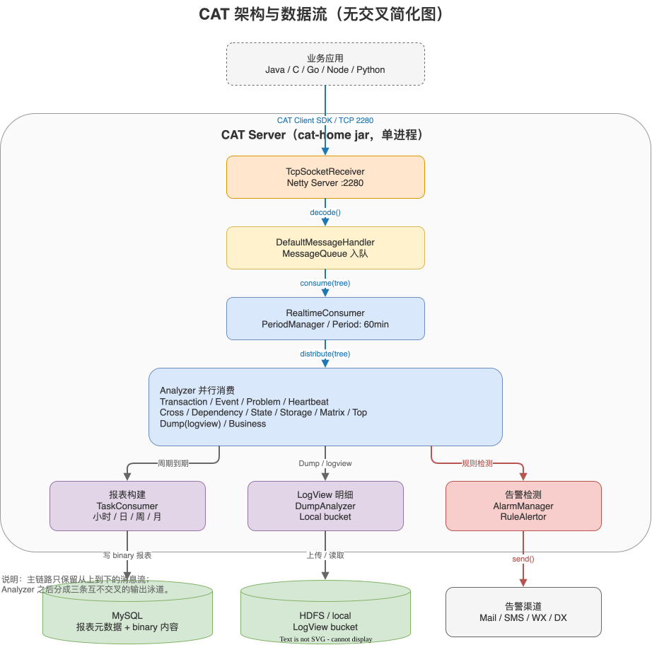

# 02 - 架构与数据流

## 高层架构

## 数据流详解

### 1. 客户端上报

- 路径：`lib/java/.../message/io/TcpSocketSender.java` → Netty 客户端 → 服务端 2280
- 协议：自定义二进制（4 字节长度 + payload），`PlainTextMessageCodec`/`NativeMessageCodec`
- 消息模型：`MessageTree`（包含 Transaction/Event/Heartbeat/Metric 树形结构）

### 2. 服务端接收

`cat-core/com.dianping.cat.analysis.TcpSocketReceiver`：
- Netty Boss + Worker 各 24 线程
- Linux 用 Epoll，其他平台 Nio
- `MessageDecoder.decode()` → `CodecHandler.decode(buf)` → `MessageTree`
- 通过 `MessageHandler` 分发

`DefaultMessageHandler` → `MessageConsumer.consume(tree)` → `RealtimeConsumer`

### 3. 实时消费

`cat-core/com.dianping.cat.analysis.RealtimeConsumer`：
- `PeriodManager` 维护按小时（HOUR=3600000ms）划分的 `Period`
- `Period.distribute(tree)` 分发给当前周期的所有 Analyzer
- Analyzer 各自维护 `MessageQueue`，独立线程消费，保持隔离

### 4. 报表生成

每个 Analyzer：
- 内存维护当前周期模型（`TransactionReport` 等，由 codegen 生成）
- `doCheckpoint(atEnd=false/true)` 周期切换时持久化
- `XxxDelegate` 决定持久化时机/格式

存储入口：
- 小时报表 → `HourlyReport` + `HourlyReportContent`（binary 字段）
- 日/周/月报表由离线 `TaskConsumer` 聚合 → `DailyReport`/`WeeklyReport`/`MonthlyReport`

### 5. 报表查询

页面入口：`/r/{action}?op=...&domain=...&date=...`

- Handler.handleOutbound() → switch(action)
- 调用 `XxxReportService.queryHourlyReport(...)` 等
- 内部走 `ModelService` 抽象：
  - `LocalModelService`：当前小时实时数据（直接读内存 Analyzer）
  - `RemoteModelService`：跨实例聚合（`/r/model?xml=...`）
  - `HistoricalModelService`：从 MySQL binary 读取
  - `CompositeModelService`：组合上述三者

`ModelRequest` → `ModelResponse<TransactionReport>` → JSP 渲染

### 6. LogView 链路

- `DumpAnalyzer` 累积 `MessageTree` 到本地 `LocalMessageBucket`
- `cat-hadoop` 周期性把本地 bucket 上传 HDFS（可关闭）
- 查询路径：`/r/m?op=view&id={MessageId}` → `MessageBlockReader` → 解码 → JSP

## 关键类与职责

| 类 | 模块 | 作用 |
|---|---|---|
| `TcpSocketReceiver` | cat-core | Netty 接收入口（2280） |
| `RealtimeConsumer` | cat-core | 周期分发，全局单例 |
| `PeriodManager` / `Period` | cat-core | 时间窗口管理，每小时切换 |
| `MessageAnalyzer` 接口 | cat-core | 各业务分析器抽象 |
| `XxxAnalyzer` | cat-consumer | 8+ 类业务实现 |
| `ModelService<T>` | cat-core | 报表查询统一接口 |
| `XxxReportService` | cat-home | DAL + binary 解码包装 |
| `Handler` (PageHandler) | cat-home | MVC 入口 |
| `CatServlet` / `MVC` (Unidal) | cat-home/unidal | 路由分发 |
| `AlarmManager` | cat-home | 触发各类规则告警 |
| `AlertManager` | cat-alarm | 渠道发送统一接口 |

## 多机部署

- **采集机**（多台）：跑 `TcpSocketReceiver` + Analyzer，本地缓存
- **任务机**（job machine）：跑 `DefaultTaskConsumer`，离线聚合
- **告警机**（alert machine）：跑 `AlarmManager`
- 区分由 `ServerConfigManager.isJobMachine()` / `isAlertMachine()` 决定，配置走 `server-config` 表

跨机数据由 `RemoteServersManager` + `/r/model` 互查接口聚合。
