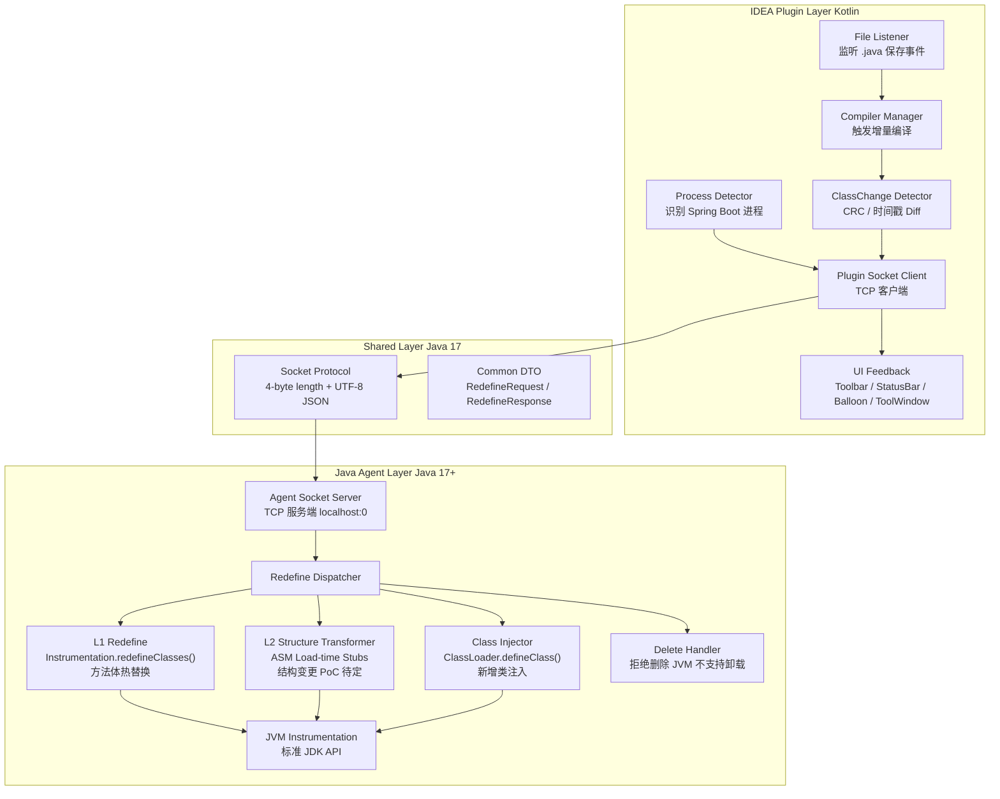
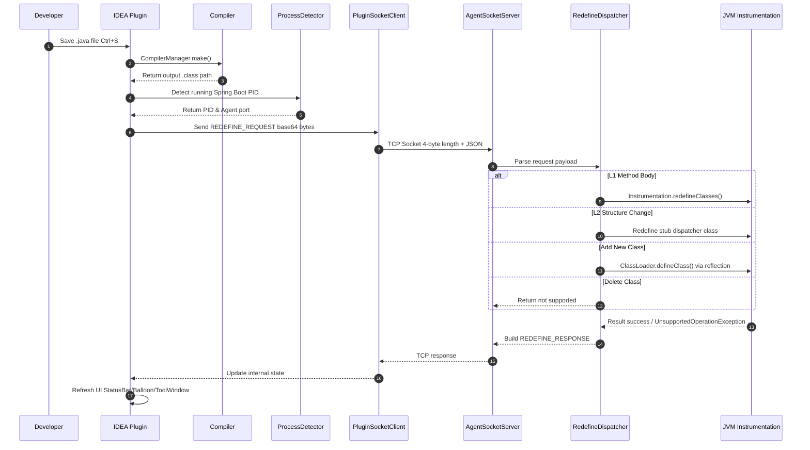
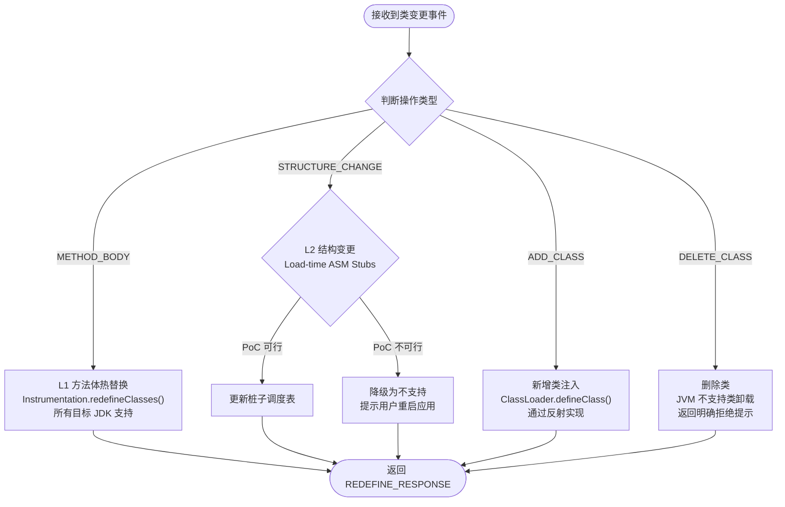
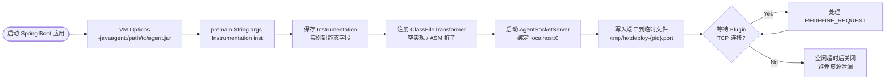

# Spring Boot 热更新 IDEA 插件 — 开发执行计划

> 基于 `spec/spec.md` V1.1 细化，工期 10–12 周（2–3 个月）
> 计划日期：2026-05-07
> 目标：产出可执行的开发任务、验证标准与风险清单

---

## 1. Context & Goals

**背景**：目前 `hot-deployment/` 目录仅包含需求规格说明书，无任何代码或构建系统。本项目从零开始，需搭建 IDEA 插件 + Java Agent 双模块工程。

**一期核心目标（10–12 周）**：
- 实现 **L1（方法体热替换）**，并确保在标准 JDK 17 下毫秒级生效。
- 实现 **L2（结构变更热替换）** 或明确其边界：新增/删除方法、字段、类。
- 提供 Auto / Manual 两种触发模式、完整的 UI 反馈（状态栏、Balloon、日志面板）与配置持久化。
- 零依赖（无需 DCEVM / JRebel / spring-boot-devtools），开源发布。

**关键假设与风险**：标准 JDK 的 `Instrumentation.redefineClasses()` 不支持已加载类的结构变更（新增/删除方法/字段）。因此 Week 1–2 的 PoC 必须优先验证 L2 的技术可行性，并据此锁定后续实现方案。

---

## 2. High-level Architecture

```
┌──────────────────────────────────────────────┐
│  IntelliJ IDEA Plugin (Kotlin/Java)          │
│  - File Listener / CompilerManager           │
│  - Spring Boot Process Detector              │
│  - Socket Client (TCP localhost)             │
│  - UI: Toolbar, StatusBar, ToolWindow        │
│  - Config: PersistentStateComponent          │
└──────────────────┬───────────────────────────┘
                   │ Socket Protocol (Length-prefixed JSON)
                   ▼
┌──────────────────────────────────────────────┐
│  Java Agent (Java 17+)                       │
│  - Premain + Instrumentation                 │
│  - Socket Server (dedicated thread)          │
│  - ClassFileTransformer (load-time ASM)      │
│  - redefineClasses / defineClass dispatcher  │
└──────────────────────────────────────────────┘
```

**技术栈**：
- **Plugin 模块**：Kotlin + IntelliJ Platform Maven 插件（`org.jetbrains.intellij`）
- **Agent 模块**：Java 17 + ASM 9.x（字节码操作）
- **通信协议**：TCP Socket，4 字节长度头 + JSON Payload
- **构建工具**：**Maven**，多模块项目（根 `pom.xml` 聚合 `agent`、`common`、`plugin`）

---

### 2.1 系统架构图（Mermaid）



---

### 2.2 热更新通信时序图（Mermaid）



---

### 2.3 类替换决策流程图（Mermaid）



---

### 2.4 Agent 启动与挂载流程（Mermaid）



---

## 3. Project Structure (Planned)

### 3.1 目录树

```
hot-deployment/
├── plan/
│   └── plan.md                  # 本计划文件
├── spec/
│   └── spec.md
├── plugin/                      # IDEA 插件模块 (Kotlin)
│   ├── pom.xml
│   └── src/
│       ├── main/kotlin/com/github/hotdeploy/plugin/
│       └── main/resources/META-INF/plugin.xml
├── agent/                       # Java Agent 模块 (Java 17)
│   ├── pom.xml
│   └── src/
│       ├── main/java/com/github/hotdeploy/agent/
│       └── test/groovy/
├── common/                      # 共享协议 DTO (Java 17)
│   ├── pom.xml
│   └── src/
│       ├── main/java/com/github/hotdeploy/common/
│       └── test/groovy/
├── sample/                      # 示例 Spring Boot 项目（Maven 单模块）
│   ├── spring-boot-2-sample/
│   └── spring-boot-3-sample/
├── doc/
│   └── poc-report.md            # PoC 阶段技术验证报告
├── README.md
├── CONTRIBUTING.md
├── ARCHITECTURE.md
├── pom.xml                      # Root aggregator
└── .github/workflows/ci.yml
```

### 3.2 Maven 多模块配置要点

**根 `pom.xml`**（聚合器，不打包）：
- `<packaging>pom</packaging>`
- `<modules>` 包含 `common`, `agent`, `plugin`
- 统一声明 `groupId`, `version`, `maven.compiler.source/target`
- 统一管理依赖版本（`dependencyManagement`）：ASM 9.x、Kotlin、Spock 2.x（Groovy 4）

**`common/pom.xml`**（共享协议层，允许项目基础工具依赖）：
- `packaging: jar`
- `source/target: 17`
- 依赖：`commons-lang3`, `commons-collections4`（项目基础工具依赖）。
- 职责：定义 Socket 通信 DTO（如 `RedefineRequest`, `RedefineResponse`），供 `agent` 和 `plugin` 共同依赖，避免序列化不兼容。

**`agent/pom.xml`**（依赖 `common`）：
- `packaging: jar`
- `source/target: 17`
- 依赖：`common`, `org.ow2.asm:asm:9.7`, `org.ow2.asm:asm-commons:9.7`
- **打包关键**：使用 `maven-shade-plugin` 打包为 **fat-jar**，将 ASM 和 common 一并打入。
- **Manifest 配置**（shade 插件的 `<transformers>`）：
  - `Premain-Class: com.github.hotdeploy.agent.HotUpdateAgent`
  - `Can-Redefine-Classes: true`
  - `Can-Retransform-Classes: true`

**`plugin/pom.xml`**（依赖 `common`）：
- `packaging: jar`（IntelliJ Platform Maven 插件会将其打包为符合 Marketplace 格式的 zip）
- `source/target: 17`（IDEA 插件开发建议 JDK 17+）
- 依赖：`common` 模块
- 插件配置：`org.jetbrains.intellij` Maven 插件（或 `intellij-platform-gradle-plugin` 的 Maven 等价方案）
  - `ideaVersion`: `2022.1.1`（对应 IC-221.5080.210）
  - `sinceBuild`: `221.5080`
  - `untilBuild`: `241.*`（根据实际测试情况调整）
- Kotlin 版本建议 `1.9.x`，与 IDEA 2022.1+ 内置 Kotlin 版本兼容。

### 3.3 模块依赖关系

```
plugin ──depends──▶ common ◀──depends── agent
```

- `agent` 和 `plugin` 均依赖 `common`，但 `agent` 与 `plugin` 之间**不直接依赖**。
- `agent` 通过 Shade 插件将 `common` 打入 fat-jar，因此运行时 `agent.jar` 是自包含的。
- `plugin` 在打包时也将 `common.jar` 放入 lib 目录，由 IDEA 的插件 ClassLoader 加载。

---

## 4. Phase-by-Phase Execution Plan

### Phase 1: Foundation & Feasibility PoC (Week 1–2)

**目标**：搭好脚手架，并通过 PoC 回答最关键的技术问题——在标准 JDK 下，L2 到底能做到什么程度。

| # | Task | Details | Deliverable |
|---|------|---------|-------------|
| 1.1 | 多模块 Maven 项目搭建 | 根 `pom.xml` 通过 `<modules>` 聚合 `agent`、`common`、`plugin`。Agent 模块使用 `maven-shade-plugin` 输出 fat-jar（含 ASM）。Plugin 模块配置 IntelliJ Platform Maven 插件（`org.jetbrains.intellij`），target IDE 2022.1+。 | 可编译的空白工程 |
| 1.2 | Agent 基础骨架 | `premain(String, Instrumentation)`，保存 `Instrumentation` 实例；注册一个空的 `ClassFileTransformer`。 | Agent 可 attach |
| 1.3 | PoC-A：标准 Redefine 边界验证 | 写一个独立测试程序：加载一个类 → 修改其字节码（方法体 / 新增方法 / 新增字段）→ 调用 `redefineClasses`。在 **JDK 17** 上运行，记录 JVM 行为与异常。 | `doc/poc-report.md` 章节 A |
| 1.4 | PoC-B：Load-time Instrumentation 可行性 | 在 `ClassFileTransformer.transform()` 中，使用 ASM 修改**首次加载**的类（例如：为每个方法插入一个调用 `HotSwapDispatcher` 的桩子，或将方法体委托给可替换的 `MethodContainer`）。评估：① 实现复杂度；② 对启动性能的影响；③ 对 Spring AOP/CGLIB 的兼容性。 | `doc/poc-report.md` 章节 B |
| 1.5 | 兼容性基线 | 在 `sample/spring-boot-3-sample` 上验证 Agent 可正常 attach，不影响应用启动。 | CI 基线通过 |

**Phase 1 出口标准**：
- `doc/poc-report.md` 明确结论：
  - L1（方法体）在所有目标 JDK 上均可行。
  - L2（已加载类结构变更）的**实现路径已锁定**（例如：采用 Load-time Instrumentation 方案，或决定一期降级）。
- 如果 PoC-B 证明无法在 2-3 个月内稳定实现，则调整后续 Phase 3 范围，仅保留 L1 + 新增/删除类。

---

### Phase 2: Communication & Process Detection (Week 3–4)

**目标**：建立 Plugin ↔ Agent 的通信通道，并让插件能准确识别目标 Spring Boot 进程。

| # | Task | Details |
|---|------|---------|
| 2.1 | 文件保存监听 | Plugin 侧注册 `VirtualFileListener`，监听 `.java` 保存事件。Auto 模式下触发，Manual 模式下仅记录待更新队列。 |
| 2.2 | 增量编译触发 | 调用 IDEA `CompilerManager.make()` 或编译指定文件，捕获输出 `.class` 文件路径（通过 `CompileTask` 或监听输出目录）。 |
| 2.3 | Spring Boot 进程检测 | 扫描 `RunManager.getAllSettings()`，匹配：① Configuration 类型为 `SpringBootApplicationConfigurationType`；② 正在运行的 `ProcessHandler`；③ 主类名匹配 `*Application`。若多个匹配，弹出 `PopupChooserBuilder` 让用户选择。 |
| 2.4 | Socket 通信协议设计 | `common` 模块定义 DTO：<br>`{ "type": "REDEFINE_REQUEST", "payload": { "classes": [{"name":"com.example.Foo","operation":"METHOD_BODY","bytes":"base64..."}] } }`。<br>传输层：4 字节大端长度 + UTF-8 JSON。Agent 端在 `premain` 中启动 `ServerSocket`（绑定 `localhost:0`，端口写入临时文件或通过 JVM 参数回传）。 |
| 2.5 | Agent Socket Server | 独立线程处理连接；解析请求；调用相应 `Instrumentation` API；返回 `REDEFINE_RESPONSE`（含每个类的 `status` 与 `message`）。 |
| 2.6 | Plugin Socket Client | 连接 Agent Server，带超时（默认 5000ms）与重试（1 次）。使用 `ApplicationManager.executeOnPooledThread` 避免阻塞 EDT。 |

**Phase 2 出口标准**：
- 在示例 Spring Boot 项目上点击 "Run" 后，Plugin 状态栏显示 "已连接 Agent (PID: xxxx)"。
- Plugin 能向 Agent 发送 `PING`，Agent 返回 `PONG`。

---

### Phase 3: Core Hot Update Logic (Week 5–7)

**目标**：实现真正的类替换逻辑。此阶段任务受 Phase 1 PoC 结论直接影响。

| # | Task | Details |
|---|------|---------|
| 3.1 | L1 – 方法体热更新 | Plugin 读取编译后的 `.class` 字节码 → Socket 发送 → Agent 调用 `Instrumentation.redefineClasses(ClassDefinition)`。 |
| 3.2 | L2 – 已加载类结构变更 | **依赖 PoC-B 结论**：<br>• **若采用 Load-time Instrumentation**：实现 `ClassFileTransformer`，在类首次加载时通过 ASM 为类注入可替换的桩子。热更新时，通过 redefine 一个辅助类或更新全局调度表来完成新增方法/字段的生效。<br>• **若 PoC-B 不可行**：此任务降级为 "提示用户不支持"，UI 和文档中明确说明。 |
| 3.3 | 新增/删除类 | **新增类**：Agent 通过反射获取目标 `ClassLoader`（识别 `LaunchedURLClassLoader` 或 `AppClassLoader`），调用 `defineClass()` 注入。<br>**删除类**：JVM 不支持单独卸载类。一期方案：UI 提示 "类无法热删除，重启后生效"；Agent 侧不做操作。 |
| 3.4 | 变更检测与 Diff | Plugin 侧维护一个 `Map<String, Long>`（类名 → 文件 CRC/最后修改时间），避免重复推送未变更的类。 |
| 3.5 | Agent 参数自动注入 | 实现 `RunConfigurationExtension`（或监听 `RunConfiguration` 启动事件），在 Spring Boot 应用的 VM options 中自动追加 `-javaagent:/path/to/agent.jar`。用户可在 Settings 中关闭此行为。 |

**Phase 3 出口标准**：
- 在示例项目中：修改 Controller 方法体 → HTTP 请求立即返回新结果。
- （若 L2 实现）在示例类中新增一个 public 方法 → 旧实例可通过反射/新逻辑调用该方法。
- 新增一个 Service 类 → Spring Boot 应用可通过 `@Autowired` 注入使用（需配合 Spring 上下文刷新或预先注入占位符）。

---

### Phase 4: UI, Config & Stability (Week 8–9)

**目标**：提供完整的用户交互与错误边界。

| # | Task | Details |
|---|------|---------|
| 4.1 | 工具栏按钮 | 实现 `AnAction`，注册到主工具栏（`MainToolbar`）。图标状态：灰色（无变更/未连接）→ 蓝色（有待推送）→ 旋转（更新中）→ 绿色对勾（2s 后恢复）→ 红色叉号（失败，点击打开 Balloon）。 |
| 4.2 | 状态栏组件 | `StatusBarWidget`，常驻右下角。显示：连接状态（Agent 版本 / PID）、最后更新时间、快捷入口。 |
| 4.3 | Balloon 通知 | `Notifications.Bus.notify()`。失败时弹出，标题为失败原因摘要，内容含 "View Details" 链接（打开日志面板）。 |
| 4.4 | Hot Update 工具窗口 | `ToolWindowFactory`，ID 为 `HotUpdateLog`。表格列：Time / Class Name / Operation / Status / Message。底部按钮：Clear / Export to File。 |
| 4.5 | 设置面板 | `Configurable`，路径 `Settings \| Tools \| Hot Update`。配置项：启用开关、触发模式（Auto/Manual）、Debounce delay、Debug logging、Agent timeout。持久化：`PersistentStateComponent` 管理项目级 XML（`.idea/hot-update.xml`），全局级使用 `PropertiesComponent`。 |
| 4.6 | 错误边界 | Agent：所有入口（Socket handler、Instrumentation callback）包 `try-catch`，异常记录到 `System.err` 或本地日志文件，不抛出。Plugin：所有后台任务使用 `ProgressManager` 或 `PooledThread`，异常捕获后更新 UI 状态栏为红色。通信超时单独处理，避免挂起。 |

**Phase 4 出口标准**：
- 所有 UI 元素在 macOS / Windows / Linux 上渲染正常。
- 错误场景（Agent 崩溃、Socket 断开、不支持的操作）均有明确提示，不阻塞 IDEA 主线程。

---

### Phase 5: Testing, Docs & Release (Week 10–12)

**目标**：确保质量、跨平台兼容，并完成开源发布。

| # | Task | Details |
|---|------|---------|
| 5.1 | 多模块项目测试 | 准备 Maven 多模块的 `sample` 项目。验证：① 插件能正确识别子模块中的变更类；② 编译输出路径正确；③ 只推送变更模块的类到目标进程。 |
| 5.2 | 跨平台测试 | 在 Windows 10/11、macOS (Intel/Apple Silicon)、Ubuntu 22.04 上手动验证插件安装与热更新链路。重点检查路径分隔符、Agent jar 路径空格、Gatekeeper/Defender 拦截问题。 |
| 5.3 | JDK 矩阵测试 | 在 CI 和本地运行：OpenJDK 17。验证 Agent attach、 redefineClasses、Socket 通信均正常。 |
| 5.4 | GitHub 仓库初始化 | 添加 `.gitignore`、License（建议 Apache 2.0）、Issue/PR 模板、Code of Conduct。 |
| 5.5 | CI/CD | GitHub Actions workflow：① 构建 plugin（`buildPlugin`）与 agent jar；② 运行单元测试；③ 打包 artifact；④ 发布 Release 时自动上传插件 zip 和 agent jar。 |
| 5.6 | 文档 | `README.md`：功能介绍、安装步骤（Marketplace / 本地安装）、使用方法、能力边界（明确列出支持与不支持的场景）、FAQ。`CONTRIBUTING.md`：环境搭建、Agent 调试（attach 模式 vs premain 模式）、IDEA 插件调试（Maven 方式或 IDEA 直接运行）。`ARCHITECTURE.md`：协议格式、Agent 启动流程、类替换时序图。 |
| 5.7 | 发布准备 | JetBrains Marketplace：准备插件描述、截图（设置面板、工具窗口、状态栏）、版本兼容性声明（2022.1+）。GitHub Release：附带 plugin zip 与 agent jar。 |

**Phase 5 出口标准**：
- CI 全绿（build + test）。
- 在至少一个干净环境（无源码、仅 Marketplace 安装）中，按 README 步骤可完成完整热更新。

---

## 5. Key Technical Decisions

| Decision | Choice | Rationale |
|----------|--------|-----------|
| Bytecode manipulation | **ASM 9.x** | 轻量、控制精细，社区文档丰富；Javassist API 更友好但体积更大。 |
| Communication | **TCP Socket (localhost)** | 简单可靠，跨平台，易于抓包调试（Wireshark/tcpdump）。JMX 过于重量级。共享内存平台差异大。 |
| New class injection | **ClassLoader#defineClass() via reflection** | Instrumentation API 不直接支持新增类，必须通过目标 ClassLoader 反射注入。 |
| Plugin language | **Kotlin** | IDEA 插件生态主流，与 Java 互操作良好，Null-safety 减少 NPE。 |
| Config persistence | **PersistentStateComponent + PropertiesComponent** | IDEA 平台标准机制，无需引入外部存储。 |

---

## 6. Risk Register

| ID | Risk | Impact | Mitigation |
|----|------|--------|------------|
| R1 | **L2 技术不可行**：标准 JDK 的 `redefineClasses` 不支持结构变更，且 Load-time Instrumentation 方案在 PoC 中证明过于复杂或不稳定。 | 高 | Phase 1 优先验证；若不可行，立即调整一期范围为 **L1 + 新增/删除类**，确保交付物稳定可用。 |
| R2 | **Agent 被安全软件拦截**：macOS Gatekeeper / Windows Defender 可能阻止未签名 Agent jar 的执行。 | 高 | 文档中提供手动放行指引；开源项目申请免费代码签名证书（如 SignPath/Let's Encrypt 不适用 jar，需购买或寻找开源赞助）。 |
| R3 | **Spring Boot ClassLoader 变化**：不同版本（2.x vs 3.x）或打包方式（fat jar vs exploded）影响 ClassLoader 类型。 | 中 | Agent 中实现 `ClassLoader` 探测逻辑（优先 `LaunchedURLClassLoader`，回退 `AppClassLoader`）；测试矩阵覆盖 2.x 和 3.x。 |
| R4 | **Agent 内存泄漏**：Socket 连接未关闭、ClassFileTransformer 未清理、`Class` 引用被长期持有。 | 中 | Agent 添加 `shutdownHook` 清理资源；使用 `WeakReference` 缓存类引用；CI 中增加长时间运行测试（30min+）并监控 Metaspace。 |
| R5 | **用户期望过高**：误以为可完全替代 JRebel（如支持方法签名变更、注解刷新）。 | 高 | README 首页明确能力边界表格；UI 中遇到不支持的变更时给出具体原因（如 "不支持修改方法签名，请重启应用"）。 |
| R6 | **IDEA 版本兼容性**：IntelliJ Platform API 在 2022.x–2025.x 之间可能存在 Breaking Changes。 | 中 | 使用 IntelliJ Platform Maven 插件的 `sinceBuild`/`untilBuild` 限制范围；CI 中至少测试最低支持的 2022.1 和最新 EAP。 |

---

## 7. Verification Strategy

每个 Phase 结束时，必须满足以下验证条件才能进入下一阶段：

- **Phase 1**：PoC 报告通过评审（由开发者自评或社区 review），且 CI 能成功编译两个模块。
- **Phase 2**：手动测试通过——Plugin 与 Agent 能完成一次端到端的 `PING-PONG`；进程检测在单/多模块项目中均能正确识别 PID。
- **Phase 3**：在 `sample/spring-boot-3-sample` 上执行黄金路径测试：修改方法体 → 保存 → 1 秒内生效；新增类 → 可被 Spring 上下文加载。
- **Phase 4**：UI 测试覆盖所有状态流转（灰色 → 蓝色 → 旋转 → 绿色/红色）；模拟 Agent 断开，验证状态栏与 Balloon 表现。
- **Phase 5**：在至少 2 个操作系统 + Java 17 上完成手动验收测试；Marketplace 包上传测试通过（沙箱验证）。

---

## 8. 决策记录 & 待确认事项

**已确认决策**（2026-05-07）：
- **L2 技术路径**：先执行 Phase 1 的 PoC-B 验证。若证明在 2–3 个月内无法在不依赖 DCEVM 的标准 JDK 下稳定实现已加载类的结构变更，则一期范围务实调整为 **L1（方法体热替换）+ 新增/删除类**，暂时放弃对已加载类进行新增/删除方法/字段的支持。

**待确认事项**：
1. **Agent 签名**：Agent jar 是否需要代码签名以规避 Gatekeeper/Defender？开源项目是否有预算或渠道申请证书？
2. **Spring 刷新策略**：新增类后，是否需要自动触发 Spring 上下文的部分刷新（如 `ApplicationContext.publishEvent`）？还是仅注入类，由用户手动重启获取 Bean 注入？
