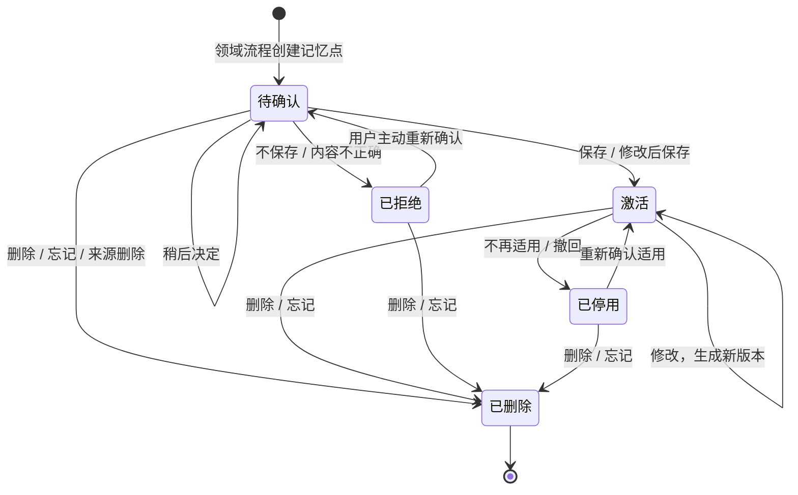

# Agent 基座 PRD

## 1. 定位与范围

Agent 基座为 [[business-workflow-runtime-prd|业务流程运行时]]提供两类通用能力：与模型的交互层，以及 User 级通用状态管理。MVP 面向 C 端，只以 User 为数据归属和隔离边界；不实现租户、组织成员关系或 SSO。

与模型的交互层负责执行业务流程运行时明确提供的模型调用请求、模型路由、失败处理和调用元数据。它不判断调用材料的领域含义，也不决定业务结果是否可展示或继续使用。

User 级通用状态管理负责可信 User 上下文、会话与原始对话、上下文材料、长期记忆点及其通用生命周期。它不管理临时分析、阶段性总结等领域业务状态。

基座不承载领域业务流程、领域输出合规、领域风险判断、业务质量判断或统一业务监控。WorkflowDefinition、SkillDefinition、Prompt 模板、流程执行和 Skill 运行监控属于业务流程运行时；基座不识别调用材料中哪些内容来自 Skill。领域流程在获得模型结果后自行决定是否向用户展示、继续处理或写入业务数据。

心理领域流程见 [[psychological-reflection-workflow-prd]]。

## 2. User 级隔离

### 2.1 User 身份与可信来源

- MVP 使用非实名个人账号。用户只需证明自己持有注册时使用的登录身份，不需要证明现实身份。
- 需要持久化对话、业务分析结果或长期记忆前，用户必须完成登录。
- 一个注册账号对应一个独立 User；同一个现实中的人可以拥有多个 User，系统不得自动识别、合并或共享其数据。
- 当前 User 必须来自平台已经确认的登录状态。业务流程运行时和客户端不得自行指定或切换 User 身份。
- 账号恢复只能恢复对应 User，不得因邮箱、姓名或其他信息相似而合并不同 User。
- 游客可以进行不产生长期数据的临时体验，但不能保存长期记忆。游客会话超过约定的不活跃期限后必须自动逻辑删除，具体期限须在发布前确定并向用户说明。

### 2.2 数据归属

- 会话、上下文、记忆、调用记录和成本数据均归属于当前 User。
- 不同 User 的数据默认完全隔离，业务流程运行时不得跨 User 读取。
- MVP 不假设一个现实中的人只能拥有一个 User，也不引入用户与租户的成员关系。

### 2.3 访问约束

- 每次基座能力调用都必须携带由可信登录状态确定的当前 User 上下文。
- 基座基于当前 User 执行读取、写入、修改和删除，不由业务流程运行时自行拼接或绕过隔离条件。
- 用户级隔离是 MVP 的唯一数据边界；租户或组织隔离属于未来演进事项，见 [[future-evolution-todo]]。

## 3. 会话与上下文管理

### 3.1 会话生命周期

- 创建、继续、查询和删除会话。
- 持久化用户与 Agent 的原始对话记录。
- 支持业务流程运行时读取当前会话及其明确指定的历史内容。
- 会话持久化不等于允许业务流程运行时将全部历史对话用于任意处理。

### 3.2 上下文边界

- 基座根据业务流程运行时明确提供的材料组装模型调用上下文，并处理上下文长度与调用限制。
- 基座不自动扫描用户全部历史对话，也不自行决定某段历史内容是否适合业务分析。
- 用户在当前会话主动提供的文本或文件内容属于本次上下文；它不因进入上下文而自动成为长期记忆。

## 4. 模型调用与版本管理

### 4.1 调用能力

- 业务流程运行时通过基座发起模型调用，不直接调用模型供应商。
- 基座负责模型路由、调用执行、失败处理和返回调用结果。
- 基座向业务流程运行时返回模型结果及必要的调用元数据；领域流程决定结果是否可展示或继续使用。

### 4.2 版本与可追溯性

- 记录模型标识和版本。
- 支持业务流程运行时指定或选择允许使用的模型策略。
- 每条调用记录必须关联 User、领域流程和流程实例；存在会话时同时关联对应会话，以支持隔离、问题排查与成本核对。

## 5. 通用记忆生命周期

长期记忆点是基座管理的唯一通用记忆对象。它可以由业务流程运行时基于对话或其他业务材料创建，并在不同状态间流转；处于“激活”状态的长期记忆点构成用户可使用的长期记忆。对话、阶段性总结等业务材料仅作为记忆点的来源引用，不构成另一类记忆对象。

### 5.1 基座职责

- 保存、查询、修改、删除长期记忆点，并执行其状态变更。
- 记录记忆点的 User 归属、领域流程范围、来源引用、版本、适用时间或情境及当前状态。
- 管理通用状态：待确认、激活、已拒绝、已停用和已删除。
- 保证只有处于激活状态且已获本次使用授权的记忆点，才能作为长期记忆参与后续处理。
- 领域流程范围默认隔离；跨领域流程使用记忆点属于未来演进事项。

### 5.2 与业务流程运行时的边界

- 基座不判断记忆点的领域含义、证据是否充分或何时应当发起确认。
- 业务流程运行时根据领域流程定义生成记忆点、决定领域分类和表达、说明依据与不确定性，并决定确认时机。
- 用户在领域流程中完成一次操作后，基座负责执行对应的通用记忆状态变更。

### 5.3 状态流转

| 当前状态 | 用户操作 | 目标状态 | 结果 |
| --- | --- | --- | --- |
| 待确认 | 保存 | 激活 | 记忆点成为可使用的长期记忆。 |
| 待确认 | 修改后保存 | 激活 | 以用户修改后的内容作为当前版本。 |
| 待确认 | 稍后决定 | 待确认 | 不参与后续处理，用户可以主动重新确认。 |
| 待确认 | 不保存或认为不正确 | 已拒绝 | 不自动重复发起确认；用户可以主动重新发起确认。 |
| 已拒绝 | 用户主动重新确认 | 待确认 | 不自动恢复使用，须再次由用户决定是否保存。 |
| 激活 | 修改 | 激活 | 生成新版本，只有当前版本可以作为长期记忆使用。 |
| 激活 | 表示不再适用或撤回 | 已停用 | 保留历史和来源关联，但不再参与后续处理。 |
| 已停用 | 重新确认适用 | 激活 | 重新成为可使用的长期记忆。 |
| 待确认、激活、已拒绝、已停用 | 删除或忘记 | 已删除 | 逻辑删除，不展示、不使用，也不发送给模型。 |

已删除为终态。来源对话或业务材料被删除时，与其关联的待确认记忆点一并逻辑删除；处于激活状态的记忆点独立管理，是否同时删除由用户逐条决定。

## 6. 成本审计

- 记录模型调用的成本相关信息，以支持成本核对和异常排查。
- 成本数据关联调用、User、领域流程和流程实例。
- 后台管理人员可以查看成本审计信息，但不得通过成本记录查看用户的对话、模型回复、记忆或资料正文。
- 用户可以查看自己的模型资源消耗，包括 Token 使用量；不得查看其他 User 的资源消耗或后台成本审计信息。
- 成本审计不负责定义业务价值、业务质量或用户体验指标。

## 7. 数据安全与删除

### 7.1 数据保护

- 原始会话、长期记忆以及领域流程保存的业务结果在传输和存储过程中必须加密。
- 内部人员不得查看用户的原始会话、长期记忆、心理分析结果或用户主动提供的资料。
- 模型调用必须通过加密传输发送必要内容，但模型供应商会接收到完成处理所需的可读内容；系统必须在首次使用前明确告知用户并取得同意。
- 发送给模型供应商的内容必须遵循最小必要原则，不得包含本次请求未授权使用的历史会话、记忆或资料。

### 7.2 删除与保留

- 对话、上下文材料、领域业务结果、长期记忆点及其历史版本采用逻辑删除。
- 被逻辑删除的数据不得再向用户展示、加入模型上下文、参与业务分析或用于后续复盘。
- 日志、运行监控记录和成本审计记录用于描述已经发生的系统与调用事件，不因用户删除业务数据而删除。
- 日志、监控和成本审计只记录必要的技术与资源元数据，不得包含对话、模型回复、记忆或用户资料正文。

## 8. 基座自身运行保障

- 监控模型调用、会话服务和记忆服务等基座能力自身的运行状态与异常。
- 记录必要的工程日志，支持故障定位和恢复。
- 不对外承担统一的业务指标上报、业务质量评估或领域风险审计能力。

## 9. MVP 非目标

- 租户、组织成员关系和 SSO。
- 跨 User 数据共享或自动关联。
- 统一业务监控平台。
- 领域流程定义、Skill 制品及其运行时管理。

未来演进事项见 [[future-evolution-todo]]。
