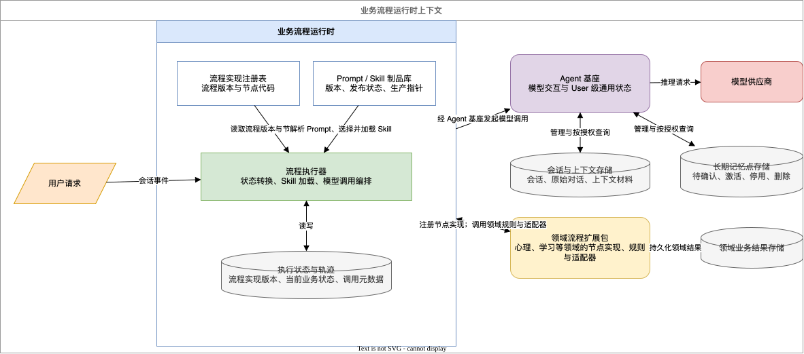
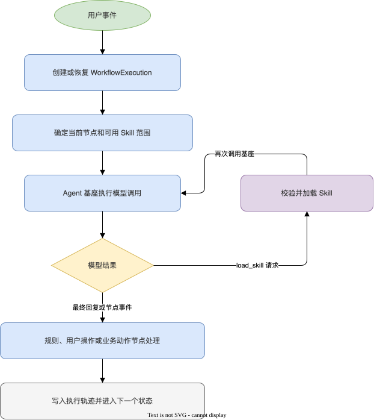

# 业务流程运行时 PRD

## 1. 定位与范围

业务流程运行时是承载各领域 Agent 流程的共享引擎。它统一管理流程定义和 Skill 制品，执行状态机、自动加载 Skill、编排多轮模型交互，并通过 [[agent-foundation-prd|Agent 基座]]完成模型调用与 User 级状态访问。

运行时不属于 Agent 基座。基座只负责模型交互与 User 级通用状态；运行时负责流程和 Skill 的执行机制；领域流程扩展包提供心理、学习或其他领域的流程定义、规则和扩展实现。

[查看和编辑架构图源文件](assets/business-workflow-runtime-architecture-v2.drawio)

第一版不支持跨领域流程组合、跨领域 Skill 自动共享或用户自行创建流程。每个领域流程默认只使用其所属命名空间中的已发布制品。

**例子：** 心理领域发布 `psychological-reflection.v1` 后，只能使用心理领域命名空间中的已发布制品，例如心理风险识别 Skill 和反思提问 Skill；不能组合学习领域流程或加载学习领域 Skill，普通 User 也不能自行创建或共享流程。

## 2. 核心对象

### 2.1 WorkflowDefinition

WorkflowDefinition 是可发布、可版本化的领域流程定义，至少包含：

- 领域流程标识、版本和发布状态。
- 入口事件和进入条件。
- 状态、节点和状态转换。
- 每个节点的上下文授权范围。
- 输出结构、校验要求和失败后的降级路径。
- 允许使用的 Skill 范围。
- 常驻 Prompt 和节点 Prompt 的模板引用。

流程定义由领域流程扩展包编写并发布到运行时。运行时保存定义制品、校验结构完整性，并以已发布版本创建流程实例。

#### DSL 与发布

WorkflowDefinition 是运行时保存的、可发布的 DSL 流程版本，不包含节点的具体实现代码。领域扩展包向运行时注册可用的原子节点；DSL 通过节点标识引用这些节点，并定义节点顺序、条件分支、起止状态和节点参数。

运行时在发布 WorkflowDefinition 前校验 DSL：节点必须已注册，输入输出必须匹配，连线和起止状态必须完整，节点必须属于允许的领域命名空间。发布后生成不可变版本；新实例使用新版本，已有实例继续使用其创建时绑定的版本。

#### ReAct 执行与恢复

ReAct 是节点内部的一种执行策略，不作为单独的业务节点写入 DSL。DSL 只编排“进入剖析”“ReAct 探索”“阶段性总结”等稳定业务节点；ReAct 节点内部在轮数、超时和 Token 上限约束下循环调用模型，根据模型请求按当前节点允许的范围加载 Skill，并在获得最终结果后触发 DSL 中声明的业务事件。循环中间状态只存在于本次节点调用中，运行时记录最终结果、调用轨迹及实际使用的 Prompt／Skill 版本。

ReAct 节点是可重试的原子执行单元。中断恢复时，运行时从当前节点入口重新执行，不恢复节点内部的 ReAct 轮次；节点已经完成的业务副作用必须通过幂等标识避免重复写入。MVP 不持久化模型内部思考、临时 observation 或节点内循环游标；未来如需长时间暂停或精确续接，再增加节点内部 checkpoint。

**例子：**`psychological-reflection.v1` 的 DSL 可以将“普通聊天”“风险检查”“进入剖析”“阶段性总结”串联起来。管理员在可视化编辑器中新增“主题确认”节点并调整节点顺序后，发布 `psychological-reflection.v2`。v1 实例继续执行旧 DSL，v2 实例执行新 DSL。旧节点只有在不再被任何可承接流量的 DSL 引用、且没有运行中实例使用时，才能下线。

### 2.2 SkillDefinition

SkillDefinition 是由运行时统一管理的 Skill 制品，至少包含：

- `skill_id`、所属领域流程、版本和发布状态。
- Skill 独立于 WorkflowDefinition，归属领域命名空间，由 DSL 节点单向引用。SkillDefinition 不维护所属流程或适用节点的反向关系。
- 用于模型选择的 description。
- 按需加载的 Skill 内容。
- 允许使用的上下文类别和输出结构要求。

运行时负责 SkillDefinition 的创建、修改、版本、发布、停用、查询、自动选择、按需加载和运行记录。领域流程扩展包负责提供领域内容和约束，但不自行实现 Skill 存储、版本或加载机制。

### 2.3 PromptDefinition

PromptDefinition 是由运行时统一管理、版本化发布的模型指令制品，可被 DSL 节点引用，至少包含：

- Prompt 标识、所属领域命名空间、版本和发布状态。
- Prompt 内容、受控变量声明。
- 可使用的上下文类别和输出结构要求。

PromptDefinition 定义模型在节点内的任务指令、行为边界、受控变量和输出格式。

PromptDefinition 与 SkillDefinition 分别管理：Prompt 在节点调用时固定携带，Skill 由模型按需请求加载。节点负责状态转换、权限校验、Skill 范围和业务动作。

运行时只用本次已授权的上下文解析受控变量。Prompt 内容不得直接包含任何 User 对话、记忆或领域业务结果正文。

### 2.4 WorkflowExecution

WorkflowExecution 是某个 User 在一个会话中运行某个 WorkflowDefinition 版本的实例，至少记录：

- User、会话、领域流程、流程定义版本和当前状态。
- 当前节点、执行状态和已发生的流程事件。
- 已向模型提供、被请求和实际加载的 Skill 及其版本。
- 关联的模型调用标识和业务结果引用。

#### 执行状态与领域结果

运行时只管理流程执行状态和执行轨迹。临时分析、阶段性总结等领域业务结果由对应的领域流程扩展包通过业务结果适配器保存和管理。

WorkflowExecution 不是完整的执行节点快照，而是流程恢复所需的最小工作状态。它保存绑定的 WorkflowDefinition 版本、当前业务状态、当前节点或节点游标、等待中的用户操作，以及跨节点 handoff 和领域业务结果的引用。

#### 流程上下文

WorkflowExecution 同时维护持久化的 `WorkflowContext`，用于在节点之间传递经过 schema 校验的流程级工作状态。

WorkflowContext 可以包含：

- 后续节点需要的结构化字段。
- 节点交接结果。
- Session、长期记忆及领域业务结果的引用。

大段正文由对应存储保存；Skill／Prompt 正文和 ReAct 临时 observation 不写入 WorkflowContext。DSL 节点必须声明可读写的 Context 字段，运行时校验节点输出后再合并并持久化。

#### 模型调用记录

Session 的原始对话、用户资料和授权记忆由 Agent 基座持久化。运行时通过 `session_id` 和上下文引用，在节点执行时重新组装本次模型调用上下文。

Skill 和 Prompt 的具体版本、上下文构成及 Token 用量记录在 ModelCallTrace 中，用于审计和恢复后的预算计算，不作为流程实例的固定内容。ReAct 节点中断后，从当前节点入口重新执行。

## 3. 流程执行

### 3.1 节点类型

运行时至少支持以下节点：

- **Skill 节点**：向模型提供当前可用 Skill 的 description，并处理按需加载和模型交互。
- **规则节点**：调用领域规则扩展点，输出是否通过及后续事件。
- **用户操作节点**：等待用户明确的保存、修改、删除、确认或取消操作。
- **业务动作节点**：调用领域业务结果适配器，持久化或更新领域业务结果。
- **结束节点**：结束当前流程实例或返回指定的稳定状态。

### 3.2 模型选择与 Skill 加载

在 Skill 节点中，运行时根据当前流程状态和 WorkflowDefinition，确定本次可提供的 Skill 范围。它向模型提供这些 Skill 的 description，而不预先替模型选择具体 Skill。

模型根据 description 发起 `load_skill(skill_id)` 请求。运行时只允许加载本次范围内、处于已发布状态的指定版本；请求不合法、已停用或不在当前范围内时必须拒绝并记录原因。成功加载后，运行时将 Skill 内容加入后续模型调用。

模型本身不能读取 Skill 存储、改变流程状态、保存业务结果或修改长期记忆点。上述操作必须由运行时执行，并由对应节点和扩展点校验。

### 3.3 多轮调用循环

[查看和编辑多轮调用循环图源文件](assets/business-workflow-runtime-multi-turn-loop.drawio)

Agent 基座不反向调用运行时，也不读取流程或 Skill 存储。运行时是基座的调用方。

ReAct 是当前节点内部的执行策略。每个节点独立声明可用 Skill，节点之间不自动继承或合并 Skill；需要跨节点使用同一 Skill 时，由各节点分别引用同一 SkillDefinition 版本。运行时仍在 WorkflowExecution 和 ModelCallTrace 中记录累计和逐次实际使用的 Skill，但这些记录不等于后续节点的自动注入集合。

## 4. 领域扩展点

运行时通过固定契约调用领域扩展点，不读取领域模块的私有存储或理解其领域语义。领域流程扩展包可提供：

- **入口与规则扩展点**：处理无法以通用条件表达的领域判断。
- **上下文提供扩展点**：提供已获授权的领域业务数据。
- **输出校验扩展点**：判断模型输出是否满足领域结构、风险和合规要求。
- **业务结果适配器**：保存、查询、修改和删除领域业务结果。
- **用户操作适配器**：将用户操作转换为流程事件或基座状态操作。

扩展点必须声明输入、输出、可访问的数据范围和失败行为。领域扩展点不得直接调用模型供应商；需要模型交互时，必须回到运行时并由其经 Agent 基座执行。

领域扩展包向运行时注册可调用节点。节点不单独维护版本字段；节点行为变更时，领域扩展包复制并注册新的节点标识，例如从 `psychological.risk-check-v1` 变为 `psychological.risk-check-v2`。

WorkflowDefinition 是完整、版本化的 DSL 配置，通过节点标识引用已注册节点，并定义节点顺序、参数、条件分支、起止状态和 Skill 引用。新的 WorkflowDefinition 版本引用新的节点标识。运行时在发布时校验节点存在、领域命名空间一致，以及节点输入输出与连线匹配。

## 5. 制品生命周期与隔离

### 5.1 发布与隔离

- WorkflowDefinition、SkillDefinition 和 PromptDefinition 的草稿、已发布、已停用状态由运行时统一管理。
- 已发布版本不可原地修改；修改后产生新版本。正在执行的 WorkflowExecution 继续使用其创建时的已发布版本。
- 每个定义和 Skill 均关联所属领域流程；默认不允许其他领域流程查询或加载。

### 5.2 Skill 绑定与停用

- 停用 Skill 后，运行时不得为新流程实例建立包含该版本的新绑定；已经绑定该版本的运行中实例仍可继续使用，包括节点重试和恢复。

流程实例创建前，运行时根据已发布的 WorkflowDefinition 解析所有节点引用的 Skill，并校验 Skill 版本仍可用。校验通过后，流程实例绑定具体的 Skill ID 和版本。

运行时不得向已有实例追加新的 Skill 绑定；模型动态请求也只能加载实例绑定清单中的 Skill。Skill 停用只阻止新流程实例建立包含该版本的新绑定。若新实例在创建前校验失败，则不得启动，或执行 WorkflowDefinition 预先声明的入口降级路径。

### 5.3 配置内容边界

运行时保存的 Skill 内容属于系统配置，不得包含任何 User 对话、记忆或业务结果正文。

## 6. 观测与监控

运行时记录流程和 Skill 的执行元数据，包括：

- 流程定义和 SkillDefinition 的标识、版本、发布状态。
- 流程实例状态、节点、事件和耗时。
- 每次调用提供的 Skill、模型请求的 Skill、实际加载的 Skill，以及拒绝或失败原因。
- 关联的模型调用标识、结果状态和领域输出校验结果。

运行时不记录用户对话、模型回复、长期记忆、Skill 运行时上下文或领域业务结果正文。

领域流程扩展包基于这些元数据监控应触发而未触发、输出校验失败和用户否定等业务质量问题。Agent 基座仅监控其自身调用、会话和记忆能力的运行状况。

## 7. 与其他层的边界

| 层 | 负责 | 不负责 |
| --- | --- | --- |
| Agent 基座 | 模型交互、User 级会话与长期记忆点、成本审计、基座运行监控 | 流程、Skill、Prompt、领域判断和业务质量监控 |
| 业务流程运行时 | 流程与 Skill 制品、状态机执行、Skill 自动加载、多轮编排、执行轨迹 | 领域业务语义、领域结果内容和领域风险结论 |
| 领域流程扩展包 | 流程内容、领域规则、上下文、输出校验和业务结果适配 | 通用流程引擎、Skill 制品管理、模型调用和 User 级隔离 |

心理领域流程的具体要求见 [[psychological-reflection-workflow-prd]]。

## 8. MVP 非目标

- 图形化流程和 Skill 编辑器。
- 用户自行创建、发布或共享 WorkflowDefinition、SkillDefinition；未来即使开放配置能力，也仅限管理员在后台配置、审核、发布和管理，普通 User 不直接操作。
- 跨领域流程自动组合或跨领域 Skill 自动发现。
- 任意代码执行型扩展点；第一版只允许受控的领域扩展契约。
