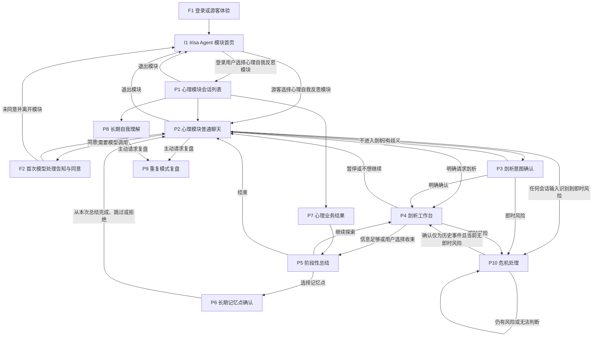

# Irisa Agent 与心理自我反思模块页面功能与联通关系

本文根据 [[psychological-reflection-workflow-prd|心理自我反思流程 PRD]]、[[agent-foundation-prd|Agent 基座 PRD]] 和 [[business-workflow-runtime-prd|业务流程运行时 PRD]] 整理页面需求，供产品、设计与研发对齐。

Irisa Agent 是承载多个领域模块的产品系统，不是心理自我反思模块的别名。产品首页负责展示可用模块；用户选择模块后，才进入该模块独立的 UI 和业务流程。本文定义 Irisa Agent MVP 的共享首页与前置页，并定义心理自我反思模块的页面。页面中的「跳转」也包含同一会话内的状态切换；是否进入心理剖析、保存记忆或恢复剖析，均须由用户明确操作触发。

## UI 体系建议（MVP）

### 体系定位

推荐采用内部称为 **Calm Shadcn** 的组合体系：

- **组件基础：Shadcn。** 使用可组合、低装饰的基础组件，承载对话、确认、表单、列表、抽屉和状态反馈。
- **用户侧视觉语气：Cafe。** 采用低饱和、温和、护眼的色彩和适度留白，但不使用过度可爱或松散的装饰。
- **布局原则：Simple / Sleek / Clean。** 保持清晰网格、稳定层级和克制的圆角，优先保证长文本、证据和操作路径的可读性。
- **后台密度：Ant / IBM 风格的数据管理模式。** A1 至 A4 可以采用更紧凑的表格、筛选、版本和执行轨迹布局，但与心理自我反思模块用户侧共享同一套颜色语义、字体和状态命名。

该体系不是监控大盘的视觉延伸。Sentry、Trading Terminal、Mission Control、Mono 和 Cosmic 等高密度、硬核或霓虹风格可借鉴局部的数据交互方式，但不作为用户侧主视觉；它们与心理反思所需的信任、长文本阅读和情绪安全不匹配。体系候选及其适用边界见 [[note/UI/UI-Design-sys|UI Design 系统]]。

### 设计原则

1. **产品与模块边界清晰。** I1 不承载领域会话、记忆或分析结果；心理自我反思模块的业务操作只在 P1 至 P10 中发生。
2. **用户掌握主动权。** P2 不主动显示心理结论；进入 P3、P4 或 P9 必须由用户确认或主动发起。
3. **一次只推进一个问题。** P4 以单一主问题和回答区域为核心，选项必须允许「都不是」「不确定」和开放回答。
4. **区分证据层级。** P5、P7 和 P9 明确区分事实、观察、可能解释、无法判断、支持材料和反例，避免使用诊断式标签或画像卡片。
5. **操作可逆且可追溯。** P6 和 P8 展示来源、依据、适用范围、确认状态和版本；保存、拒绝、停用、修改和删除不得混为一个操作。
6. **授权范围可见。** P4 和 P9 在开始前明确本次会使用的会话材料、时间范围和激活记忆点，不以页面跳转扩大上下文范围。
7. **危机流程单独处理。** P10 进入后停止剖析、总结、记忆确认和复盘；红色只用于即时风险和破坏性操作，不作为品牌主色，也不使用警报动画。
8. **隐私优先。** F2 的模型处理告知应清晰可见；用户侧不展示内部 Prompt、Skill、模型调用轨迹或后台运行元数据。

### 页面形态建议

| 页面范围 | 推荐形态 | 重点 |
| --- | --- | --- |
| I1 | 模块目录 | 以模块卡片或列表展示产品能力；只展示模块简介、可用状态和进入入口，不展示领域数据。 |
| P1、P7、P8 | 列表与详情 | 支持筛选、状态、版本和来源；避免做成指标仪表盘。 |
| P2、P3、P4 | 会话工作台 | 以对话流为主，使用内联确认和渐进披露，减少强制弹窗。 |
| P5、P6 | 证据与确认工作台 | 总结按证据层级分组；记忆点逐条确认，来源和不确定性始终可见。 |
| P9 | 复盘证据视图 | 使用时间线、支持材料、反例和情境差异，明确展示「目前无法判断」。 |
| P10 | 安全接管页 | 只保留现实支持引导、当前风险确认和必要的离开／返回路径。 |
| F1、F2 | 轻量前置流程 | 登录、游客体验和模型处理同意应说明后果，并支持返回原操作。 |
| A1 至 A4 | 管理后台 | 采用表格、筛选、版本和轨迹详情；只展示运行元数据和配置内容。 |

### 视觉基线

- 使用暖灰或低饱和中性背景、深炭色正文和单一低饱和强调色；琥珀表示待确认，红色仅表示危机或破坏性操作。
- 使用清晰的无衬线字体和较宽正文行高；等宽字体仅用于版本号、制品标识和技术元数据。
- 不使用大面积渐变、毛玻璃、霓虹、粗黑边框、装饰性仪表盘或临床诊断式视觉。
- 用户侧优先保证长文本和连续对话的舒适阅读，后台侧再通过紧凑间距提升信息密度。

## 1. Irisa Agent 产品首页

| 编号 | 页面 | 主要功能点 | 入口 | 可前往的页面或状态 |
| --- | --- | --- | --- | --- |
| I1 | Irisa Agent 模块首页 | 展示当前用户可进入的、已发布的领域模块，以及每个模块的名称、用途、可用状态和进入入口。第一版仅展示「心理自我反思」模块；不展示未发布模块或「即将推出」占位卡片。I1 不展示任一模块的会话、记忆、分析结果或统一聊天输入。 | F1 完成登录或选择游客体验后；从模块退出后返回。 | 用户选择「心理自我反思」后，登录用户进入 P1，游客进入 P2；在首次需要模型调用前进入 F2。 |

## 2. 心理自我反思模块页面

以下页面属于心理自我反思领域模块。模块内的会话、心理业务结果和长期记忆点均受心理领域流程范围约束，不与其他领域模块共用。

| 编号 | 页面 | 主要功能点 | 入口 | 可前往的页面或状态 |
| --- | --- | --- | --- | --- |
| P1 | 模块会话列表 | 创建、继续、查询和删除属于当前用户、且归属心理自我反思模块的会话；展示会话及其心理业务结果的入口。删除会话前提示其会逻辑删除原始对话、临时分析和关联的待确认记忆点，并逐条询问是否同时删除关联的激活记忆点。 | 登录用户从 I1 选择心理自我反思模块后进入；从模块内其他页面返回。 | 新建或继续会话进入 P2；查看某次分析结果进入 P7；退出模块返回 I1。 |
| P2 | 普通聊天 | 用户自由表达；倾听、复述和事实澄清；回应用户已明确表达的情绪；支持继续、补充和暂停。用户可主动发起心理剖析或重复模式复盘。不得主动剖析、宣布心理模式或引导用户进入剖析。 | 从 P1 新建或继续会话；游客从 I1 选择模块后进入；完成、暂停或跳过其他流程后返回。 | 明确请求剖析时进入 P4；剖析意图存在歧义时进入 P3；主动请求复盘时进入 P9；发现即时风险时进入 P10；退出模块返回 I1。 |
| P3 | 剖析意图确认 | 明确说明用户的表达可能涉及心理剖析，并询问是否希望进入该模式。提供确认进入和继续普通聊天两种选择。 | P2 中出现有歧义的剖析意图。 | 用户确认后进入 P4；拒绝或取消后返回 P2；发现即时风险时进入 P10。 |
| P4 | 剖析工作台 | 先确认本次主题和范围；围绕事件、情绪、想法、需要、反应和代价逐层提问；每次只推进一个问题；支持选项与开放回答、「都不是」、不确定、暂停及结束。输出须区分事实、观察、可能解释和无法判断部分。 | P2 的明确剖析请求或 P3 的确认结果；P10 的历史风险安全门通过后，用户重新发起剖析。 | 信息足够或用户选择收束时进入 P5；用户暂停或不想继续时返回 P2；用户继续探索时留在 P4；发现即时风险时进入 P10。 |
| P5 | 阶段性总结 | 展示可修正的本次总结：主题、用户明确表达的事实、情绪和行为、较可信的观察、待验证解释、无法支持的结论及可继续探索的问题。支持继续探索、修正、结束；从合格内容中逐条生成待确认记忆点，但总结本身不直接写入长期记忆。 | P4 信息足够或用户结束时；从 P7 打开历史总结。 | 继续探索返回 P4；修正后保留当前版本；选择某个待确认记忆点进入 P6；结束返回 P2。 |
| P6 | 长期记忆点确认 | 按记忆点展示内容、来源、依据与不确定性；支持保存、修改后保存、稍后决定、不保存／内容不正确。已激活记忆点还支持修改、不再适用／撤回、重新确认适用、删除和按主题忘记。仅激活状态的记忆点可参与后续心理剖析和复盘。 | P5 中选择待确认记忆点；P7 的历史总结中主动重新确认；P8 中管理已有记忆点。 | 从本次总结进入时，完成、跳过或拒绝后返回 P2；从 P7 或 P8 进入时，完成操作后返回来源页。 |
| P7 | 心理业务结果列表与详情 | 查看临时分析和阶段性总结；当前结论只展示当前修订版本；支持修改、保留和删除。删除结果时逻辑删除关联的待确认记忆点，并逐条处理关联的激活记忆点；已删除内容不可再展示或参与模型上下文、剖析与复盘。 | P1；P5 完成后。 | 查看阶段性总结进入 P5 的只读／修订状态；选择待确认观察进入 P6；删除完成后返回 P7 或 P1。 |
| P8 | 长期自我理解 | 查看当前用户在心理自我反思模块中的长期记忆点及其状态、当前版本、适用时间或情境和来源可用性；管理激活、待确认、已拒绝和已停用记忆点。不得展示已删除记忆点或其他领域的记忆点。 | 从 P1 或 P2 的用户主动操作进入。 | 选择记忆点进入 P6；用户主动请求复盘进入 P9；返回 P1 或 P2。 |
| P9 | 重复模式复盘 | 先由用户选择时间范围和本次会话中可加入的材料；仅读取心理自我反思模块内的激活记忆点和明确指定材料。展示模式、支持材料、反例、情境差异、变化和不确定性；每条支持材料展示内容、时间、类型、确认状态和来源可用性。证据不足、冲突或超出范围时，说明「目前无法判断」、原因和现有材料可支持的范围。 | P2 或 P8 中用户主动发起。 | 修改范围后在 P9 重新生成结果；返回 P2 或 P8。用户明确请求进一步剖析时，按 P2 的剖析入口规则进入 P3 或 P4。 |
| P10 | 危机处理 | 立即停止剖析、深层追问、阶段性总结和记忆点生成；明确引导用户联系当地紧急服务、就近医疗机构或可信任的现实联系人。用户主动回顾危机历史时，先确认当前是否仍存在即时风险。 | P2、P3、P4 及其他模块内会话输入中识别到自伤、他伤、急性失控或其他即时高风险内容。 | 当前仍有风险或无法判断时留在 P10；确认仅为历史事件且当前不存在即时风险后，允许用户重新发起 P4。 |

## 3. 共享基础能力前置页

以下页面由 [[agent-foundation-prd|Agent 基座]]提供，本流程在其完成前不应创建长期数据：

| 编号 | 页面 | 主要功能点 | 页面关系 |
| --- | --- | --- | --- |
| F1 | 登录／游客体验 | 登录后为用户创建、继续和管理持久化会话、分析结果和长期记忆；游客只可进行不产生长期数据的临时体验。 | 首次访问 Irisa Agent 时进入；需要持久化数据时也可从模块内返回 F1。完成后进入 I1 或返回原操作。 |
| F2 | 首次模型处理告知与同意 | 在首次使用模型前，告知发送给模型供应商的数据类型、处理目的和供应商，并取得用户同意。 | 用户已进入模块、首次需要模型调用时进入。同意后返回 P2 继续当前会话；未同意时不得发起需要模型调用的流程，并可返回 I1。 |

## 4. 心理自我反思模块后台页面

后台页面面向有权限的业务人员，不向普通用户开放。后台只展示运行元数据和配置内容，不展示用户对话、模型回复、长期记忆、心理业务结果或用户资料正文。

| 编号 | 页面 | 主要功能点 | 入口与跳转 |
| --- | --- | --- | --- |
| A1 | Prompt 与 Skill 制品管理 | 按心理领域命名空间维护 PromptDefinition 与 SkillDefinition 的内容、description、受控变量、上下文类别、输出结构、版本和发布状态；发布、停用、查询制品。Skill 停用后不进入新实例绑定，已绑定的运行中实例仍可继续使用。 | 心理自我反思模块后台首页进入 A1；编辑制品版本进入 A2；发布或停用后返回 A1。 |
| A2 | Prompt／Skill 版本详情 | 编辑草稿制品，查看其领域归属、版本、适用约束及发布校验结果。制品内容不得包含用户对话、记忆或业务结果正文。 | 从 A1 进入；保存、发布或停用后返回 A1。 |
| A3 | 流程执行与业务质量观测 | 查询流程实例的状态、节点、事件、耗时、定义与制品版本、模型调用标识、Skill 提供／请求／加载情况、拒绝或失败原因、领域输出校验结果；关注应触发未触发、输出校验失败和用户否定等业务质量问题。 | 心理自我反思模块后台首页进入 A3；选择某条执行记录进入 A4。 |
| A4 | 执行轨迹详情 | 查看单个流程实例的执行轨迹和关联的模型调用元数据，用于问题排查与恢复判断。不得借此查看任何用户正文。 | 从 A3 进入；返回 A3。 |

## 5. 关键跳转规则

- I1 只负责发现和进入模块，不得聚合、展示或检索跨模块的用户会话、长期记忆或领域业务结果。第一版只显示已发布的心理自我反思模块。
- P10 的危机处理优先级高于普通聊天、剖析、总结、记忆确认和复盘；进入后不得跳转至 P5、P6 或 P9。
- P4 仅使用当前会话中用户明确指定的内容。P9 仅使用心理自我反思模块中处于激活状态的记忆点和用户在当前会话中明确指定的材料，不能通过页面跳转扩大读取其他历史会话、历史总结或其他领域模块的数据范围。
- 用户暂停或退出 P4 时直接返回 P2，不触发 P5 或 P6。只有完成 P5 后，或用户从历史总结中主动选择观察时，才可进入 P6。
- A1 至 A4 与 I1 和模块用户侧页面不直接联通；后台对配置、执行轨迹和成本审计的操作不能绕过用户数据隔离或读取正文。

## 6. 不应新增的页面

第一版不设置跨模块统一聊天、跨模块会话列表、跨模块长期记忆、跨领域流程组合或跨领域 Skill 自动共享等页面或交互。心理自我反思模块内不设置心理疾病诊断、第三方心理分析、创伤治疗、个性化心理练习、训练计划、专业人士协作、外部数据源连接或自动生成心理画像等页面。WorkflowDefinition 由领域流程扩展包编写并发布，第一版不设置其后台配置或图形化编辑页面；第一版也不设置普通用户的流程、Prompt 或 Skill 配置页面，以及后台图形化 Skill 编辑器。
