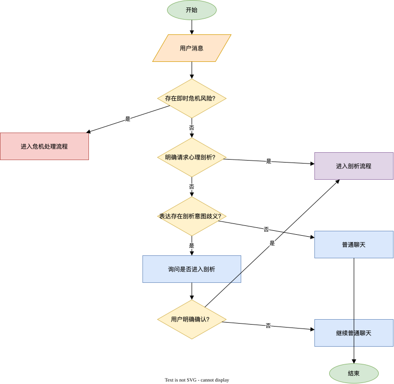
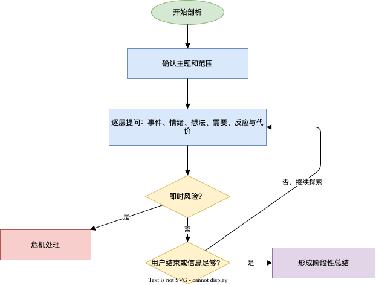
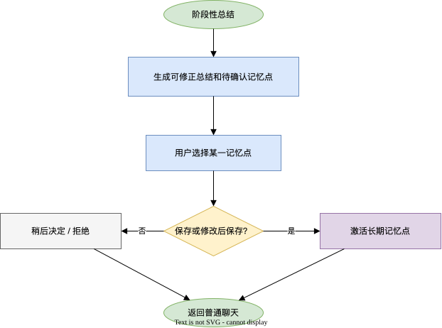
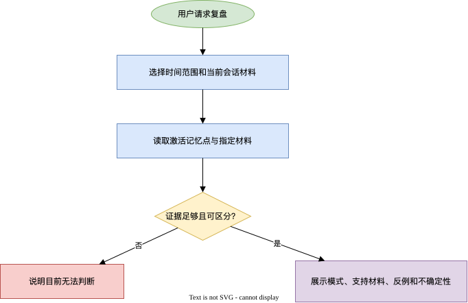
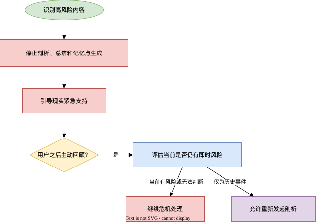
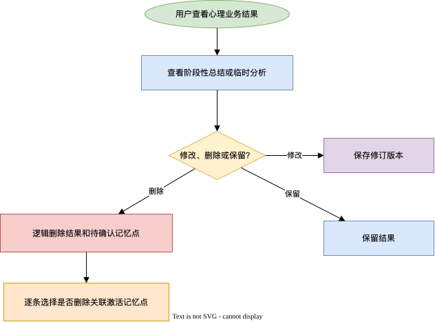

# 心理自我反思流程 PRD

## 1. 流程定位

心理自我反思流程是运行在 [[business-workflow-runtime-prd|业务流程运行时]]中的领域流程扩展包。它定义心理自我反思的 WorkflowDefinition、领域规则和业务结果适配器；后台业务人员在运行时维护心理领域的 PromptDefinition 和 SkillDefinition，运行时负责统一保存、版本化、发布、加载和观测。

本流程通过长期对话，帮助用户理解自己的情绪、想法、行为反应和重复出现的心理模式，逐步形成一份由用户确认、可以随时修正的自我理解。

本流程不依赖 Obsidian。第一版处理服务内对话，以及用户在当前会话中主动提供的内容作为上下文；Obsidian、GitHub Repository 等长期外部数据源的接入属于未来演进事项，见 [[future-evolution-todo]]。

### 1.1 三层职责边界

Agent 基座提供：

- User 级别的数据归属和隔离。
- 会话和上下文管理。
- 模型调用及模型版本管理。
- 长期记忆的保存、查询、修改和删除。
- 通用的长期记忆点、用户授权、状态、版本、访问控制和删除能力。
- 模型调用成本审计。
- 基座自身能力的运行状态和异常监控，不承担统一业务监控或业务指标上报。

业务流程运行时提供：

- WorkflowDefinition、SkillDefinition 和 PromptDefinition 的保存、版本、发布、停用和隔离。
- 面向后台业务人员维护 PromptDefinition、SkillDefinition 及其 description 的能力。
- 流程状态机执行、Skill description 自动选择、按需加载和多轮模型调用编排。
- 流程实例和 Skill 执行轨迹的记录。
- 通过 Agent 基座完成模型调用。

本领域流程扩展包提供：

- 心理自我反思的业务目标。
- 普通聊天、心理剖析、阶段性总结和危机处理的流程状态与转换条件。
- 心理领域对 Prompt、Skill 的业务使用规则、适用约束和审核要求。
- 心理观察的领域含义和确认规则。
- 心理模式的形成条件和复盘方式。
- 心理领域的输出边界、合规判断和风险处理规则。
- 心理分析结果、阶段性总结和其他领域业务结果的适配与生命周期。
- 领域输出校验、领域业务质量判断和业务指标。

本流程扩展包不得绕过业务流程运行时直接调用 Agent 基座、读取其他领域数据或写入未授权的长期记忆。模型结果必须先经过本流程的领域规则判断，再决定是否向用户展示或写入业务数据。

记忆确认分为两个层次：基座负责通用的授权与记忆生命周期；本流程负责判断哪些心理内容可以创建为长期记忆点、记忆点的领域分类和表达、确认时机，以及确认后的业务含义。心理规则、Prompt 与 Skill 通过运行时的领域扩展契约接入，不嵌入 Agent 基座。

### 1.2 MVP 流程定义

第一版发布 `psychological-reflection.v1`。运行时以用户事件创建或恢复流程实例，并按以下稳定状态执行：

```text
普通聊天
  -> 用户明确请求剖析：进入剖析
  -> 表达存在歧义：澄清是否进入剖析

剖析中
  -> 用户结束或信息足够：阶段性总结
  -> 检测到即时风险：危机处理

阶段性总结
  -> 用户继续确认：长期记忆点确认
  -> 用户结束：普通聊天

长期记忆点确认
  -> 完成或跳过：普通聊天

危机处理
  -> 当前仍有风险或无法判断：继续现实求助引导
  -> 确认仅为历史事件且不存在即时风险：允许用户重新发起剖析
```

本流程至少发布以下 SkillDefinition：普通聊天回应、剖析引导、阶段性总结、长期记忆点确认、重复模式复盘和危机响应。运行时根据上述状态确定可提供的 Skill 范围，模型再根据 description 发起加载请求；危机处理时不允许加载剖析、总结、记忆点确认或复盘 Skill。

### 1.3 业务流程图与能力点

#### 1.3.1 会话路由与剖析进入



| 能力点 | 说明 |
| --- | --- |
| 入口意图识别 | 区分普通表达、明确剖析请求和存在歧义的剖析意图。 |
| 明确确认 | 对存在歧义的请求询问用户是否进入剖析，不因模型推测而切换状态。 |
| 普通聊天 | 提供倾听、复述和事实澄清，不主动剖析。 |
| 风险优先路由 | 在任何入口优先识别即时风险，并中断普通或剖析流程。 |
| 流程状态切换 | 由运行时记录普通聊天、澄清和剖析中的状态及对应事件。 |

#### 1.3.2 逐层心理剖析



| 能力点 | 说明 |
| --- | --- |
| 主题与范围确认 | 在剖析开始时限定本次主题，防止自动扩大分析对象。 |
| 逐层探索 | 一次只推进一个问题，围绕事件、情绪、想法、需要、反应和代价展开。 |
| 动态提问 | 基于用户回答选择下一步，不执行机械问卷。 |
| 不确定性管理 | 区分事实、观察、可能解释和无法判断部分。 |
| 中断与收束 | 支持用户随时暂停；信息充分或用户结束时转入阶段性总结。 |

#### 1.3.3 阶段性总结与长期记忆点确认



| 能力点 | 说明 |
| --- | --- |
| 阶段性总结 | 生成可修正的本次结果，不将整篇总结直接作为长期记忆。 |
| 记忆点提取 | 从总结中逐条整理待确认长期记忆点，并保留来源引用。 |
| 用户确认 | 支持保存、修改后保存、稍后决定和拒绝。 |
| 基座状态操作 | 对已保存记忆点调用基座的激活、版本与删除能力。 |
| 独立结束 | 用户可以不保存任何记忆点而结束本次剖析。 |

#### 1.3.4 重复模式复盘



| 能力点 | 说明 |
| --- | --- |
| 范围选择 | 由用户选择复盘时间范围，并明确本次会话中可加入的材料。 |
| 材料读取 | 只使用激活记忆点和当前会话明确指定的内容，不扫描其他历史会话。 |
| 证据评估 | 同时检查支持材料、反例、情境差异和信息粒度。 |
| 保守输出 | 证据不足时说明无法判断、原因和可支持范围。 |
| 可追溯展示 | 展示模式的支持材料、时间、类型、确认状态和来源可用性。 |

#### 1.3.5 危机处理与历史回顾



| 能力点 | 说明 |
| --- | --- |
| 高风险拦截 | 停止剖析、深层追问、阶段性总结和记忆点生成。 |
| 现实支持引导 | 引导用户联系当地紧急服务、医疗机构或可信任的现实联系人。 |
| 历史回顾安全门 | 用户主动回顾危机历史时，先确认当前是否仍存在即时风险。 |
| 保守降级 | 当前仍有风险或无法判断时，继续危机处理而不恢复剖析。 |
| 恢复条件 | 仅在确认属于历史事件且当前不存在即时风险时，允许用户重新发起剖析。 |

#### 1.3.6 心理业务结果生命周期



| 能力点 | 说明 |
| --- | --- |
| 结果查看 | 支持查看临时分析和阶段性总结等心理领域业务结果。 |
| 结果修订 | 用户修改结果时保存修订版本，不把历史版本展示为当前结论。 |
| 逻辑删除 | 删除对话或总结时，删除关联的临时内容和待确认记忆点。 |
| 关联记忆处置 | 删除来源时，逐条询问是否同时删除关联的激活记忆点。 |
| 删除后隔离 | 已删除内容不得展示、进入模型上下文、参与剖析或复盘。 |

## 2. 流程目标

### 2.1 核心目标

本流程第一版的核心目标是：

> 帮助用户在主动发起的心理剖析中，更清楚地理解自己当下的心理体验，以及长期反复出现的情绪和行为模式。

模块价值不在于替用户下结论，而在于：

- 把用户已经感受到但尚未说清楚的体验具体化。
- 帮助用户区分事实、情绪、想法、需求和行为。
- 通过逐层提问，探索不同的可能解释。
- 让用户确认、否定或修正 Agent 的观察。
- 基于用户确认过的内容，逐步形成可修正的长期自我理解。
- 在单次剖析中形成有具体情境、反应链条、短期作用和长期代价的工作性理解，而不止复述用户表达。

### 2.2 目标用户与明确边界

第一版目标用户是希望理解自身情绪和行为模式的成年人。第一版不面向未成年人，也不面向正在寻求紧急危机干预、疾病诊断或替代治疗的用户。

## 3. 流程原则

### 3.1 用户掌握剖析主动权

普通聊天默认不进入心理剖析。只有用户明确提出分析请求，或主动选择心理剖析模式后，Agent 才可以进行心理分析。

仅表达困惑或情绪，不等于用户已经请求分析。对于“我为什么会这样”这类可能有歧义的表达，Agent 先确认用户是否要进入心理剖析，不直接开始分析。

### 3.2 不臆测，不诱导

Agent 不主动暗示用户存在某种创伤、人格特征、心理疾病或关系模式，也不根据有限信息预测或影响用户未来的重大决定。

### 3.3 观察不是结论

心理模式必须以待验证的观察呈现，并说明依据和不确定性。用户可以随时否定、修改或撤回某项观察。

### 3.4 只分析用户本人

Agent 可以分析用户对事件的感受、想法和行为，但不判断伴侣、家人、同事等第三方的心理状态、人格特征或真实动机。

### 3.5 先理解，再解释

Agent 必须先确认用户明确表达的事实和体验，再提出可能的解释，不能从一个情绪词直接跳到深层心理结论。

### 3.6 记忆由用户控制

未经用户确认，不把心理观察保存为长期记忆。用户可以查看、修改、删除或要求忘记已保存的内容。

## 4. 使用模式

第一版包含两个模式：普通聊天模式和心理剖析模式。

### 4.1 普通聊天模式

普通聊天是默认入口，作用是提供低压力的表达空间，为用户后续主动剖析准备自然的上下文。

支持：

- 用户自由表达。
- 倾听和复述。
- 澄清事实。
- 回应用户已经明确表达的情绪。
- 让用户继续讲述、补充或暂停。
- 在用户主动提出分析请求后，将当前对话作为剖析材料。

不支持：

- 主动进行心理剖析。
- 主动识别或宣布心理模式。
- 主动暗示潜在创伤、人格特征或心理疾病。
- 主动建议用户进入剖析模式。
- 主动预测、推动或替用户做未来的重要决定。

示例：

用户说：

> 最近工作特别累，回家什么都不想做。

普通聊天可以回答：

> 你说最近工作特别累。最近具体发生了什么？

普通聊天不应直接回答：

> 你是不是因为害怕失败，所以一直不敢停下来？

### 4.2 心理剖析模式

心理剖析模式必须由用户主动触发，例如：

- “帮我分析一下。”
- “我想做心理剖析。”
- “帮我看看是不是有重复模式。”
- “帮我复盘最近的状态。”

进入后，Agent 仍然需要先确认分析主题和范围，不应自动扩大分析对象。

“我为什么会这样？”等可能表达分析意图、但含义仍有歧义的内容，不直接触发心理剖析。Agent 必须先询问用户是否希望进入心理剖析模式，得到明确确认后再切换。

#### 进入条件

- 明确的分析请求可以进入剖析模式。
- 有歧义的表达必须先确认，不得直接进入。
- 进入后先确认本次要分析的主题和范围。

#### 退出与暂停

- 默认只使用用户当前明确指定的内容，不自动扫描全部历史对话。
- 用户可以随时说“先停在这里”或“不想继续分析”，立即结束或暂停本次剖析。
- 结束一次剖析后回到普通聊天，不自动开始下一次分析。
- 退出、暂停或中断本身不触发长期记忆确认；阶段性总结完成后可以询问用户是否保存待确认的长期记忆点，用户也可以之后从历史总结中主动发起保存。

## 5. 心理剖析功能

### 5.1 当前情绪分析

帮助用户把笼统的情绪词具体化。

例如用户说最近经常“低落”，Agent 可以询问它更接近：

- 沉重、什么都懒得做的疲惫。
- 觉得生活缺少意义的空虚或迷茫。
- 因为事情没有做好而产生的失望。
- 其他，由用户自行描述。

选项只能作为探索入口，不代表诊断结论，也不能限制用户的真实答案。

### 5.2 具体事件分析

围绕用户指定的一件事，逐步梳理：

1. 发生了什么。
2. 用户当时有什么情绪。
3. 用户脑中出现了什么想法。
4. 用户最在意或最想保护的是什么。
5. 用户采取了什么反应。
6. 这种反应带来了什么结果。
7. 用户是否见过类似的反应模式。

### 5.3 逐层提问

剖析会话一次只推进一个问题，可以结合选择题和开放回答。

#### 提问要求

- 提供多个可能方向，而不是预设唯一答案。
- 允许用户选择“都不是”或自行描述。
- 在用户不确定时允许停留在不确定。
- 在进入更深层内容前保持用户知情和主动。
- 根据用户回答动态调整，不机械执行固定问卷。

#### 选项限制

选项本身不能包含未经证实的心理结论。例如可以询问“这种低落更接近疲惫、空虚还是失望”，但不应询问“你是不是害怕被抛弃”。

### 5.4 心理机制探索

在用户明确请求分析后，可以探索：

- 情绪背后的具体体验。
- 反复出现的自动化想法。
- 用户试图满足或保护的需要。
- 用户常用的应对方式。
- 某种应对方式的短期收益和长期代价。
- 当前体验与过去处于激活状态的模式的相似之处。

探索结果可以经业务规则检查整理为待验证的心理观察；经用户明确确认后，可以保存为用户认可的长期自我理解。此流程不是临床评估，不允许把观察升级为心理疾病、人格类型、童年创伤或确定性人格结论。

业务规则检查至少确认以下内容：

- 依据来自用户本人明确提供的内容。
- 事实、观察和可能解释彼此区分。
- 存在不确定性和其他合理解释时已明确说明。
- 长期模式具有多次支持记录并经用户确认。
- 内容未越过本流程的禁止边界。

### 5.5 待验证的心理观察

分析结论必须采用分层表达：

- **用户明确表达的事实**：用户已经直接说过的内容。
- **当前对话中的观察**：根据本次内容整理出的关系。
- **待验证的可能解释**：仍需要用户确认的假设。
- **无法判断的部分**：现有信息不足以支持的结论。

单次剖析的目标是形成情境化的工作性理解：说明触发情境、情绪和自动想法、行为反应，以及该反应的短期作用和长期代价。用户确认的是“这符合自己当前的理解”，不是对某种心理机制作出客观证明。

示例：

> 你描述的是“知道应该做，但很难启动”。目前可以确认的是任务启动困难；至于它主要来自疲惫、压力、任务阻力还是自我要求过高，还需要继续了解。

### 5.6 剖析总结

一次剖析结束时，生成阶段性总结，而不是给用户贴标签。

总结包括：

- 本次分析主题。
- 用户明确表达的事实。
- 用户描述的情绪和行为。
- 当前较可信的观察。
- 仍待验证的可能解释。
- 现有材料无法支持的结论。
- 用户可以选择继续探索的问题。

用户可以结束、继续、修正或放弃本次总结。

阶段性总结完成后，可以将其中符合条件的内容整理为长期记忆点，供用户逐条保存、修改后保存或稍后决定。保存确认不阻止用户结束本次剖析；用户也可以在之后打开历史总结，主动选择其中的具体观察重新进行确认。阶段性总结本身不直接写入长期记忆。

## 6. 长期自我理解

本流程通过业务流程运行时使用原始会话记录和长期记忆能力。临时分析、阶段性总结和其他心理分析结果属于本流程的领域业务数据，由业务结果适配器负责保存、访问、修改和删除；基座负责提供 User 级隔离所需的可信上下文和通用能力。本流程同时定义这些内容在心理自我反思领域中的含义、确认规则和使用范围。

### 6.1 内容层级

为了避免“对话持久化”和“心理记忆”混为一谈，第一版区分以下内容：

- **对话记录**：用户和 Agent 的原始对话，用于用户查看或继续当前话题；不因为被保存就自动成为心理模式。
- **临时分析**：一次剖析过程中的中间观察和未确认假设，只服务于当前剖析，不参与长期模式复盘。
- **阶段性总结**：一次剖析结束后形成的总结，属于本次对话的结果，不自动进入用户画像；用户之后可以从中选择具体观察，发起长期记忆确认。
- **长期记忆点**：基座管理的通用记忆对象，可以引用对话或阶段性总结作为来源。只有处于“激活”状态的记忆点，才可以作为长期记忆参与后续的自我理解。

#### 删除关系

删除对话时，原始对话、临时分析及其他对话内中间内容一并逻辑删除；关联的待确认长期记忆点也一并逻辑删除。删除阶段性总结时，关联的待确认长期记忆点也一并逻辑删除。

处于激活状态的长期记忆点独立管理，默认不随对话或总结删除。删除来源时应明确提示用户，并允许其逐条选择是否同时逻辑删除关联记忆点。

已删除记忆点不得再向用户展示、加入模型上下文、参与心理剖析或用于后续复盘；已拒绝和已停用记忆点不得加入模型上下文、参与心理剖析或用于后续复盘。

#### User 级隔离

每个 User 名下的对话、分析结果和长期记忆点必须与其他 User 的对应数据隔离，不得被其他 User 访问。同一 User 内的数据只能按业务状态和用户授权关联使用。普通聊天记录可以被持久化以支持继续对话，但持久化不代表用户同意将其用于心理剖析或长期模式复盘。

### 6.2 记忆内容

第一版只允许将以下内容创建为长期记忆点，并在用户确认后激活：

- 重要个人事实。
- 用户确认过的长期目标。
- 用户确认过的反复情绪或行为模式。
- 用户对自身体验的稳定描述。

#### 个人事实

重要个人事实是用户明确表达并确认、对后续自我理解有持续参考价值的个人背景。它应当具有一定稳定性，或带有明确的有效时间。

可以包括用户确认的长期生活安排、持续责任、长期项目、作息或其他会影响情绪和行为理解的背景。一次性事件默认留在对话中；用户认为后续仍有价值时，可以作为带时间范围的背景保存。

Agent 的临时推测不能自动成为长期画像；推测信息只有经用户核实后，才可以保存为用户认可的版本。

默认不保存或不提取以下内容作为长期记忆：

- 与理解用户体验无关的第三方个人信息或秘密。
- 身份凭证、支付信息和其他与自我理解无关的敏感信息。
- 未经用户确认的健康状况或心理诊断性表述。

#### 第三方背景

与用户体验直接相关的第三方背景可以最小化收录，但必须经用户确认，且不得建立第三方画像。

记录应表述为用户的体验或判断，例如“用户认为伴侣在冲突中经常回避沟通”，而不是把单方描述写成第三方的客观事实。第三方的心理判断包括对其情绪原因、真实动机、人格特征、心理模式或健康状态的解释和定性，例如“伴侣是回避型人格”或“同事是在嫉妒用户”；这类内容不得作为长期记忆保存。

### 6.3 长期记忆点确认

阶段性总结完成后，Agent 可以询问是否保存其中形成的观察：

> 这次分析中形成了一条关于你的观察：……你希望保存、修改后保存、稍后决定，还是不保存？

用户可以：

- 保存。
- 修改后保存。
- 稍后决定。
- 不保存或认为内容不正确。
- 表示已保存的内容不再适用。
- 删除已有内容。
- 要求忘记某个主题。

确认按记忆点逐条进行。一次分析产生多条观察时，用户可以逐条保存、修改或拒绝；处于待确认状态的记忆点不参与后续重复模式复盘。用户稍后决定后，仍可从保留的阶段性总结中主动选择具体观察重新确认；不得把整篇总结直接追加为长期记忆。

长期记忆点采用基座定义的通用状态：

- **待确认**：已从心理业务材料中整理出记忆点，但不能参与后续自我理解和复盘。
- **激活**：用户确认后，可以参与后续自我理解和复盘。
- **已拒绝、已停用、已删除**：不得参与后续自我理解和复盘。

状态流转、版本和删除语义遵循 [[agent-foundation-prd]]。修改激活记忆点时，以用户修改后的版本为当前版本；历史版本不再作为新的心理结论展示。

### 6.4 重复模式复盘

用户可以主动请求：

- “帮我看看最近反复出现的问题。”
- “复盘我最近的情绪和反应。”
- “我是不是总在类似的事情上卡住？”

#### 输入范围

复盘只使用处于激活状态的长期记忆点，以及用户在当前会话中明确指定的内容。它不直接读取其他历史会话或历史阶段性总结。复盘必须使用用户选择的时间范围，并展示每条模式对应的可查看支持材料。

#### 支持材料

支持材料可以是处于激活状态的长期记忆点、当前会话中用户明确指定的内容，或当前剖析中处于激活状态的具体事件观察。每条支持材料应展示内容、时间、类型、确认状态和来源可用性。原始对话删除后，处于激活状态的长期记忆点仍可参与复盘，但应标记“原始来源已删除”，不得展示或声称可以追溯原文。

#### 输出与不确定性

复盘应展示：

- 反复出现的情绪。
- 常见触发场景。
- 常见行为反应。
- 支持某个模式的具体材料。
- 可能的反例。
- 与过去相比的变化。
- 仍然无法确定的部分。

复盘不自动生成训练计划、心理练习或决策方案。

如果出现以下情况，复盘必须明确表示“目前无法判断”，不能为了生成结论而补足心理解释：

- 证据不足或现有材料粒度不足。
- 存在多种无法区分的解释。
- 处于激活状态的记忆点存在无法由时间或情境差异解释的实质冲突。
- 问题超出本流程的判断范围。

表示“目前无法判断”时，必须说明判断对象、具体原因、现有材料能够支持的范围，以及用户愿意时可以进一步了解的内容。不同事件中出现不同反应本身不是冲突，而是用于识别模式的适用情境和反例；原始来源被删除也不影响处于激活状态的记忆点的可用性，只有记忆点本身过于概括、无法支持本次判断时才应说明信息粒度不足。

## 7. 使用边界

### 7.1 支持范围

- 用户自己的情绪、想法和行为。
- 用户对工作、关系、家庭和生活事件的主观体验。
- 普通的压力、困惑、失落、冲突和自我怀疑。
- 用户主动要求的心理机制和重复模式探索。
- 用户主动要求的阶段性自我复盘。

### 7.2 明确不做

- 心理疾病诊断。
- 人格障碍或依恋类型定性。
- 判断用户的“真实人格”。
- 分析第三方的心理状态、人格或动机。
- 根据对话替用户决定是否分手、辞职或采取其他重大行动。
- 药物、医疗和治疗建议。
- 创伤治疗。
- 个性化心理练习。
- 用户与专业人士的协作流程。

### 7.3 模式无关的安全边界

安全规则同时适用于普通聊天和心理剖析模式，并且优先级高于普通对话目标。

#### 高风险处理

出现自伤、他伤、急性失控或其他需要立即现实支持的内容时：

- 停止继续心理剖析和深层原因追问。
- 明确告知用户当前内容需要现实中的紧急支持。
- 引导用户联系当地紧急服务、就近医疗机构或可信任的现实联系人；第一版不提供无法实时核验的具体热线、电话号码或机构信息。
- 鼓励用户联系可信任的现实中的人，不把 Agent 描述成可以独自处理危机的对象。
- 高风险处理过程中不生成阶段性心理总结或长期记忆点。原始内容按会话规则管理。
- 用户之后主动回顾相关历史内容时，必须先确认当前是否仍存在即时风险。当前仍有风险或无法判断时，继续现实求助引导，不进入心理剖析；确认属于历史事件且当前不存在即时风险后，才可以重新剖析，形成的观察仍需经过正常确认后才能进入长期记忆。

第一版的发布前提是：上述高风险场景经过专业人员审核，并有明确的测试案例覆盖。无法判断风险时，优先采用保守的现实求助引导，而不是继续心理剖析。

## 8. 专业性要求

专业性不是通过“说话像心理医生”实现的。本流程第一版必须满足：

- 模块定位不声称诊断或治疗能力。
- 心理剖析方法和示例由心理专业人员审核。
- 关键场景覆盖过度解读、错误标签、诱导决策和高风险内容。
- 分析结果提供依据和不确定性。
- 用户可以否定、修正和删除分析结果。
- 模型不能因为用户表达强烈情绪，就自动确认某种心理解释。
- 单次事件不能直接形成长期心理模式；长期模式必须有多次、可查看且经用户确认的支持记录。
- 用户撤回、删除或否定观察后，该观察不能继续影响后续复盘。

专业人员审核属于产品质量保障，不是第一版面向用户的协作功能。

## 9. 第一版范围

### 9.1 必须支持

第一版必须支持：

- 普通聊天模式。
- 用户主动进入心理剖析模式。
- 当前情绪分析。
- 具体事件分析。
- 用户在当前会话中主动提供内容作为上下文。
- 逐层提问和选项澄清。
- 待验证的心理观察。
- 剖析总结。
- 用户确认式长期记忆。
- 用户主动发起的重复模式复盘。
- 记忆和分析结果的查看、修改、删除。
- 高风险内容的安全边界。

第一版的最小业务闭环是：用户主动选择一个主题，完成一次逐层心理剖析，得到可修正的阶段性总结，并由用户决定是否将其中某些观察保存为长期自我理解。长期复盘只基于处于激活状态的长期记忆点或用户在本次复盘中明确选择的材料。

### 9.2 暂不支持

第一版暂不支持：

- 长期外部数据源连接、同步或自动检索。
- Obsidian、GitHub Repository 等数据源接入。
- 个性化心理练习。
- 专业人士协作。
- 自动安排训练计划。
- 自动分析用户未指定的主题。
- 主动推送心理解释或重大决策建议。

第一版不自动扫描全部对话来生成心理画像；用户未确认的观察不参与长期模式复盘。

### 9.3 数据安全与模型处理告知

- 对话、心理分析结果和长期记忆在传输和存储过程中必须加密。
- 内部人员不得查看用户的对话、心理分析结果、长期记忆或用户主动提供的资料。
- 日志、监控和成本审计不得记录对话正文、模型回复正文、心理记忆正文或用户资料内容。
- 模型调用需要将完成本次请求所需的内容，以模型可处理的形式发送给模型供应商。首次使用前必须明确告知用户发送的数据类型、处理目的和供应商，并获得用户同意。
- Agent 基座和业务流程运行时只发送完成本次请求所必需的最少内容，不得把未获授权的历史会话、记忆或资料发送给模型供应商。

## 10. 成功标准

第一版达到以下结果，才算业务闭环成立：

- 用户可以自然聊天，而不会被未经请求地心理剖析。
- 用户可以明确主动开启一次心理剖析。
- 在用户愿意继续且信息充分时，一次完成的剖析可以形成包含触发情境、情绪与自动想法、行为反应、短期作用、长期代价和工作性解释的阶段性总结，而不只是复述用户表达。
- 信息不足时，Agent 可以说明缺少什么、现有材料能够支持到什么程度，不会为了完成总结而补足心理解释。
- Agent 的观察不会被伪装成确定性心理结论。
- 用户可以确认、否定或修正每个重要观察。
- 用户确认过的内容可以沉淀为长期自我理解。
- 用户可以主动回顾重复出现的模式。
- 用户不会被引导去分析第三方或做出未经充分思考的重大决定。
