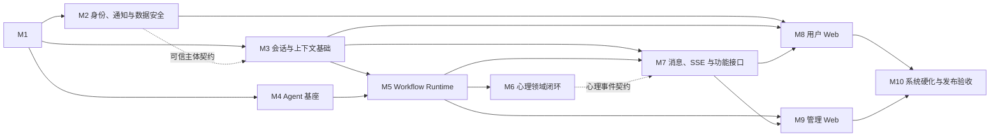

# 心理自我反思 Agent MVP 实施计划

## 1. 计划说明

本文把 [[technical-solution-mvp]] 拆解为可执行的里程碑和开发任务。一级结构描述实施方向、依赖与退出条件；二级任务控制在可独立开发和验收的范围，但不继续拆到提交或文件级。

计划覆盖：

- Spring Boot 模块化单体后端。
- `apps/web` 用户 Web 端，包括 I1、F1、F2 和 P1 至 P10。
- `apps/admin` 管理 Web 端，包括 A1 至 A4。
- MySQL、MongoDB、Redis、RocketMQ 普通 Topic、LiteTopic、SMTP、KMS 和模型供应商接入。
- LangChain4j Agent 基座、自建 Workflow Runtime、心理领域流程、消息与 SSE 链路。
- 安全、恢复、观测、测试和发布验收。

不包含：

- iOS、Android、小程序或桌面客户端。
- 多活 Worker、跨实例自动接管和 fencing token。
- 文件上传、附件解析、RAG 和外部资料库。
- 图形化 Workflow 编辑器。
- 未经领域校验的 token 流式展示。
- PRD 或技术方案中明确列为后续演进的能力。

## 2. 估算口径

### 2.1 工作量定义

每个任务使用“乐观／常规／悲观”三点估算，单位为单人日：

- **乐观**：技术验证顺利，供应商行为符合预期，没有需求返工。
- **常规**：包含实现、单元测试、集成测试、必要文档、代码评审和一次合理修正。
- **悲观**：包含供应商兼容问题、边界修正和非结构性返工，但不包含需求重做。

里程碑工作量是下属任务之和，表示总工程投入，不等于自然日。自然日排期必须在团队人数、技能分布和并行上限确定后另行计算。

### 2.2 估算前提

- 当前目录只有 PRD 和设计文档，按从零建立代码工程估算。
- 默认已有可用的模型、KMS、SMTP、RocketMQ、MySQL、MongoDB 和 Redis 环境账号；采购、备案与审批等待不计入人日。
- 默认产品文案、危机引导文本和心理领域验收样例能及时确认；等待时间不计入人日，但会阻塞关键路径。
- 默认测试环境允许验证 LiteTopic 的容量、TTL、回溯和动态订阅行为。
- 不把 AI 辅助开发效率预先折算为固定比例，以免形成无法验证的承诺。

## 3. 总体实施策略

采用“基础能力横向铺设、业务闭环纵向交付、最后系统硬化”的混合方式。计划不设置开发前技术验证阶段，直接从工程骨架开始；外部能力在对应开发任务中接入并通过契约测试收敛。

图中的实线表示后继里程碑退出时必须完成的完整前置里程碑，虚线表示特定契约或任务门槛。它不是最早开工时间表；允许提前启动的任务仍以任务表中的精确前置依赖为准。

可并行原则：

- M2、M3 的非认证部分和 M4 可在 M1 完成后并行，但 M3 的访问控制验收依赖 M2。
- M6 开始后，M7 可先完成消息基础设施和接口骨架，再等待领域事件契约收敛。
- M8 可在 API 契约冻结后使用 Mock Server 提前开发；真实联调仍依赖 M7。
- M9 的制品页面依赖 M5，观测页面依赖 M4、M5 和 M7 的元数据接口。
- M10 是统一发布门禁，不因某个局部功能提前完成而跳过。

## 4. 里程碑总览

| 里程碑 | 目标 | 乐观 | 常规 | 悲观 | 主要前置依赖 |
| --- | --- | ---: | ---: | ---: | --- |
| M1 | 建立可持续开发的工程与数据基线 | 12 | 20 | 31 | 无 |
| M2 | 完成身份、通知、授权与数据保护 | 21 | 34 | 52 | M1 |
| M3 | 完成 Session、Turn、记忆和上下文基础 | 17 | 28 | 44 | M1、M2 的主体契约 |
| M4 | 完成可替换的 LangChain4j Agent 基座 | 19 | 31 | 49 | M1 |
| M5 | 完成制品、DSL、Execution、Worker 与 ReAct | 31 | 48 | 75 | M3、M4 |
| M6 | 完成心理领域业务闭环 | 32 | 50 | 81 | M5 |
| M7 | 完成消息外化、SSE 和对外 API | 30 | 50 | 79 | M3、M5、M6 的事件契约 |
| M8 | 完成用户 Web 端 I1、F1、F2、P1 至 P10 | 31 | 46 | 75 | M2、M3、M7 |
| M9 | 完成管理 Web 端 A1 至 A4 | 10 | 16 | 26 | M5、M7 |
| M10 | 完成系统硬化和发布验收 | 21 | 34 | 54 | M8、M9 |
| **未加风险预留合计** |  | **224** | **357** | **566** |  |

建议用常规值 `357` 人日作为资源规划基线，另保留 `15%` 的项目级风险预留，即约 `54` 人日；风险预留不预先分摊到任务，也不应被当作必然消耗。若开发中发现 LiteTopic、模型供应商或 KMS 不满足技术方案，必须更新方案并重新估算受影响任务。

## 5. M1：工程骨架与数据基线

### 5.1 目标与边界

建立后端、两个 Web 应用、自动化测试和基础设施适配的最小工程骨架，固化模块依赖和数据库基线。本阶段不实现具体心理业务流程。

### 5.2 开发任务

| ID | 开发任务 | 交付物与验收标准 | 前置依赖 | 乐观／常规／悲观 |
| --- | --- | --- | --- | ---: |
| M1-T1 | 创建工程与工作区 | Spring Boot 后端、`apps/web`、`apps/admin` 和共享前端包可独立构建；本地命令和环境变量有说明 | 无 | 2／3／5 |
| M1-T2 | 固化模块边界 | 建立 `common`、`platform.*`、`runtime.*`、`domain.psychology`、`agent.foundation`、`interface.*` 和 `infrastructure.*`；`ApplicationModules.verify()` 能阻止非法依赖 | M1-T1 | 1／2／3 |
| M1-T3 | 建立 CI 与本地依赖环境 | 后端、前端、静态检查和测试进入 CI；MySQL、MongoDB、Redis 和 RocketMQ 测试依赖可重复启动 | M1-T1 | 2／3／5 |
| M1-T4 | 实现 `common` 基础能力 | 提供 ID、Clock、统一错误、加密、观测和限流的公共能力；不包含领域事件或业务模型 | M1-T2 | 2／3／4 |
| M1-T5 | 建立 Flyway 数据基线 | [[technical-solution-mvp]] 中的核心 DDL 可迁移和回滚到已定义基线；字段统一使用 `*_time`，不引入通用 `version` 或幂等字段 | M1-T3 | 3／5／8 |
| M1-T6 | 建立持久化适配和测试基座 | MyBatis、事务、Repository 集成测试、Testcontainers 或等价隔离环境可用；业务模块不直接依赖 Mapper | M1-T2、M1-T3 | 2／4／6 |

### 5.3 退出条件

- 空业务工程可以在 CI 中完成构建、模块校验和基础设施集成测试。
- 数据库迁移能从空库稳定执行。
- Runtime 源码除自身模块外，只能直接依赖 `common`；其他实现通过 Runtime 内部端口接入。

## 6. M2：身份、通知与数据安全

### 6.1 目标与边界

提供可信主体、本地账号、游客体验、邮箱流程、模型处理同意和正文加密，形成所有业务数据隔离的前置条件。

### 6.2 开发任务

| ID | 开发任务 | 交付物与验收标准 | 前置依赖 | 乐观／常规／悲观 |
| --- | --- | --- | --- | ---: |
| M2-T1 | 建立身份领域与存储 | `IdentitySubject`、`LocalAccount`、验证令牌和刷新令牌可独立持久化；邮箱使用 HMAC 盲索引和密文 | M1 | 2／3／5 |
| M2-T2 | 实现注册与邮箱验证 | 支持注册、唯一性校验、一次性令牌、验证激活、邮件失败重试和防轰炸限流 | M2-T1 | 3／5／7 |
| M2-T3 | 实现登录、刷新和密码重置 | BCrypt strength 12、短期 JWT、刷新令牌轮换与撤销、密码重置后撤销旧令牌全部可验证 | M2-T1、M2-T2 | 4／6／9 |
| M2-T4 | 实现游客主体与滑动过期 | 游客最后活跃后保留 24 小时；过期数据逻辑删除且不能被查询或进入上下文 | M2-T1 | 2／3／5 |
| M2-T5 | 实现 per-User 信封加密 | 正文使用 DEK 加密，KMS 主密钥不落库；解密失败、密钥轮换和删除行为有测试 | M1-T4、M2-T1 | 3／5／8 |
| M2-T6 | 实现 Runtime 主体转换与模型同意 | `interface.*` 将认证主体转换为 `RuntimeSubject`；首次模型调用前强制同意，Runtime 不依赖平台身份实体 | M2-T3、M2-T4 | 3／5／7 |
| M2-T7 | 完成身份与隔离安全测试 | 覆盖越权、账号枚举、令牌重放、暴力破解、重置流程、游客过期和密文泄漏 | M2-T2 至 M2-T6 | 2／4／6 |
| M2-T8 | 实现管理权限与初始授权 | 定义并持久化管理权限；通过受控的一次性引导建立初始管理员，支持授权撤销和令牌权限失效；MVP 不新增角色管理页面 | M2-T3 | 2／3／5 |

### 6.3 退出条件

- 账号与游客都能产生可信 `RuntimeSubject`。
- 管理权限有可审计的来源、初始化和撤销路径，普通账号无法调用管理接口。
- 任何业务数据访问都能使用不透明 `userId` 和领域范围约束。
- 日志、错误响应和观测记录不泄漏密码、令牌、邮箱或正文。

## 7. M3：会话与上下文基础

### 7.1 目标与边界

完成 Session、Turn、长期记忆和授权上下文读取。Session、Turn、WorkflowExecution 分别持久化，不建立级联聚合。

### 7.2 开发任务

| ID | 开发任务 | 交付物与验收标准 | 前置依赖 | 乐观／常规／悲观 |
| --- | --- | --- | --- | ---: |
| M3-T1 | 实现 Session 生命周期 | 支持创建、列表、详情、活跃时间更新和逻辑删除；所有查询按 User、领域和删除状态隔离 | M1、M2-T6 | 2／3／5 |
| M3-T2 | 实现 Turn 受理前置机制 | 实现 Redis 所有权锁、Session 行锁、最新 Turn 和活动 Execution 查询，以及 `SESSION_BUSY` 判定；定义供 M5 原子受理使用的会话侧契约，不在本任务创建 Execution | M3-T1 | 3／5／8 |
| M3-T3 | 实现长期记忆生命周期 | 支持待确认、激活、拒绝、停用、删除、重新确认和内容版本；只有 ACTIVE 且获授权的记忆可被读取 | M2-T5 | 4／6／9 |
| M3-T4 | 实现授权上下文组装 | 只读取当前 Turn、明确指定历史 Turn、授权记忆、允许的 WorkflowContext 字段和固定制品版本；超限裁剪可观测 | M3-T1、M3-T3 | 3／5／8 |
| M3-T5 | 实现通用删除与来源失效机制 | 删除 Session 或 Turn 时处理原始对话、待确认记忆和激活记忆选择；提供领域结果删除可调用的来源失效能力，删除内容不再展示或进入上下文 | M3-T1、M3-T3 | 3／5／8 |
| M3-T6 | 完成会话与上下文集成测试 | 覆盖 Turn 独立更新、受理互斥判定、User 隔离、逻辑删除、上下文授权和最新 Turn 恢复查询 | M3-T1 至 M3-T5 | 2／4／6 |

### 7.3 退出条件

- 更新 Turn 时不加载 Session 及其全部历史 Turn，也不通过 Session 级联保存。
- 并发受理机制能够串行进入创建临界区，完整的 Turn／Execution 原子创建在 M5 验收。
- 上下文读取范围可从测试用例中明确证明，不依赖模型自行约束。

## 8. M4：Agent 基座

### 8.1 目标与边界

实现只负责模型交互的 Agent 基座。Runtime 组装 `ModelRequest`，基座不管理 Session、Turn、长期记忆、Workflow 或业务数据。

### 8.2 开发任务

| ID | 开发任务 | 交付物与验收标准 | 前置依赖 | 乐观／常规／悲观 |
| --- | --- | --- | --- | ---: |
| M4-T1 | 定义自有模型 DTO 和错误契约 | `ModelRequest`、`ModelRoundResult`、消息、工具、输出 Schema、限制和统一错误不泄漏 LangChain4j 类型 | M1-T2 | 2／3／4 |
| M4-T2 | 实现 LangChain4j 供应商适配 | 直接接入目标供应商；同步和流式 API 均可调用，供应商响应、usage、finish reason 和异常被统一映射 | M4-T1、供应商开发账号 | 3／5／8 |
| M4-T3 | 实现模型路由快照与降级 | 单次调用固定路由快照；启停、权重、限额和降级顺序可配置并有失败测试 | M4-T2 | 3／5／8 |
| M4-T4 | 实现 Tool Calling 与结构化输出 | 工具定义、调用 ID、参数 JSON、Schema 校验和结果回传行为跨供应商一致 | M4-T2 | 3／5／8 |
| M4-T5 | 实现调用控制 | 支持超时、取消、重试、并发限制和 token／费用预算；取消不会被无界重试覆盖 | M4-T2、M1-T4 | 3／5／8 |
| M4-T6 | 接入模型调用观测 | 记录模型、路由、usage、耗时、费用和失败码；不记录正文、Prompt 展开内容或工具参数正文 | M4-T2、M1-T4 | 2／3／5 |
| M4-T7 | 建立供应商契约测试 | 在开发过程中固化实际供应商行为，覆盖正常、限流、超时、取消和畸形输出 | M4-T2 至 M4-T6 | 3／5／8 |

### 8.3 退出条件

- 只有 `agent.foundation` 直接依赖 `dev.langchain4j.*` 和供应商 SDK。
- 基座契约测试可以在替换模型供应商或升级 LangChain4j 时发现行为变化。
- Runtime 无需了解模型供应商、LangChain4j 或底层错误类型。

## 9. M5：Workflow Runtime

### 9.1 目标与边界

完成不可变制品、DSL 状态机、WorkflowExecution、Worker、恢复、ReAct 和领域扩展契约。Runtime 只提供执行机制，不解释心理领域语义。

### 9.2 开发任务

| ID | 开发任务 | 交付物与验收标准 | 前置依赖 | 乐观／常规／悲观 |
| --- | --- | --- | --- | ---: |
| M5-T1 | 实现 Workflow、Prompt、Skill 制品 | 支持草稿、发布、停用、版本和不可变绑定；停用不影响已绑定 Execution | M1-T5 | 4／6／9 |
| M5-T2 | 实现 DSL 解析和发布校验 | 校验节点注册、连线、入口出口、类型、命名空间、Prompt／Skill 绑定和 Context 读写声明 | M5-T1 | 4／6／10 |
| M5-T3 | 实现 Execution 与 Turn 原子受理 | 使用 M3 会话侧契约，在同一事务创建 Turn、固定制品版本和 PENDING Execution；Execution 条件状态更新有效，`workflowContext` 受 Schema 约束 | M3-T2、M5-T1 | 3／5／8 |
| M5-T4 | 实现 BoundedExecutor 与恢复调度 | 有界线程池、队列、拒绝、取消和 PENDING 补偿调度可用；不承载 Session、Turn 或 Execution 业务语义 | M5-T3 | 4／6／9 |
| M5-T5 | 实现 WorkflowExecutor | 按 `executionId` 推进，通过 `turnId` 定位当前 Turn，创建临时 `SessionExecutionContext`，节点外执行、节点后短事务保存 | M3、M5-T2 至 M5-T4 | 4／7／11 |
| M5-T6 | 实现节点内 ReAct | 支持 ModelRound、允许工具、Skill 按需加载、轮次、token、工具次数、超时、取消和失败边界 | M4、M5-T2、M5-T5 | 5／8／13 |
| M5-T7 | 实现 `runtime.spi` 与领域注册 | 节点、RiskGate、输出校验和结果适配器使用窄接口与不可变 DTO；领域模块不能访问 Repository 实现和模型 SDK | M5-T2、M5-T5 | 3／4／6 |
| M5-T8 | 完成 Runtime 集成与恢复测试 | 覆盖制品不可变性、状态机、节点重试、PENDING 恢复、进程重启、拒绝策略、取消和 ReAct 预算 | M5-T1 至 M5-T7 | 4／6／9 |

### 9.3 退出条件

- 一个不含心理语义的测试 Workflow 能从 Turn 提交执行到终态，并在进程重启后恢复。
- 同一 Session 并发提交时只有一个请求原子创建 Turn 与 Execution，另一个返回 `SESSION_BUSY`。
- `SessionExecutionContext` 不落库、不包含完整历史 Turn，重启时从节点入口重新组装。
- `domain.psychology` 只能通过 `runtime.spi` 接入 Runtime。

## 10. M6：心理领域闭环

### 10.1 目标与边界

在 Runtime 机制上实现心理自我反思领域。所有模型结果先经过领域校验，再决定是否展示、持久化或创建记忆候选。

### 10.2 开发任务

| ID | 开发任务 | 交付物与验收标准 | 前置依赖 | 乐观／常规／悲观 |
| --- | --- | --- | --- | ---: |
| M6-T1 | 实现 RiskGate 与 P10 危机处理 | 任何会话输入先经过风险闸门；命中或无法排除风险时停止剖析、总结、记忆和复盘，仅输出已审核安全响应 | M5-T7 | 3／5／8 |
| M6-T2 | 实现普通聊天与剖析意图确认 | 普通聊天只倾听、复述和澄清；明确请求进入剖析，歧义请求先确认，不由模型推测切换 | M6-T1 | 3／5／8 |
| M6-T3 | 实现逐层剖析 | 支持主题和范围、事件、情绪、想法、需要、反应与代价；一次只推进一个问题，支持不确定、暂停和结束 | M6-T2 | 4／6／10 |
| M6-T4 | 实现阶段性总结与结果版本 | 输出事实、观察、可能解释、无法判断和继续问题；支持修订、保留、逻辑删除和当前版本查询 | M6-T3 | 4／6／9 |
| M6-T5 | 实现记忆候选与确认语义 | 从合格总结逐条创建待确认记忆，保留来源和不确定性；未经用户确认不得激活，游客不得创建长期记忆候选 | M3-T3、M6-T4 | 3／5／8 |
| M6-T6 | 实现重复模式复盘 | 只使用当前领域 ACTIVE 记忆和用户明确指定材料；输出支持材料、反例、情境差异、变化和不确定性 | M3-T4、M6-T5 | 4／6／10 |
| M6-T7 | 实现结果、证据与删除联动 | 证据引用可追溯来源可用性；完整实现结果删除，并调用 M3 来源失效机制处理展示、上下文和关联记忆 | M3-T5、M6-T4 | 3／5／8 |
| M6-T8 | 制作并发布 MVP 制品 | 交付 Workflow、Prompt、Skill 初始版本和校验样例；危机状态不能加载剖析、总结、记忆或复盘 Skill | M5-T1、M6-T1 至 M6-T7 | 4／6／10 |
| M6-T9 | 完成领域规则与回归测试 | 使用审核样例覆盖普通聊天、歧义确认、剖析、总结、记忆、复盘、删除、游客不生成长期记忆和危机抢占 | M6-T1 至 M6-T8 | 4／6／10 |

### 10.3 退出条件

- P2 至 P10 的后端业务状态和转换均有自动化验收样例。
- 危机处理在所有会话入口前置，新增 Workflow 分支不能绕过 RiskGate。
- 心理输出不使用诊断式确定结论，证据不足时能明确返回“目前无法判断”。

## 11. M7：消息、SSE 与功能接口

### 11.1 目标与边界

把各业务模块产生的事件可靠外化，并提供 Web 所需的 REST API、快照查询和 SSE 通知。消息不是业务真相源，浏览器不管理 RocketMQ 位点。

### 11.2 开发任务

| ID | 开发任务 | 交付物与验收标准 | 前置依赖 | 乐观／常规／悲观 |
| --- | --- | --- | --- | ---: |
| M7-T1 | 实现 Outbox 存储与发布契约 | 提供业务状态和待发布记录同事务提交所需的基础设施能力；事件类型保留在产生事实的模块，不建立 `common.event` | M1-T5、M3、M5 | 3／5／8 |
| M7-T2 | 实现有序 Outbox 发布器 | 按 Session 分配单调序号，前序失败时不越过；失败可重试，业务事务不依赖 RocketMQ 可用性 | M7-T1 | 3／5／8 |
| M7-T3 | 实现消息路由 | 直接接入 LiteTopic：对话输出事件路由到 LiteTopic，跨模块冷事件路由到普通 Topic；Worker 不感知 Topic、消费组和 SSE | M7-T2、RocketMQ 开发环境 | 2／4／6 |
| M7-T4 | 实现网关消费日志 | 按 `consumerGroup + eventId` 去重，记录消息位点和交付结果；Runtime、Turn 和浏览器均不保存消费游标 | M7-T3 | 2／4／6 |
| M7-T5 | 实现 SSE 网关 | 支持 Session 授权、本地连接扇出、心跳和断线重连；通知丢失时由 Turn／领域结果快照收敛 | M7-T4 | 3／5／8 |
| M7-T6 | 接入各模块领域事件 | 把 conversation、execution 和 psychology 事件接入 Outbox；逐项验证业务状态与待发布记录同事务提交 | M3、M5、M6 的事件契约、M7-T1 | 2／3／5 |
| M7-T7 | 实现身份与会话接口 | 完成注册、验证、登录、刷新、重置、游客、同意、Session、Turn、取消和统一错误契约 | M2、M3、M5-T3 | 3／5／7 |
| M7-T8 | 实现记忆与心理结果接口 | 完成记忆查询和状态命令、结果查询、修订、删除和复盘命令；越权资源统一返回 404 | M3、M6 | 3／5／8 |
| M7-T9 | 实现制品与观测接口 | 完成 Prompt／Skill 管理、Workflow 执行元数据只读查询，以及模型、成本元数据查询；不提供 Workflow 后台创建、编辑、发布或停用接口，后台接口不能读取正文 | M2-T8、M4、M5 | 3／5／8 |
| M7-T10 | 实现当前用户资源消耗接口 | 当前用户只能查询本人的 Token 使用量；不能读取其他 User 的用量、后台成本或模型调用正文 | M4-T6、M2-T6 | 1／2／3 |
| M7-T11 | 完成消息集成测试 | 覆盖重复消息、乱序阻断、发布失败重试、网关退出窗口、断线重连、各模块事件接入和快照收敛 | M7-T1 至 M7-T6 | 3／4／7 |
| M7-T12 | 完成 API 契约测试 | OpenAPI 或等价契约冻结；覆盖状态码、错误码、鉴权、分页、删除、用户用量和 SSE 事件格式 | M7-T5、M7-T7 至 M7-T10 | 2／3／5 |

### 11.3 退出条件

- RocketMQ 暂时不可用时，业务结果仍已落库，并能在恢复后继续外化。
- SSE 采用 at-least-once 通知语义，前端始终能通过业务快照得到最终状态。
- REST 和 SSE 契约已冻结，可供两个 Web 应用稳定联调。

## 12. M8：用户 Web

### 12.1 目标与边界

交付响应式用户 Web 应用，不包含原生 App。页面遵循 [[psychological-reflection-page-map]] 的 I1、F1、F2 和 P1 至 P10，不展示内部 Prompt、Skill、调用轨迹或后台元数据。

### 12.2 开发任务

| ID | 开发任务 | 交付物与验收标准 | 前置依赖 | 乐观／常规／悲观 |
| --- | --- | --- | --- | ---: |
| M8-T1 | 建立用户 Web 基础 | 路由、API Client、状态管理、错误处理、响应式布局、UI Token 和无障碍基线可用 | M1-T1 | 2／4／6 |
| M8-T2 | 实现 F1、F2 | 完成登录、注册、邮箱验证、密码重置、游客入口和模型处理同意；同意后能返回原操作 | M2、M7-T7 | 3／5／8 |
| M8-T3 | 实现 I1、P1 | 模块首页只展示已发布模块；会话列表支持创建、继续、查询、删除和结果入口；在现有账户区域展示本人 Token 使用量，不新增页面 | M7-T7、M7-T10、M8-T1 | 4／7／10 |
| M8-T4 | 实现 P2、P3 | 对话工作台支持普通聊天、状态呈现、剖析意图确认、暂停和退出；不主动展示心理结论 | M7、M8-T3 | 4／5／8 |
| M8-T5 | 实现 P4、P5 | 剖析工作台一次只推进一个问题，展示授权材料范围；阶段性总结区分证据层级并支持修订 | M6、M7、M8-T4 | 4／5／9 |
| M8-T6 | 实现 P6、P7、P8 | 完成记忆逐条确认、结果列表与详情、长期自我理解、版本、来源和删除联动交互 | M7-T8、M8-T1 | 4／5／9 |
| M8-T7 | 实现 P9、P10 | 复盘允许选择范围和材料；危机页停止其他流程，仅保留现实支持、风险确认和安全离开路径 | M6-T1、M6-T6、M7 | 4／5／9 |
| M8-T8 | 实现 SSE 与快照收敛 | 建连、心跳、断线重连、重复事件归并、页面刷新和终态快照恢复可用；客户端不提交或存储 Broker offset | M7-T5 | 3／5／8 |
| M8-T9 | 完成用户端自动化验收 | 覆盖主流桌面和移动 Web 视口、键盘操作、错误状态、网络中断及 I1、F1、F2、P1 至 P10 主路径 | M8-T2 至 M8-T8 | 3／5／8 |

### 12.3 退出条件

- 用户端所有页面均能通过真实 API 完成主路径，不依赖 Mock Server。
- 页面跳转不会扩大上下文授权范围，P10 能抢占其他流程。
- 桌面和移动 Web 视口无文本溢出、控件遮挡或不可达操作。

## 13. M9：管理 Web

### 13.1 目标与边界

交付独立的管理 Web 应用，完成 A1 至 A4。管理端只管理制品和元数据，不提供查看用户正文的入口。

### 13.2 开发任务

| ID | 开发任务 | 交付物与验收标准 | 前置依赖 | 乐观／常规／悲观 |
| --- | --- | --- | --- | ---: |
| M9-T1 | 建立管理端基础与权限 | 独立路由、认证守卫、紧凑型表格／筛选组件和错误处理可用；普通用户不能进入管理页面 | M1-T1、M2-T8、M7-T9 | 2／3／5 |
| M9-T2 | 实现 A1、A2 制品管理 | 支持 Prompt／Skill 草稿、版本、发布、停用、校验结果和只读已发布版本；Workflow 仅显示关联版本，不提供配置入口 | M5-T1、M7-T9、M9-T1 | 3／5／8 |
| M9-T3 | 实现 A3、A4 观测页面 | 支持执行列表、状态、节点、耗时、制品版本、模型 usage、成本、失败与领域校验元数据详情 | M4-T6、M5-T8、M7-T9 | 3／5／8 |
| M9-T4 | 完成后台隔离与页面测试 | 自动验证 API 响应和页面中不存在用户输入、模型回复、记忆、结果正文、Prompt 展开内容和工具参数正文 | M9-T2、M9-T3 | 2／3／5 |

### 13.3 退出条件

- 管理员可以发布制品并定位执行失败，但无法借由管理端读取用户正文。
- 已发布制品不可原地修改，停用只影响新 Execution。
- A1 至 A4 的筛选、详情和权限行为有自动化测试。

## 14. M10：系统硬化与发布验收

### 14.1 目标与边界

将已完成功能提升到可发布状态，验证跨模块故障、隐私边界、性能容量和运维可诊断性。本阶段原则上不新增业务功能。

### 14.2 开发任务

| ID | 开发任务 | 交付物与验收标准 | 前置依赖 | 乐观／常规／悲观 |
| --- | --- | --- | --- | ---: |
| M10-T1 | 完成端到端验收套件 | 覆盖登录、同意、聊天、剖析、总结、记忆、复盘、危机、制品发布和观测查询主路径 | M8、M9 | 4／5／8 |
| M10-T2 | 完成并发与恢复验证 | 覆盖 Session 双提交、PENDING 补偿、RUNNING 重启恢复、节点副作用防重、消息重复和断线重连 | M5、M7 | 3／5／8 |
| M10-T3 | 完成安全与隐私验收 | 覆盖越权、账号枚举、令牌、限流、密钥、日志脱敏、后台正文隔离、删除后隔离和游客清理 | M2、M3、M8、M9 | 3／5／8 |
| M10-T4 | 完成性能与容量验证 | 基于目标部署规格定义工作负载、生产等价数据规模和通过阈值，再验证 Session 并发、Worker 队列、模型限额、数据库热点、消息通道和 SSE 连接 | M7、M8、目标部署规格 | 3／5／8 |
| M10-T5 | 完成观测与告警 | 建立执行失败、模型超时、队列拒绝、消息积压、重复消息、SSE 延迟、成本和清理失败的看板与告警 | M4、M5、M7 | 2／4／6 |
| M10-T6 | 完成配置、部署和恢复手册 | Secret、迁移、部署、回滚、单活约束、数据备份、恢复和供应商降级步骤可由非开发者照章执行 | M1 至 M9 | 3／5／8 |
| M10-T7 | 完成发布评审与缺陷收敛 | 所有阻断缺陷关闭；已知风险有负责人、触发条件和处置方案；检查清单签署完成 | M10-T1 至 M10-T6 | 3／5／8 |

### 14.3 退出条件

- [[technical-solution-mvp#14. 实施前检查清单]] 全部通过。
- 没有未处理的安全、数据隔离、危机流程或恢复阻断问题。
- 发布包、数据库迁移、配置、监控和回滚材料齐全。

## 15. 纵向交付检查点

里程碑按技术依赖组织，但研发过程中必须用纵向检查点验证真实闭环，避免各模块“分别完成、整体不可用”。

| 检查点 | 可演示范围 | 必须完成 |
| --- | --- | --- |
| V1 可信会话骨架 | 登录或游客进入模块，创建 Session，提交 Turn，查看 RUNNING 快照 | M2-T1 至 M2-T7、M3-T1 至 M3-T3、M5-T3、M7-T7 |
| V2 模型调用闭环 | Turn 触发测试 Workflow，调用模型并形成已校验完整回复 | M4-T1 至 M4-T7、M5-T1 至 M5-T8、M7-T5、M7-T7 |
| V3 心理主路径 | P2 → P3／P4 → P5 → P6 → P2，结果和记忆均可追溯 | M6-T1 至 M6-T5、M6-T7、M7-T8、M8-T4 至 M8-T6 |
| V4 复盘与安全 | P9 范围受控；任意会话输入可进入 P10 且停止其他流程 | M6-T1、M6-T6、M7-T8、M8-T7 |
| V5 可运营闭环 | 管理员发布制品、查看无正文执行轨迹；用户断线后由快照恢复 | M7、M8、M9 |
| V6 发布候选 | 安全、恢复、容量、告警和回滚全部通过 | M10 |

## 16. 需求与任务追踪

| 需求或方案范围 | 主要任务 | 最终验收 |
| --- | --- | --- |
| 本地账号、游客、管理授权和模型处理同意 | M2、M7-T7、M8-T2 | F1、F2、管理接口授权测试 |
| Session、Turn 独立持久化与串行提交 | M3-T1、M3-T2、M5-T3 | 并发、恢复和 Repository 测试 |
| 长期记忆和删除控制 | M3-T3、M3-T5、M6-T5、M6-T7、M8-T6 | P6、P8、游客边界和删除后隔离测试 |
| LangChain4j 与模型供应商 | M4 | 基座契约测试 |
| Workflow、Prompt、Skill 与 Execution | M5、M9-T2 | 制品不可变、版本绑定和恢复测试 |
| 普通聊天与剖析 | M6-T2、M6-T3、M8-T4、M8-T5 | P2、P3、P4 场景验收 |
| 总结、心理结果与证据 | M6-T4、M6-T7、M8-T5、M8-T6 | P5、P7 场景验收 |
| 重复模式复盘 | M6-T6、M8-T7 | P9 范围和证据测试 |
| 危机处理 | M6-T1、M8-T7、M10-T1 | P10 抢占全流程测试 |
| Outbox、LiteTopic、SSE 和快照收敛 | M7、M8-T8 | 故障恢复与断线重连测试 |
| 管理端无正文观测 | M4-T6、M7-T9、M9 | A1 至 A4 和数据泄漏测试 |
| 用户查看本人 Token 使用量 | M4-T6、M7-T10、M8-T3 | 当前 User 隔离与页面验收 |
| 安全、观测与发布 | M10 | 发布检查清单 |

## 17. 计划控制规则

### 17.1 开工规则

- 任务只有在前置依赖达到对应退出条件后才能进入完成状态。
- 外部供应商的实际行为与技术方案不一致时，在对应开发任务内更新适配方案和估算；只有发生架构级冲突时才暂停受影响任务。
- API 消费方可以基于已冻结契约和 Mock Server 并行开发，但里程碑退出必须通过真实链路。

### 17.2 完成定义

每个开发任务必须同时满足：

- 功能实现完成并通过代码评审。
- 单元测试和任务要求的集成测试通过。
- 数据隔离、错误处理和观测符合 [[technical-solution-mvp]]。
- 对外契约或操作方式发生变化时，同步更新文档。
- 不留下无负责人、无退出条件的阻断性 TODO。

### 17.3 变更控制

出现以下任一情况时，必须更新本计划的任务、依赖和工作量：

- 新增原生 App、文件能力、RAG、多领域或多活 Worker。
- 修改 Session、Turn、WorkflowExecution 的对象边界。
- 改为 token 级用户可见流式输出。
- LiteTopic、模型供应商或 KMS 验证结论变化。
- 用户端或管理端新增 [[psychological-reflection-page-map]] 之外的页面。

## 18. 发布门禁

- [ ] M1 至 M10 的退出条件全部满足。
- [ ] V1 至 V6 纵向检查点全部通过。
- [ ] 常规工作量与剩余风险预留已根据实际燃尽更新。
- [ ] 数据库迁移已在生产等价数据规模验证。
- [ ] 单活 Worker 和单进程 SSE 扇出的部署约束已写入运行手册。
- [ ] P10 内容和交互已由领域负责人审核。
- [ ] 后台、日志、指标和 MongoDB 无用户正文。
- [ ] Secret、备份、恢复、回滚和供应商降级演练完成。

## 19. 依据文档

- [[technical-solution-mvp]]：实施范围、模块边界、数据设计、接口契约和验收标准。
- [[technical-architecture-overview]]：系统架构背景和既有约束；冲突时以技术方案的最新决策为准。
- [[langchain4j-integration-research]]：LangChain4j API 选择、Tool Calling 和 ReAct 调研依据。
- [[agent-foundation-prd]]：身份、数据保护、模型接入和成本要求。
- [[business-workflow-runtime-prd]]：Workflow、制品、Execution、DSL、ReAct 和恢复要求。
- [[psychological-reflection-workflow-prd]]：心理业务流程、记忆、结果、复盘和危机边界。
- [[psychological-reflection-page-map]]：用户 Web 与管理 Web 页面范围和跳转规则。
