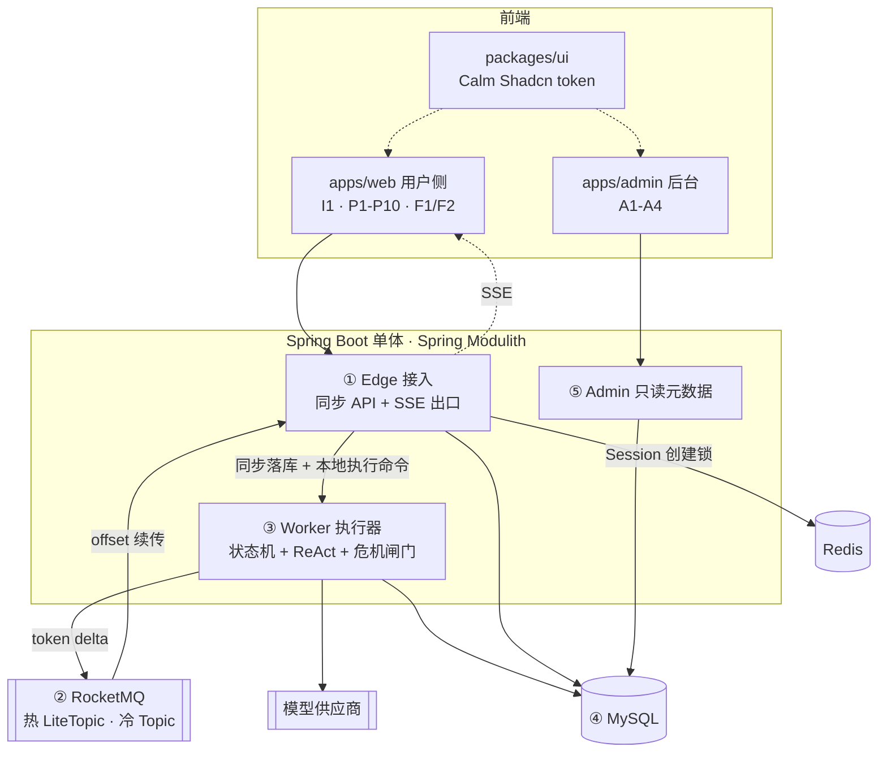

# 技术架构与技术栈总览

本文是技术设计的基线快照，覆盖整体架构、模块划分和技术栈选型。已确定的写为结论，未确定的集中在第 6 节待定清单。后续细化文档从本文派生。

对应的业务需求见 [[agent-foundation-prd]]、[[business-workflow-runtime-prd]] 和 [[psychological-reflection-workflow-prd]]；页面范围见 [[psychological-reflection-page-map]]。

## 1. 整体架构



### 1.1 两条数据流

| 方向 | 机制 | 理由 |
| --- | --- | --- |
| 入口 | 同步 HTTP：校验、创建 Turn 与 WorkflowExecution、返回 `turnId`，随后提交本地异步执行 | 鉴权失败、配额超限、并发冲突需要当场反馈；同步落库保证失败的对话在页面上可渲染 |
| 出口 | 流式节点启用后，token delta 经 LiteTopic 异步扇出，按 offset 续传 | 任意 Edge 实例可服务任意 session，无需 sticky session；断线重连可补齐缺失 token |

入口和 WorkflowExecution 调度均不走消息队列。MQ 在出口解决的扇出与 offset 回溯，入口都不需要；且入队后消费失败会导致用户消息没有任何数据库记录，前端无法渲染失败气泡。MVP 中，事务提交后通过 Worker 输入端口把 `executionId` 提交到同进程的有界执行器；RocketMQ 不消费 WorkflowExecution，也不负责启动流程。

### 1.2 五个运行组件

| 组件 | 职责 | 不负责 |
| --- | --- | --- |
| ① Edge 接入 | 鉴权、幂等键、限流、Session 创建锁、创建 Turn 与 Execution、SSE 出口与 offset 续传 | 业务语义 |
| ② 消息总线 | 流式节点使用热通道传递 token；冷通道传递跨模块业务事件 | 承载用户命令 |
| ③ Worker 执行器 | 危机前置闸门、状态机推进、ReAct 调模型、写状态 | 连接管理 |
| ④ 存储 | Execution、Context、制品、会话、记忆 | — |
| ⑤ Admin | 只读运行元数据与配置 | 接触任何正文 |

组件的存在理由是让连接生命周期与执行生命周期解耦：用户断线不影响剖析继续执行，重连可续流。

### 1.3 部署形态

MVP 逻辑分开、物理同进程。Edge、Worker、Admin 在同一个 Spring Boot 进程内。Edge 只依赖 Worker 对外暴露的命令端口，命令由本地有界执行器异步处理；跨模块业务通知通过事件通信。Edge 不直接调用 Worker 内部实现，WorkflowExecution 命令也不经过 RocketMQ。

三者伸缩特征不同（Edge 连接密集、Worker 受 LLM 延迟支配、Admin 几乎无量），但 SSE 连接由 Servlet 异步派发持有、不占用容器线程，MVP 量级同进程可承载。命令端口隔离了调用方与执行实现；后续拆进程时为该端口增加远程适配器，不改变领域契约。

风险：同进程下容易让 Edge 直接依赖 Worker 内部类，导致后续无法拆分。此约束须由 Modulith 依赖校验禁止；允许依赖的只有 Worker 命令端口及其 DTO。

## 2. Turn 与恢复语义

### 2.1 对象边界、创建流程与并发控制

「一轮对话」容易同时指用户交互和模型内部循环，本文不使用这个说法。统一采用以下四层术语：

| 层级 | 对象 | 开始与结束边界 | 与其他对象的关系 |
| --- | --- | --- | --- |
| 会话 | Session | 用户创建会话后开始，归档或删除时结束 | 包含多个 Turn；同一时刻只允许一个 Turn 执行 |
| 用户交互 | Turn | 一次外部用户提交被接受时开始，到该提交触发的助手输出成功、失败或取消时结束 | 属于一个 Session；只保存对话内容、展示状态和事件游标，不感知执行器 |
| 流程执行 | WorkflowExecution | 用户提交后，基于当时最新已发布的 WorkflowDefinition 创建，到本轮 DSL 到达结束节点、失败或取消时结束 | 属于一个 Session，通过 `turnId` 构建且只构建一个 Turn；不跨越下一次用户提交 |
| 模型调用 | ModelRound | Worker 向模型发起一次请求时开始，收到该次响应的 `finish` 或 `error` 时结束 | ReAct 可以在一个 Turn 内执行多个 ModelRound 和工具调用 |

本文固定采用 `Session 1:N Turn`、`Turn 1:1 WorkflowExecution`。用户每次提交都会创建新的 Turn 和新的 WorkflowExecution；DSL 只描述本次提交触发的单轮流程。若本轮输出是向用户追问，当前 Execution 在问题完整生成后即结束；用户回答时再根据最新会话材料创建下一组 Turn 与 Execution，而不是恢复上一组 Execution。

存储关系采用 `WorkflowExecution → Turn` 的单向引用：`workflow_execution.turn_id` 为非空外键并带唯一约束，Turn 不保存 `workflowExecutionId`。该方向表达「Execution 正在构建哪个 Turn」；Worker 在执行期间通过 `turnId` 持续写入助手正文、结构化结果、生命周期状态和事件游标。Turn 只是对话记录，不感知 DSL、Worker 或构建过程。反向查询某个 Turn 的 Execution 时，直接使用 `workflow_execution.turn_id` 的唯一索引。

WorkflowExecution 创建时绑定当时最新的已发布 WorkflowDefinition 完整版本标识。当前 Execution 内的节点重试始终复用已绑定版本，不重新查询 `latest`；用户下一次提交创建新的 Execution 时，才重新选择最新已发布版本。

WorkflowContext 只保存本轮节点间传递和故障恢复所需的运行数据，不是跨 Turn 的 `ConversationFlowState`，MVP 不定义通用状态 schema，也不允许 DSL 直接读取任意领域字段，例如 `state.phase`。条件流转由布尔类型节点封装领域判断：领域节点通过 `runtime.spi` 自行读取并解释领域数据，运行时只消费节点返回的 `true` 或 `false`，再沿对应连线继续执行。

成熟系统的名词并不完全统一，但普遍会区分外部交互与内部步骤：Codex App Server 使用 `thread → turn → item`，用户输入启动 Turn，模型消息和工具执行作为 Item 发生在 Turn 内；OpenAI Agents SDK 使用一次 `Runner.run()` 表示外部运行，内部因工具调用可以多次调用模型，其 `max_turns` 统计的是内部循环次数；LangGraph 则用 thread-scoped checkpoint 保存可跨调用、跨人工等待恢复的图状态。

本文的 Turn 最接近 Codex 的 `turn/start → turn/completed` 生命周期，但 MVP 不提供 Codex 的 `turn/steer` 语义；新用户提交一律创建新 Turn 和新 WorkflowExecution。ModelRound 是本项目为避免与 SDK 内部 `turn` 混淆而定义的术语。LangGraph 的 thread-scoped checkpoint 可跨调用恢复图状态，属于另一种生命周期选择，不作为本文 WorkflowExecution 跨 Turn 的依据。以上只是层级结构参考，不表示这些框架共享同一套名词。参考：[Codex App Server](https://developers.openai.com/codex/app-server/)、[OpenAI Agents SDK](https://openai.github.io/openai-agents-python/running_agents/)、[LangGraph Persistence](https://docs.langchain.com/oss/python/langgraph/persistence)。

| Turn 状态 | 进入条件 | 退出条件 |
| --- | --- | --- |
| `running` | Edge 校验通过，持久化用户输入并提交 Worker 命令 | Worker 成功、失败、危机闸门命中或用户取消 |
| `succeeded` | 该 Turn 的助手输出或结构化结果已完整持久化 | 终态 |
| `failed` | 模型、依赖或执行超时等被动中断；只保留失败前已经对外展示的部分输出 | 终态 |
| `guard_blocked` | 前置危机闸门命中，转入 P10 | 终态 |
| `cancelled` | 用户或系统主动停止当前 Turn | 终态 |

WorkflowExecution 使用独立的运行状态：`PENDING` 表示已持久化但尚未开始，`RUNNING` 表示 Worker 正在执行，`COMPLETED`、`FAILED`、`CANCELLED` 为终态。Session 并发检查只把 `PENDING` 和 `RUNNING` 视为活动状态。

一次提交按以下顺序创建并启动：

```text
按 Idempotency-Key 查询已受理请求
  → 键和载荷摘要均相同，返回原 turnId
  → 键相同但载荷摘要不同，拒绝本次提交
按 sessionId 查询是否存在 PENDING 或 RUNNING 的 WorkflowExecution
  → 若存在，拒绝本次提交
获取 workflow-execution:create:{sessionId} 分布式锁
  → 再次查询活动 WorkflowExecution，若存在则拒绝
  → 在同一数据库事务中：
      1. 再次校验并写入 Idempotency-Key
      2. 查询最新已发布的 WorkflowDefinition
      3. 创建 running Turn
      4. 创建 PENDING WorkflowExecution，写入 turnId 和定义版本
  → 提交事务并释放创建锁
  → 通过 Worker 命令端口提交 executionId
  → Worker 按 executionId 加载一次 WorkflowExecution
  → 在该对象上执行 start()：PENDING → RUNNING，并持久化
  → 将同一个内存对象交给引擎执行 DSL，并持续构建关联 Turn
  → WorkflowExecution 与 Turn 分别写入对应终态
```

幂等查询优先于活动 Execution 查询，保证同一次提交的 HTTP 重试返回原 Turn，而不是被当成新的并发请求拒绝。第一次活动查询用于快速失败，获取锁后的第二次查询用于消除并发请求在等待锁期间产生的竞态。分布式锁只保护同一 Session 创建 WorkflowExecution 的临界区，事务提交后立即释放，不覆盖模型调用和 DSL 执行。锁必须带所有权 token 并仅允许持有者释放；TTL 须覆盖创建事务，并由客户端在事务未结束时续期。Session 不增加 `activeExecutionId`，也不维护活动实例槽位；活动性直接按 `sessionId` 和 Execution 状态查询。

浏览器每次提交生成 `Idempotency-Key`。Edge 以 `(userId, sessionId, Idempotency-Key)` 唯一约束去重 HTTP 重试，并保存请求载荷摘要：同一个键且摘要相同返回原 `turnId`，摘要不同则拒绝。该约束处理同一次提交的重复请求；Session 创建锁与二次检查处理两个不同请求的并发创建；`workflow_execution.turn_id` 唯一约束保证 Turn 与 Execution 的 1:1 关系。三者职责不同。

Worker 命令只携带 `executionId`，不跨异步边界传递持久化实体。Worker 按 ID 加载一次 WorkflowExecution 后，在同一个聚合对象上完成 `PENDING → RUNNING`，持久化该状态，再继续使用这个对象执行流程；持久化后不重新查询所谓的“最新 Execution”。这次状态更新只是生命周期记录，不承担任务去重、Worker 认领或并发写入保护。启动状态在短事务中提交，后续模型调用和工具执行发生在事务外；节点进度、WorkflowContext 与 Turn 输出分别使用短事务持久化。

MVP 不支持运行中 WorkflowExecution 的跨 Worker 自动接管，也不通过 RocketMQ 重投 Execution 命令，因此不设置 `ownerId`、`leaseUntil`、`fencingToken`，不引入 Execution 认领锁或持续 CAS。任务提交被执行器明确拒绝时，将刚创建的 Execution 和 Turn 更新为失败态；若进程在事务提交后、提交任务前退出，启动恢复任务扫描遗留的 `PENDING` Execution；若 Worker 在执行中退出，则只在确认原进程已经终止后恢复遗留的 `RUNNING` Execution。未来若引入多 Worker 自动超时接管，届时再补充租约和 fencing token，不能只复用当前的 Session 创建锁。

### 2.2 恢复语义

「恢复」是两件独立的事，模块归属不同。

| | 连接恢复 | 流程恢复 |
| --- | --- | --- |
| 场景 | 刷新页面、切网、Edge 实例滚更 | 节点失败、执行超时、Worker 进程重启 |
| 恢复对象 | 少收的 token 流 | WorkflowExecution 状态机 |
| 依据 | MQ offset | 数据库中的当前节点 + WorkflowContext |
| 归属 | Edge | Worker |

流程恢复始终发生在当前 Turn 对应的 WorkflowExecution 内，不会等待下一次用户提交，也不会把下一次提交接到旧 Execution。恢复遵循 [[business-workflow-runtime-prd]]：`PENDING` 从流程入口开始，`RUNNING` 从已持久化的当前节点入口重新执行，不恢复 ReAct 内部 ModelRound，业务副作用靠幂等标识防重。MVP 只在节点失败时由当前 Worker 重试，或在 Worker 进程已终止并重启后恢复遗留 Execution；不允许旧 Worker 仍在运行时由另一个 Worker 自动接管。连接恢复是 PRD 未涉及的技术需求，但单次执行可能耗时较长，必须支持。

连接恢复采用「turn 记录 + 事件游标」双层方案。按恢复场景处理：

| 恢复场景 | 发生时系统状态 | 恢复步骤 |
| --- | --- | --- |
| 用户刷新页面或短暂断网，Worker 仍在执行 | 浏览器丢失 SSE 连接；turn、已生成文本和事件游标仍在存储中 | 页面先按 session 查询 turn 快照，立即渲染已落库的用户消息、助手文本和当前状态；随后携带该 turn 已渲染的 `Last-Event-ID` 重连 SSE。Edge 从热通道补发此游标之后的事件，补齐后切换到实时订阅。重复收到的事件按 `eventId` 忽略 |
| Edge 实例重启或负载均衡切到另一实例，Worker 仍在执行 | 原 Edge 的连接与本地订阅丢失，但 Worker、数据库和热通道不依赖该实例 | 浏览器按相同的 sessionId／turnId 重连任一 Edge。新 Edge 先读 turn 的最新快照和事件游标，再从热通道订阅后续事件；Edge 不保存执行状态，因此实例切换不会中断 Worker |
| 用户离线过久，热通道的保留窗口已过，或 turn 已结束 | 早期 token 事件已无法从热通道回放；最终内容与终态仍在 turn 记录中 | 页面只读取 turn 快照，不尝试补历史 token。快照包含完整可展示文本、终态、失败／中断原因及最后一个 `eventId`；若 turn 尚在运行，再从该游标之后订阅实时事件；若已终态，则无需建立 SSE |

Worker 每产生一个可恢复增量，就按顺序持久化到 turn 记录并附带单调递增的 `eventId`，再发布到热通道。快照读取与事件回放都以 `eventId` 去重，因此两者交界处至多重复，不会漏内容。

前端渲染永远读 Turn 记录，SSE 只是让变化更快可见。Turn 状态落库是运行态和失败态可跨刷新展示的前提。

## 3. 模块划分

```
foundation/   基座    identity · session · memory · model · cost
runtime/      运行时  artifact · engine · react · spi · trace
domain/       领域包  节点 · 规则 · 输出校验 · 业务结果适配器
delivery/     适配层  edge · admin
```

依赖方向严格单向：`delivery → domain → runtime → foundation`。

### 3.1 PRD 边界到模块约束的映射

| PRD 约束 | 模块表达 |
| --- | --- |
| 基座不反向调用运行时 | `foundation` 的 allowedDependencies 不含 `runtime` |
| 领域包不绕过运行时调用基座 | `domain` 只允许依赖 `runtime.spi` |
| 领域扩展点不得直连模型供应商 | 仅 `foundation.model` 持有供应商 SDK 依赖 |
| 后台不得查看用户正文 | `delivery.admin` 的依赖中不含正文仓库 |

违反上述约束时 `ApplicationModules.verify()` 失败，不依赖代码评审。

### 3.2 各模块内容

**foundation（Agent 基座）** — User 是唯一隔离边界

- `identity` — User、游客、登录态、模型处理同意记录
- `session` — Session、原始对话、本次上下文材料
- `memory` — 记忆点五态流转、版本、逻辑删除
- `model` — 模型路由、调用、失败降级
- `cost` — 成本审计，只接收元数据

**runtime（业务流程运行时）** — 只提供机制，不理解领域语义

- `artifact` — WorkflowDefinition / SkillDefinition / PromptDefinition 的版本与发布
- `engine` — DSL 状态机、WorkflowExecution、WorkflowContext
- `react` — 节点内 ReAct 循环、Skill 按需加载
- `spi` — 领域扩展契约，纯接口与 DTO，无实现
- `trace` — 流程与 Skill 执行元数据  写入 MongoDB `flow_trace` / `skill_trace` 集合：只增不改、不参与事务、按 executionId 查询，供 Admin A3 轨迹页直读。技术侧 span 与耗时走 Micrometer Observation 抽象，不与业务轨迹混用

**domain（心理领域流程扩展包）** — 只提供内容，不触碰机制

- 节点实现：意图识别、剖析引导、风险检查、阶段性总结
- 领域规则与输出校验扩展点
- 业务结果适配器：临时分析、阶段性总结

**delivery** — 用户侧 API 与 SSE 出口、后台 API

### 3.3 唯一接缝

`runtime.spi` 是 `runtime` 与 `domain` 之间的唯一接缝。`domain` 取不到 `foundation.memory` 的类，编译期即不通过；所有基座能力经运行时转发。

划分是否正确的检验标准：接入第二个领域流程（如学习领域）时只新增一个 `domain.*` 包，`runtime` 与 `foundation` 零改动。

### 3.4 前端模块

```
packages/ui     Calm Shadcn token 与基础组件
apps/web        I1 · P1-P10 · F1/F2
apps/admin      A1-A4
```

两个 entry 共享 token 包，后台代码不打进用户侧产物，减少内部字段误暴露的机会。

## 4. 技术栈

### 4.1 前端

| 项 | 选型 | 理由 |
| --- | --- | --- |
| 框架 | Vue 3.5 + TypeScript + Vite | 指定 |
| 组件 | shadcn-vue（Reka UI + Tailwind v4） | 承载 Calm Shadcn；token 化后用户侧走低饱和暖灰，后台侧仅调密度，共用语义色 |
| 路由与状态 | vue-router 4 + Pinia | — |
| 服务端状态 | TanStack Query (Vue) | P7 / P8 列表的缓存失效与乐观更新 |
| 流式接收 | `@microsoft/fetch-event-source` | 原生 EventSource 只支持 GET、不能带 header |
| 长文本渲染 | markdown-it + Shiki + DOMPurify | P5 / P9 证据分层展示 |
| 表单 | vee-validate + zod | P6 记忆点修改后保存 |
| 后台表格 | TanStack Table (Vue) | A1 / A3 筛选、版本、轨迹 |
| 测试 | Vitest + Playwright | P10 危机接管、P4 中断恢复须有端到端覆盖 |

### 4.2 后端

| 项      | 选型                                                                          | 理由                                                               |
| ------ | --------------------------------------------------------------------------- | ---------------------------------------------------------------- |
| 运行时 | Java 17 + 有界平台线程池 | Spring Boot 3.5 的最低要求即 Java 17，栈内无组件强依赖 21。SSE 出口用 `SseEmitter`，连接由 NIO connector 持有、不占容器线程；Worker 并发上限由模型配额决定，线程数不是瓶颈。代价：Worker 须显式配置有界池并做拒绝策略，不能靠虚拟线程无脑放大 |
| 框架     | Spring Boot 3.5 + Spring Modulith 1.4                                       | 指定                                                               |
| 模型接入 | Spring AI 1.0 | Spring 官方的模型接入抽象层，作用见 4.3。只用 `ChatClient`、tool calling、流式响应、结构化输出四项：tool calling 直接映射 `load_skill(skill_id)`；不使用其 ChatMemory、RAG、Advisor，会话与记忆由基座管理 |
| 持久化 | MySQL 8.0 + Flyway + MyBatis-Plus 3.5；MongoDB 7 仅承接 trace 与成本流水 | 结构化字段用列，WorkflowContext、DSL、Skill 内容用 MySQL JSON 列。Context 必须与 Execution 状态同库同事务——当前节点与 Context 需要原子写，跨库会出现节点已推进而 Context 未更新的不可恢复态。MongoDB 只接只增不改、不参与事务的数据。代价：JSON 内部检索弱于 jsonb + GIN，需要过滤的字段必须提列并建索引 |
| DSL 校验 | 自建 DSL 解析与发布前检查（参考 LiteFlow EL 语义） | 解析器负责 WorkflowDefinition 的语法与基本结构；节点注册、连线完整、布尔节点分支以及被引用的 Skill／Prompt 版本存在等约束，必须在制品发布前检查。这里不引入 ConversationFlowState schema |
| 状态机 | 自建轻量流程引擎 + Execution 持久化与 ReAct 循环；LangChain4j Agentic 作为候选内核 | 运行时至少需要节点、顺序／布尔条件、子流程、有限迭代和 ReAct。LangChain4j Agentic 已提供 sequence、loop、parallel、conditional 与 AgenticScope，但官方仍标为 experimental；须验证动态 DSL、版本绑定、持久化恢复和 `runtime.spi` 边界后再决定是否替代自建内核 |
| 缓存与协调 | Redis 7 | `sessionId` 粒度的 WorkflowExecution 创建锁、限流、游客会话 TTL；创建锁在事务提交后立即释放，不覆盖 Execution 执行周期 |
| 消息     | RocketMQ 5.x                                                                | 指定；延时消息可用于游客清理与记忆回收                                              |
| 加密     | 应用层信封加密，per-User DEK 由 KMS 主密钥保护                                            | 满足内部人员不得查看正文；代价是正文列不可检索                                          |
| 认证     | Spring Security + JWT                                                       | 非实名，一账号一 User，不做合并；游客为带 TTL 的匿名主体                                |
| 可观测 | Micrometer Observation API 埋点，后端暂空实现 | 只落埋点与语义约定（指标名、tag 集、脱敏规则），不绑定具体后端。自研监控接入时补 `ObservationHandler` / registry 导出，业务代码零改动。正文字段禁止进入日志与 tag，由统一脱敏层强制 |
| 定时任务 | `@Scheduled` + ShedLock（Redis Provider） | 多副本下不重复执行；用 Redis Provider 免建锁表。具体任务清单见 4.3 |
| 构建 | Maven 3.9.2 单模块 + 包级 Modulith | 先靠 `ApplicationModules.verify()` 守边界，确有需要再抽子模块。校验须绑到 `test` 阶段，否则边界约束形同注释 |

### 4.3 选型补充说明

**Spring AI 是什么**

Spring 官方的模型接入抽象层，作用类似 JDBC 对数据库：屏蔽各家供应商 SDK 的差异，业务代码只面向统一接口。本项目用到四点：

| 能力                | 用途                                                                                                               |
| ----------------- | ---------------------------------------------------------------------------------------------------------------- |
| `ChatClient` 统一接口 | `foundation.model` 在一次调用开始时按路由快照选择 `ChatModel`。已接入供应商的启停、权重、限额和降级顺序存为版本化 `ModelRoute`，由本地缓存配合配置事件刷新，因此调整路由无需重启服务；同一请求可按路由并行发起多个候选调用并按策略选取结果。新增供应商适配器或 SDK 依赖仍随发布接入，避免在运行中动态加载不受控代码 |
| tool calling 抽象   | 用注解声明 Java 方法即成为模型可调用的工具，直接映射 `load_skill(skill_id)`，不必手写各家 function calling 的报文差异                               |
| 流式响应              | 返回 token 流，接到出口通道                                                                                                |
| 结构化输出             | 把响应映射成 Java 对象，用于 5.3 的结构化节点                                                                                     |

明确不用的部分：`ChatMemory`（会话由 `foundation.session` 管，Spring AI 的内存实现不满足加密与多端恢复）、RAG / VectorStore（记忆检索属基座职责）、Advisor 链（会与状态机的控制流打架）。

这里要区分两层：Spring AI 不提供状态机。状态机与流程编排由 `runtime.engine` 负责；Spring AI 只在节点内部提供 `ChatClient`、tool calling、流式响应和结构化输出能力。

成本与风控不交给 Spring AI 的 Advisor 链，而是收敛在模型调用门面与领域扩展点：

| 关注点       | 归属与实现                                                                                                                                      |
| --------- | ------------------------------------------------------------------------------------------------------------------------------------------ |
| 成本、配额与并发  | `foundation.model` 的 `ModelInvoker` 在调用前按 User、模型路由和 token 预算做配额／并发判断；调用完成后从响应元数据记录模型、输入输出 token、耗时和费用到 `foundation.cost`。成本流水只记录元数据，不记录正文 |
| 平台级模型风控   | `ModelInvoker` 统一执行供应商／模型白名单、超时、最大上下文、最大输出和熔断／降级策略；这些规则不理解心理领域语义                                                                           |
| 心理风险与领域输出 | `runtime` 在路由前调用领域 `RiskGate`，命中后进入 P10；结构化结果由领域输出校验器决定是否展示或写入。两者不下沉到通用模型门面                                                                |
| 工具调用风险    | ReAct 驱动器校验当前节点允许的工具、参数 schema 和 Skill 版本，拒绝未声明的工具调用；工具执行结果只回填给模型与 trace                                                                   |

**自建轻量流程引擎的边界**

| 能力 | 设计 |
| --- | --- |
| DSL 与节点编排 | 抽取 LiteFlow 的最小能力：节点、顺序／条件分支、子流程与有限迭代；增加节点类型、输入输出和 Skill／Prompt 版本等领域元数据 |
| 布尔条件节点 | 领域节点封装状态读取与判断，只向引擎返回 `true`／`false`；DSL 连接布尔节点的两个出口，不使用 `when state.field == value`，也不要求通用状态 schema |
| 执行态持久化与断点续跑 | `WorkflowExecution` 记录本轮当前节点与 `WorkflowContext` 快照，并在同一事务中写入；恢复时从当前节点重新进入，但不跨 Turn 续接 Execution |
| ReAct 循环 | 在运行时组件中由 Spring AI tool calling 驱动，控制 ModelRound 数量、超时与 token 预算；ModelRound 不落库，符合第 2 节的恢复语义 |
| 危机前置闸门 | 放在状态机路由之前的运行时统一入口，不作为 DSL 节点，见 5.4 |

流程制品以 `workflowId + version` 固定版本（对外可组合成 `chainId=reflection_v3`）。发布新版本创建新制品，不原地覆盖；每个 Execution 创建时持久化绑定完整版本标识，本轮重试与恢复继续使用旧制品，下一次用户提交创建的新 Execution 才选择最新已发布版本。LiteFlow 作为编排语义参考；LangChain4j Agentic 作为候选执行内核，其是否采用列入第 6 节待定项。

**定时任务清单**

| 任务              | 频率     | 说明                                                                                         |
| --------------- | ------ | ------------------------------------------------------------------------------------------ |
| 游客会话清理          | 每小时    | TTL 到期的匿名主体及其数据，Redis TTL 兜不住的落库部分                                                         |
| 逻辑删除记忆点物理清理     | 每天     | 过保留期后真删，含加密正文                                                                              |
| 发件箱补偿重投         | 每分钟    | 事务性发件箱中未成功外化的事件重发，见 5.1                                                                    |
| 成本流水日结          | 每天     | 按 User 汇总元数据写入账期表，供配额判断                                                                    |

其中游客清理与记忆回收也可用 RocketMQ 延时消息实现，二者选一即可，不要两套并存。

## 5. 已识别风险

### 5.1 Spring Modulith 无 RocketMQ 事件外化支持

官方 externalizer 仅覆盖 Kafka、AMQP、JMS、SQS、SNS、Pulsar。冷通道需自行实现 `EventExternalizer` 包装 `RocketMQTemplate`，配合 `spring-modulith-events-jpa` 做事务性发件箱。工作量有限，但须排入计划。

结论：排入计划，作为运行时基建的前置任务。

一处修正：栈已改为 MyBatis，`spring-modulith-events-jpa` 不再适用，事务性发件箱用 `spring-modulith-events-jdbc`（基于 `JdbcTemplate`，自带 `event_publication` 表 DDL，与 MyBatis 共用同一 `DataSource` 和事务管理器）。外化器仍需自行实现，包装 `RocketMQTemplate`。

### 5.2 LiteTopic 能力矩阵未验证

单 session 一 topic 的数量上限、TTL、offset 回溯与消费者动态订阅开销，在社区版与云版之间差异较大。开工前须在目标环境做一轮验证，结论直接影响出口方案是否成立。

LiteTopic 是 Apache RocketMQ 官方文档领域模型章节中的特性（`/zh/docs/domainModel/03litetopic/`），社区版即有，不是云厂商专有能力。设计文档不得再按「社区版无此特性」推理。

尚缺的是量化结论：单 broker 可承载的 LiteTopic 数量上限、创建与销毁开销、TTL 与自动回收行为、offset 回溯窗口、消费者动态订阅是否触发重平衡。这些直接决定「一 session 一 LiteTopic」能否作为出口通道，须在目标环境实测，不引用二手数字。

验证项与判定口径：

| 验证项 | 判定口径 |
| --- | --- |
| 数量上限 | 按 MVP 峰值在线会话数的 3 倍创建，broker 元数据内存与 NameServer 同步耗时是否平稳 |
| 创建／销毁开销 | 单个 LiteTopic 创建 P99 延迟，是否可放在 turn 提交的同步路径上 |
| TTL 与回收 | 会话结束后是否自动回收，需不需要显式清理任务 |
| offset 回溯 | 断线重连补齐缺口的可用窗口是否覆盖单次剖析时长 |
| 动态订阅 | 新增消费者是否引发重平衡、影响同 broker 其他通道 |

备选方案（若上表任一项不达标）：**Redis Stream，一 session 一 stream**。

| 需求 | Redis Stream 如何满足 |
| --- | --- |
| offset 续传 | Stream entry ID 天然单调，前端上报 lastEventId，`XRANGE` 补齐缺口 |
| 任意 Edge 实例可服务任意 session | 数据在 Redis，不依赖实例本地状态，无 sticky session |
| 大量短生命周期通道 | key 级别开销，`XADD` 带 `MAXLEN` 限长 + key TTL 自动回收，不涉及集群元数据 |
| 扇出 | 多端同时 `XREAD BLOCK` 同一 stream |

备选方案的代价：Redis 内存承压（用 `MAXLEN` 与短 TTL 控制），token 流不持久可审计（可接受——正文最终形态落库在 turn 记录，流本身不需长期留存），且引入第二种消息机制、运维面变宽。

结论：LiteTopic 保持为运行时 token 热通道的首选，是否在心理流程 MVP 建设取决于待定项 7。需要建设但验证不通过时再切备选，届时 ② 拆为热通道 Redis Stream + 冷通道 RocketMQ。

### 5.3 流式输出与领域输出校验冲突

冲突点只有一个：候选内容在领域校验前能否对用户可见。[[psychological-reflection-workflow-prd]] 当前要求所有模型结果先经过领域规则判断，再决定是否展示；因此，在 PRD 明确增加流式例外之前，P2 与 P4 不能使用真正的 `stream_text`，基线按 `buffered_text` 实现。第 1 节的 token 热通道和第 5.2 节的 LiteTopic 方案是运行时的流式能力预留，是否进入心理流程 MVP 由第 6 节待定项 7 决定。

这里必须区分三层，`outputMode` 只作用于最后一层：

```text
一次 ModelRound 的供应商事件流：content_delta / tool_call_delta / finish / usage / error
  → ModelResponseAdapter 归一化
  → ReAct 驱动器聚合为单轮结果：ToolRequests / FinalAnswer / Failed
  → OutputSink 按 outputMode 处理最终答案：stream_text / buffered_text / structured
```

**第一层：供应商事件。** 这里的事件流是「模型供应商 → Worker」的一次 ModelRound 内部响应流，不是发给浏览器的 SSE。调用供应商流式 API 时，Adapter 随网络响应逐个接收并归一化事件；调用非流式 API 时，Adapter 收到完整响应后合成相同语义的 `content_delta`／`tool_call_delta`、`finish` 和可选 `usage`。因此，上层 ReAct 驱动器不需要区分供应商是否原生流式，`ModelResponseAdapter` 也不读取 `outputMode`。

| 供应商事件 | 含义 |
| --- | --- |
| `content_delta` | 文本或 JSON 内容片段，不表示本轮已经结束 |
| `tool_call_delta` | 工具名、调用 ID 或参数片段，需要聚合后才能校验和执行 |
| `finish` | 本轮响应结束及结束原因，是驱动器推进状态的依据 |
| `usage` | 可选的 token 与费用元数据；缺失时不影响状态推进 |
| `error` | 超时、限流、供应商错误或协议解析失败 |

一次 ModelRound 从发出模型请求开始，以 `finish` 或 `error` 结束。事件可以增量到达，但只有适配与聚合发生在这一层；是否向前端增量展示由第三层 OutputSink 决定。

“事件增量到达”是指供应商采用流式响应时，一次 ModelRound 的响应不会作为一个完整对象一次性返回，而是通过 HTTP 流或 SDK 回调分批发送事件。例如，文本可能先后收到多个 `content_delta`，工具调用的名称和参数也可能拆成多个 `tool_call_delta`。Adapter 按响应顺序接收、校验并聚合这些片段；在收到 `finish` 之前，不能执行工具、确定 `FinalAnswer` 或推进 DSL。这里的“增量”只描述供应商到 Worker 的传输方式，不等同于向前端展示 token。

**第二层：ReAct 单轮结果。** 这一层收集第一层中「一次 ModelRound」的全部事件，直到 `finish` 或 `error`，再形成且只形成一种聚合结果。它不收集整个 ReAct 节点的所有模型调用：如果本轮形成 `ToolRequests`，Worker 执行工具后会发起新的 ModelRound，并重新经历第一层和第二层；直到某一轮形成 `FinalAnswer`，ReAct 循环才结束。

| 单轮结果 | 形成条件 | 后续动作 |
| --- | --- | --- |
| `ToolRequests` | 本轮包含一个或多个完整、合法的工具请求 | 校验工具权限与参数，执行后把 tool result 作为下一轮输入；本轮所有内容只写 trace，不进入 SSE |
| `FinalAnswer` | 本轮没有工具请求，且得到完整文本或结构化候选结果 | 结束工具循环，把候选结果交给当前节点的 OutputSink |
| `Failed` | 供应商报错、事件无法聚合、工具请求非法，或超过 ModelRound／超时／token 上限 | 按重试与降级策略处理；超过上限则把 Turn 标为 `failed` |

同一轮同时出现正文和工具请求时一律形成 `ToolRequests`，正文视为工具轮次的中间内容，不得展示。工具结果是 Worker 发给模型的下一轮输入，不属于供应商事件。这个边界保证 ReAct 中间轮次不会被误当成最终回答。

会。只要供应商协议同时返回正文和工具请求，Worker 会把正文作为本次 assistant 消息的一部分保留在下一轮模型调用的上下文中，并追加工具结果后再次请求模型；它只是工具轮次的中间内容，不进入 `OutputSink`、Turn 的用户可见正文或 SSE。这样模型可以看到自己在发起工具请求时产生的上下文。

若适配器无法完整重建工具请求，则当前 ModelRound 立即进入 `Failed`：不执行工具，也不把残缺的 assistant message 或 tool call 加入模型上下文。这只终止当前 ModelRound，不必立即终止整个 ReAct 节点。ReAct 驱动器根据重试与降级策略，使用本轮开始前最后一份稳定上下文重新发起 ModelRound；可以附加由运行时生成的修复提示，但不得回填供应商返回的残缺内容。重试耗尽或错误被判定为不可重试后，当前 ReAct 节点失败，并终止本次 WorkflowExecution，将关联 Turn 更新为 `failed`。

**第三层：节点输出契约。** 只有 `FinalAnswer` 可以进入 OutputSink：

| `outputMode` | 适用节点 | OutputSink 行为 | 对前端的事件 |
| --- | --- | --- | --- |
| `stream_text` | 仅限领域 PRD 明确允许免于完整输出校验的节点 | 工具循环结束后，额外发起一次禁用工具的最终渲染调用；该调用的 `content_delta` 才可按序写入 `turn.displayContent` | `token_delta`，随后 `completed` 或 `failed` |
| `buffered_text` | 当前基线下的 P2 普通聊天、P4 逐层提问 | 在 Worker 内聚合完整自然语言文本，领域校验通过后一次性写入 Turn | `result_ready`，随后 `completed`；校验失败则 `failed` |
| `structured` | P5 阶段性总结、P6 记忆点、P9 复盘 | 将完整文本或原生结构化结果映射为 DTO，领域校验通过后写入业务制品 | `result_ready`，随后 `completed`；解析或校验失败则 `failed` |

`stream_text` 的额外最终调用必须禁用工具，避免出现「文本已经发送，随后模型又请求工具」的混合帧问题。`buffered_text` 与 `structured` 不发送 token；工具请求、参数、结果、用量和供应商错误在三种模式下都只进入内部状态、trace 或生命周期事件，不作为用户正文发送。

### 5.4 危机闸门不能只做成 DSL 节点

[[psychological-reflection-workflow-prd]] 要求任何入口优先识别即时风险。若仅作为流程节点，新增分支即可能遗漏。方案：运行时增加输入前置闸门扩展点，在状态机路由之前无条件执行，由领域包实现；命中后抢占式跳转 P10，并禁止加载剖析、总结、记忆点确认与复盘类 Skill。

## 6. 待定清单

| #   | 待定项                           | 影响                        | 当前倾向                                                                                        |
| --- | ----------------------------- | ------------------------- | ------------------------------------------------------------------------------------------- |
| 1   | `runtime.spi` 扩展点签名           | 决定运行时与领域包的分工，DSL 表达能力受其约束 | 未定                                                                                          |
| 2   | WorkflowDefinition DSL schema | 运行时核心                     | 自建最小 DSL，参考 LiteFlow 的编排语义并按领域需求扩展                                                          |
| 3   | 正文／元数据访问隔离                    | 后台不可见正文的逻辑保证              | 同库同表可接受；使用逻辑隔离标志与 metadata 投影，Admin 不依赖正文仓库                                       |
| 4   | turn 状态机与 SSE 事件表             | 前后端并行开工的前提                | 状态：running / succeeded / failed / guard_blocked / cancelled                        |
| 5   | Edge 与 Worker 命令契约            | 同上                        | 未定                                                                                          |
| 6   | 部分输出保留策略                      | 影响失败态展示与记忆点生成             | 未校验的缓冲结果一律丢弃；若待定项 7 允许 `stream_text`，仅保留已经展示的文本并标记中断 |
| 7   | 心理流程是否允许流式例外                  | 决定 P2／P4 输出契约及 LiteTopic 是否进入 MVP | 现有 PRD 要求展示前完成领域校验，基线使用 `buffered_text`；只有同步修改 PRD 明确例外后才能启用 `stream_text` |
| 8   | LangChain4j Agentic 执行内核验证 | 决定自建状态机的范围 | 作为正式候选；先验证动态 DSL、定义版本绑定、Execution／Turn 持久化恢复、布尔节点、`runtime.spi` 和 Spring AI 共存方式，不因其提供编排能力就直接采用 |

失败的 turn 一律不得产出待确认记忆点。

### 6.1 各待定项是什么

**1 · `runtime.spi` 扩展点签名** — 运行时留给领域包的插座。这里采用窄接口、能力导向的 SPI，而不是让领域包实现整个运行时：节点、输出校验、前置闸门、结果适配器分别定义独立接口；入参使用不可变 DTO 和受限的运行时服务，返回明确的决策／结果 DTO，不暴露 `foundation` 实体、数据库连接或状态机内部对象。先固定接口语义，再让 DSL 只引用已注册的扩展标识；扩展点增加字段时采用向后兼容的可选字段或新版本接口。签名决定领域包能做多少事，也决定 DSL 里能声明什么，因此排第一。

**2 · WorkflowDefinition DSL schema** — 单次用户提交触发流程的可发布描述：有哪些节点、如何流转、每个节点绑定哪个 Prompt／Skill 版本。它是数据而非代码，因此可以发布、停用和回滚，并由 Execution 在创建时固定版本。条件分支引用布尔节点的 `true`／`false` 出口，不读取任意领域状态字段，因此这里的 schema 仅描述 DSL 制品结构，不包含 `ConversationFlowState` 或通用状态字段契约。

**3 · 正文／元数据访问隔离** — 正文与运行元数据暂不拆库分表，允许同库同表；每条记录带逻辑隔离标志（如 `data_scope=content|metadata`），由 repository 与 metadata projection 约束可见字段，`delivery.admin` 只查询 metadata 投影。该方案提供应用层逻辑隔离，不宣称物理隔离；若后续合规要求提高，再迁移为物理分离。

**4 · turn 状态机与 SSE 事件表** — 一次用户提交的生命周期状态，以及推给前端的事件类型清单（`token_delta`、节点切换、闸门命中、`result_ready`、`completed`、`failed`）。这是前后端能并行开工的契约：前端照事件表写增量渲染，后端照状态机写推进；历史加载不依赖事件回放，而是读取 turn 快照。

**5 · Edge 与 Worker 命令契约** — Edge 提交异步任务时传什么、Worker 回报什么。因为二者刻意不做直接方法调用（见 1.3），这层契约就是唯一接口，也是后续拆进程时不用改代码的前提。

**6 · 部分输出保留策略** — 执行中断时，未通过领域校验的缓冲内容一律丢弃，避免半截回答被当成结论。只有待定项 7 最终允许 `stream_text` 时，P2／P4 才会出现已经展示、无法撤回的部分文本；此时保留已展示内容并明确标记中断。失败的 Turn 不得产出待确认记忆点。

Turn 进入终态时同时写入 `status`、`interruptMode=active|passive` 和不含正文的失败原因。下次加载 Session 时，接口直接返回这些字段；`buffered_text` 与 `structured` 失败时不返回未校验内容。若节点使用 `stream_text`，前端渲染已保存的部分文本和不可编辑的中断标记，不建立 SSE 补历史内容。

**7 · 心理流程是否允许流式例外** — 现有领域 PRD 要求模型结果在展示前通过领域规则，因此 P2／P4 当前按 `buffered_text` 设计。如果产品决定普通聊天或逐层提问可以在前置约束和增量检查下流式展示，必须先修改 PRD，明确适用节点、禁止内容、增量拦截能力与失败后的部分输出策略；随后才把对应节点切换为 `stream_text`。若不允许例外，LiteTopic 不进入心理流程 MVP 的关键路径，可推迟到出现真实流式节点时建设。

**8 · LangChain4j Agentic 执行内核验证** — `langchain4j-agentic` 官方提供 sequential、loop、parallel、conditional、`AgenticScope` 等编排能力，但整个模块仍被官方标记为 experimental。验证不能只看静态代码编排示例，必须以本项目契约做原型：从后台发布的动态 DSL 构建流程、创建时固定 WorkflowDefinition 版本、用 `turnId` 持续构建 Turn、持久化本轮 Execution 与 Context、布尔节点分支、领域 SPI 隔离，以及与现有 Spring AI 模型接入层的共存或替换成本。验证通过才调整第 4 节技术选型。参考：[LangChain4j Agentic](https://docs.langchain4j.dev/tutorials/agents/)。

## 7. 下一步拆解顺序

建议先并行验证 `1`、`2` 与 `8`，确定运行时边界和执行内核后，再按 `3 → 4 → 5 → 6 → 7` 推进。

`runtime.spi` 先行的理由：它确定运行时与领域包的分工边界，DSL 能表达什么受其约束；若签名定反，后续 DSL 与领域实现均需返工。
