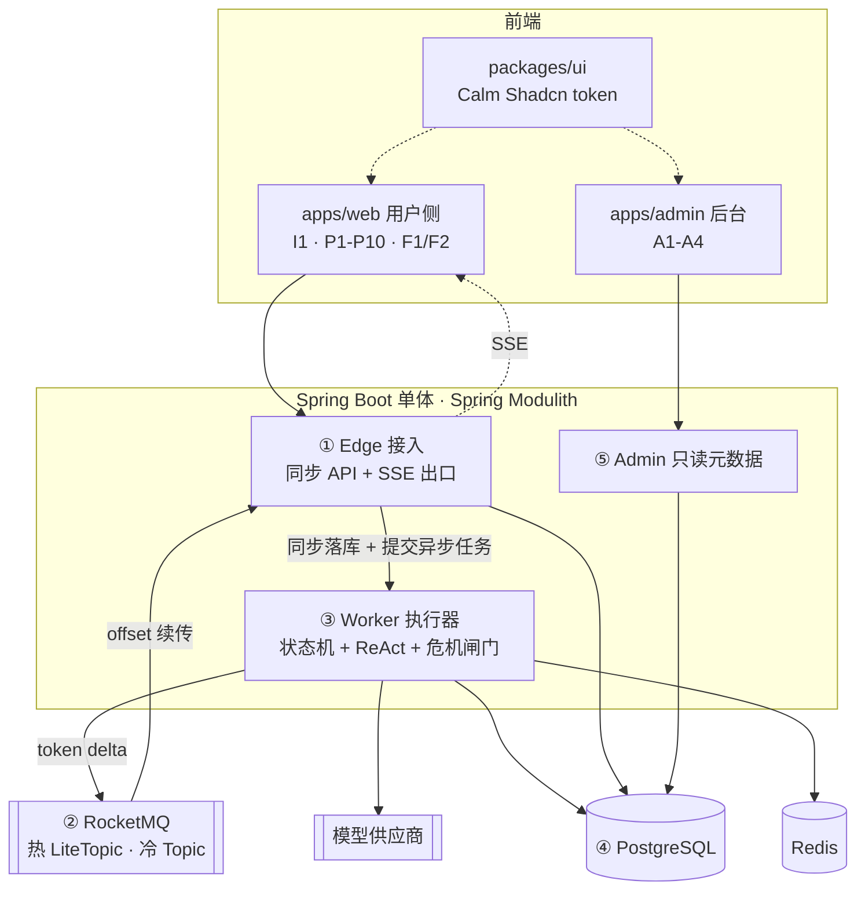

# 技术架构与技术栈总览

本文是技术设计的基线快照，覆盖整体架构、模块划分和技术栈选型。已确定的写为结论，未确定的集中在第 6 节待定清单。后续细化文档从本文派生。

对应的业务需求见 [[agent-foundation-prd]]、[[business-workflow-runtime-prd]] 和 [[psychological-reflection-workflow-prd]]；页面范围见 [[psychological-reflection-page-map]]。

## 1. 整体架构



### 1.1 两条数据流

| 方向 | 机制 | 理由 |
| --- | --- | --- |
| 入口 | 同步 HTTP：校验、落库、返回 `turnId`，随后提交异步执行 | 鉴权失败、配额超限、并发冲突需要当场反馈；同步落库保证失败的对话在页面上可渲染 |
| 出口 | 异步：token delta 经 LiteTopic 扇出，按 offset 续传 | 任意 Edge 实例可服务任意 session，无需 sticky session；断线重连可补齐缺失 token |

入口不走消息队列。MQ 在出口解决的扇出与 offset 回溯，入口都不需要；且入队后消费失败会导致用户消息没有任何数据库记录，前端无法渲染失败气泡。

### 1.2 五个运行组件

| 组件 | 职责 | 不负责 |
| --- | --- | --- |
| ① Edge 接入 | 鉴权、幂等键、限流、写入 turn、SSE 出口与 offset 续传 | 业务语义 |
| ② 消息总线 | 热通道 token 流；冷通道跨模块业务事件 | 承载用户命令 |
| ③ Worker 执行器 | 危机前置闸门、状态机推进、ReAct 调模型、写状态 | 连接管理 |
| ④ 存储 | Execution、Context、制品、会话、记忆 | — |
| ⑤ Admin | 只读运行元数据与配置 | 接触任何正文 |

组件的存在理由是让连接生命周期与执行生命周期解耦：用户断线不影响剖析继续执行，重连可续流。

### 1.3 部署形态

MVP 逻辑分开、物理同进程。Edge、Worker、Admin 在同一个 Spring Boot 进程内，彼此通过消息或事件通信，不直接方法调用。

三者伸缩特征不同（Edge 连接密集、Worker 受 LLM 延迟支配、Admin 几乎无量），但 SSE 连接由 Servlet 异步派发持有、不占用容器线程，MVP 量级同进程可承载。已走消息解耦，后续拆进程只改部署描述。

风险：同进程下容易图省事让 Edge 直接调用 Worker 方法，绕过消息通道，导致后续无法拆分。此约束须由 Modulith 依赖校验禁止。

## 2. 恢复语义

「恢复」是两件独立的事，模块归属不同。

| | 连接恢复 | 流程恢复 |
| --- | --- | --- |
| 场景 | 刷新页面、切网、Pod 滚更 | 执行中断、超时、重启 |
| 恢复对象 | 少收的 token 流 | WorkflowExecution 状态机 |
| 依据 | MQ offset | 数据库中的当前节点 + WorkflowContext |
| 归属 | Edge | Worker |

流程恢复遵循 [[business-workflow-runtime-prd]]：从当前节点入口重新执行，不恢复 ReAct 内部轮次，业务副作用靠幂等标识防重。连接恢复是 PRD 未涉及的技术需求，但单次剖析耗时较长，必须支持。

连接恢复采用「turn 记录 + 事件游标」双层方案。按恢复场景处理：

| 恢复场景 | 发生时系统状态 | 恢复步骤 |
| --- | --- | --- |
| 用户刷新页面或短暂断网，Worker 仍在执行 | 浏览器丢失 SSE 连接；turn、已生成文本和事件游标仍在存储中 | 页面先按 session 查询 turn 快照，立即渲染已落库的用户消息、助手文本和当前状态；随后携带该 turn 已渲染的 `Last-Event-ID` 重连 SSE。Edge 从热通道补发此游标之后的事件，补齐后切换到实时订阅。重复收到的事件按 `eventId` 忽略 |
| Edge 实例重启或负载均衡切到另一实例，Worker 仍在执行 | 原 Edge 的连接与本地订阅丢失，但 Worker、数据库和热通道不依赖该实例 | 浏览器按相同的 sessionId／turnId 重连任一 Edge。新 Edge 先读 turn 的最新快照和事件游标，再从热通道订阅后续事件；Edge 不保存执行状态，因此实例切换不会中断 Worker |
| 用户离线过久，热通道的保留窗口已过，或 turn 已结束 | 早期 token 事件已无法从热通道回放；最终内容与终态仍在 turn 记录中 | 页面只读取 turn 快照，不尝试补历史 token。快照包含完整可展示文本、终态、失败／中断原因及最后一个 `eventId`；若 turn 尚在运行，再从该游标之后订阅实时事件；若已终态，则无需建立 SSE |

Worker 每产生一个可恢复增量，就按顺序持久化到 turn 记录并附带单调递增的 `eventId`，再发布到热通道。快照读取与事件回放都以 `eventId` 去重，因此两者交界处至多重复，不会漏内容。

前端渲染永远读 turn 记录，SSE 只是让变化更快可见。turn 状态落库是失败态可展示、等待态可跨刷新存活的前提。

## 3. 模块划分

```
foundation/   基座    identity · session · memory · model · cost
runtime/      运行时  artifact · engine · react · spi · trace
domain/       领域包  节点 · 规则 · 输出校验 · 业务结果适配器
delivery/     适配层  edge · admin
```

依赖方向严格单向：`delivery → domain → runtime → foundation`。

### 3.1 PRD 边界到模块约束的映射

| PRD 约束 | 模块表达 |
| --- | --- |
| 基座不反向调用运行时 | `foundation` 的 allowedDependencies 不含 `runtime` |
| 领域包不绕过运行时调用基座 | `domain` 只允许依赖 `runtime.spi` |
| 领域扩展点不得直连模型供应商 | 仅 `foundation.model` 持有供应商 SDK 依赖 |
| 后台不得查看用户正文 | `delivery.admin` 的依赖中不含正文仓库 |

违反上述约束时 `ApplicationModules.verify()` 失败，不依赖代码评审。

### 3.2 各模块内容

**foundation（Agent 基座）** — User 是唯一隔离边界

- `identity` — User、游客、登录态、模型处理同意记录
- `session` — Session、原始对话、本次上下文材料
- `memory` — 记忆点五态流转、版本、逻辑删除
- `model` — 模型路由、调用、失败降级
- `cost` — 成本审计，只接收元数据

**runtime（业务流程运行时）** — 只提供机制，不理解领域语义

- `artifact` — WorkflowDefinition / SkillDefinition / PromptDefinition 的版本与发布
- `engine` — DSL 状态机、WorkflowExecution、WorkflowContext
- `react` — 节点内 ReAct 循环、Skill 按需加载
- `spi` — 领域扩展契约，纯接口与 DTO，无实现
- `trace` — 流程与 Skill 执行元数据  写入 MongoDB `flow_trace` / `skill_trace` 集合：只增不改、不参与事务、按 executionId 查询，供 Admin A3 轨迹页直读。技术侧 span 与耗时走 Micrometer Observation 抽象，不与业务轨迹混用

**domain（心理领域流程扩展包）** — 只提供内容，不触碰机制

- 节点实现：意图识别、剖析引导、风险检查、阶段性总结
- 领域规则与输出校验扩展点
- 业务结果适配器：临时分析、阶段性总结

**delivery** — 用户侧 API 与 SSE 出口、后台 API

### 3.3 唯一接缝

`runtime.spi` 是 `runtime` 与 `domain` 之间的唯一接缝。`domain` 取不到 `foundation.memory` 的类，编译期即不通过；所有基座能力经运行时转发。

划分是否正确的检验标准：接入第二个领域流程（如学习领域）时只新增一个 `domain.*` 包，`runtime` 与 `foundation` 零改动。

### 3.4 前端模块

```
packages/ui     Calm Shadcn token 与基础组件
apps/web        I1 · P1-P10 · F1/F2
apps/admin      A1-A4
```

两个 entry 共享 token 包，后台代码不打进用户侧产物，减少内部字段误暴露的机会。

## 4. 技术栈

### 4.1 前端

| 项 | 选型 | 理由 |
| --- | --- | --- |
| 框架 | Vue 3.5 + TypeScript + Vite | 指定 |
| 组件 | shadcn-vue（Reka UI + Tailwind v4） | 承载 Calm Shadcn；token 化后用户侧走低饱和暖灰，后台侧仅调密度，共用语义色 |
| 路由与状态 | vue-router 4 + Pinia | — |
| 服务端状态 | TanStack Query (Vue) | P7 / P8 列表的缓存失效与乐观更新 |
| 流式接收 | `@microsoft/fetch-event-source` | 原生 EventSource 只支持 GET、不能带 header |
| 长文本渲染 | markdown-it + Shiki + DOMPurify | P5 / P9 证据分层展示 |
| 表单 | vee-validate + zod | P6 记忆点修改后保存 |
| 后台表格 | TanStack Table (Vue) | A1 / A3 筛选、版本、轨迹 |
| 测试 | Vitest + Playwright | P10 危机接管、P4 中断恢复须有端到端覆盖 |

### 4.2 后端

| 项      | 选型                                                                          | 理由                                                               |
| ------ | --------------------------------------------------------------------------- | ---------------------------------------------------------------- |
| 运行时 | Java 17 + 有界平台线程池 | Spring Boot 3.5 的最低要求即 Java 17，栈内无组件强依赖 21。SSE 出口用 `SseEmitter`，连接由 NIO connector 持有、不占容器线程；Worker 并发上限由模型配额决定，线程数不是瓶颈。代价：Worker 须显式配置有界池并做拒绝策略，不能靠虚拟线程无脑放大 |
| 框架     | Spring Boot 3.5 + Spring Modulith 1.4                                       | 指定                                                               |
| 模型接入 | Spring AI 1.0 | Spring 官方的模型接入抽象层，作用见 4.3。只用 `ChatClient`、tool calling、流式响应、结构化输出四项：tool calling 直接映射 `load_skill(skill_id)`；不使用其 ChatMemory、RAG、Advisor，会话与记忆由基座管理 |
| 持久化 | MySQL 8.0 + Flyway + MyBatis-Plus 3.5；MongoDB 7 仅承接 trace 与成本流水 | 结构化字段用列，WorkflowContext、DSL、Skill 内容用 MySQL JSON 列。Context 必须与 Execution 状态同库同事务——流程恢复要求「当前节点 + Context」原子写，跨库会出现节点已推进而 Context 未更新的不可恢复态。MongoDB 只接只增不改、不参与事务的数据。代价：JSON 内部检索弱于 jsonb + GIN，需要过滤的字段必须提列并建索引 |
| DSL 校验 | 自建 DSL 解析与发布前检查（参考 LiteFlow EL 语义） | 解析器只负责语法与基本结构；节点注册、输入输出类型匹配、连线完整、被引用的 Skill/Prompt 版本存在等领域约束，必须在制品发布前检查 |
| 状态机 | 自建轻量流程引擎 + Execution 持久化与 ReAct 循环 | 抽取 LiteFlow 的最小编排能力（节点、顺序／条件／子流程、迭代）并按本项目需求扩展；LiteFlow 只作为能力参考和对照测试，不作为生产运行时依赖 |
| 缓存与协调  | Redis 7                                                                     | Execution 单写锁、幂等键、限流、游客会话 TTL                                    |
| 消息     | RocketMQ 5.x                                                                | 指定；延时消息可用于游客清理与记忆回收                                              |
| 加密     | 应用层信封加密，per-User DEK 由 KMS 主密钥保护                                            | 满足内部人员不得查看正文；代价是正文列不可检索                                          |
| 认证     | Spring Security + JWT                                                       | 非实名，一账号一 User，不做合并；游客为带 TTL 的匿名主体                                |
| 可观测 | Micrometer Observation API 埋点，后端暂空实现 | 只落埋点与语义约定（指标名、tag 集、脱敏规则），不绑定具体后端。自研监控接入时补 `ObservationHandler` / registry 导出，业务代码零改动。正文字段禁止进入日志与 tag，由统一脱敏层强制 |
| 定时任务 | `@Scheduled` + ShedLock（Redis Provider） | 多副本下不重复执行；用 Redis Provider 免建锁表。具体任务清单见 4.3 |
| 构建 | Maven 3.9.2 单模块 + 包级 Modulith | 先靠 `ApplicationModules.verify()` 守边界，确有需要再抽子模块。校验须绑到 `test` 阶段，否则边界约束形同注释 |

### 4.3 选型补充说明

**Spring AI 是什么**

Spring 官方的模型接入抽象层，作用类似 JDBC 对数据库：屏蔽各家供应商 SDK 的差异，业务代码只面向统一接口。本项目用到四点：

| 能力                | 用途                                                                                                               |
| ----------------- | ---------------------------------------------------------------------------------------------------------------- |
| `ChatClient` 统一接口 | `foundation.model` 在一次调用开始时按路由快照选择 `ChatModel`。已接入供应商的启停、权重、限额和降级顺序存为版本化 `ModelRoute`，由本地缓存配合配置事件刷新，因此调整路由无需重启服务；同一请求可按路由并行发起多个候选调用并按策略选取结果。新增供应商适配器或 SDK 依赖仍随发布接入，避免在运行中动态加载不受控代码 |
| tool calling 抽象   | 用注解声明 Java 方法即成为模型可调用的工具，直接映射 `load_skill(skill_id)`，不必手写各家 function calling 的报文差异                               |
| 流式响应              | 返回 token 流，接到出口通道                                                                                                |
| 结构化输出             | 把响应映射成 Java 对象，用于 5.3 的结构化节点                                                                                     |

明确不用的部分：`ChatMemory`（会话由 `foundation.session` 管，Spring AI 的内存实现不满足加密与多端恢复）、RAG / VectorStore（记忆检索属基座职责）、Advisor 链（会与状态机的控制流打架）。

这里要区分两层：Spring AI 不提供状态机。状态机与流程编排由 `runtime.engine` 负责；Spring AI 只在节点内部提供 `ChatClient`、tool calling、流式响应和结构化输出能力。

成本与风控不交给 Spring AI 的 Advisor 链，而是收敛在模型调用门面与领域扩展点：

| 关注点       | 归属与实现                                                                                                                                      |
| --------- | ------------------------------------------------------------------------------------------------------------------------------------------ |
| 成本、配额与并发  | `foundation.model` 的 `ModelInvoker` 在调用前按 User、模型路由和 token 预算做配额／并发判断；调用完成后从响应元数据记录模型、输入输出 token、耗时和费用到 `foundation.cost`。成本流水只记录元数据，不记录正文 |
| 平台级模型风控   | `ModelInvoker` 统一执行供应商／模型白名单、超时、最大上下文、最大输出和熔断／降级策略；这些规则不理解心理领域语义                                                                           |
| 心理风险与领域输出 | `runtime` 在路由前调用领域 `RiskGate`，命中后进入 P10；结构化结果由领域输出校验器决定是否展示或写入。两者不下沉到通用模型门面                                                                |
| 工具调用风险    | ReAct 驱动器校验当前节点允许的工具、参数 schema 和 Skill 版本，拒绝未声明的工具调用；工具执行结果只回填给模型与 trace                                                                   |

**自建轻量流程引擎的边界**

| 能力 | 设计 |
| --- | --- |
| DSL 与节点编排 | 抽取 LiteFlow 的最小能力：节点、顺序／条件分支、子流程与有限迭代；增加节点类型、输入输出和 Skill／Prompt 版本等领域元数据 |
| 执行态持久化与断点续跑 | `WorkflowExecution` 记录当前节点与 `WorkflowContext` 快照，并在同一事务中写入；恢复时从当前节点重新进入 |
| ReAct 循环 | 在运行时组件中由 Spring AI tool calling 驱动，控制轮次、超时与 token 预算；轮次不落库，符合第 2 节「不恢复 ReAct 内部轮次」 |
| 危机前置闸门 | 放在状态机路由之前的运行时统一入口，不作为 DSL 节点，见 5.4 |

流程制品以 `workflowId + version` 固定版本（对外可组合成 `chainId=reflection_v3`）。发布新版本创建新制品，不原地覆盖；每个 Execution 持久化绑定完整版本标识，旧执行继续使用旧制品。LiteFlow 仅作为能力参考和对照测试。

**定时任务清单**

| 任务              | 频率     | 说明                                                                                         |
| --------------- | ------ | ------------------------------------------------------------------------------------------ |
| 游客会话清理          | 每小时    | TTL 到期的匿名主体及其数据，Redis TTL 兜不住的落库部分                                                         |
| 逻辑删除记忆点物理清理     | 每天     | 过保留期后真删，含加密正文                                                                              |
| 发件箱补偿重投         | 每分钟    | 事务性发件箱中未成功外化的事件重发，见 5.1                                                                    |
| 成本流水日结          | 每天     | 按 User 汇总元数据写入账期表，供配额判断                                                                    |

其中游客清理与记忆回收也可用 RocketMQ 延时消息实现，二者选一即可，不要两套并存。

Execution 不设跨线程、跨任务的锁回收。Worker 当前线程以限定等待时间获取锁；等待超时即返回并发冲突。获得锁的同一线程在 `finally` 中释放，且单次模型调用与整个 turn 都有小于锁 lease 的超时上限。进程崩溃时 lease 自然过期；应用重启或收到恢复命令后，运行时按第 2 节读取持久化的 Execution 并重新正常加锁，再决定续跑或失败，不操作旧锁。

??? 这里得预防兜底一下拿到分布式锁后宕机, 导致只能等待分布式锁自然过期的情况, 因为大模型场景下锁时间通常都较长, 很容易宕机后锁长时间未释放

## 5. 已识别风险

### 5.1 Spring Modulith 无 RocketMQ 事件外化支持

官方 externalizer 仅覆盖 Kafka、AMQP、JMS、SQS、SNS、Pulsar。冷通道需自行实现 `EventExternalizer` 包装 `RocketMQTemplate`，配合 `spring-modulith-events-jpa` 做事务性发件箱。工作量有限，但须排入计划。

结论：排入计划，作为运行时基建的前置任务。

一处修正：栈已改为 MyBatis，`spring-modulith-events-jpa` 不再适用，事务性发件箱用 `spring-modulith-events-jdbc`（基于 `JdbcTemplate`，自带 `event_publication` 表 DDL，与 MyBatis 共用同一 `DataSource` 和事务管理器）。外化器仍需自行实现，包装 `RocketMQTemplate`。

### 5.2 LiteTopic 能力矩阵未验证

单 session 一 topic 的数量上限、TTL、offset 回溯与消费者动态订阅开销，在社区版与云版之间差异较大。开工前须在目标环境做一轮验证，结论直接影响出口方案是否成立。

LiteTopic 是 Apache RocketMQ 官方文档领域模型章节中的特性（`/zh/docs/domainModel/03litetopic/`），社区版即有，不是云厂商专有能力。设计文档不得再按「社区版无此特性」推理。

尚缺的是量化结论：单 broker 可承载的 LiteTopic 数量上限、创建与销毁开销、TTL 与自动回收行为、offset 回溯窗口、消费者动态订阅是否触发重平衡。这些直接决定「一 session 一 LiteTopic」能否作为出口通道，须在目标环境实测，不引用二手数字。

验证项与判定口径：

| 验证项 | 判定口径 |
| --- | --- |
| 数量上限 | 按 MVP 峰值在线会话数的 3 倍创建，broker 元数据内存与 NameServer 同步耗时是否平稳 |
| 创建／销毁开销 | 单个 LiteTopic 创建 P99 延迟，是否可放在 turn 提交的同步路径上 |
| TTL 与回收 | 会话结束后是否自动回收，需不需要显式清理任务 |
| offset 回溯 | 断线重连补齐缺口的可用窗口是否覆盖单次剖析时长 |
| 动态订阅 | 新增消费者是否引发重平衡、影响同 broker 其他通道 |

备选方案（若上表任一项不达标）：**Redis Stream，一 session 一 stream**。

| 需求 | Redis Stream 如何满足 |
| --- | --- |
| offset 续传 | Stream entry ID 天然单调，前端上报 lastEventId，`XRANGE` 补齐缺口 |
| 任意 Edge 实例可服务任意 session | 数据在 Redis，不依赖实例本地状态，无 sticky session |
| 大量短生命周期通道 | key 级别开销，`XADD` 带 `MAXLEN` 限长 + key TTL 自动回收，不涉及集群元数据 |
| 扇出 | 多端同时 `XREAD BLOCK` 同一 stream |

备选方案的代价：Redis 内存承压（用 `MAXLEN` 与短 TTL 控制），token 流不持久可审计（可接受——正文最终形态落库在 turn 记录，流本身不需长期留存），且引入第二种消息机制、运维面变宽。

结论：LiteTopic 保持为首选，第 1 节架构图与 1.2 表不改。验证不通过再切备选，届时 ② 拆为热通道 Redis Stream + 冷通道 RocketMQ。
### 5.3 流式输出与领域输出校验冲突

[[psychological-reflection-workflow-prd]] 要求模型结果先经领域规则判断再决定是否展示，而 token 流是边生成边展示。按节点类型区分：

| 节点类型 | 页面 | 输出方式 | 校验位置 |
| --- | --- | --- | --- |
| 流式节点 | P2 普通聊天、P4 逐层提问 | 流式 token | 约束前置在 Prompt / Skill 与输入侧风险闸门，输出侧做增量检查与事后审计 |
| 结构化节点 | P5 阶段性总结、P6 记忆点、P9 复盘 | 不流原文，返回结构化结果，校验通过后整体下发 | 领域输出校验扩展点 |

只有结构化输出才能真正校验「区分事实、观察、可能解释与无法判断」这一硬要求。

工具调用属于 ReAct 的中间轮次，不直接作为用户可见正文。Worker 收到模型响应后，先校验工具名、参数和当前节点权限；通过校验才执行 `load_skill(skill_id)` 等受控工具，并将结果作为 tool message 回填上下文后再次调用模型。循环在 Worker 内受轮次、超时和 token 预算限制；校验失败或达到上限则进入失败／中断态并写入 trace。

ReAct 节点是否流式由 DSL 的 `outputMode` 显式声明，不从模型响应推断：

| `outputMode` | ReAct 驱动器行为 | 对前端的事件 |
| --- | --- | --- |
| `stream_text` | 工具调用与工具结果始终在驱动器内部处理；模型返回最终助手文本后，将文本增量按序写入 turn 并发布 | `token_delta`、`completed` 或 `failed` |
| `structured` | 工具循环完成后收集最终响应，映射为结构化对象并交给领域校验；校验通过才持久化和发布 | `result_ready`、`completed` 或 `failed` |

也就是说，模型只能决定是否请求工具，不能决定输出是否直接展示。ReAct 驱动器根据节点配置选择对应的输出 sink；工具调用片段、参数和工具结果只进入 trace，不进入 SSE。这样同一套工具循环可服务流式聊天和需先校验的结构化节点。

??? 你还是没说对于一个 re-act 节点, 他接收几种大模型返回数据类型, 以及在什么场景下接收.

### 5.4 危机闸门不能只做成 DSL 节点

[[psychological-reflection-workflow-prd]] 要求任何入口优先识别即时风险。若仅作为流程节点，新增分支即可能遗漏。方案：运行时增加输入前置闸门扩展点，在状态机路由之前无条件执行，由领域包实现；命中后抢占式跳转 P10，并禁止加载剖析、总结、记忆点确认与复盘类 Skill。

### 5.5 Turn 定义、流转与并发写入

??? 这一部分补充到恢复前面, 现在逻辑上依赖是颠倒了, 我看了前面的恢复内容的部分是缺失前提背景的

Session、Turn 与 WorkflowExecution 的粒度不同：Session 是用户的一段连续会话；Turn 是一次用户提交及其对应的助手输出、事件和终态；WorkflowExecution 是运行中的流程实例，可以跨多个 Turn，例如 P4 提问后等待下一次用户回答。每个 Turn 关联当前 Execution，但不等同于 Execution。

| Turn 状态 | 进入条件 | 退出条件 |
| --- | --- | --- |
| `running` | Edge 校验通过，持久化用户输入并提交 Worker 命令 | Worker 成功、失败、危机闸门命中或用户取消 |
| `succeeded` | 该 Turn 的助手输出或结构化结果已完整持久化 | 终态 |
| `failed` | 模型、依赖或执行超时等被动中断，保留可展示的聊天类部分输出 | 终态 |
| `guard_blocked` | 前置危机闸门命中，转入 P10 | 终态 |
| `cancelled` | 用户或系统主动停止当前 Turn | 终态 |

一次提交按「持久化用户输入和 `running` Turn → Worker 获取 Execution 锁 → 推进节点／发布事件 → 写入终态」流转。P4 等待用户下一次回答时，当前 Turn 已 `succeeded`，但关联的 Execution 停在等待输入的节点；下一次提交创建新的 Turn 并继续该 Execution。

同一 Execution 同时只允许一个写者，否则重复提交会产生两条并行推进的状态机。MVP 使用 Redis 锁：Worker 当前线程以限定等待时间获取锁，获取失败即返回并发冲突并携带当前 turnId，前端直接接上该流；锁只由持有线程在 `finally` 中释放，见 4.3。

## 6. 待定清单

| #   | 待定项                           | 影响                        | 当前倾向                                                                                        |
| --- | ----------------------------- | ------------------------- | ------------------------------------------------------------------------------------------- |
| 1   | `runtime.spi` 扩展点签名           | 决定运行时与领域包的分工，DSL 表达能力受其约束 | 未定                                                                                          |
| 2   | WorkflowDefinition DSL schema | 运行时核心                     | 自建最小 DSL，参考 LiteFlow 的编排语义并按领域需求扩展                                                          |
| 3   | 正文／元数据访问隔离                    | 后台不可见正文的逻辑保证              | 同库同表可接受；使用逻辑隔离标志与 metadata 投影，Admin 不依赖正文仓库                                       |
| 4   | turn 状态机与 SSE 事件表             | 前后端并行开工的前提                | 状态：running / succeeded / failed / guard_blocked / cancelled                        |
| 5   | Edge 与 Worker 命令契约            | 同上                        | 未定                                                                                          |
| 6   | 部分输出保留策略                      | 影响失败态展示与记忆点生成             | 按节点区分：P2 / P4 保留已生成内容并标记中断；P5 / P6 丢弃，避免半截总结被当作结论。加载 session 时直接返回 turn 快照中的可展示文本、状态和中断信息 |

失败的 turn 一律不得产出待确认记忆点。

### 6.1 各待定项是什么

**1 · `runtime.spi` 扩展点签名** — 运行时留给领域包的插座。这里采用窄接口、能力导向的 SPI，而不是让领域包实现整个运行时：节点、输出校验、前置闸门、结果适配器分别定义独立接口；入参使用不可变 DTO 和受限的运行时服务，返回明确的决策／结果 DTO，不暴露 `foundation` 实体、数据库连接或状态机内部对象。先固定接口语义，再让 DSL 只引用已注册的扩展标识；扩展点增加字段时采用向后兼容的可选字段或新版本接口。签名决定领域包能做多少事，也决定 DSL 里能声明什么，因此排第一。

**2 · WorkflowDefinition DSL schema** — 一次剖析流程的可发布描述：有哪些节点、按什么条件流转、每个节点绑哪个 Prompt／Skill 版本。它是数据而非代码，因此可以发版、回滚、按 Execution 绑定版本。实现上不直接依赖 LiteFlow，而是抽取其编排与 ReAct 所需的最小能力（节点、顺序／条件／子流程、有限迭代、工具调用边界），复刻为本项目的运行时内核，再补充恢复、危机闸门和领域元数据。

**3 · 正文／元数据访问隔离** — 正文与运行元数据暂不拆库分表，允许同库同表；每条记录带逻辑隔离标志（如 `data_scope=content|metadata`），由 repository 与 metadata projection 约束可见字段，`delivery.admin` 只查询 metadata 投影。该方案提供应用层逻辑隔离，不宣称物理隔离；若后续合规要求提高，再迁移为物理分离。

**4 · turn 状态机与 SSE 事件表** — 一次用户提交的生命周期状态，以及推给前端的事件类型清单（`token_delta`、节点切换、闸门命中、`result_ready`、`completed`、`failed`）。这是前后端能并行开工的契约：前端照事件表写增量渲染，后端照状态机写推进；历史加载不依赖事件回放，而是读取 turn 快照。

**5 · Edge 与 Worker 命令契约** — Edge 提交异步任务时传什么、Worker 回报什么。因为二者刻意不做直接方法调用（见 1.3），这层契约就是唯一接口，也是后续拆进程时不用改代码的前提。

**6 · 部分输出保留策略** — 执行中断时，已生成的半截内容是留着标为中断，还是直接丢弃。聊天类节点留（用户看得到进度更重要），总结类节点丢（半截总结会被当成结论，这是心理场景下的实质风险）。

P2／P4 的可展示增量随生成写入 `turn.displayContent`；终态同时写入 `status`、`interruptMode=active|passive` 和不含正文的失败原因。下次加载 session 时，接口直接返回这些字段，前端先渲染已保存文本，再按终态显示不可编辑的中断标记，不建立 SSE 来补历史内容。P5／P6 在失败时清空未校验的临时结果，只返回失败状态与原因，不返回半截结论。

## 7. 下一步拆解顺序

建议按 `1 → 2 → 3 → 4 → 5 → 6` 推进。

`runtime.spi` 先行的理由：它确定运行时与领域包的分工边界，DSL 能表达什么受其约束；若签名定反，后续 DSL 与领域实现均需返工。
