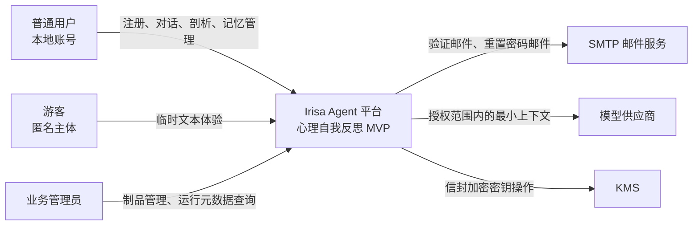
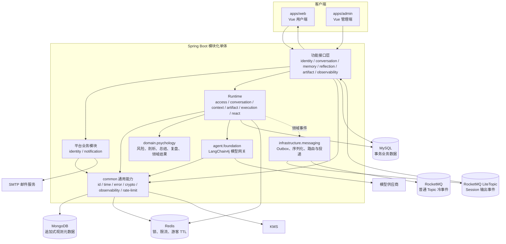
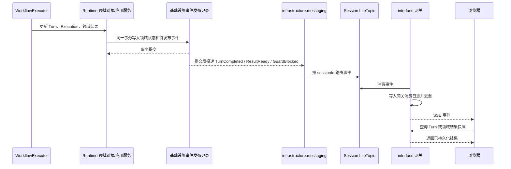
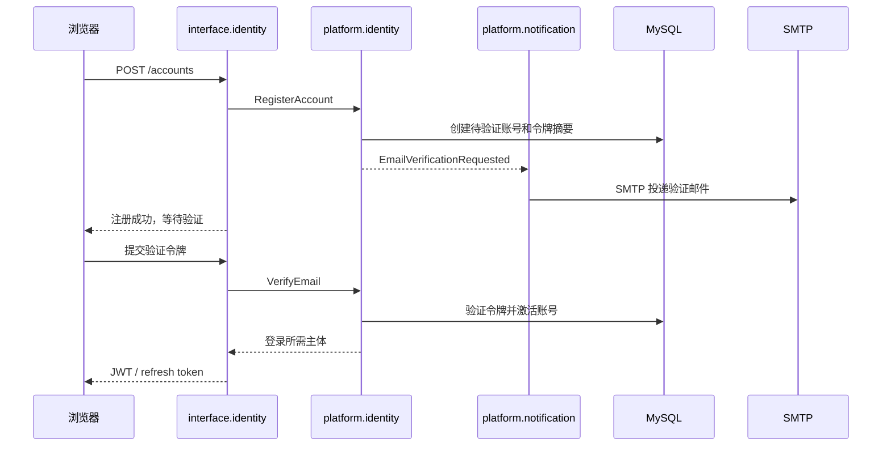
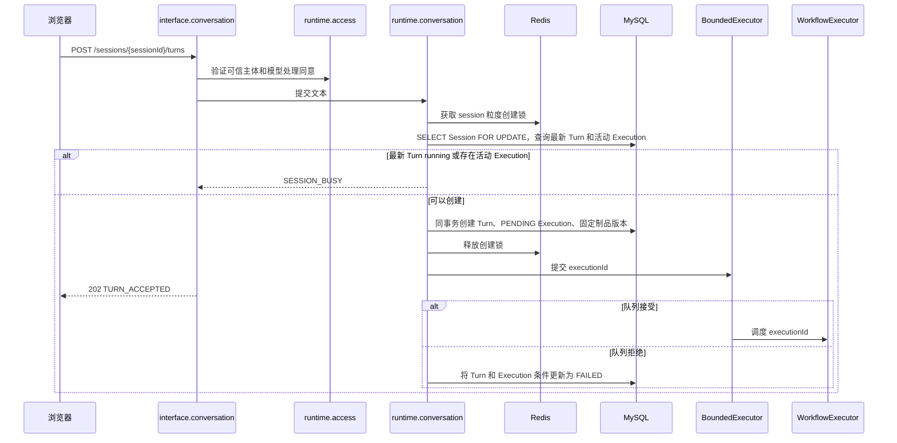
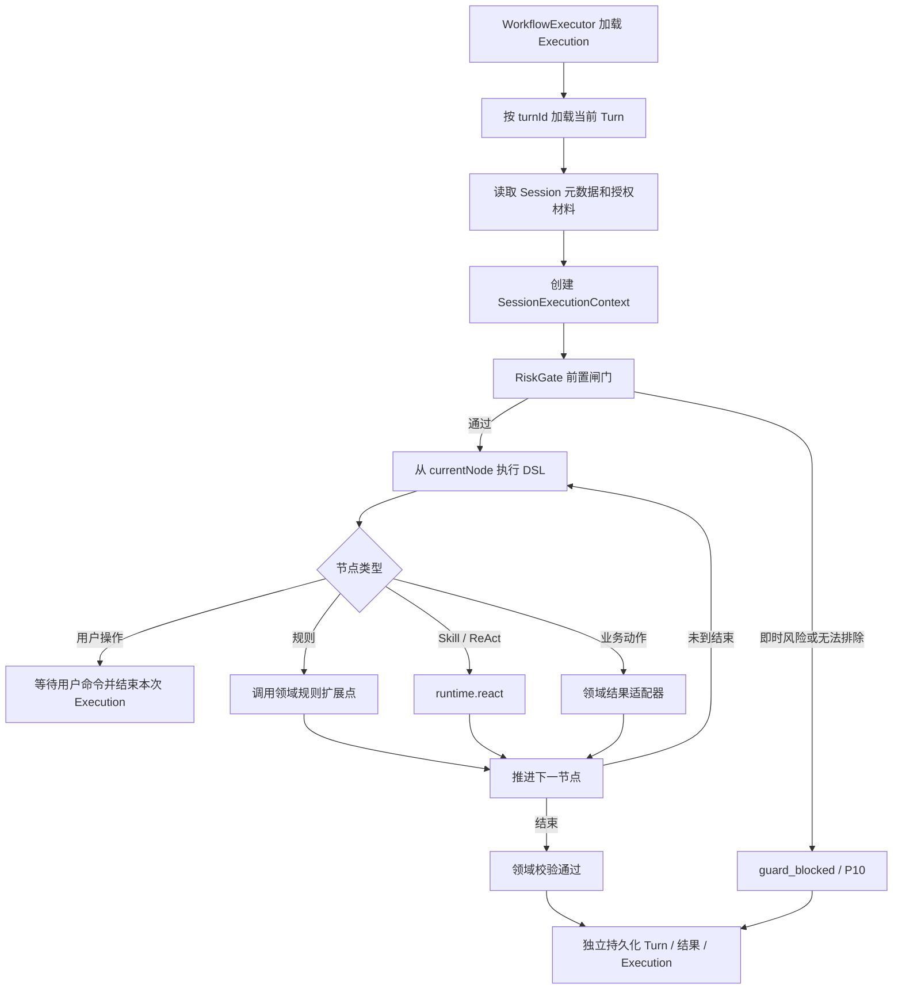
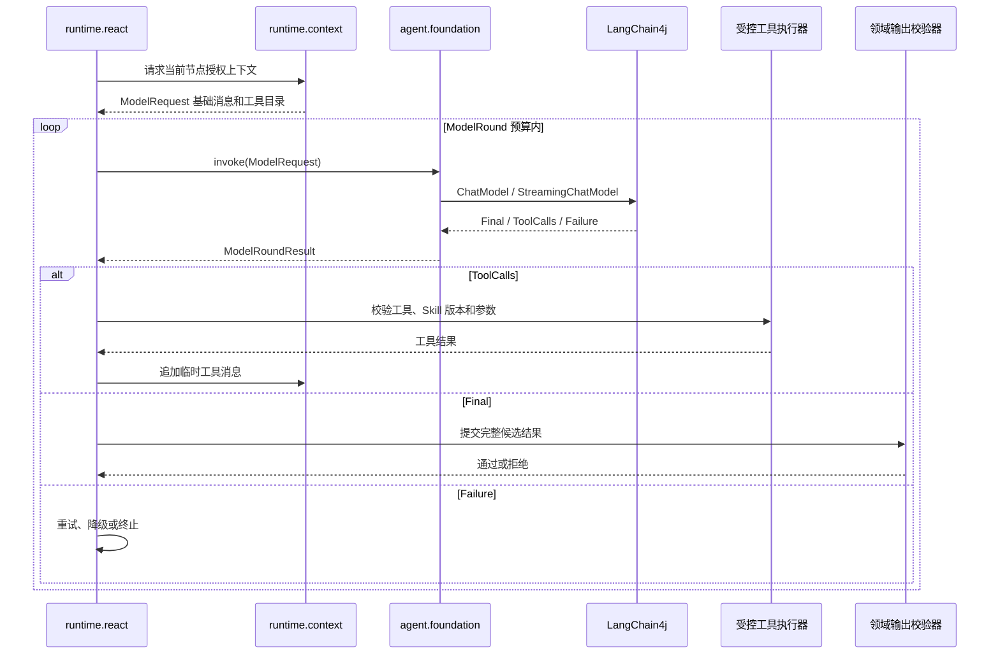
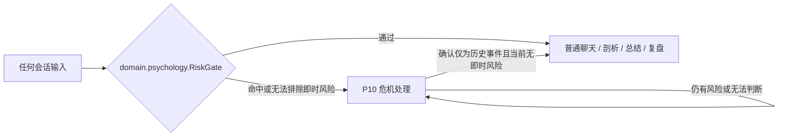
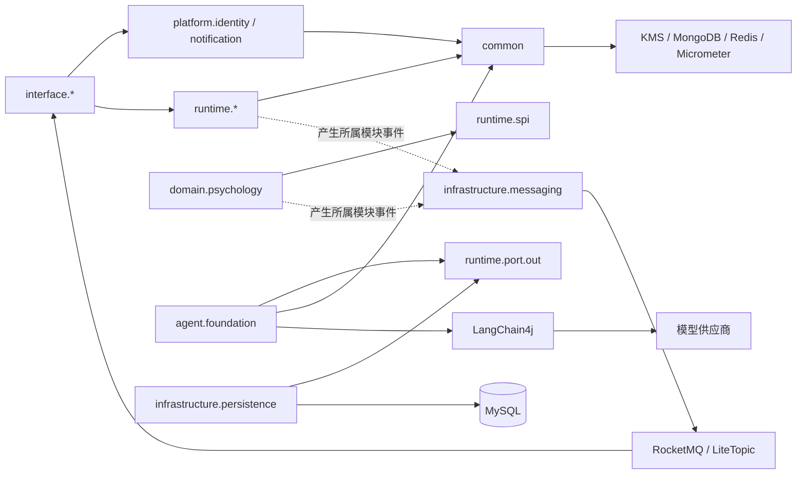

# 心理自我反思 Agent MVP 技术方案

## 1. 文档说明

本文是心理自我反思 Agent MVP 的实施方案。目标是让不熟悉项目的研发人员能够从系统边界、运行容器、模块职责、核心流程、数据模型、接口契约和验收标准中，完整理解系统要做什么以及如何实现。

本文采用以下组织方式：

1. System Context：系统作为黑盒与外部世界的关系。
2. Container：系统由哪些运行容器组成，以及容器之间如何交互。
3. Module：后端模块的职责、端口、内部流程和依赖方向。
4. Data：独立持久化对象、DDL、事件和网关消费记录。
5. Delivery：对外接口、SSE、错误契约和前端交互。
6. Operations：安全、恢复、观测、测试和发布顺序。

### 1.1 方案范围

本方案只覆盖 MVP：

- 一个可容器化的 Spring Boot 模块化单体。
- 一个心理自我反思领域流程。
- 本地账号、邮箱验证、密码重置和游客体验。
- 纯文本对话，不实现附件上传和解析。
- LangChain4j 作为唯一模型接入框架。
- 自建最小 Workflow DSL、WorkflowExecution 和节点内 ReAct。
- MySQL 保存事务性业务数据，MongoDB 保存追加式观测元数据。
- RocketMQ 普通 Topic 承载冷事件，LiteTopic 承载对话输出事件。
- 网关消费 LiteTopic 并转换为 SSE。

### 1.2 明确不在范围内

- 跨 Worker 自动接管、租约和 fencing token。
- 跨领域流程组合和 Skill 自动共享。
- 用户自定义 Workflow 或图形化 Workflow 编辑器。
- 文件上传、附件解析、外部长期资料接入。
- 持久化 LangChain4j ChatMemory。
- 使用 `langchain4j-agentic` 直接替代自建 DSL。
- 未完成领域校验前的用户可见 token 流式输出。
- 基于 `Idempotency-Key` 的 HTTP 自动请求幂等。
- 组织、租户、成员关系和 SSO。

### 1.3 已确认的架构决策

| 决策 | 结论 |
| --- | --- |
| 模型框架 | LangChain4j；不使用 Spring AI |
| LangChain4j 使用方式 | 低层 `ChatModel`／`StreamingChatModel`、Tool Calling；ReAct 循环由项目实现 |
| Agent 基座边界 | 只负责模型交互及模型调用控制，不管理 Session、Turn、长期记忆或业务数据 |
| 业务状态归属 | Runtime 和领域模块负责 Session、Turn、WorkflowExecution、上下文、长期记忆及心理结果 |
| User 数据隔离 | Runtime 根据可信认证主体执行，不由客户端或模型层自行指定 User |
| 身份 | 本地账号，支持邮箱验证和密码重置；邮件通过通用 SMTP `MailGateway` 适配器 |
| 部署 | 可容器化模块化单体，不绑定 Docker Compose 或 Kubernetes |
| 文本输入 | MVP 只支持文本 |
| 游客数据 | 最后活跃 24 小时后逻辑删除 |
| 公共能力 | Runtime 可直接依赖统一的 `common` 模块；不拆分 `platform-api`／`platform-impl` |
| 事件归属 | 事件类型归产生该事实的业务模块；Outbox、RocketMQ 和 LiteTopic 投递归消息基础设施 |
| 输出通道 | Worker 产生所属模块的领域事件；消息基础设施路由到 LiteTopic；网关消费并输出 SSE |
| 输出模式 | 心理流程默认 `buffered_text`／`structured`；不发送未校验 token |
| Turn 幂等 | 不保存幂等字段；通过 Session 最新 Turn 状态、活动 Execution 查询和 Session 锁控制串行提交 |

## 2. 核心术语与对象边界

### 2.1 Session、Turn、WorkflowExecution

这三个对象分别代表不同语义，不使用“Session 拥有多个 Turn”或“Session 聚合包含 Turn”的表述。

| 对象 | 语义 | 持久化边界 |
| --- | --- | --- |
| Session | 用户可见的会话范围，定义 User、业务领域、生命周期和可引用上下文边界 | 独立持久化 Session 行 |
| Turn | Session 范围内一次独立的用户交互事实，表示“用户提交 → 系统处理 → 产生结果” | 独立持久化 Turn 行 |
| WorkflowExecution | 为构建某个 Turn 而创建的异步执行记录 | 独立持久化 Execution 行 |

关系只通过标识表达：

```text
Session：会话范围
  ↑ sessionId
Turn：范围内的一次交互记录
  ↑ turnId
WorkflowExecution：构建当前 Turn 的执行过程
```

`workflow_execution.turn_id` 指向它负责构建的 Turn；Turn 不保存 `workflowExecutionId`，也不感知 DSL、Worker 或执行过程。MVP 对 `workflow_execution.turn_id` 设置唯一约束，一次提交只对应一个 Execution。

### 2.2 Worker、BoundedExecutor、SessionExecutionContext

| 对象 | 职责 |
| --- | --- |
| `WorkflowExecutor` | 业务执行组件，加载并推进 Execution，在 Session 范围内构建当前 Turn |
| `BoundedExecutor` | 异步基础设施，只负责有界线程池、队列、拒绝策略和取消信号 |
| `SessionExecutionContext` | Worker 本轮执行的临时运行对象，不是实体，不是 DDD 聚合，不落库 |

执行流程：

```text
BoundedExecutor
  → 调度 WorkflowExecutor(executionId)
  → WorkflowExecutor 读取 WorkflowExecution
  → 通过 execution.turnId 定位当前 Turn
  → 读取 Session 元数据和授权材料
  → 创建 SessionExecutionContext
  → 构建并独立持久化当前 Turn
  → 独立推进 WorkflowExecution
```

`SessionExecutionContext` 只保存本轮授权材料引用、按授权范围读取的上下文材料、当前 Turn 构建器和 ReAct 临时状态，不包含全部历史 Turn。历史内容由 `runtime.context` 按指定 Turn、时间范围和授权范围读取。

## 3. System Context

系统黑盒是 **Irisa Agent 平台**，MVP 只发布心理自我反思领域。



### 3.1 外部参与者

| 外部对象 | 交互内容 | 系统边界 |
| --- | --- | --- |
| 普通用户 | 登录、创建 Session、提交文本、查看结果、管理记忆 | 系统验证 JWT 后，只允许访问当前 User 数据 |
| 游客 | 创建匿名主体并进行临时文本体验 | 不产生长期记忆；最后活跃 24 小时后清理 |
| 业务管理员 | 发布 Prompt／Skill，查看流程和成本元数据 | 不得查看用户正文、记忆或心理结果 |
| SMTP 邮件服务 | 投递邮箱验证和密码重置邮件 | 系统通过 `MailGateway` 隔离供应商差异 |
| 模型供应商 | 执行模型调用、Tool Calling 和结构化输出 | 只能收到本次授权且最小必要的上下文 |
| KMS | 包装和解包 per-User DEK | 系统不把主密钥写入数据库或日志 |

### 3.2 系统边界内外的责任

- 账号“是谁”由 `platform.identity` 证明。
- 业务数据“属于谁、能否使用”由 Runtime 的访问上下文和 Repository 约束决定。
- 模型“如何被调用”由 `agent.foundation` 决定。
- 模型结果“是否能推进业务、是否能展示”由 Runtime 和 `domain.psychology` 决定。
- 邮件、模型和 KMS 供应商不可直接访问 MySQL 业务表。

## 4. Container 架构

MVP 逻辑分离、物理同进程。用户接口、后台接口、Runtime、领域扩展和 Agent 基座均位于一个 Spring Boot 进程内，通过模块端口和事件通信隔离职责。



### 4.1 容器职责

| 容器 | 职责 | 不负责 |
| --- | --- | --- |
| `apps/web` | 用户侧页面、查询快照、建立 SSE、发起功能命令 | 不执行流程、不管理 RocketMQ offset |
| `apps/admin` | 制品和运行元数据页面 | 不读取用户正文 |
| 功能接口层 | 协议映射、认证入口、权限声明、错误转换 | 不承载领域执行逻辑 |
| `common` | ID、时间、错误、加密、观测和限流等跨模块技术能力 | 不定义领域事件，不拥有业务数据 |
| 平台业务模块 | 本地身份和通知等可独立描述业务流程的平台能力 | 不充当通用技术能力集合 |
| Runtime | User 隔离、Session／Turn／Execution、上下文组装、DSL、ReAct 控制 | 不直接暴露模型供应商 SDK |
| `domain.psychology` | 心理领域规则、节点、风险闸门、输出校验和结果 | 不访问业务 Repository 实现 |
| `agent.foundation` | LangChain4j 适配、单次 ModelRound、模型路由和平台级调用控制 | 不读取或存储 Session、Turn、Memory、Skill |
| `infrastructure.messaging` | 持久化并外化待发布事件，完成序列化、Topic 路由、重试和消费适配 | 不定义领域事件语义，不改变领域状态 |
| MySQL | 承接结构化业务数据和事务状态 | 不主动创建或推进业务对象 |
| MongoDB | 承接追加式执行、模型和成本元数据 | 不保存用户正文 |
| Redis | 分布式锁、限流、游客 TTL、定时任务锁 | 不作为业务状态真相源 |
| LiteTopic | 低延迟输出事件通道 | 不作为 Turn 或结果真相源 |

### 4.2 输出事件链路

事件类型定义在产生事实的模块内，例如 `runtime.conversation.event.TurnCompleted`、`runtime.execution.event.ExecutionCompleted` 和 `domain.psychology.event.ReflectionResultReady`。这些模块不感知 LiteTopic、Topic 名称、消费组、SSE 或消费游标；外化和传输统一由 `infrastructure.messaging` 处理：



领域状态和基础设施事件发布记录必须先在同一事务中提交；事务提交后才由 `infrastructure.messaging` 外化到 LiteTopic。这样消息不可用时业务状态仍然存在，发布器恢复后可以继续投递。发布器按 `sessionId` 使用有序消息组；同一 Session 的前序事件发布失败时，不越过它发布后序事件。

网关消费和 SSE 交付采用 at-least-once 语义，不宣称端到端 exactly-once：

```text
网关收到 LiteTopic 消息
  → 按 consumerGroup + eventId 插入消费日志；已存在则跳过
  → 提交 RocketMQ 消费位点
  → 按 sessionId 向当前进程内已连接的 SSE 客户端扇出
  → 记录交付结果
```

MVP 是单活应用实例，当前进程持有全部 SSE 连接并执行本地扇出。若网关在消费日志落库后、SSE 发送前退出，浏览器可能收不到该条通知，但重连后读取的业务快照包含最终状态；因此消息不是业务真相源。未来拆分多网关实例时，需要增加跨实例连接路由或独立推送层，不能直接复用单进程本地扇出。

### 4.3 SSE 重连语义

浏览器不需要理解 RocketMQ offset，也不负责管理业务消费游标。RocketMQ 客户端和网关消费组管理 broker 消费位点，网关消费日志只记录事件幂等与 SSE 交付结果：

```text
浏览器重新建立 SSE
  → interface 网关先注册连接并缓冲新消费到的 Session 事件
  → 查询 Turn／领域结果最新快照并返回浏览器
  → 根据网关消费日志丢弃已交付的重复事件
  → 推送快照读取期间缓冲的新事件
  → 切换为实时 SSE 推送
```

浏览器离线期间的业务变化由最新快照覆盖，不要求从 LiteTopic 向浏览器回放全部历史事件。网关进程重启后，RocketMQ 消费组从已提交 broker 位点继续消费；`gateway_event_consumption` 根据 `eventId` 去重。SSE 协议的 `id` 可以作为网关和浏览器传输层的优化，但不是 Runtime 业务概念。浏览器只需要渲染快照和后续事件，不需要提交 `lastSequence` 或 RocketMQ offset。

## 5. 端到端核心流程

### 5.1 注册与登录



令牌只保存摘要、用途和失效时间。密码重置使用同一令牌生命周期模式。邮件投递失败不会回滚已创建账号；投递任务按策略重试并记录元数据。

### 5.2 Turn 提交



这里不使用 HTTP `Idempotency-Key`。网络超时后的客户端恢复路径是查询 Session 最新 Turn 或时间线；若最新 Turn 已经存在，客户端恢复展示，不自动再次创建相同提交。

事务提交后、命令进入内存队列前存在进程退出窗口。启动扫描和每分钟运行的 PENDING 补偿任务会重新提交超过 30 秒仍为 `PENDING` 的 Execution；`WorkflowExecutor` 只有在条件更新 `PENDING → RUNNING` 成功后才执行，重复调度不会重复启动同一个 Execution。若有界队列明确拒绝命令，应用服务立即将对应 Turn 和 Execution 条件更新为 `FAILED`，并产生 `TurnFailed` 领域事件。

### 5.3 Worker 执行



### 5.4 节点内 ReAct



同一 ModelRound 同时包含正文和工具调用时，结果按 `ToolCalls` 处理；中间正文只留在本轮临时上下文，不进入 Turn 可见正文和 SSE。`agent.foundation` 不执行工具，工具权限和 ReAct 循环均由 Runtime 控制。

### 5.5 危机抢占

RiskGate 位于 DSL 路由之前，不作为普通 DSL 节点，避免新增流程分支时遗漏安全检查。



进入 P10 后，停止深层追问、总结、记忆点生成和复盘；输出现实支持、紧急服务、就近医疗机构或可信联系人引导。

## 6. 模块划分与依赖方向

### 6.1 模块清单

| 模块 | 职责 | 允许依赖 |
| --- | --- | --- |
| `common` | ID、时间、错误、加密、观测和限流等跨模块通用功能 | KMS、MongoDB、Micrometer、Redis；不依赖业务模块 |
| `platform.identity` | 本地账号、邮箱验证、登录、密码重置、JWT、游客主体 | `platform.notification`、`common`、身份数据基础设施 |
| `platform.notification` | 邮件模板、`MailGateway`、投递和重试 | `common`、SMTP 基础设施 |
| `agent.foundation` | LangChain4j、模型路由、ModelRound、Tool Calling 协议、超时、重试、配额和取消 | `runtime.port.out`、`common`、LangChain4j、供应商 SDK |
| `runtime.access` | 可信主体 DTO、User／领域／授权校验、模型处理同意 | `common`、Runtime 内部端口 |
| `runtime.conversation` | Session、Turn、提交串行控制、状态和删除 | `runtime.access`、`common`、Runtime 内部端口 |
| `runtime.memory` | 长期记忆点、版本、来源和状态 | `runtime.access`、`common`、Runtime 内部端口 |
| `runtime.context` | 按授权范围读取并组装 ModelRequest | conversation、memory、artifact、execution 端口 |
| `runtime.artifact` | Workflow、Prompt、Skill 版本、发布、停用和绑定 | `common`、Runtime 内部端口 |
| `runtime.execution` | WorkflowExecution、WorkflowContext、DSL 状态机、恢复和本模块事件 | artifact、conversation、context、runtime.spi、runtime.port.out |
| `runtime.react` | ReAct、工具授权、Skill 加载、预算和取消 | artifact、runtime.spi、runtime.port.out、`common` |
| `runtime.port.out` | Runtime 内部定义的模型调用、Repository、调度和领域结果等出站契约 | Runtime 自有 DTO、`common` |
| `runtime.spi` | 运行时提供给领域包的窄接口和不可变 DTO | 不依赖领域包 |
| `domain.psychology` | 风险闸门、心理节点、输出校验、心理结果和证据 | `runtime.spi` |
| `infrastructure.persistence` | 实现 Runtime Repository，接入 MySQL | `runtime.port.out`、MyBatis、MySQL 驱动 |
| `infrastructure.messaging` | Outbox、事件序列化、RocketMQ／LiteTopic 路由、重试和消费适配 | 各模块公开的事件 DTO、MySQL、RocketMQ SDK |
| `interface.identity` | 注册、登录、验证、密码接口 | platform.identity |
| `interface.conversation` | Session、Turn、提交、SSE 和网关消费日志 | runtime、LiteTopic 适配器 |
| `interface.memory` | 长期记忆命令和查询 | runtime.memory |
| `interface.reflection` | 结果、总结、复盘命令和查询 | domain.psychology、runtime |
| `interface.artifact` | 制品草稿、发布、停用和查询 | runtime.artifact |
| `interface.observability` | 执行和模型元数据查询 | `common` 的观测查询能力 |

### 6.2 依赖图



强制规则：

- 只有 `agent.foundation` 直接依赖 `dev.langchain4j.*`。
- `agent.foundation` 不引用 Session、Turn、Memory、Workflow、领域结果或业务 Repository。
- Runtime 的源码依赖除自身子模块外只允许指向 `common`；模型、持久化、调度和领域结果等外部能力通过 `runtime.port.out` 接入。
- `common` 可以直接提供稳定的跨模块功能，不为每项能力额外拆分 `*-api`／`*-impl`；它不得包含 Session、Turn、Workflow 或心理领域语义。
- 领域事件定义在产生事实的模块内，不定义统一的 `common.event`；Outbox、序列化、Topic 路由和投递重试属于 `infrastructure.messaging`。
- `domain.psychology` 不引用 MySQL Mapper、MongoDB Client、LangChain4j 或平台认证实体。
- `interface.*` 按功能划分，不按“用户端／管理员端”划分；权限通过认证主体和接口策略控制。
- `interface.observability` 只访问元数据投影。
- 使用 `ApplicationModules.verify()` 和包级架构测试校验边界。

## 7. 模块内部设计

### 7.1 `platform.identity`

#### 内部模型

- `IdentitySubject`：不透明 `userId`、主体类型 `ACCOUNT`／`GUEST`、状态、最后活跃时间和失效时间。
- `LocalAccount`：邮箱盲索引、加密邮箱、密码摘要、验证状态和账号状态。
- `IdentityToken`：邮箱验证或密码重置令牌摘要、用途和失效时间。
- `RefreshToken`：令牌摘要、设备标识、撤销时间和失效时间。

#### 流程

```text
注册 → 规范化邮箱 → 校验唯一性 → 创建待验证账号
    → 生成一次性令牌摘要 → 发布邮件请求事件
验证 → 校验令牌用途、摘要和有效期 → 激活账号
登录 → 校验邮箱、验证状态和密码 → 签发短期 JWT 与刷新令牌
刷新 → 校验刷新令牌摘要和撤销状态 → 轮换刷新令牌
重置 → 发送重置邮件 → 校验令牌 → 更新密码并撤销旧刷新令牌
```

#### 端口

```text
RegisterAccountUseCase
VerifyEmailUseCase
LoginUseCase
RefreshTokenUseCase
RequestPasswordResetUseCase
CompletePasswordResetUseCase
ResolvePrincipalUseCase
```

密码摘要使用 Spring Security `PasswordEncoder`，MVP 默认 BCrypt 且 strength 为 12，参数通过配置管理并允许后续升级。邮箱盲索引使用 `HMAC-SHA-256(规范化邮箱, lookupKey)`，不能使用无密钥哈希；`lookupKey` 通过部署环境的 Secret 注入。身份数据不保存明文密码、验证令牌原文或重置令牌原文；为支持邮件失败重试，通知模块可在令牌有效期内保存加密投递载荷，过期后清除。

### 7.2 `runtime.access`

`RuntimeSubject` 由经过 Spring Security 验证的主体创建，包含：

```text
userId
subjectType: ACCOUNT | GUEST
domainCode
permissionSet
modelConsentVersion
```

`interface.*` 将 `platform.identity` 验证通过的主体转换为 `RuntimeSubject` 后再调用 Runtime。所有运行时应用端口和 Repository 方法都必须接收 `RuntimeSubject` 或由其派生的不可变访问条件；Runtime 不依赖平台认证实体。客户端不能在请求体中指定 `userId` 作为数据归属。

模型处理同意记录在首次需要模型调用前校验。未同意返回 `MODEL_CONSENT_REQUIRED`，不创建需要模型调用的流程；已有纯本地页面仍可访问。

### 7.3 `runtime.conversation`

#### 领域模型

`Session`、`Turn` 是独立持久化对象，不是相互嵌套的聚合。应用服务负责显式编排它们的创建、查询、状态更新和删除。

Session 字段：`sessionId`、`userId`、`domainCode`、`lifecycleStatus`、`lastActiveTime`。

Turn 字段：`turnId`、`sessionId`、`userId`、`sequenceNo`、加密用户输入、加密助手输出、状态、结果引用和失败原因。

#### 提交并发控制

```text
获取 session 粒度 Redis 锁
  → 校验 Session 属于当前 RuntimeSubject
  → 在创建事务内 SELECT conversation_session FOR UPDATE
  → 查询该 Session 最新 Turn
  → 最新 Turn 为 RUNNING，返回 SESSION_BUSY
  → 查询该 Session 是否有 PENDING / RUNNING Execution
  → 有活动 Execution，返回 SESSION_BUSY
  → 同一 MySQL 事务创建 Turn 和 PENDING Execution
  → 提交后释放锁
  → 通过 WorkerCommandPort 提交 executionId
```

不使用 `Idempotency-Key`、request digest 或独立幂等表。网络异常恢复依靠 Session 最新 Turn 查询和时间线查询；系统不宣称自动识别 HTTP 重试。

#### Turn 状态

```text
RUNNING → SUCCEEDED
RUNNING → FAILED
RUNNING → GUARD_BLOCKED
RUNNING → CANCELLED
```

状态更新使用条件更新和受影响行数判断，不使用通用 `version` 字段：

```sql
UPDATE conversation_turn
SET status = 'SUCCEEDED',
    assistant_output_ciphertext = ?,
    completed_time = CURRENT_TIMESTAMP(6),
    updated_time = CURRENT_TIMESTAMP(6)
WHERE turn_id = ?
  AND user_id = ?
  AND status = 'RUNNING'
  AND deleted_time IS NULL;
```

### 7.4 `runtime.execution`

`WorkflowExecutor` 加载一次 Execution，按 `turnId` 定位 Turn，读取 Session 元数据和授权材料，创建 `SessionExecutionContext` 后推进 DSL。

Execution 状态：`PENDING`、`RUNNING`、`COMPLETED`、`FAILED`、`CANCELLED`。

状态和 `workflowContext` 必须在同一短事务内原子更新：

```sql
UPDATE workflow_execution
SET current_node_id = ?,
    workflow_context = ?,
    execution_status = ?,
    updated_time = CURRENT_TIMESTAMP(6)
WHERE execution_id = ?
  AND execution_status IN ('RUNNING', 'PENDING');
```

模型调用、工具执行和领域扩展调用均在事务外执行。节点完成后才开启短事务保存节点结果、Context、Turn 或领域结果。

### 7.5 `runtime.context`

上下文组装器接收节点声明的 `ContextAccessPolicy`，只读取本次授权材料：

```text
当前 Turn 输入
+ 用户明确指定的历史 Turn
+ 当前领域、当前 User、ACTIVE 且获授权的记忆点
+ WorkflowContext 中节点允许读取的字段
+ 固定版本 Prompt
+ ReAct 当前节点临时工具消息
→ 项目自有 ModelRequest
```

它不自动扫描整个 Session，不读取其他 User，不读取已删除数据，不把输入材料自动升级为长期记忆。上下文超限时按固定优先级裁剪，并记录引用元数据而不记录正文。

### 7.6 `runtime.artifact`

制品分为三类：

- `WorkflowDefinitionVersion`：DSL、节点、连线、入口、出口和版本。
- `PromptDefinitionVersion`：Prompt 正文、受控变量、输出结构和版本。
- `SkillDefinitionVersion`：Skill description、正文、资源引用和允许上下文类别。

发布检查包括：节点已注册、连线完整、起止状态存在、输入输出匹配、领域命名空间正确、Prompt／Skill 版本存在且可用。发布事务同时写入 Workflow 版本及其完整 Prompt／Skill 绑定，并把发布状态切换为 `PUBLISHED`；发布后的 `workflow_definition_version` 和 `workflow_artifact_binding` 均禁止更新或删除。Execution 创建时保存 `workflowId + workflowVersion`，恢复时只解析该不可变版本的绑定，不查询各制品的 `latest`。停用只影响新 Execution，已绑定运行中的 Execution 继续使用原版本。

### 7.7 `runtime.react` 与 `agent.foundation`

`runtime.react` 负责：

- ModelRound 次数、节点总超时、token 预算和工具次数。
- 当前节点允许的工具和 Skill 版本。
- 工具参数、权限、领域和版本校验。
- 工具执行顺序、失败重试、取消和最终结果边界。

`agent.foundation` 负责：

- `ModelRequest` 到 LangChain4j `ChatRequest` 的映射。
- `ChatModel`／`StreamingChatModel` 调用。
- `ToolSpecification`、`ToolExecutionRequest` 等协议适配。
- 供应商响应、usage、finish reason 和错误的统一映射。
- 模型路由快照、超时、重试、降级、配额和取消。

项目对外只暴露自有 DTO，不向 Runtime 泄漏 LangChain4j 类型：

```java
public interface ModelGateway {
    ModelRoundResult invoke(ModelRequest request);
}

public record ModelRequest(
        String modelRoute,
        List<ModelMessage> messages,
        List<ModelTool> tools,
        OutputSchema outputSchema,
        ModelLimits limits,
        String executionId,
        String turnId
) {}
```

MVP 的心理流程不使用持久化 ChatMemory。ReAct 临时消息在 `SessionExecutionContext` 内维护，Worker 重启后从当前节点入口重新组装。

### 7.8 `domain.psychology`

内部能力：

- `RiskGate`：入口前置风险判断和 P10 安全响应。
- 普通聊天节点：倾听、复述、事实澄清，不主动剖析。
- 剖析意图确认和逐层提问节点。
- 阶段性总结、待确认记忆点生成和结果修订。
- 重复模式复盘及证据、反例、不确定性输出。
- 领域输出校验器和心理结果适配器。

领域模块只能通过 `runtime.spi` 获取受限能力：读取授权上下文、调用模型、写入领域结果、创建记忆点候选和发布领域业务事件。它不访问 Runtime 内部 Repository，不直接调用模型供应商。

## 8. 数据模型与 DDL

### 8.1 设计原则

- 业务模块执行写入，MySQL 只承接数据；不使用“MySQL 创建对象”的表述。
- `Session`、`Turn`、`WorkflowExecution` 独立持久化，不级联加载或级联保存。
- 保存用户数据的主表带 `user_id`；版本表通过主表归属查询，Repository 必须先以当前 User 限定主表，再读取对应版本。
- 所有时间字段使用 `*_time`；不使用通用 `version` 字段。
- 正文采用应用层信封加密，DDL 只存密文和密钥版本。
- `workflow_context` 是受 schema 约束的 JSON，不存放大段正文、Skill 正文或模型思考。

### 8.2 核心表 DDL

以下 DDL 是 MVP 基线；生产环境通过 Flyway 管理，不建议手工修改已发布迁移。

```sql
CREATE TABLE identity_subject (
    user_id          CHAR(26)     NOT NULL,
    subject_type     VARCHAR(16)  NOT NULL,
    lifecycle_status VARCHAR(24)  NOT NULL,
    last_active_time DATETIME(6)  NOT NULL,
    expires_time     DATETIME(6)  NULL,
    deleted_time     DATETIME(6)  NULL,
    created_time     DATETIME(6)  NOT NULL,
    updated_time     DATETIME(6)  NOT NULL,
    PRIMARY KEY (user_id),
    KEY idx_subject_expiry
        (subject_type, expires_time, deleted_time)
);

CREATE TABLE local_account (
    user_id              CHAR(26)      NOT NULL,
    email_blind_index    BINARY(32)    NOT NULL,
    email_ciphertext     VARBINARY(1024) NOT NULL,
    password_digest      VARCHAR(255)  NOT NULL,
    email_verified_time  DATETIME(6)   NULL,
    account_status       VARCHAR(24)   NOT NULL,
    created_time         DATETIME(6)   NOT NULL,
    updated_time         DATETIME(6)   NOT NULL,
    PRIMARY KEY (user_id),
    UNIQUE KEY uk_account_email (email_blind_index)
);

CREATE TABLE identity_token (
    token_id          CHAR(26)     NOT NULL,
    user_id           CHAR(26)     NOT NULL,
    token_type        VARCHAR(24)  NOT NULL,
    token_digest      BINARY(32)   NOT NULL,
    expires_time      DATETIME(6)  NOT NULL,
    consumed_time     DATETIME(6)  NULL,
    created_time      DATETIME(6)  NOT NULL,
    PRIMARY KEY (token_id),
    UNIQUE KEY uk_identity_token_digest (token_digest),
    KEY idx_identity_token_user (user_id, token_type, expires_time)
);

CREATE TABLE refresh_token (
    refresh_token_id  CHAR(26)     NOT NULL,
    user_id           CHAR(26)     NOT NULL,
    token_digest      BINARY(32)   NOT NULL,
    device_label      VARCHAR(128) NULL,
    expires_time      DATETIME(6)  NOT NULL,
    revoked_time      DATETIME(6)  NULL,
    created_time      DATETIME(6)  NOT NULL,
    PRIMARY KEY (refresh_token_id),
    UNIQUE KEY uk_refresh_token_digest (token_digest),
    KEY idx_refresh_user (user_id, revoked_time, expires_time)
);

CREATE TABLE notification_delivery (
    delivery_id       CHAR(26)      NOT NULL,
    user_id           CHAR(26)      NOT NULL,
    notification_type VARCHAR(64)   NOT NULL,
    recipient_hash    BINARY(32)    NOT NULL,
    recipient_ciphertext VARBINARY(1024) NOT NULL,
    template_id       VARCHAR(128)  NOT NULL,
    template_variables_ciphertext MEDIUMBLOB NOT NULL,
    key_version       INT           NOT NULL,
    delivery_status   VARCHAR(24)   NOT NULL,
    failure_code      VARCHAR(64)   NULL,
    retry_count       INT           NOT NULL DEFAULT 0,
    next_retry_time   DATETIME(6)   NULL,
    expires_time      DATETIME(6)   NOT NULL,
    delivered_time    DATETIME(6)   NULL,
    created_time      DATETIME(6)   NOT NULL,
    updated_time      DATETIME(6)   NOT NULL,
    PRIMARY KEY (delivery_id),
    KEY idx_notification_retry
        (delivery_status, next_retry_time),
    KEY idx_notification_expiry (expires_time)
);

CREATE TABLE user_data_key (
    user_id             CHAR(26)        NOT NULL,
    key_version         INT             NOT NULL,
    kms_key_id          VARCHAR(255)    NOT NULL,
    encrypted_data_key  VARBINARY(2048) NOT NULL,
    key_status          VARCHAR(24)     NOT NULL,
    created_time        DATETIME(6)     NOT NULL,
    retired_time        DATETIME(6)     NULL,
    PRIMARY KEY (user_id, key_version),
    KEY idx_user_data_key_status (user_id, key_status)
);

CREATE TABLE model_processing_consent (
    consent_id        CHAR(26)     NOT NULL,
    user_id           CHAR(26)     NOT NULL,
    notice_version     VARCHAR(64)  NOT NULL,
    provider_scope     JSON         NOT NULL,
    consent_status     VARCHAR(16)  NOT NULL,
    consent_time       DATETIME(6)  NOT NULL,
    revoked_time       DATETIME(6)  NULL,
    created_time       DATETIME(6)  NOT NULL,
    PRIMARY KEY (consent_id),
    KEY idx_consent_user (user_id, notice_version, consent_status)
);

CREATE TABLE conversation_session (
    session_id         CHAR(26)     NOT NULL,
    user_id            CHAR(26)     NOT NULL,
    domain_code        VARCHAR(64)  NOT NULL,
    lifecycle_status   VARCHAR(24)  NOT NULL,
    title_ciphertext   VARBINARY(4096) NULL,
    key_version        INT          NULL,
    last_active_time   DATETIME(6)  NOT NULL,
    deleted_time       DATETIME(6)  NULL,
    created_time       DATETIME(6)  NOT NULL,
    updated_time       DATETIME(6)  NOT NULL,
    PRIMARY KEY (session_id),
    KEY idx_session_owner_time
        (user_id, domain_code, deleted_time, last_active_time)
);

CREATE TABLE conversation_turn (
    turn_id                     CHAR(26)      NOT NULL,
    session_id                  CHAR(26)      NOT NULL,
    user_id                     CHAR(26)      NOT NULL,
    sequence_no                 BIGINT        NOT NULL,
    user_input_ciphertext       MEDIUMBLOB    NOT NULL,
    assistant_output_ciphertext MEDIUMBLOB    NULL,
    key_version                 INT           NOT NULL,
    status                      VARCHAR(24)   NOT NULL,
    interrupt_mode              VARCHAR(16)   NULL,
    result_references           JSON          NULL,
    failure_code                VARCHAR(64)   NULL,
    deleted_time                DATETIME(6)   NULL,
    created_time                DATETIME(6)   NOT NULL,
    completed_time              DATETIME(6)   NULL,
    updated_time                DATETIME(6)   NOT NULL,
    PRIMARY KEY (turn_id),
    UNIQUE KEY uk_turn_session_sequence (session_id, sequence_no),
    KEY idx_turn_owner_session (user_id, session_id, deleted_time, sequence_no)
);

CREATE TABLE workflow_execution (
    execution_id       CHAR(26)      NOT NULL,
    turn_id             CHAR(26)      NOT NULL,
    session_id         CHAR(26)      NOT NULL,
    user_id            CHAR(26)      NOT NULL,
    domain_code        VARCHAR(64)   NOT NULL,
    workflow_id        VARCHAR(128)  NOT NULL,
    workflow_version   INT           NOT NULL,
    current_node_id    VARCHAR(128)  NULL,
    execution_status   VARCHAR(24)   NOT NULL,
    workflow_context   JSON          NOT NULL,
    failure_code       VARCHAR(64)   NULL,
    retry_count        INT           NOT NULL DEFAULT 0,
    started_time       DATETIME(6)   NULL,
    finished_time      DATETIME(6)   NULL,
    created_time       DATETIME(6)   NOT NULL,
    updated_time       DATETIME(6)   NOT NULL,
    PRIMARY KEY (execution_id),
    UNIQUE KEY uk_execution_turn (turn_id),
    KEY idx_execution_session_status
        (session_id, execution_status, created_time),
    KEY idx_execution_user_session
        (user_id, session_id, created_time)
);
```

### 8.3 活动 Turn 与 Execution 约束

MVP 不在数据库中使用活动状态生成列，也不通过数据库唯一索引表达“一个 Session 只能有一个活动 Execution”。创建约束由以下步骤共同保证：

1. Session 粒度 Redis 锁，锁带所有权 token 和 TTL，用于快速协调和减少数据库锁竞争。
2. 加锁前快速查询，锁内开启创建事务。
3. 以 `SELECT ... FOR UPDATE` 锁定 `conversation_session` 对应行；该数据库行锁是最终互斥边界。
4. 在行锁事务内查询 Session 最新 Turn；`RUNNING` 直接拒绝新提交。
5. 查询 `workflow_execution` 的 `PENDING`／`RUNNING` 状态。
6. 在同一事务中创建 Turn 和 Execution，并更新 Session 活跃时间。
7. 事务提交后释放 Redis 锁。

Redis 不可用时创建 Turn 失败关闭并返回服务暂不可用，不绕过协调层；即使 Redis 锁因 TTL 失效，MySQL Session 行锁仍保证两个创建事务不能同时通过检查。创建事务只包含查询和写入，不包含模型调用。MVP 不支持旧 Worker 仍运行时的跨 Worker 接管，因此不增加 Execution owner、租约或 fencing token。

### 8.4 制品表 DDL

```sql
CREATE TABLE workflow_definition (
    workflow_id       VARCHAR(128) NOT NULL,
    domain_code       VARCHAR(64)  NOT NULL,
    lifecycle_status  VARCHAR(24)  NOT NULL,
    created_time      DATETIME(6)  NOT NULL,
    updated_time      DATETIME(6)  NOT NULL,
    PRIMARY KEY (workflow_id),
    UNIQUE KEY uk_workflow_domain (domain_code, workflow_id)
);

CREATE TABLE workflow_definition_version (
    workflow_id       VARCHAR(128) NOT NULL,
    workflow_version  INT          NOT NULL,
    definition_json   JSON         NOT NULL,
    publish_status    VARCHAR(24)  NOT NULL,
    published_time    DATETIME(6)  NULL,
    created_time      DATETIME(6)  NOT NULL,
    PRIMARY KEY (workflow_id, workflow_version),
    KEY idx_workflow_publish (workflow_id, publish_status, published_time)
);

CREATE TABLE prompt_definition_version (
    prompt_id          VARCHAR(128) NOT NULL,
    domain_code        VARCHAR(64)  NOT NULL,
    prompt_version     INT          NOT NULL,
    prompt_content     MEDIUMTEXT   NOT NULL,
    variable_schema    JSON         NOT NULL,
    output_schema      JSON         NULL,
    publish_status     VARCHAR(24)  NOT NULL,
    published_time     DATETIME(6)  NULL,
    created_time       DATETIME(6)  NOT NULL,
    PRIMARY KEY (prompt_id, prompt_version),
    KEY idx_prompt_publish (domain_code, prompt_id, publish_status)
);

CREATE TABLE skill_definition_version (
    skill_id                 VARCHAR(128) NOT NULL,
    domain_code              VARCHAR(64)  NOT NULL,
    skill_version            INT          NOT NULL,
    description              VARCHAR(1000) NOT NULL,
    skill_content            MEDIUMTEXT   NOT NULL,
    resource_manifest        JSON         NULL,
    context_category         JSON         NOT NULL,
    publish_status            VARCHAR(24)  NOT NULL,
    published_time            DATETIME(6)  NULL,
    created_time              DATETIME(6)  NOT NULL,
    PRIMARY KEY (skill_id, skill_version),
    KEY idx_skill_publish (domain_code, skill_id, publish_status)
);

CREATE TABLE workflow_artifact_binding (
    binding_id        CHAR(26)      NOT NULL,
    workflow_id       VARCHAR(128) NOT NULL,
    workflow_version  INT          NOT NULL,
    node_id           VARCHAR(128) NOT NULL,
    binding_type      VARCHAR(16)  NOT NULL,
    prompt_id         VARCHAR(128) NULL,
    prompt_version    INT          NULL,
    skill_id          VARCHAR(128) NULL,
    skill_version     INT           NULL,
    created_time      DATETIME(6)  NOT NULL,
    PRIMARY KEY (binding_id),
    KEY idx_artifact_binding_node
        (workflow_id, workflow_version, node_id, binding_type),
    KEY idx_artifact_binding_prompt
        (prompt_id, prompt_version),
    KEY idx_artifact_binding_skill
        (skill_id, skill_version)
);
```

`binding_type` 取 `PROMPT` 或 `SKILL`。应用层发布校验保证：`PROMPT` 行必须同时填写 `prompt_id` 和 `prompt_version`，`SKILL` 行必须同时填写 `skill_id` 和 `skill_version`，另一组字段为空；这样既允许一个节点绑定多项 Skill，也不会把可空列放入主键。

### 8.5 记忆与心理结果表 DDL

```sql
CREATE TABLE memory_point (
    memory_point_id  CHAR(26)     NOT NULL,
    user_id          CHAR(26)     NOT NULL,
    domain_code      VARCHAR(64)  NOT NULL,
    current_version  INT          NOT NULL,
    memory_status    VARCHAR(24)  NOT NULL,
    source_available TINYINT(1)   NOT NULL,
    deleted_time     DATETIME(6)  NULL,
    created_time     DATETIME(6)  NOT NULL,
    updated_time     DATETIME(6)  NOT NULL,
    PRIMARY KEY (memory_point_id),
    KEY idx_memory_user_status
        (user_id, domain_code, memory_status, deleted_time)
);

CREATE TABLE memory_point_version (
    memory_point_id       CHAR(26)      NOT NULL,
    memory_version        INT           NOT NULL,
    content_ciphertext    MEDIUMBLOB    NOT NULL,
    key_version           INT           NOT NULL,
    applicability_json    JSON          NULL,
    uncertainty_json      JSON          NULL,
    created_time           DATETIME(6)   NOT NULL,
    PRIMARY KEY (memory_point_id, memory_version)
);

CREATE TABLE memory_source_reference (
    memory_point_id     CHAR(26)     NOT NULL,
    memory_version      INT          NOT NULL,
    source_type         VARCHAR(32)  NOT NULL,
    source_id           CHAR(26)     NOT NULL,
    source_available    TINYINT(1)   NOT NULL,
    created_time        DATETIME(6)  NOT NULL,
    PRIMARY KEY (memory_point_id, memory_version, source_type, source_id)
);

CREATE TABLE psychology_result (
    result_id           CHAR(26)     NOT NULL,
    user_id             CHAR(26)     NOT NULL,
    session_id          CHAR(26)     NOT NULL,
    turn_id             CHAR(26)     NOT NULL,
    result_type         VARCHAR(32)  NOT NULL,
    current_version     INT          NOT NULL,
    lifecycle_status    VARCHAR(24)  NOT NULL,
    deleted_time        DATETIME(6)  NULL,
    created_time        DATETIME(6)  NOT NULL,
    updated_time        DATETIME(6)  NOT NULL,
    PRIMARY KEY (result_id),
    KEY idx_result_user_session
        (user_id, session_id, result_type, lifecycle_status, deleted_time)
);

CREATE TABLE psychology_result_version (
    result_id            CHAR(26)     NOT NULL,
    result_version       INT          NOT NULL,
    content_ciphertext   MEDIUMBLOB   NOT NULL,
    key_version          INT          NOT NULL,
    validation_version   VARCHAR(64)  NOT NULL,
    created_time         DATETIME(6)  NOT NULL,
    PRIMARY KEY (result_id, result_version)
);

CREATE TABLE psychology_evidence_reference (
    result_id             CHAR(26)     NOT NULL,
    result_version        INT          NOT NULL,
    evidence_id           CHAR(26)     NOT NULL,
    source_type           VARCHAR(32)  NOT NULL,
    source_id             CHAR(26)     NOT NULL,
    evidence_type         VARCHAR(32)  NOT NULL,
    source_available      TINYINT(1)   NOT NULL,
    created_time          DATETIME(6)  NOT NULL,
    PRIMARY KEY (result_id, result_version, evidence_id)
);
```

### 8.6 领域事件与网关消费表

Runtime 和领域模块分别定义、产生表达自身业务事实的事件；发件箱和网关消费日志由 `infrastructure.messaging` 实现，不改变事件所属模块及其领域对象边界。

```sql
CREATE TABLE domain_event_publication (
    event_id             CHAR(26)     NOT NULL,
    event_type           VARCHAR(64)  NOT NULL,
    source_type          VARCHAR(64)  NOT NULL,
    source_id            CHAR(26)     NOT NULL,
    session_id           CHAR(26)     NULL,
    turn_id              CHAR(26)     NULL,
    event_sequence       BIGINT       NULL,
    payload_json         JSON         NOT NULL,
    publication_status   VARCHAR(24)  NOT NULL,
    published_time       DATETIME(6)  NULL,
    retry_count          INT          NOT NULL DEFAULT 0,
    created_time         DATETIME(6)  NOT NULL,
    PRIMARY KEY (event_id),
    UNIQUE KEY uk_event_session_sequence
        (session_id, event_sequence),
    KEY idx_event_publication_status
        (publication_status, created_time),
    KEY idx_event_session_publish
        (session_id, publication_status, event_sequence)
);

CREATE TABLE domain_event_stream (
    session_id           CHAR(26)     NOT NULL,
    next_event_sequence  BIGINT       NOT NULL,
    updated_time         DATETIME(6)  NOT NULL,
    PRIMARY KEY (session_id)
);

CREATE TABLE gateway_event_consumption (
    consumer_group      VARCHAR(128) NOT NULL,
    event_id             CHAR(26)     NOT NULL,
    session_id           CHAR(26)     NULL,
    event_sequence       BIGINT       NULL,
    topic_name           VARCHAR(255) NOT NULL,
    broker_message_id    VARCHAR(255) NOT NULL,
    queue_id             INT          NULL,
    broker_offset        BIGINT       NULL,
    delivery_status      VARCHAR(24)  NOT NULL,
    delivered_time       DATETIME(6)  NULL,
    created_time         DATETIME(6)  NOT NULL,
    PRIMARY KEY (consumer_group, event_id),
    KEY idx_gateway_consumption_session
        (consumer_group, session_id, created_time)
);
```

`event_sequence` 属于事件发布基础设施，不属于 Runtime 或 Turn。带 `session_id` 的事件在写入发件箱时，先以 `INSERT ... ON DUPLICATE KEY UPDATE` 确保 `domain_event_stream` 行存在，再以 `SELECT ... FOR UPDATE` 锁行、递增并分配 Session 内单调序号。发布器通过 `idx_event_session_publish` 查询该 Session 最小未发布序号；只有前序事件为 `PUBLISHED` 后才外化后序事件。不关联 Session 的冷事件可以为空。网关消费日志不是 Runtime 的游标，也不写入 Turn。RocketMQ 消费组负责恢复 broker 消费位点；日志中的 Topic、消息 ID、队列和 offset 只用于事件幂等、SSE 交付排障和审计，不由 Runtime 或浏览器读取。

### 8.7 MongoDB 集合

MongoDB 集合只保存不含正文的追加式元数据：

- `execution_trace`
- `model_round_trace`
- `skill_load_trace`
- `domain_validation_trace`
- `cost_ledger`

禁止字段：用户输入、模型回复、Prompt 展开结果、Skill 正文、工具参数正文、记忆正文和心理结果正文。

## 9. 对外接口与事件契约

### 9.1 统一响应

```json
{
  "code": "OK",
  "message": "success",
  "data": {},
  "requestId": "01K..."
}
```

错误响应不包含用户正文、模型原始错误、Prompt、Skill、堆栈或内部 Topic 信息。

### 9.2 功能接口

| 功能 | 方法 | 路径 |
| --- | --- | --- |
| 注册 | POST | `/api/v1/accounts` |
| 邮箱验证 | POST | `/api/v1/accounts/email-verification` |
| 登录 | POST | `/api/v1/sessions/login` |
| 刷新 Token | POST | `/api/v1/tokens/refresh` |
| 请求密码重置 | POST | `/api/v1/password-reset-requests` |
| 完成密码重置 | POST | `/api/v1/password-resets` |
| 创建游客主体 | POST | `/api/v1/guest-sessions` |
| 同意模型处理 | PUT | `/api/v1/model-processing-consents/current` |
| 创建心理 Session | POST | `/api/v1/reflection/sessions` |
| 查询 Session | GET | `/api/v1/reflection/sessions` |
| 查询 Session 详情 | GET | `/api/v1/reflection/sessions/{sessionId}` |
| 删除 Session | DELETE | `/api/v1/reflection/sessions/{sessionId}` |
| 查询 Turn 时间线 | GET | `/api/v1/reflection/sessions/{sessionId}/turns` |
| 提交文本 Turn | POST | `/api/v1/reflection/sessions/{sessionId}/turns` |
| 查询 Turn | GET | `/api/v1/reflection/turns/{turnId}` |
| 取消 Turn | POST | `/api/v1/reflection/turns/{turnId}/cancellation` |
| 建立 SSE | GET | `/api/v1/reflection/sessions/{sessionId}/events` |
| 查询记忆点 | GET | `/api/v1/reflection/memory-points` |
| 记忆点状态命令 | POST／PUT／DELETE | `/api/v1/reflection/memory-points/{id}/...` |
| 查询心理结果 | GET | `/api/v1/reflection/results` |
| 修订或删除结果 | PUT／DELETE | `/api/v1/reflection/results/{id}` |
| 发起复盘 | POST | `/api/v1/reflection/reviews` |
| 制品管理 | GET／POST／PUT | `/api/v1/artifacts/{workflows|prompts|skills}` |
| 观测查询 | GET | `/api/v1/observability/...` |

提交 Turn 请求：

```json
{
  "content": "最近一到周日晚上就很焦虑。",
  "intent": "CHAT",
  "contextSelection": {
    "turnIds": [],
    "memoryPointIds": []
  }
}
```

MVP 只接受文本。受理成功返回 `202 Accepted`：

```json
{
  "code": "TURN_ACCEPTED",
  "data": {
    "sessionId": "01K...",
    "turnId": "01K...",
    "status": "running"
  }
}
```

### 9.3 SSE 事件

```text
event: turn.accepted
data: {"turnId":"01K...","status":"running"}

event: result.ready
data: {"turnId":"01K...","resultType":"TURN_OUTPUT"}

event: guard.blocked
data: {"turnId":"01K...","status":"guard_blocked"}

event: turn.completed
data: {"turnId":"01K...","status":"succeeded"}

event: turn.failed
data: {"turnId":"01K...","status":"failed","failureCode":"MODEL_TIMEOUT"}
```

事件只携带最小引用和状态。浏览器收到 `result.ready` 后，通过 Turn 或领域结果查询接口获取已持久化快照。RocketMQ 消费组负责消息位点恢复，网关消费日志负责重复事件去重和 SSE 交付记录，浏览器不管理 RocketMQ offset。

### 9.4 错误码

| HTTP | 业务码 | 说明 |
| --- | --- | --- |
| 400 | `INVALID_ARGUMENT` | 参数或状态动作不合法 |
| 401 | `UNAUTHENTICATED` | 身份无效 |
| 403 | `MODEL_CONSENT_REQUIRED` | 未同意模型处理 |
| 403 | `ACCESS_DENIED` | 权限不足 |
| 404 | `RESOURCE_NOT_FOUND` | 资源不存在、已删除或不属于当前主体 |
| 409 | `SESSION_BUSY` | 当前 Session 已有活动交互 |
| 409 | `STATE_CONFLICT` | 状态已变化 |
| 422 | `DOMAIN_VALIDATION_FAILED` | 领域输出未通过校验 |
| 429 | `MODEL_QUOTA_EXCEEDED` | 模型额度或并发受限 |
| 503 | `MODEL_UNAVAILABLE` | 模型供应商不可用 |

为避免通过错误响应探测他人数据，按 ID 查询不属于当前 User 的业务资源统一返回 `404 RESOURCE_NOT_FOUND`。

## 10. 安全、恢复与可观测性

### 10.1 安全与隐私

- JWT 只表达认证主体和权限，不携带正文。
- JWT 签名密钥、SMTP 凭据、模型供应商密钥、KMS 凭据和邮箱盲索引密钥通过部署环境的 Secret 注入，不写入代码仓库、数据库或普通配置文件；每项凭据必须有独立身份、最小权限和轮换流程。
- 访问令牌使用短有效期；刷新令牌放入 `Secure`、`HttpOnly`、`SameSite` Cookie，并在刷新和密码重置时轮换或撤销。
- 注册、登录、验证邮件、密码重置、模型调用和 SSE 建连分别按主体与来源地址限流，防止暴力破解、邮件轰炸和资源耗尽。
- 所有业务查询带 `user_id`、领域和逻辑删除条件。
- 正文、记忆和心理结果使用 per-User DEK；KMS 主密钥不落库。
- 邮箱验证、密码重置和刷新令牌只保存摘要。
- `runtime.context` 不自动扫描全部 Session 历史。
- 后台只访问元数据投影。
- 日志、MongoDB、成本和指标禁止正文、Prompt 展开内容、Skill 内容和工具参数正文。
- 游客最后活跃 24 小时后逻辑删除，清理任务处理落库数据。
- 游客每次成功访问受保护能力时更新 `identity_subject.last_active_time`，并将 `expires_time` 延长到最后活跃时间后 24 小时；过期判断不使用账号创建时间。

### 10.2 恢复语义

```text
Worker 启动扫描遗留 Execution
  → PENDING：从 Workflow 入口执行
  → RUNNING：只在本次进程重启、确定旧进程已经终止后，从已保存 currentNode 重新执行
```

MVP 的 Worker 调度和启动恢复按单活应用实例设计；“可容器化”不表示支持多实例同时扫描和执行。恢复不加载旧的 `SessionExecutionContext`，不恢复 ReAct 内部 ModelRound 和工具临时消息。节点副作用使用业务状态前置检查或业务幂等标识避免重复。部署多活实例前，必须先增加 Execution owner、租约、fencing token 和接管协议。

### 10.3 观测事件

观测至少包含：

```text
requestId
userHash
sessionId
turnId
executionId
workflowId + version
nodeId
modelRoute
providerModel
usage
duration
failureCode
```

正文不得进入日志或指标标签。建议指标：

- `workflow_execution_total`
- `workflow_execution_duration`
- `workflow_node_failure_total`
- `model_round_total`
- `model_round_duration`
- `model_token_usage`
- `model_cost_total`
- `gateway_event_lag`
- `gateway_event_duplicate_total`

## 11. 测试与验收

| 层级 | 验收重点 |
| --- | --- |
| 单元测试 | DSL 校验、状态机、RiskGate、记忆状态、上下文授权、错误映射 |
| Repository 测试 | User 隔离、逻辑删除、Turn 独立更新、Execution 条件更新 |
| Agent 基座契约测试 | LangChain4j 同步／流式、Tool Calling、结构化输出、超时、取消和错误归一化 |
| Runtime 集成测试 | Turn 提交、Session 锁、Worker 恢复、节点重试和领域事件发布 |
| 消息集成测试 | LiteTopic 路由、网关消费日志、重复事件、断线重连、Session 内顺序和快照收敛 |
| 安全测试 | 越权访问、后台正文隔离、令牌重放、密码重置和游客过期 |
| 端到端测试 | 登录、同意、普通聊天、剖析、总结、记忆、复盘和危机接管 |

必须覆盖的并发场景：

```text
同一 Session 两个提交同时到达
  → 只有一个创建 Turn
  → 另一个返回 SESSION_BUSY

Turn 创建后 Worker 进程退出
  → 启动扫描 PENDING
  → 恢复同一个 Execution 和 Turn

LiteTopic 重复投递
  → 网关消费日志去重
  → SSE 允许因发送与确认窗口出现重复通知
  → 前端按 turnId + 目标状态幂等归并，并以业务快照收敛
```

## 12. 发布顺序

1. `common` 通用能力、`platform.identity` 和 `platform.notification`。
2. `runtime.access`、`runtime.conversation`、`runtime.memory`。
3. `agent.foundation` LangChain4j 模型网关和供应商契约测试。
4. `runtime.artifact`、`runtime.execution`、`runtime.react`。
5. `domain.psychology` 风险、普通聊天、剖析、总结和复盘节点。
6. `infrastructure.messaging`、LiteTopic、网关消费日志和 SSE。
7. 用户接口、后台接口和前端页面。
8. 安全、恢复、并发和端到端验收。

## 13. 风险与后续演进

### 13.1 MVP 风险

| 风险 | 影响 | 缓解 |
| --- | --- | --- |
| Redis 锁失效 | 同一 Session 并发创建 Turn | 锁内二次检查、事务测试、所有权 token 和 TTL |
| LiteTopic 容量或回溯能力不足 | SSE 断线恢复受影响 | 在目标环境验证数量、TTL、offset 回溯和动态订阅；不达标时改用 Redis Stream 热通道 |
| 领域校验与流式输出冲突 | 未校验正文不可提前展示 | MVP 使用 `buffered_text`／`structured` |
| 供应商 Tool Calling 能力差异 | ReAct 不稳定 | 适配器统一错误；验证 call ID、partial tool call、JSON Schema 和 usage |
| 同库应用层正文隔离 | 管理员误读正文 | 元数据投影、Repository 白名单、自动化越权测试；必要时演进为物理分库 |

### 13.2 后续演进

- 多 Worker 自动接管：新增 owner、租约、fencing token 和恢复协议。
- 真正的 `stream_text`：先修改领域 PRD，再让校验通过的最终渲染调用进入 LiteTopic。
- 跨领域 Workflow 和 Skill：重新定义命名空间、授权和数据隔离，不直接复用心理领域规则。
- 外部资料：增加文件／资料存储、解析、授权、来源追踪和删除链路。
- LangChain4j Agentic：完成动态 DSL、版本绑定、持久化恢复和 `runtime.spi` 原型验证后再评估。

## 14. 实施前检查清单

- [ ] LangChain4j 目标供应商同步、流式、Tool Calling、结构化输出和取消行为已验证。
- [ ] LiteTopic 在目标环境的容量、TTL、回溯和动态订阅已实测。
- [ ] MySQL Flyway DDL 已按 `*_time`、无通用 `version`、无幂等字段基线落地。
- [ ] Redis Session 锁的所有权 token、TTL、续期和释放测试完成。
- [ ] `ApplicationModules.verify()` 已接入测试阶段。
- [ ] 管理接口无法读取正文的 Repository 和集成测试已完成。
- [ ] 游客 24 小时清理、逻辑删除和上下文排除测试已完成。
- [ ] P10 抢占普通聊天、剖析、总结、记忆和复盘的端到端测试已完成。
- [ ] 领域事件先提交、后外化到 LiteTopic 的故障恢复测试已完成。

## 15. 依据文档

- [[agent-foundation-prd]]：身份隔离、模型处理同意、数据保护和成本要求。
- [[business-workflow-runtime-prd]]：Workflow、Skill、Prompt、Execution、DSL、节点和恢复要求。
- [[psychological-reflection-workflow-prd]]：心理流程、记忆确认、危机处理和领域边界。
- [[psychological-reflection-page-map]]：用户侧、后台页面和页面跳转关系。
- [[technical-architecture-overview]]：现有技术栈、Turn／Execution 语义、恢复和事件通道基线；其中 Spring AI 模型接入部分由本文的 LangChain4j 决策替代。
- [[langchain4j-integration-research]]：LangChain4j 低层 API、Tool Calling、ReAct、Skill 按需加载和 ChatMemory 取舍。
