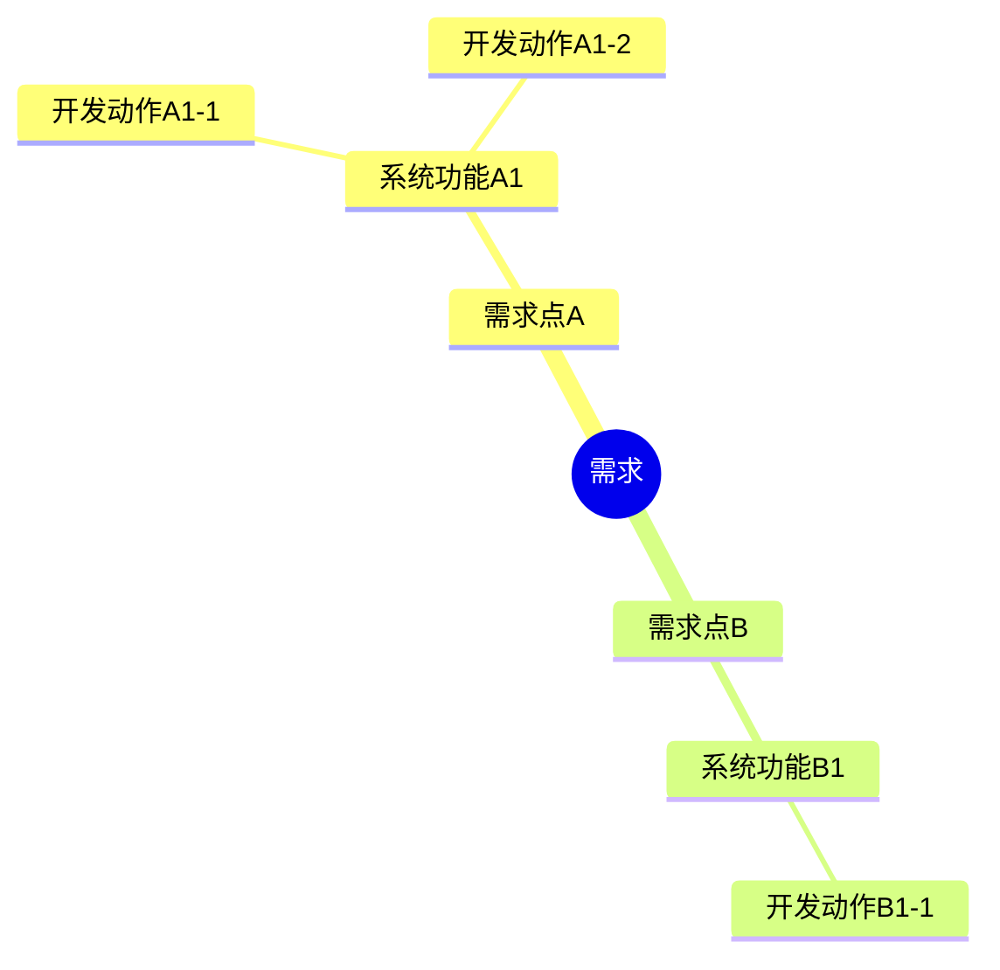
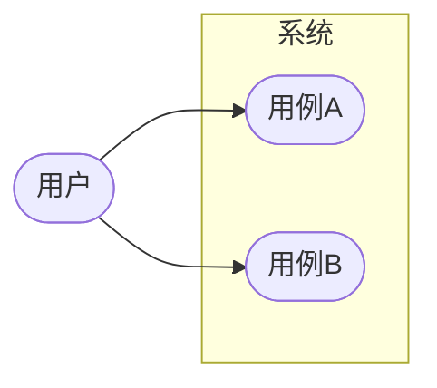
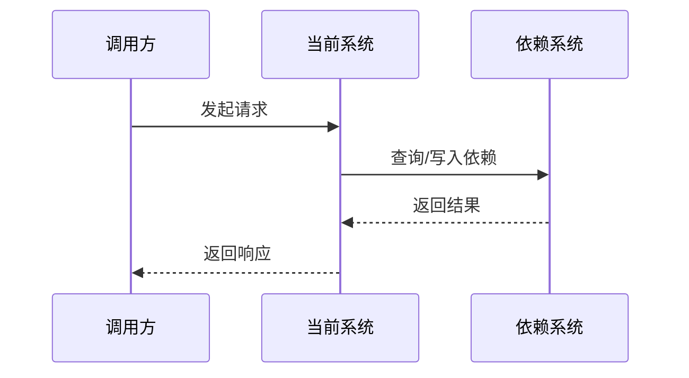

# 技术方案模板

> 使用说明：本模板用于沉淀需求背景、详细设计、接口/存储/中间件/监控/灰度/安全/成本/排期等信息。请删除与本次需求无关的章节，避免空白或仅粘贴 PRD 链接。

## 目录

- [1. 需求概要](#1-需求概要)
  - [1.1 需求背景](#11-需求背景)
  - [1.2 名词解释](#12-名词解释)
  - [1.3 需求要点](#13-需求要点)
- [2. 详细设计](#2-详细设计)
  - [2.1 功能概述与改动点](#21-功能概述与改动点)
  - [2.2 模块设计](#22-模块设计)
    - [2.2.1 用例图](#221-用例图)
    - [2.2.2 流程图/时序图](#222-流程图时序图)
    - [2.2.3 数据模型及存储设计](#223-数据模型及存储设计)
    - [2.2.4 接口设计](#224-接口设计)
    - [2.2.5 监控与报警设计](#225-监控与报警设计)
    - [2.2.6 测试用例](#226-测试用例)
    - [2.2.7 自定义](#227-自定义)
- [3. 灰度方案](#3-灰度方案)
- [4. 成本预估](#4-成本预估)
- [5. 估时](#5-估时)

---

# 1. 需求概要

## 1.1 需求背景

> 模板说明：介绍项目背景、业务或技术诉求、为什么需要做本次需求，以及当前遇到的问题。应让不熟悉项目的同学大致知道本项目要做什么、为什么要做。

- PRD/需求链接：
- 相关项目/历史方案：
- 当前问题：
- 设计目标：
- 非目标/本期不做：

**Badcase：**

1. 空白。
2. 只粘贴 PRD 链接，没有解释上下文。

## 1.2 名词解释

| 名词  | 说明  |
| --- | --- |
|     |     |

## 1.3 需求要点

> 模板说明：提取本次需求中涉及的主要需求点，并用一段话描述清楚需求内容。可列出需求文档描述不清晰、但与 PM 沟通确认后的需求要点。

| 需求点 | 描述 |
| --- | --- |
|  |  |

---

# 2. 详细设计

## 2.1 功能概述与改动点

> 模板说明：建议用图示方式分析需求实现涉及的功能点和技术改动点。从需求出发，建议包含 3 层信息：
> 1. 主要需求点；
> 2. 对应系统功能点；
> 3. 具体要执行的开发动作。
>
> 可包含：模型变更、复杂业务逻辑、长业务流程、并发场景下的数据一致性、性能指标要求等。



## 2.2 模块设计

> 模板说明：按核心模块拆分设计内容。可复制本节为多个模块：如“订单模块设计”“结算模块设计”“审核模块设计”等。

### 2.2.1 用例图
> 模板说明：用 UML 用例图描述模块中包含的用例。



### 2.2.2 流程图/时序图

> 模板说明：用流程图或时序图描述核心功能的执行逻辑。



### 2.2.3 数据模型及存储设计

> 模板说明：如果是新建表，给出具体数据表设计、索引设计及 ER 图；如果是现有数据表改动，记录全部执行 SQL；结合业务场景给出主要查询 SQL 及索引设计。

#### 2.2.3.1 DB 变更

| 表名称 | 变动形式            | 变动说明 | DDL 编号/说明 |
| --- | -------------- | ---- | --------- |
|     新增库/表<br>修改库/表 /表 |      | DDL-001   |

**DDL-001：**

```sql
-- 在此填写具体 DDL
```

#### 2.2.3.2 缓存设计（Redisl）

> 说明：缓存的 key、超时时间、更新机制、缓存写入异常处理机制等。

| 集群/category | 描述 | key:value | 数据类型 | 过期策略 | 备注 |
| --- | --- | --- | --- | --- | --- |
|  |  |  |  |  | 预估 QPS 等 |

#### 2.2.3.3 ES 设计

> 说明：ES 索引、同步机制等。

| 集群 | 索引 | 预估读写 QPS | 索引容量预估 | 索引内容描述 |
| --- | --- | --- | --- | --- |
|  |  |  |  |  |

### 2.2.4 接口设计

> 模板说明：接口需要考虑功能修改和数据字段修改两种维度。未做链路控制时，一定要做兜底处理，防止安全问题发生。
>
> 接口设计可分为内部提供、外部依赖，列出本项目中新增、变更的接口列表。接口包括 API、RPC、MQ 等。

#### 2.2.4.1 对外提供

##### API 接口

| URI | 接口名 | 入参（字段含义和取值范围） | 出参（字段含义和取值范围） |
| --- | --- | ------------- | ------------- |
|     |     |               |               |

##### RPC 接口

| URI | 接口名 | 入参（字段含义和取值范围） | 出参（字段含义和取值范围） |
| --- | --- | ------------- | ------------- |
|     |     |               |               |

**对外 Client 包版本：**

```xml
<!-- 在此填写 pom 坐标 -->
```

##### MQ 输出

| 主题名称 | 主题内容说明 | 消息体编号/说明 | 对账 |
| --- | --- | --- | --- |
|  |  | MSG-OUT-001 |  |

**MSG-OUT-001：**

```json
{
  "field": "value"
}
```

#### 2.2.4.2 外部依赖

##### 接口依赖

| appkey       | JAR/POM 坐标说明 | 接口名 | 接口说明（字段含义和取值范围） | 接口容量及性能预估（调用 QPS、耗时、成功率等） | 使用说明 |
| ------------ | ------------ | --- | --------------- | ------------------------- | ---- |
| 依赖系统的 appkey | POM-EXT-001  |     |                 |                           |      |

**POM-EXT-001：**

```xml
<!-- 在此填写 jar/pom 坐标 -->
```

##### MQ 输入

| 主题名称 | 主题内容说明 | 消息体编号/说明 | 对账 |
| --- | --- | --- | --- |
|  |  | MSG-IN-001 |  |

**MSG-IN-001：**

```json
{
  "field": "value"
}
```

### 2.2.5 监控与报警设计

#### 2.2.5.1 消息通知

| 触发场景 | 群/接收人 | 消息内容 | 频率/去重策略 |
| --- | --- | --- | --- |
|  |  |  |  |

#### 2.2.5.2 日志告警

| 告警项 | 触发条件 | 告警级别 | 接收人 | 处理 SOP |
| --- | --- | --- | --- | --- |
|  |  |  |  |  |

#### 2.2.5.3 监控埋点

| 指标名称 | 指标类型           | 维度  | 统计口径 | 阈值  | 看板/报警链接 |
| ---- | -------------- | --- | ---- | --- | ------- |
|      | QPS/耗时/成功率/异常数 |     |      |     |         |

#### 2.2.5.4 BCP 对账

| 对账对象 | 对账口径 | 对账周期 | 差异处理方式 | 负责人 |
| --- | --- | --- | --- | --- |
|  |  |  |  |  |

#### 2.2.5.5 实时对账

| 对账链路 | 对账指标 | 延迟要求 | 异常处理 | 备注 |
| --- | --- | --- | --- | --- |
|  |  |  |  |  |

### 2.2.6 测试用例

| 用例编号 | 场景  | 前置条件 | 操作步骤 | 预期结果 | 优先级      |
| ---- | --- | ---- | ---- | ---- | -------- |
| 1    |     |      |      |      | P0/P1/P2 |

### 2.2.7 自定义

> 说明：补充本模板未覆盖但本次需求必须说明的设计内容。

---

# 3. 灰度方案

| 阶段 | 范围/流量 | 开始时间 | 观察指标 | 回滚条件 | 负责人 |
| --- | --- | --- | --- | --- | --- |
| 小流量 |  |  |  |  |  |
| 扩大灰度 |  |  |  |  |  |
| 全量 |  |  |  |  |  |

- 灰度开关/配置：
- 回滚方案：
- 数据修复方案：

---

# 4. 成本预估

| 资源项 | 现状 | 增量预估 | 峰值预估 | 成本影响 | 备注 |
| --- | --- | --- | --- | --- | --- |
| DB |  |  |  |  |  |
| 缓存 |  |  |  |  |  |
| MQ |  |  |  |  |  |
| ES |  |  |  |  |  |
| 机器/容器 |  |  |  |  |  |

---

# 5. 估时

| 阶段 | 工作项 | 负责人 | 开始时间 | 结束时间 | 人日 | 依赖/备注 |
| --- | --- | --- | --- | --- | --- | --- |
| 需求澄清 |  |  |  |  |  |  |
| 开发 |  |  |  |  |  |  |
| 联调 |  |  |  |  |  |  |
| 测试 |  |  |  |  |  |  |
| 灰度/上线 |  |  |  |  |  |  |
